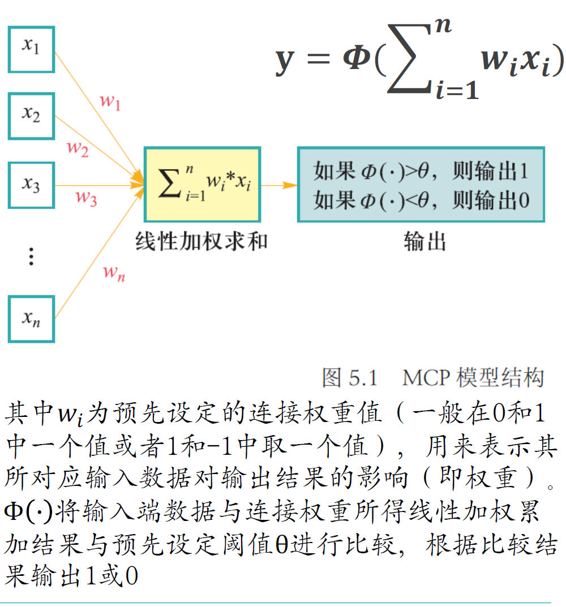
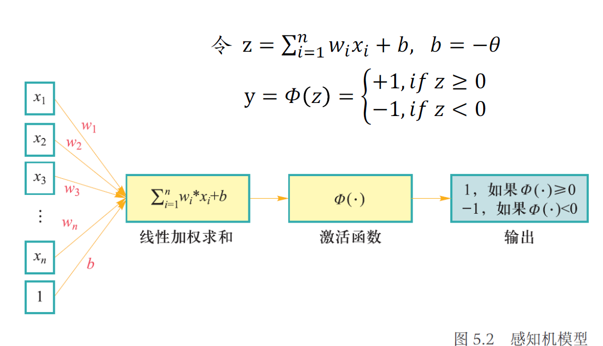

# 神经网络和深度学习

## 1 前馈神经网络与参数优化
在人工神经网络中，MCP模型成为最基本的结构,可求解二分类问题

### 1.1 单层感知机

单层感知机由一个输入层和一个输出层构成，可作为一种线性二分类模型

$$
z : z = \sum_{i=1}^{n} w_ix_i+b
$$

$z$是激活函数的输入，$w_i$是权重，$x_i$是输入数据，$b$是偏置项

单层感知机构建
损失函数，来计算模型预测值与数据真实值之间的“误差”，通过最小化损失函数取值，来优化模型参数。

单层感知机可以模拟逻辑与，逻辑与非，逻辑或等线性可分函数，但是无法完成逻辑异或这一非线性操作

### 1.2 前馈神经网络

在感知机模型中增加若干隐藏层，增强神经网络的非线性表达能力，即由多个隐藏层构成的多层感知机

## 2 卷积神经网络

## 3 循环神经网络

## 4 注意力机制与正则化

## 5 自然语言与计算机视觉应用