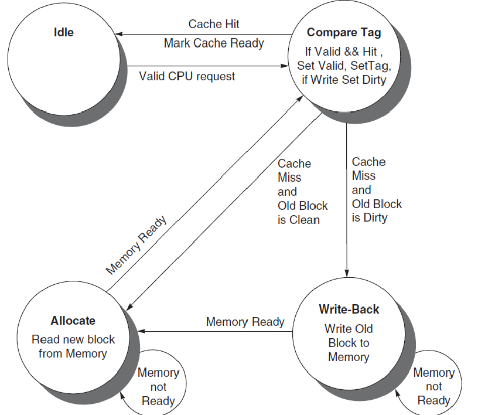
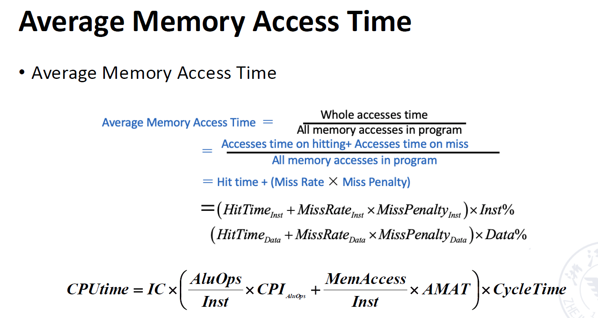

# Memory Hierachy

## 1 Introduction

### 1.1 Memory

内存层次：

* Register
* Cache
* Memory
* Storage

存储技术：

* Mechanical Memory
* Electronic Memory
    * SRAM
    * DRAM
        * SDRAM 
        * DDR
    * GDRAM
        * GDDR
    * HBM
    * EPPROM
        * NAND
        * NOR
* Optical Memory

### 1.2 Cache Concept

**Cache**: a safe place for hiding or storing things. 

采用缓冲技术来重复使用频繁出现的项目。

* Cache **Hit/Miss**: When the processor *can/cannot* find a requested data item in the cache一个包含被请求字的固定大小的数据集合，它从主内存中取出并放入缓存中。
    
    Cache Miss 会带来额外的开销：由 Latency, Bandwith 决定。

* Cache **Block/Line**: A fixed-size collection of data containing the requested word, retrieved from the main memory and placed into the cache.
* Cache **Locality**: 
    * **Temporal locality**: need the requested word again soon

        访问过这个数据，之后很可能再次访问这个数据。

    * **Spatial locality**: likely need other data in the block soon

        访问了这个位置，之后很可能访问下一个位置。

#### Cache Miss

cache miss 的时间依赖于：

- Latency: 取回block中第一个word的时间
- Bandwidth: 取回block中剩余word的时间

Causes of Cache Misses:

- Compulsory: 对一个（数据）块的首次访问
- Capacity: （数据）块被丢弃后又再次被获取
- Conflict: 程序对多个来自不同（数据）块、但映射到缓存中同一位置的地址进行重复访问。

**Enhancing Cache Performance**:

利用好局部性原则

- 大多数程序并不会统一地访问所有代码或数据
- 时间局部性：将最近访问过的数据项更靠近处理器
- 空间局部性：将最近访问过的连续数据块更靠近处理器

### 1.3 Three classes of computers with different  concerns in memory hierarchy

- Desktop Computers 更关心内存层次结构的平均延迟
- Server Computers 关心内存带宽
- Embedded Computers: 更关心功率和电池寿命

!!! Info "36 terms of Cache"
    

### 1.4 Enhance speed of memory

Component character of hardware:
- 硬件越小，成本越高，速度越快
- 更大的内存更便宜

### 1.5 The method enhance speed of  memory

利用局部性原则：
- Temporary locality: 使最近访问的数据更靠近处理器
- Spatial locality: 将最近访问的连续数据块移近处理器

The method  
- Hierarchies bases on memories of different speeds and size  
- The more closely CPU the level is, the faster the one is.  
- The more closely CPU the level is, the smaller the one is.  
- The more closely CPU the level is, the more expensive one is.

### 1.6 What is Cache?

small, fast storage 用来提升slow memory的平均访存时间

In computer architecture, almost everything is a cache:

- Registers: a cache on variable --sofware managed
- First-level cache: a cache on second-level cache
- Second-level: a cache on memory
- Memory: a cache on disk(virtual memory)
= TLB: a cache on page table
- Branch predictor: a cache on prediction information

### Split vs Unified Cache

Unified cache: 

- 所有内存请求都经过同一个缓存
- 需要更少的硬件，但是性能也更差

Split cache:

- 将指令和数据分开存储
- 需要更多的硬件，因此也有一些简化（I-cache 只读）

## 2 Four Questions for Cache Designers

这部分内容可见[计组笔记](https://note.hobbitqia.cc/CO/co5/)

**Caching** is a general concept used in processors, operating systems, file systems, and applications.

* **Q1**: Where can a block be *placed* in the upper level/main memory? (**Block placement**)
    * Fully Associative, Set Associative, Direct Mapped
* **Q2**: How is a block *found* if it is in the upper level/main memory? (**Block identification**)
    * Tag/Block
* **Q3**: Which block should be *replaced* on a Cache/main memory miss? (**Block replacement**)
    * Random, LRU,FIFO
* **Q4**: What happens on a *write*? (**Write strategy**)
    * Write Back or Write Through (with Write Buffer)

### 2.1 Q1: Block Placement

* Direct mapped

    一个块在 cache 中有一个固定的位置（通常通过取模得到）。

    

* Fully associative

    块可以放在 cache 里的任意位置。（不好找）

    

* Set associative
    * 块可以在一个组里的任何位置，组里可以放若干个块。
    * 直接映射相当于一路组相联，全相联相当于 n 路组相联（n 是 cache 的块数）

    

一般情况，$n\leq 4$

!!! example "4-way Set-associative"
    
    Why Index With the Middle Bits?

    使用Higher-order bits的话，连续的地址会被映射到同一个组中，导致冲突。

The higher the degree of association, the higher the utilization of cache

space, the lower the probability of block collision and the lower the

failure rate.

关联度越高，缓存空间的利用率就越高，块冲突的概率就越低，失败率也就越低。
### 2.2 Q2: Block Identification

每个block有一个存储主存中block地址的 address tag。

When checking the cache, 处理器会将请求的内存地址与cache tag进行比较，如果两个相同，cache hit 并且数据在cache中

通常， 每个cache block 也有一个valid 位用来分辨cache block的内容是否有效

- **Index** has many bits as log2(#sets(组相联中的组数，直接相联中的block数))
- **Byte Offset**: the byte within the block, has as many bits as log2(size of block)
- **Tag**: 用于匹配，address_size - index_size - byte_offset_size

!!! example 

    === Direct-mapped Cache Example
        
        
        - 首先使用地址的组索引部分来定位到缓存中的一个特定组。
        - 然后，在该组内并行比较地址的标记部分和所有缓存行的标记，并检查有效位。
        - 如果找到匹配且有效的行，则为缓存命中。
        - 最后，使用地址的块偏移部分从命中的缓存行中读取具体的字。

    === Fully-Associative Cache Example
        
        
    === 2-way set-Associative Cache
        
        

先算index，再算offset,最后得出tag

!!! example "Bits in Cache"

    === example 1
        How many total bits are required for a direct-mapped
        cache with 16 KiB of data and four-word blocks, assuming a 64-bit
        address?
        
    
    === example 2
        Consider a cache with 64 blocks and a block size of 16
        bytes. To what block number does byte address 1200 map?
        

#### Using a Finite State Machine (FSM) to Control a Simple Cache

有限状态机（FSM）：一种时序逻辑功能，由一组输入和输出、一个将当前状态和输入映射到新状态的下一状态函数 (next-state function)，以及一个将当前状态和（可能包括）输入映射到一组有效输出的输出函数 (output function) 组成。

下一状态函数 (next-state function)：
一种组合逻辑函数，它根据输入和当前状态来确定有限状态机的下一状态。

### 2.3 Q3: Block Replacement

* **Random** replacement - randomly pick any block，易于实现，内存块的分配均匀地分布在整个缓存中，它可能会替换掉一个即将被再次访问的数据块，这对性能并不理想。
* **Least-Recently Used (LRU)** - pick the block in the set which was least recently accessed

    需要额外的位数来记录访问的时间。一般我们用的是近似的 LRU。

* **First In, First Out (FIFO)** - Choose a block from the set which was first came into the cache

!!! Example "Strategy of Block Replacement"
    Suppose: 
    
    * Cache block size is 3, and access sequence is shown as follows.  
        
        2, 3, 2, 1, 5, 2, 4, 5, 3, 4
    
    * FIFO, LRU and OPT are used to simulate the use and replacement of cache block. （OPT 是一种理想情况，用来衡量算法性能）

        * FIFO

            

        * LRU

            

        
        * OPT
        
        当需要替换一个页面（或缓存块）时，选择未来最长时间内不会被访问的那个页面进行替换。

            

Hit rate is related to the replacement algorithm, the access sequence, the cache block size.

#### 2.3.1 Stack replacement algorithm

有些算法随着 N 增大命中率非下降，有些算法随着 N 增大命中率反而会下降。  
我们把随着**N 增大命中率非下降**的算法称为 stack replacement algorithm。

$B_t(n)$ represents the set of access sequences contained in a cache block of size $n$ at time $t$.

* $B_t(n)$ is the subset of $B_t(n＋1)$.

LRU replacement algorithm is a stack replacement algorithm, while FIFO is not.  
For LRU algorithm, the hit ratio always increases with the increase of cache block.

!!! Example "Using LRU"
    用栈来模拟 LRU，栈顶是最近访问的，栈底是最久未访问的，每次要替换的时候，替换栈底的元素。通过下面的图可以快速看到栈大小为 n 时的命中率。
    

#### 2.3.2 LRU Implementation - Comparison Pair Method

如何只通过门和触发器来实现 LRU 算法？—— **Comparison Pair Method**

* Basic idea

    Let each cache block be combined in pairs, use a comparison pair flip-flop to record the order in which the two cache blocks have been accessed in the comparison pair, and then use a gate circuit to combine the state of each comparison pair flip-flop, you can find the block to be replaced according to the LRU algorithm.

    让任何两个 cache 块之间两两结对，用一个触发器的状态来代表这两个块的先后访问顺序（比如 1 表示 A 刚被访问，0 表示 B 刚被访问）。通过门电路对触发器的状态进行逻辑组合，找到最久未被访问的块。

!!! Example "Comparison Pair Method"
    这里有 3 个 cache blocks A, B, C。那么我们需要 3 个触发器来记录之间的状态。假设 $T_{AB}=1$ 表示 A 被更近访问，$T_{AC}, T_{BC}$ 同理。
    

    

* **Hardware usage analysis**

    假设有 p 个 cache blocks, 我们需要 $C_p^2=p\cdot (p-1)/2$ 个触发器。每个block的输出对应一个and门，共有p个，每个与门的输入是 $p-1$ 个触发器的输出。
    当 $p$ 超过 8 时，需要的触发器过多，这个算法就不适用了。

### 2.4 Q4: Write Strategy

* Write Hit
    * **Write Through**：直接写回到内存。

        写到内存的时间较长，这个过程需要 **Write Stall**，或者使用 **Write Buffer**。
        

    * **Write Back**：在 Cache 中写，同时通过一个额外的 dirty bit 表示这个块已经被修改但并未写回下一级内存中。

* Write Miss
    * **Write Allocate**：将要写的块先读到 Cache 中，再写。
    * **Write Around**：直接写到内存。
* In general, write-back caches use write-allocate , and write-through caches use write-around.

??? Example 
    

**Read Strategy:**

- Read through: 可以直接读cache内存中的
- Read allocate: 先从memory中读到cache中

## 3 Memory System Performance

这部分也可见[计组笔记](https://note.hobbitqia.cc/CO/co5/#measuring-and-improving-cache-performance)

!!! example
    

How to improve

* Reduce the miss penalty： 多级缓存、关键（数据）字优先、读未命中优先于写未命中处理、合并写缓冲以及受害者缓存
* Reduce the miss rate： 更大的块大小、更大的缓存容量、更高的相联度、路预测 (way prediction) 和伪相联 (pseudo-associativity) 以及编译器优化
* Reduce the time to hit in the cache： 小型简单缓存、避免地址转换、流水线式缓存访问以及追踪缓存 (trace caches)
* Reduce the miss penalty and miss rate via parallelism： 非阻塞缓存 (non-blocking caches)、硬件预取以及编译器预取

## 4 Virtual Memory

**Program Uses**:

- discontiguout memory locations 非连续的内存 位置
- seconddary/non-memory storage 使用二级/非内存存储，程序的一部分数据（如段D）可以存放在磁盘这样的二级存储中，而不是必须全部在物理内存里。

在程序的严重，所有的段都在一个巨大且连续的地址空间中，不关心其在物理上是怎么存储的

程序认为它拥有一个比实际物理内存大得多的可用内存空间

物理内存有限，虚拟内存让用户体验到一个抽象的更大的内存。

* Why virtual memory?

    可以让进程使用不连续的物理内存空间（虚拟地址上是连续的）；更好地隔离不同进程。

* virtual-physical address translation
* memory protection/sharing among multi-program

Virtual Memory = Main Memory + Secondary Storage

Physical memory allocations need  not to be contiguous

内存保护，进程隔离

* Virtual Memory Allocation
    * Paged virtual memory 页式虚拟内存

        **page**: fixed-size block
    
    * Segmented virtual memory 段式虚拟内存

        **segment**: variable-size block
    

page address 通常由一个word表示，而segment address 通常由两个word表示。

**Paging vs Segmentation (页式管理与段式管理的对比)**
    
| 特征                  | Page (页式)                                                                 | Segment (段式)                                                                                                |
| :-------------------- | :-------------------------------------------------------------------------- | :-------------------------------------------------------------------------------------------------------------- |
| **Words per address** (每个地址的字数) | **One** (一个)                                                              | **Two (segment and offset)** (两个：段号和偏移量)                                                               |
| **Programmer visible?** (程序员是否可见？) | **Invisible to application programmer** (对应用程序员不可见)                      | **May be visible to application programmer** (可能对应用程序员可见)                                                 |
| **Replacing a block** (替换一个块)   | **Trivial (all blocks are the same size)** (简单，因为所有块大小相同)           | **Hard (must find contiguous, variable-size, unused portion of main memory)** (困难，必须找到主存中连续的、可变大小的、未使用的部分) |
| **Memory use inefficiency** (内存使用效率低下) | **Internal fragmentation (unused portion of page)** (内部碎片：页内未使用的部分) | **External fragmentation (unused pieces of main memory)** (外部碎片：主存中未使用的零散部分)                          |
| **Efficient disk traffic** (高效的磁盘读写) | **Yes (adjust page size to balance access time and transfer time)** (是，调整页大小以平衡访问时间和传输时间) | **Not always (small segments may transfer just a few bytes)** (不总是，小段可能只传输几个字节)                         |

    分页式的易于实现，方便替换。现在常用段页式结合，或者纯页式。

### 4.1 How virtual memory works?

Cache 的四个问题在虚拟内存中都有对应。

* Q1. Where can a block be placed in main memory?

    缺失代价很高，因此我们采用全相联的方式，以降低 miss rate。操作系统允许（数据）块放置在主内存中的任何位置

* Q2. How is a block found if it is in main memory?

    虚拟地址分两部分，偏移量和页号。页号是页表的索引。
    
    
* Q3. Which block should be replaced on a virtual memory miss?

    Least Recently Used (LRU) block, with use/reference bit.当一个页面被访问时，逻辑上（该位）被设置。操作系统（OS）会周期性地清除使用位，之后再记录它们，以便跟踪最近最少被引用的页面；

* Q4. What happens on a write?

    Write-back strategy, with diry bit. 往disk上写的代价太大

### 4.2 Page Table

* Page tables are often large

    ***e.g.*** 32-bit virtual address, 4KB pages, 4 bytes per page table entry.  
    page table size: $(2^{32}/2^{12}) \times 2^2 = 2^{22}$ bytes = $4$ MB
    
- page table存储在main memory中
    
* Logically two memory accesses for data access 两次访存:
    * one to obtain the physical address from page table;
    * one to get the data from the physical address;

正常来说页表需要两次内存访问，访问效率低下，因此我们需要 cache page table，即 TLB（块表）。

**Translation lookaside buffer (TLB)**

一种特殊的缓存，它保存了先前的地址转换记录

* tag: portions of the virtual address (VPN);虚拟地址的一部分
* data: a physical page frame number (PPN), protection field, valid bit, use bit, dirty bit;

!!! Example
    发送 tag (VPN) 尝试匹配，并看访问类型是否违规。如果匹配成功，就把对应的 PPN 送到 Mux，将偏移量加上 PPN 得到物理地址。
    
        
    
### 4.3 Page Size Selection

* Pros of *larger* page size
    * Smaller page table, less memory (or other resources used for the memory map);

        页更少，所以页表更小。
    
    * Larger cache with fast cache hit;

        页更大，所以 cache 命中的时间更短（因为我们需要遍历的页更少）。

    * Transferring larger pages to or from secondary storage is more efficient than transferring smaller pages;

        一次搬运更多的数据，所以更高效，小页可能需要搬运多次。

    * Map more memory, reduce the number of TLB misses;

        TLB miss 次数更少。

* Pros of *smaller* page size
    * Conserve storage
        
        节省存储空间

        When a contiguous region of virtual memory is not equal in size to a multiple of the page size, a small page size results in less wasted storage.

        当一个连续的虚拟内存区域的大小不是页面大小的整数倍时（没法填满），较小的页面尺寸会导致更少的存储空间浪费。

Use both: **multiple page sizes**

!!! Note "Address Translation"
    

### 4.4 Multiprogramming

使计算机能够同时被多个程序同时运行，需要多个程序之间的保护和共享

**process**:

A running program plus any state needed to continue running it

一个运行中的程序加上使他运行需要的任何状态

- Time-Sharing：
    shares processor and memory with interactive users simultaneously;
    gives the illusion that all users have their own computers
    与交互式用户同时共享处理器和内存。
- Process/Context Switch:
    从一个进程到另外一个
- 分割主内存，以便多个不同的进程可以同时将其状态保留在内存中
- 操作系统设计者必须保证进程之间不会干扰彼此的计算；
- Maintain correct process behavior
    - computer designer must ensure that the processor portion of the process state can be saved and restored;计算机设计者必须确保进程的处理器部分可以被保存
- Proprietary page tables 专业页表。通过让每个进程拥有自己的页表，可以实现进程间的保护，每个页表指向内存中国不同 的页面，必须组织用户程序修改自身的页表
- Rings:
    - 将内存访问保护扩展到多个级别
- Keys and Locks:
    - 除非程序拥有密钥，否则它无法解锁对数据的访问权限
    - 为了使密钥/权能（capabilities）有效，硬件和操作系统必须能够显式地将它们从一个程序传递给另一个程序，同时不允许程序自身伪造它们

## 5 Summary 

!!! Summary  
    * Memory hierarchy
        * From single level to multi level
        * Evaluate the performance parameters of the storage system (average price per bit C; hit rate H; average memory access time T)

    * Cache basic knowledge
        * Mapping rules
        * Access method
        * Replacement algorithm
        * Write strategy
        * Cache performance analysis

    * Virtual Memory (the influence of memory organization structure on Cache failure rate)