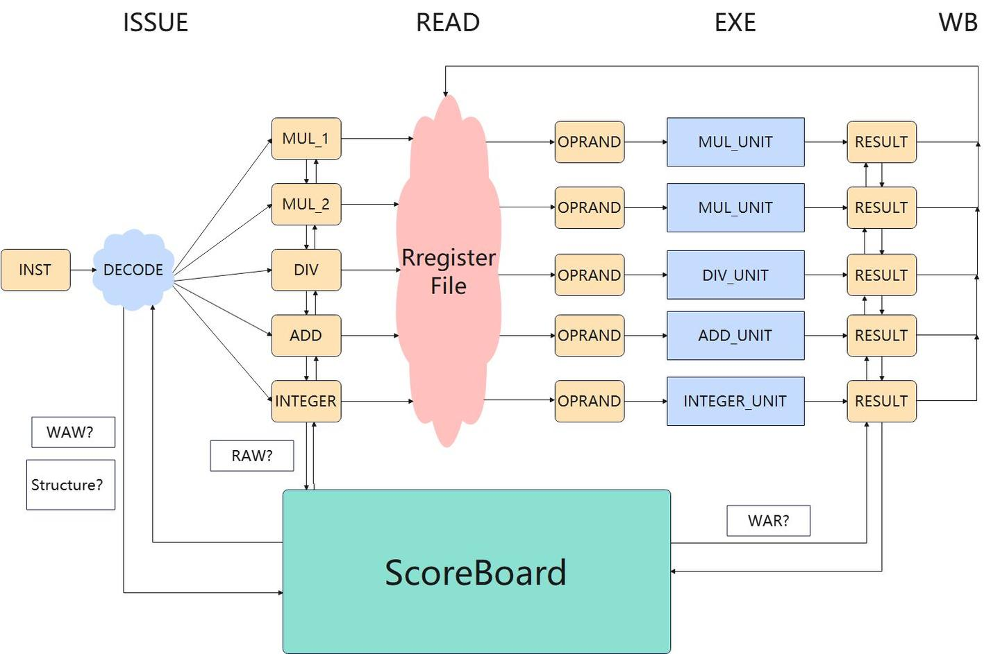
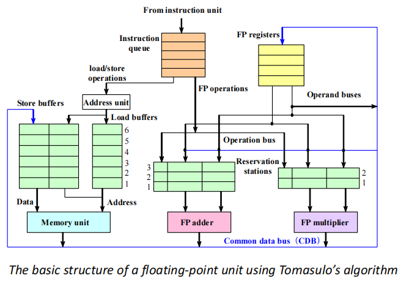

# Instruction-Level parallelism(ILP)


## 1 The Classic Five-Stage Pipeline for a RISC Processor

重命名可以用于解决Name Dependences


## 2 Dynamic Scheduling 动态调度

**Idea**: Dynamic Scheduling

**Method:** out-of-order execution

!!! example "Dynamic Scheduling with scoreboard"
    

### 2.1 Scoreboard

- **功能单元状态**：记分牌是面向功能部件的，在记分牌中每一个功能部件都有一组信息，信息包括部件是否正在忙、部件执行的指令类型、部件现在需要的源寄存器、部件现在的目的寄存器、源寄存器是否准备好（Rj、Rk 表示）和如果源寄存器没准备好部件该向哪里要数据（Qj、Qk 表示
- **寄存器结果状态**：里面主要记录对于某一个寄存器，是否有部件正准备写入数据。


<div align = center></div>

### 2.2 发射

对指令进行解码，并观察记分牌信息，主要观察各个功能部件的占用情况，和寄存器堆的写情况，以此来判断是否可以把解码得到的信息存进对应的部件寄存器。

**如果指令对应的功能部件空闲**，**且指令要写的目标寄存器没有别的指令将要写**（这是为了解决 WAW 冒险），那么阶段结束的时候，就可以把指令信息存进部件寄存器，同时改写记分牌，把指令相关信息进入记分牌。

#### 2.2.1 Summary

IS阶段能够进入取决于运算需要的部件是否空闲

RO阶段能否进入取决于依赖的register是否ready

WB阶段能否进入取决于需要写入的寄存器是否读走

### 2.3 Tomasulo's Approach

<div align = center></div>

绿色的是保留栈，可以用于存储指令和重命名

- It tracks when operands for instructions are available to minimize RAW hazards;

- It introduces register renaming in hardware to minimize WAW and WAR hazards.


**分为3步**(Get the next instruction from the head of the instruction queue (FIFO))：

- 发射：从指令队列（先进先出）的头部获取下一条指令。 
- 如果有一个匹配的且为空的保留栈，若操作数当前在寄存器中，就将带有操作数的指令发射到该保留栈。 
-  如果没有空的保留站，那么就存在结构冒险，并且该指令会暂停，直到有一个保留站或缓冲区被释放。 
- 如果操作数不在寄存器中，追踪将会产生这些操作数的功能单元。 


这些步骤重命名了寄存器，避免了


Issue 时寄存器内容就已经被读走了，可以进行写入


### 2.4 Hardware-Based Speculation

Cache for uncommitted instruction results:

3 fields: instruction type, destination address, value
- 当指令的execution阶段已经完成，将RS中的值替换为the number of ROB
- Increase instruction submission stage
- ROB提供了completion和 commit 阶段operation的数量
- 当操作数被提交之后，结果就会被写回到寄存器中
- 以这种方式，当预测失败时，容易存储预测执行的指令，当异常发生时，容易存储状态

<div aign = center></div>

<div align=center></div>

- Issue: 从 instruction queue 取指令
- Execution: 操作操作数
- Write Result: 完成执行
- Commit: 用reorder result更新寄存器

**Hardware-based speculation combines three key ideas**
- dynamic branch prediction to choose which instructions to execute
- speculation to allow the execution of instructions before the control dependences are resolved (with the ability to undo the effects of an incorrectly speculated sequence)
- dynamic scheduling to deal with the scheduling of different combinations of basic blocks

```tabs
tab: WB
**重排序缓冲区（ROB）**在指令操作完成到指令提交期间，临时保存该指令的结果。
ROB为指令提供操作数，其作用类似于Tomasulo算法中保留站（reservation stations）的功能。
tab: instruction commit
实现推测执行的核心思想是：允许指令乱序执行，但强制按序提交，并在指令提交前阻止任何不可逆操作。
重排序缓冲区（ROB）通过提供额外的寄存器，其作用与Tomasulo算法中保留站扩展寄存器集的方式类似。
```

- 指令按照ROB中的顺序来完成
- 可以实现精确异常
- 方便扩展
- 但是硬件实现非常复杂
## 3 Exploiting ILP Using Multiple Issue and Static Scheduling

多流出，即一拍可以流出多条指令。

- Superscalar
    
    可以分为静态调度超标量和动态调度超标量。静态调度是通过编译器来完成的，动态调度是通过硬件来完成的。
    
    每个时钟周期发射的指令条数可以不一样（1~8）
- VLIW （very long instruction word）
    超长指令字也是通过编译器完成。

    每个时钟周期发射的指令条数是固定的。他们组成一条长指令或者一个指令包

    在指令包中，指令间的并行通过指令显示地表达
    
    It has been successfully applied to digital signal processing and
multimedia applications.


在典型的超标量处理器中，每个时钟周期可以发射**1至8条指令**。指令**按序发射**，并在发射时进行冲突检测。当前指令序列中需确保不存在数据冲突或近位冲突。


The outgoing component detects structural conflicts or data conflicts**