# Instruction-Level parallelism(ILP)


## 1 The Classic Five-Stage Pipeline for a RISC Processor

<div align = center></div>

重命名可以用于解决Name Dependences

A major limitation of simple pipelining techniques:使用顺序的发射和执行

## 2 Dynamic Scheduling 动态调度

out-of-order execution 会导致`WAR`和`WAW`冒险, 在五级流水线中不存在

**Idea**: Dynamic Scheduling

**Method:** out-of-order execution

!!! example "Dynamic Scheduling with scoreboard"
    

- scoreboard算法是一种调度指令的方法
- Robert Tomasulo 引入了硬件中寄存器重命名来最小化
  `WAR`和`WAW`冒险

为了能够实现乱序执行，我们将ID阶段分解为两个阶段：

- Issue Stage (IS): 解码指令，检查结构冲突(in - order issue)
- Read Operands Stage (RO): Wait 直到没有数据冲突， 接着读取操作数(out - of - order issue)

<div align = center></div>

### 2.1 Scoreboard

- **功能单元状态**：记分牌是面向功能部件的，在记分牌中每一个功能部件都有一组信息，信息包括部件是否正在忙、部件执行的指令类型、部件现在需要的源寄存器、部件现在的目的寄存器、源寄存器是否准备好（Rj、Rk 表示）和如果源寄存器没准备好部件该向哪里要数据（Qj、Qk 表示
- **寄存器结果状态**：里面主要记录对于某一个寄存器，是否有部件正准备写入数据。


<div align = center></div>

### 2.2 发射

对指令进行解码，并观察记分牌信息，主要观察各个功能部件的占用情况，和寄存器堆的写情况，以此来判断是否可以把解码得到的信息存进对应的部件寄存器。

**如果指令对应的功能部件空闲**，**且指令要写的目标寄存器没有别的指令将要写**（这是为了解决 WAW 冒险），那么阶段结束的时候，就可以把指令信息存进部件寄存器，同时改写记分牌，把指令相关信息进入记分牌。

#### 2.2.1 Summary

IS阶段能够进入取决于运算需要的部件是否空闲,如果功能部件被上一条指令占用，则不能进入IS阶段，在上一条指令WB阶段完成之前，不能进入IS阶段。

RO阶段能否进入取决于依赖的register是否ready

WB阶段能否进入取决于需要写入的寄存器是否读走

<div align = center></div>


### 2.3 Tomasulo's Approach

!!! example "Tomasulo's Approach"
    consider the following code:
    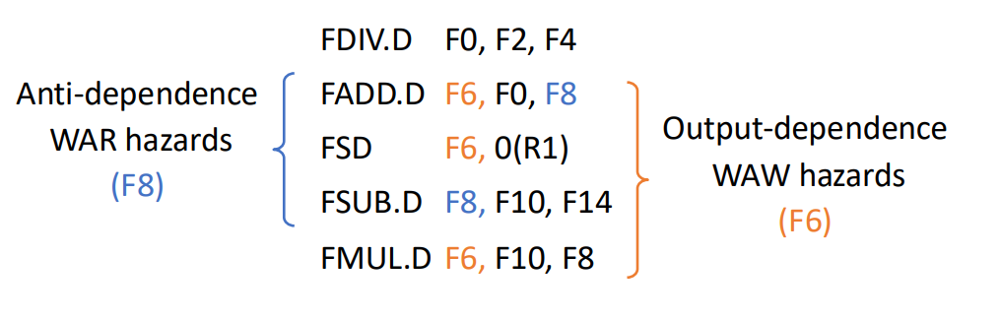
    WAW和WAR冒险（即name dependency）都可以通过寄存器重命名来解决

        - 假设现在有两个临时寄存器S、T
        - 这个指令序列可以被重写为（没有任何dependencies）
    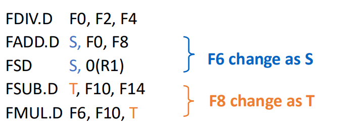


<div align = center></div>

绿色的是保留栈，可以用于存储指令和重命名

- It tracks when operands for instructions are available to minimize RAW hazards;

- It introduces register renaming in hardware to minimize WAW and WAR hazards.


**分为3步**(Get the next instruction from the head of the instruction queue (FIFO))：

- 发射：从指令队列（先进先出）的头部获取下一条指令。 
- 如果有一个匹配的且为空的保留栈，若操作数当前在寄存器中，就将带有操作数的指令发射到该保留栈。 
-  如果没有空的保留站，那么就存在结构冒险，并且该指令会暂停，直到有一个保留站或缓冲区被释放。 
- 如果操作数不在寄存器中，追踪将会产生这些操作数的功能单元。 

这些步骤重命名了寄存器，避免了

Issue 时寄存器内容就已经被读走了，可以进行写入

**Execute**: 

- 当所有操作数都空闲，操作可以在对应的功能单元中执行
- Load and Store require a two-step execu process:
    - 当base register可用时，计算effective address(是指指令在执行时，经过寻址模式计算后得到的实际内存地址，用于访问（读取或写入）数据。它是程序运行时确定的地址，而不是指令中直接编码的地址（如立即数或标签）。) 


**Write Result**:

- 当结果可获得时，结果会被写入到Common Data Bus中，接着从CDB中写入到reservation stations中(包括store buffers)
- 要写入内存的值存储在store buffer 中直到要被写入的值和地址都可用，接着结果在memory unit空闲时被写入

There are three tables for Tomasulo's Approach:

- Instruction Status Table: 这个表仅仅用来帮助理解算法，并非是硬件实现的一部分
- Reservation Stations Table: 保留每个被发射的操作的状态
- Register status table (Field Qj): The number of the reservation station 
    - 存储应该被存储在寄存器中的操作

**Each reservation station has 7 fields**:

- **Op**: 原操作上的操作数
- **Qj,Qk**: 会产生对应的操作数的保留站
- **Vj,Vk**: 源操作数的值
- **A**: 用来记录计算store和load指令的地址需要的信息
- **Busy**: 该保留站和它使用的功能单元是否被占用

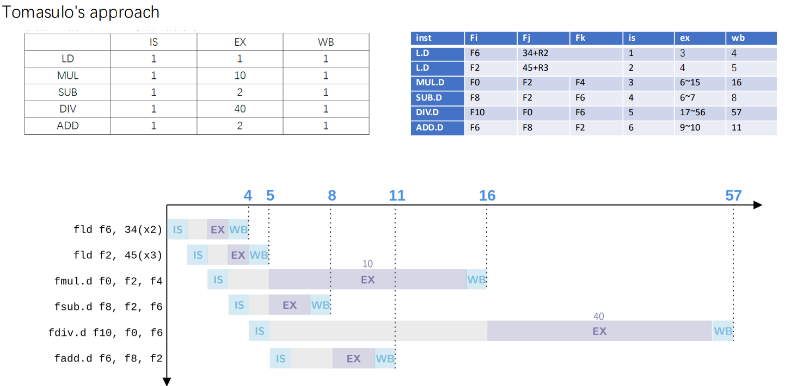


### 2.4 Hardware-Based Speculation

Cache for uncommitted instruction results:

3 fields: instruction type, destination address, value

- 当指令的execution阶段已经完成，将RS中的值替换为the number of ROB
- Increase instruction submission stage
- ROB提供了completion和 commit 阶段operation的数量
- 当操作数被提交之后，结果就会被写回到寄存器中
- 以这种方式，当预测失败时，容易存储预测执行的指令，当异常发生时，容易存储状态

<div align = center></div>

<div align=center></div>

- Issue: 从 instruction queue 取指令
- Execution: 操作操作数
- Write Result: 完成执行
- Commit: 用reorder result更新寄存器

就我的理解而言，本来是在WB阶段直接将结果写入寄存器堆，应用Hardware-based speculation后，WB阶段的结果是写入到ROB中，等到commit阶段再将ROB中的结果写入寄存器堆中。

**Hardware-based speculation combines three key ideas**

- dynamic branch prediction to choose which instructions to execute
- speculation to allow the execution of instructions before the control dependences are resolved (with the ability to undo the effects of an incorrectly speculated sequence)**即加入ROB**给了反悔的余地
- dynamic scheduling to deal with the scheduling of different combinations of basic blocks


!!! note "执行过程"    
    === "WB"
    **重排序缓冲区（ROB）(Reorder Buffer)**在指令操作完成到指令提交期间，临时保存该指令的结果。
    ROB为指令提供操作数，其作用类似于Tomasulo算法中保留站（reservation stations）的功能。
    === "Commit"
    实现推测执行的核心思想是：允许指令乱序执行，但强制按序提交，并在指令提交前阻止任何不可逆操作。
    重排序缓冲区（ROB）通过提供额外的寄存器，其作用与Tomasulo算法中保留站扩展寄存器集的方式类似。   

!!! example "Hardware-based speculation"
    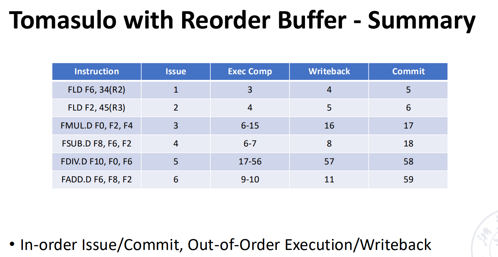
    按序 Issue/Commit, 乱序Execution/WriteBack

- 指令按照ROB中的顺序来完成
- 可以实现精确异常
- 方便扩展
- 但是硬件实现非常复杂

## 3 Exploiting ILP Using Multiple Issue and Static Scheduling

多流出，即一拍可以流出多条指令。

- Superscalar
    
    - 可以分为静态调度超标量和动态调度超标量。静态调度是通过编译器来完成的，动态调度是通过硬件来完成的。
    - 是最成功的General Computing 方法
    - 每个时钟周期发射的指令条数可以不一样（1~8）
    - n-issue：每个时钟周期最多发射n条指令

- VLIW （very long instruction word）

    超长指令字也是通过编译器完成静态调度。

    每个时钟周期发射的指令条数是固定的（4-16）。他们组成一条长指令或者一个指令包

    在指令包中，指令间的并行通过指令显示地表达
    
    It has been successfully applied to digital signal processing and
    
!!! exmaple "SuperScalar & VLIW"
    
    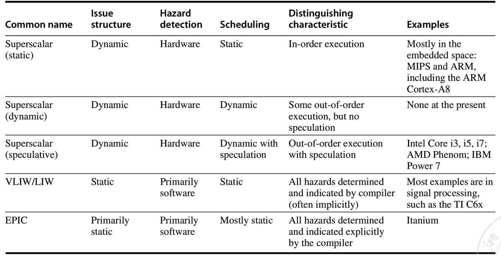

### 3.1 Multi-issue Technology based on Static Scheduling

在典型的超标量处理器中，每个时钟周期可以发射**1至8条指令**。指令**按序发射**，并在发射时进行冲突检测。当前指令序列中需确保不存在数据冲突或近位冲突。

指令顺序流出，在流出时进行冲突检测；在并行的指令中，不存在data conflict and close conflict

    - **Data conflict**: 读写同一个寄存器
    - **Close conflict**: 读写同一个寄存器，且读操作在写操作之前

Outgoing Component 检测结构冲突和数据冲突

- The first Stage: 进行输出包中的冲突检测，挑选可以被流出的这令
- The second Stage: 检查被挑选的指令执行时是否发生冲突

!!! example "RISC-V多发射实现"

    - two instruction flow out every cycle(一个integer instruction和一个floating point instruction)
    - load ,store, and branch instructions 是 integer instructions

    Claim：Fetch two instructions(64-bit) at the same time and decode two instructions(64-bit)

    - 指令的加载包括接下来的步骤：
        - 从cache中加载两条指令
        - 确定这两条指令可以流出
        - 将指令送到对应的功能单元

    在这种设计下，需要增加的硬件很少。浮点数load/store时需要使用integer part,会增加浮点数寄存器的延迟
    
    增加floating point register的读写通道

    Since the number of instructions in the pipeline has doubled, the directional path has to be increased.

### 3.2 Multi-issue Technology based on Dynamic Scheduling

**Extended Tomasulo Algorithm**: 支持2路多发射；每个时钟周期可以发射两条指令，一个是interger指令，一个是浮点指令

使用两种简单方法：

- 指令顺序流向RS，否则程序semantics会被破坏
- 将用于整数的表结构与表结构分开

用于浮点数，并将它们分开处理，使一个浮点指令和一个整数指令可以同一时间各自发送至保留站。

!!! example "Extended Tomasulo Algorithm"

    === "Question:" 
        For the RISC-V pipeline that uses the Tomasulo algorithm and multiissue technology, consider the following simple loop execution. This program adds the scalar in X2 to each element of a vector.
        ```assembly
            ld x2, 0(x1) //X2=array element
            addi x2, x2, 1 //increment X2
            sd x2, 0(x1) //store X2
            addi x1,x1,8//increment pointer by 8 (each data occupies 8 bytes)
            bne x2,x3,loop //branch if not equal
        ```
        Now make the following assumptions:
        
        - 每个周期一个整数指令和一个浮点数指令，即使他们关联
        - 一个做整数ALU操作和地址计算的整数单元，对于每一种类型的浮点数操作，有一个独立的浮点单元
        - 指令可以流出和写入结果花费1个周期
        - 有动态分支预测单元和一个独立的功能单元来计算分支情况
        - Branch instructions flowed out separately, no delayed branch was used, but branch prediction was perfect. Before the branch instruction is completed, its subsequent instructions can only be fetched and flowed out, but cannot be executed

        由于写回操作占据一个周期，产生结果的延迟是： 1 cycle for operation, 2 cycles for load, 3 cycles for floating point addition

        List the issue of each instruction in the first three loops of the program, start execution, and write the results to the CDB.

    === "Solution" 
        在执行时，loop会动态展开，在任何可能的时候两条指令会一起发射。 For ease of analysis, the time when the memory fetch occurs is listed in the table. The running result is shown in the figure below.
        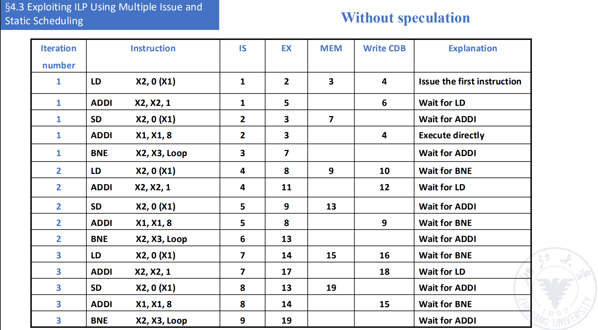
        可以看到，data-dependent branches 和 ALU components成为了瓶颈

        Solution: add an adder to separate the ALU function from the address calculation function

        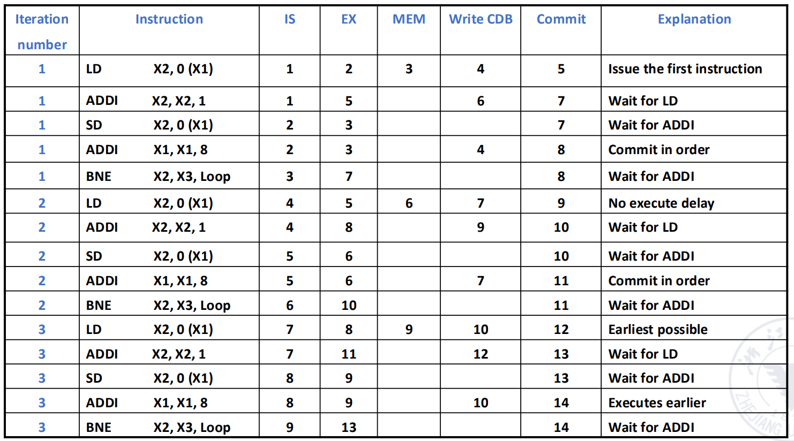

    === "Analysis"
        - In this case , 在分支成为瓶颈的时候，speculation 很有用
        - 这个优势建立在正确的分支预测上
        - 错误的分支预测无法提高性能，反而影响性能并极大降低能效

### 3.3 VLIM
- VLIW: Very Long Instruction Word

Assemble multiple instructions that can be executed in parallel into a very
long instruction (more than 100 bits to hundreds of bits).

指令被划分为多个fields, 每个field叫做一个operaion slot, 直接独立控制一个功能单元

在VLIW中，所有的加载和指令安排由编译器完成

在编译时，不相关的操作可以并行执行，被合并为一个指令包with multiple operation segments

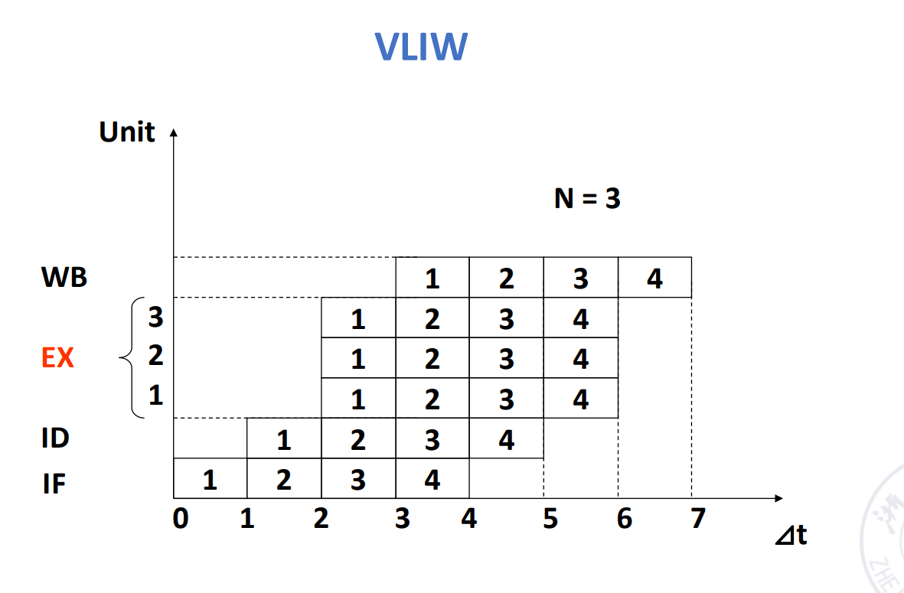

!!! example the unrolled version of the loop `x[i] = x[i] + 1`
    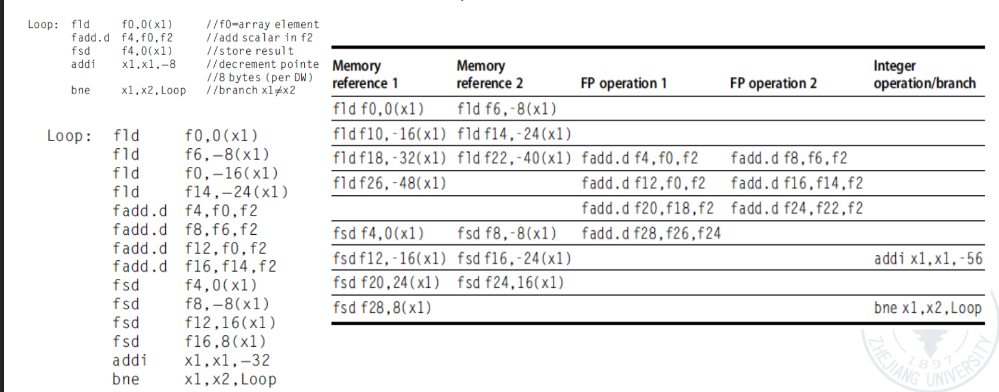


**some problems with VLIW**
- 代码大小增加
- Lockstep mechanism
- Machine code incompatibility

### 3.4 Super Pipelined
- 每个流水线阶段被进一步划分，以至于多条指令可以在同一时钟周期内time-shared
- 在一个周期能流出n条指令的super pipelined processor中，n条指令不是在同一时间流出的，而是每1/n周期流出一条指令
- the time-space diagram of a super pipelined processor that isuues 2 instructions per cycle

<div align = center></div>

• A pipeline processor with 8 or more instruction pipeline stages is called a superpipelining processor

!!! example R4000 Pipeline Structre
    - 2 caches in the R4000 microprocessor chip
        - instruction cache
        - data cache
        - the capacity is 8kB
        - the data with of each Cache is 64b
    - Core processing components: integer components
        - a 32*32 bit general register bank
        - An ALU
        - A dedicated Multiplition/division unit
    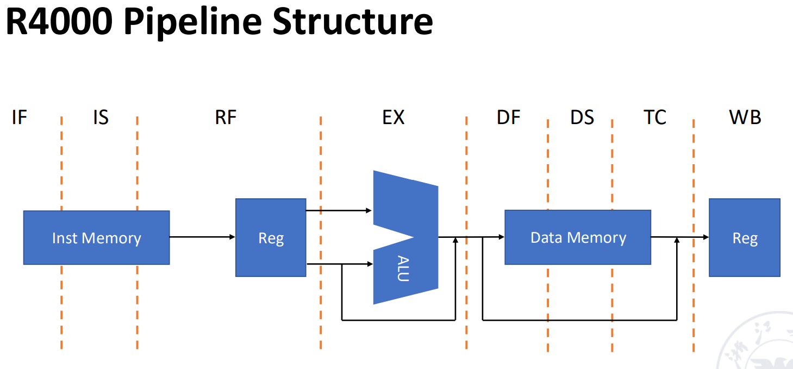
    - IF: first half fetch,在此时选择PC，同时初始化 I cache 加载
    - IS: second half fetch, 完成 I cache 的加载
    - RF: Instruction decode and register fetch, hazard checking , and instrction cache hit detection
    - EX: Execute, effective address calculation, ALU operaion, and branch-target calculation and condition evaluation
    - DF: Data fetch, first half of data cache access
    - DS: second half of data cache access, completion fo data cache access
    - TC: Tag check , 确认D cache 是否命中
    - WB: Write back, write back for loads and register-register operations

    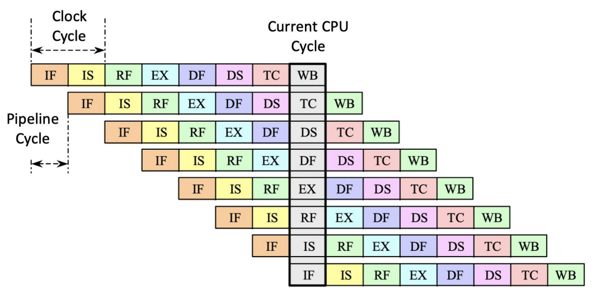
    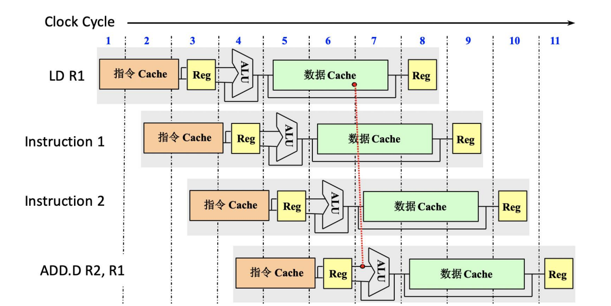