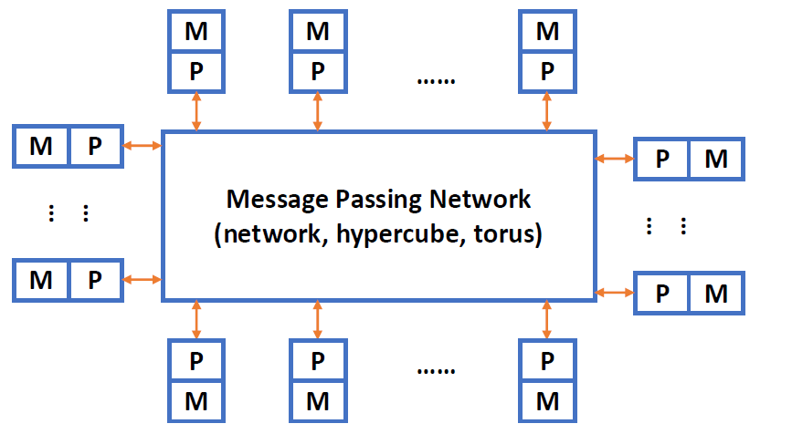
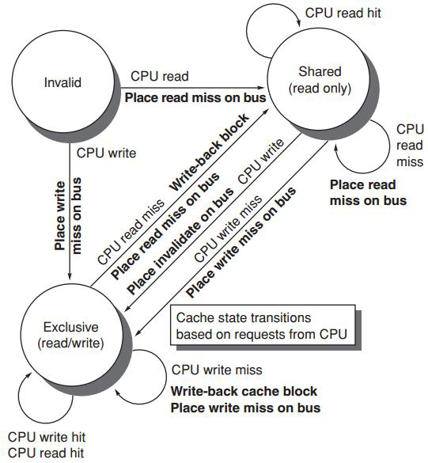

# DLP and TLP


在其中设置了矢量数据表示和相应矢量指令的流水线处理器称为vector processor, 对应没有的则被称为scalar processor


## 1 SIMD: vector processor

vector pipeline的特点：

- The elements in the vector are **rarely correlated** during operations. vector中的元素在执行时相互不关联
- Improper vector handling can also cause related problem and frequent function switching;


* SIMD architectures can exploit significant data-level parallelism
    * Matrix-oriented scientific computing
    * Media-oriented image and sound processors

* SIMD is more energy efficient than MIMD
* SIMD allows programmer to continue to think sequentially

### 1.1 Vector Processor & Scalar Processor

Problems to be solved by vector pipeline processing:
如何处理向量和arrays中的数据,来最大化流水线的效率


* A pipeline processor, in which the vector data representation and the corresponding vector instructions are set, is called the **vector processor**.
* A pipeline processor that does not have vector data representation and corresponding vector instructions is called a **scalar processor**.

在其中设置了矢量数据表示和相应矢量指令的流水线处理器称为vector processor, 对应没有的则被称为scalar processor

通常有三种处理模式：

* Horizontal processing method
    * Vector calculations are performed horizontally from left to right in a row.

        横向计算，从左到右，逐个计算出后再进行下一行。
        时间并行：将向量中的元素按照顺序逐个送入单元进行计算

    * Problems with horizontal processing:
        * When calculating each component, *RAW* correlation occurs, and the *pipeline efficiency is low*.
        * If a static multi-functional pipeline is used, the pipeline must be switched frequently; the throughput  of the pipeline is lower than that of sequential serial execution.

            如果是静态的多功能流水线，我们每次都要排空才能进行下一次运算，这样的效率很低。

        * The horizontal processing method is not suitable for vector processors.

* Vertical processing method

    The vector calculation is performed vertically from top to bottom in a column 
    manner.从顶到底进行计算
    
    Data related: 1 times Function switching: 2 times

    Requirements for processor structure: **memory-memory structure**

    源向量和目标向量，存储在内存中，处理器不会预先将所有数据加载到寄存器。操作的中间结果也需要发送回内存

    

    •The source vector and destination vector of the vector instruction are stored in the memory, and the intermediate result of the operation needs to be sent back to the memory.

* Horizontal and vertical processing method(group processing method)
    * Requirements for Processor Structure: Register - Register structure
    * 设置可快速访问的向量寄存器，以存储源向量、目标向量和中间结果，使算术分量的输入端和输出端与向量寄存器连接，形成寄存器-寄存器类型的作流水线。

!!! Example
    D = A $\times$ (B + C) A, B, C, D ── vector of length N

    * Horizontal processing method

        先计算 $d_1\leftarrow a_1\times(b_1 +c_1)$，再计算 $d_2\leftarrow a_2\times(b_2 +c_2)$，以此类推。写作循环可以写作：

        $$
        \begin{aligned}
        k_i & \leftarrow b_i+c_i\\
        d_i & \leftarrow a_i \times k_i
        \end{aligned}
        $$

        循环里的两个语句存在数据相关。因此有 N 个数据相关，需要进行 2N 次功能切换。

    * Vertical processing method

        先计算加法，B+C 得到一个向量 K，再计算乘法，A*K 得到 D。

        $$
        \begin{aligned}
        K & \leftarrow B + C\\
        D& \leftarrow A\times K
        \end{aligned}
        $$

        这里只有 1 个数据相关，2 次功能切换。

    * Horizontal and vertical processing method

        如果 N 太大了，我们不能用一个向量来直接装下所有数据，就需要多次运算。假设 $N=S\times n +r$，即我们把 N 个数据分成了 S 组，每组有 n 个数据，最后一组有 r 个数据。组内做纵向运算，组间做横向运算。

        Data Related: S+1 Function Switching: 2(S+1)


### 1.2 Vector Processor Example - Cray-1


有 8 个向量寄存器，每组向量寄存器有 64 位。有 12 条单功能流水线，可以并行工作。


Each vector register Vi has a separate bus connected to 6 vector functional units.

每个矢量函数单元还具有一条总线，该总线将作结果返回到矢量寄存器总线。

只要没有 Vi 冲突和功能冲突，每个 Vi 和每个功能单元都可以并行工作，大大加快了向量指令的处理速度。

不同的功能需要的拍数不同。

向量的指令也是可能存在相关性：  

* **Vi conflict**: The source vector or result vector of each vector instruction working in parallel uses the same Vi.

    当向量寄存器有依赖的时候，后续指令要在前面指令的结果出来之后再执行。这里并不是等前面的向量的每一个元素都计算完，而是等前面的向量的第一个元素计算完就开始计算第一个元素的后续指令，等第二个元素计算完就开始计算第二个元素的后续指令，以此类推。

    * Writing and reading data related

        $$
        \begin{aligned}
        V0 & \leftarrow V1+V2\\
        V3& \leftarrow V0\times V4
        \end{aligned}
        $$

    * Reading data related

        $$
        \begin{aligned}
        V0 & \leftarrow V1+V2\\
        V3& \leftarrow V4\times V0
        \end{aligned}
        $$

* **Functional conflict**: Each vector instruction working in parallel must use the same functional unit.

    $$
    \begin{aligned}
    V3 & \leftarrow V1\times V2\\
    V5& \leftarrow V4\times V6
    \end{aligned}
    $$

    如果我们只有一个乘法部件，就会有结构冲突。我们只能等前一条指令全部完成（最后一个元素做完才可以），才能开始下一条指令。

#### 1.2.1 Instruction Types of CRAY-1


向量加法需要 6 拍；乘法需要 7 拍；读写需要 6 拍。


#### 1.2.2 Improve the Performance of Vector Processor

* Set up multiple functional units and make them work in parallel.设置多个功能部件使其并行工作
* Use **link technology** to speed up the execution of a string of vector instructions.使用向量链接技术
* Adopt **recycling mining technology** to speed up recycling processing.使用循环挖掘基础来加速寻出处理。
* Using a **multi-processor system** to further improve the performance.使用多处理器系统进一步提高性能

**1. Set up multiple functional units and make them work in parallel:**
    比如 CRAY-1 vector processor 有四组 12个单功能流水线部件：
    - Vector components
    - Floating point components
    - Scalar components
    - Address calculation components

**2.Use link technology to speed up the execution of a string of a string of vector instruction:**

Link feature: It has two related instructions that are written first and then read. In the case of no conflicts between functional components and source vector conflicts, functional components can be linked for pipeline processing to achieve the purpose of speeding up execution.  

链接特性：它有两个相关的指令，先写入然后读取。在功能部件和源向量没有冲突的情况下，功能部件可以被链接起来进行流水线处理，以达到加速执行的目的。

如果我们有两条指令，第一条指令的结果是第二条指令的输入，那么我们就可以把这两条指令链接起来，这样就可以减少一次读写的时间。

!!! Example "Use link technology to perform vector operations on CRAY-1"
    D = A $\times$ (B + C) A, B, C, D ── vector of length N，假设 $N\leq 64$，均为浮点数，B 和 C 已经被存在 V0 和 V1 中。

    ```  asm
    V3 <- memory    // access vector A
    V2 <- V0 ＋ V1  // Vector B and Vector C perform floating point addition
    V4 <- V2 * V3   // Floating point multiplication, the result is stored in V4
    ```
    这里前两条指令没有冲突，可以并行完成。第三条指令需要等前两条指令完成，存在 RAW，不能并行但可以链接。

    这里假设把数据从寄存器送到功能部件需要一拍，功能部件的结果写回到寄存器也需要一拍。开始从内存中取数据也需要一拍
    
    !!! Question
        计算下面的指令，假设三条指令串行执行；1 和 2 并行执行后执行 3；使用 link 技术，这三种情况下的拍数。
        ``` asm
        V3 <- A
        V2 <- V0 + V1
        V4 <- V2 * V3
        ```
        注意到向量功能内部也是流水的。

        * The execution time using serial method. 

            经过 8 拍 V0 的第一个元素到达 V2，那么再过 (N-1) 拍 V0 的最后一个元素就会到达 V2。因此总共需要 [(1+6+1)+N-1] + [(1+6+1)+N-1] + [(1+7+1)+N-1] = 3N+22 拍。

        * The first two instructions are parallel, and the third is serial.

            max{[(1+6+1)+N-1], [(1+6+1)+N-1]} + [(1+7+1)+N-1] = 2N+15

        * Use link technology.

            我们只需要知道 V4 的第一个结果多久可以出来：8+1+7+1=9 拍，随后还有 (N-1) 条指令，因此总共需要的拍数为 max{(1+6+1), (1+6+1)} + (1+7+1)+N-1 = N+16.

#### 1.2.3 Segmented Vector

如果向量的长度比向量要长？

当向量的长度大于向量寄存器的长度时，长向量必须被分成固定长度的段，然后通过循环进行处理，每个循环只处理一个向量段

#### 1.2.4 Adopt multi-processor system


### 1.3 RV64V


* Loosely based on Cray-1
* 32 62-bit vector registers
    * Register file has 16 read ports and 8 write ports
* Vector functional units
    * Fully pipelined
    * Data and control hazards are detected
* Vector load-store unit
    * Fully pipelined
    * One word per clock cycle after initial latency
* Scalar registers
    * 31 general-purpose registers
    * 32 floating-point registers

!!! Example "DAXPY (Double Precision a*X plus Y)"
    <div align = center></div>
    
<!-- ### Multiple Lanes: Beyond One Element per Clock Cycle

每个时钟周期可以处理多个元素。
<div align = center></div> -->

## 2 SIMD: array processor

N processing elements $PE_0$ to $PE_{N-1}$ are repeatedly set.

不同的阵列需要互相通信以连接，形成一个阵列

在单个控制单元的控制下，处理器所分配的数据并行完成同一条指令指定的操作

!!! Example "ILLIAC IV"
        

According to the composition of the memory in the system, the **array processor** can be divided into two basic structures:

* Distributed memory
* Centralized shared memory

两种分布式内存类型的区别：

- 内存分布不同
- 互联网络的规则不同


### 2.1 Distributed memory


PE 代表处理器，PEM 是其对应的内存，ICN 是一个内部的互联网络。

### 2.2 Centralized shared memory


网络之间会通过拓扑结构设计谁和谁联通。

    

### 2.3 Parallel computer design

The communication architecture of the parallel computer is the core of the system.

如果我们想让任何两个处理器都互相连接，如果都是直连，那么需要 $C_n^2 $ 个连接。

**Definition**: A network composed of switching units according to a certain topology and control mode to realize the interconnection between multiple processors or multiple functional components within a computer system. 

根据一定的拓扑结构和控制模式，由交换单元组成的网络，用于实现计算机系统内部多个处理器或多个功能组件之间的互连。

网络中的节点代表一个处理器单元，每条边就代表一个连接。连接的通路越短就认为效率越高。

连接的东西包括 CPU，内存，接口，link and switch node。

* **Interface**: It is a device that obtains information from CPU and memory and sends information to another CPU and memory. Typical devices are network interface cards.
* **Link**: A physical channel to transmit data bits. The link can be a cable, twisted pair or optical fiber, it can be serial or parallel, and each link has its maximum bandwidth. The link can be simplex half-duplex and full-duplex, the clock mechanism used by the link can be synchronous or asynchronous.
* **Switch node**: It is the information exchange and control station of the interconnected network. It is a device with multiple input ports and multiple output ports which is able to perform data buffer storage and path selection.

!!! Note "Some key points"
    * Topology of interconnection network
        * Static topology

            静态网络：网络设定好后节点和边的连接方式就确定下来。

        * Dynamic topology

            动态网络：网络由很多开关组成，网络的连接方式会变化，如交叉开关我们拨动之后两个点的连接改变。

    * Timing mode of interconnection network
        * Synchronization system: Use a unified clock. Such as SIMD array processor
        * Asynchronous system: No uniform clock. Each processor in the system works independently
    * Exchange method of interconnection network
        * Circuit switching
        * Packet switching
    * Control Strategy of interconnection network
        * Centralized control mode: have a global controller
        * Distributed control mode: no global controller

<!---### 2.4 Goal of interconnection network

通过有限数量的连接方式，任意两个 PE 可以在一步或几步内实现信息传输，以完成某种问题求解算法。

* **Single-stage interconnection network**: There are only a limited number of connections at the only level to realize information transmission between any two processing units.

    单级网络，一个 PE 和另一个 PE 连在一起。仅在唯一的层级上存在有限数量的连接，以实现任意两个处理单元之间的信息传输。

* **Multi-stage interconnection network**: It is composed of multiple single-level networks in series to realize the connection between any two processing units.

    多级网络。 它由多个单级网络串联组成，以实现任意两个处理单元之间的连接。

N 个入端和 N 个出端会建立一个映射关系 $j \leftrightarrow f(j)$。

### 2.5 Single-stage interconnection network

#### 2.5.1 Cube

假设有 N 个入端和出端，表示为 $P_{n-1}\ldots P_1P_0$。

这里有 n 个不同的互联函数：（对第 i 位取反）$n = log_2N$

$$
Cube_i(P_{n-1}\ldots P_1P_0)=P_{n-1}\ldots \overline{P_i}\ldots P_1P_0
$$

!!! Example
    
    
    


3D Cube 里，任意两个点最远需要 3 步。

当n>3时，it is called a hyper cube network

single-stage n维 cube network 的最大距离 是n

#### 2.5.2 PM2I

**PM2I (Plus Minus 2i)** single-stage network

$$
PM2_{+i}(j)=(j+2^i)\mod N, PM2_{-i}(j)=(j-2^i)\mod N
$$

总共有N个内联网络节点，$0\leq j \leq N-1,0\leq i \leq log_2 N-1$

实际上这里只有 $2\log_2(N)-1$ 个不同的函数，因为 $PM2_{+\log_2(N)}$ 与 $PM2_{-\log_2(N)}$ 是一样的。

!!! Example
    Example: N = 8
    

    任意两点最短的互联距离是 2。（0 可以一步到 1、2、4、6、7，再过一步可以到 3、5）

#### 2.5.3 Shuffle exchange network

Composed of two parts: **Shuffle** + **Exchange**

N-dimension shuffle function:

$$
shuffle(P_{n-1}\ldots P_1P_0)=P_{n-2}\ldots P_1P_0P_{n-1}
$$

!!! Example 
    可以看到这里 000 和 111 并没有与其他点连接，因此我们需要有更多的操作。
    <div align = center></div>


可以看到经过 3 次 shuffle 后其他点都回到了原来的位置，但是 000 和 111 还是没有连接。因此我们在此的基础上加上 exchange 的连线（红色是通过 $cube_0$ 实现的）。
<div align = center></div>   

在这里任意两个节点相连最多需要 5 步，3 exchanges + 2 shuffles.

The maximum distance of shuffle exchange network: (from the nodes numbered all “0” to all “1”) n exchanges and n-1 shuffles, maximum distance: 2n-1

中间节点的距离较短，效率高，除了从全 0 到全 1 的距离远。

#### 2.5.4 Others

* Linear array

    开销低，但是每个点都是关键节点，一旦出现故障就会影响整个系统。
    <div align = center></div>   

* Circular array

    <div align = center></div>

    可以在点上加一些弦。
    <div align = center></div>

* Tree array

    <div align = center></div>

    可以拓展为带环的树（Tree with loop）、Binary fat tree
    <div align = center></div>

* Star array

    安全性较差，中间的节点非常重要。
    <div align = center></div>

* Grid

    在 GPU 中广泛使用。
    <div align = center></div>

    可以拓展为 2D torus

    <div align = center></div>

* Hypercube

    <div align = center></div>

    Cube 也可以加上环（Cube with loop）
    <div align = center></div>

<div align = center></div> 

注意到这些都是静态网络。

### 2.6 Multi-stage interconnection network

通过交叉开关可以实现动态的网络。（根据传过来的信号决定开关是开还是关）

开关也有多种控制方式，可以每个开关都有自己的控制器，可以有一个全局的控制，也可以分级开关，每一级是一样的。

双功能开关不能满足我们的需求，因此我们会有下面这样的交叉开关：
<div align = center></div>

常用的办法是级控制，每一级的开关是一样的。
<div align = center></div>

不同的多级网络，他们的拓扑结构、交换方式（交叉开关）、控制方式可能不一样。

#### 2.6.1 Switching unit

A switching unit with two inputs and two outputs is the basic component of various multi-level interconnection networks.

The statuses of switching unit:

* Straight
* Exchange
* Upper broadcast
* Lower broadcast

随着端口增加，这里可以有其他的开关单元，如 multicast 即组播，分组广播。

#### 2.6.2 Multi-stage cube interconnection network

这里假设

* Switch unit: two-function switch unit

    在立方体里，我们只需要双功能开关。即 straight 和 exchange 即可。

* Control mode: stage, part stage and unit control
* Topology: cube structure

那么 N 个输入，我们需要 $n=\log_2N$ 级，每一级需要 $N/2$ 的交叉开关。

!!! Example "Three-stage cube interconnection network"
    下面图是一个静态的拓扑结构，中间的布线是三级 cube 网络静态拓扑图，但是开关是可以变化的，因此变成动态了。本身的连线是静态的。
    <div align = center></div>
    
    我们把 012 的控制信号进行排列组合，可以得到 8 种不同的控制信号，会得到不同的网络。  
    这里我们改变三级开关的状态（0 表示 connect，1 表示 exchange），最左侧表示入端，表格中间是对应控制信号下的网络出端。
    <div align = center></div>

    通过状态也可以反推出控制信号。
    
!!! Example
    假设现在有 16 个处理器，我们要实现的是先对四组做 4 个元素的交换，再对两组做 8 个元素的交换，最后做一组 16 个元素的交换。
    <div align = center></div>

    对每一个端口，经过的操作是一样的，因此我们可以写出来这个函数

    $$
    f(P_3P_2P_1P_0)=\overline{P_3} P_2\overline{P_1}P_0
    $$

    我们可以通过函数反推出每级的控制信号。
    <div align = center></div>
    
#### 2.6.3 Multi-stage shuffle exchange network

Multi-level shuffle exchange network is also called **Omega network**.

* The switch function has four functions

    四功能开关。（与立方体网络不同）

* The topological structure is shuffled topology followed by a four function switch
* Control mode is unit control

是立方体网络的逆网络。
<div align = center></div>


!!! Info "Similarity between omega and cube"
    如果我们限定 omega 网络的开关也只能用直连和交换两种功能，那么可以看到 omega 网络就是立方体网络的逆网络。
    <div align = center></div>

!!! Info "Difference between omega and cube"
    * The level of Omega network data flow: n-1, n-2,..., 1, 0.  
    The level of n-cube network data flow: 0, 1,..., n-1.
    * The Omega network uses a *four-function* exchange unit.  
    The n-cube network uses a *two-function* exchange unit.
    * Omega network can realize *one-to-many broadcasting* function.  
    N-cube network cannot achieve.

!!! Example 
    任意一个节点可以传到所有出端。
    <div align = center></div>
    
    对于 cube 网络，他无法同时实现 5-0 和 7-1，但 omega 可以。

<div align = center></div>
--->
## 3 DLP in GPU

* *Heterogeneous* execution model
    * CPU is the host, GPU is the device

* Unify all forms of GPU parallelism as **CUDA thread**
* Programming model is “**Single Instruction Multiple Thread**”

**GPUs are really just multithreaded SIMD Processors**.

### 3.1 Programming the GPU: CUDA

* **CUDA**: Compute Unified Device Architecture

GPUs 只是 multithreaded SIMD 处理器。

!!! Example
    <div align = center></div>

### 3.2 Grid, Thread Blocks and Threads

* A **thread** is associated with each data element
* Threads are organized into **blocks**
* Blocks are organized into a **grid**

GPU hardware handles thread management, not applications or OS. GPU硬件处理线程管理，而不是应用程序或操作系统。
<div align = center></div>

### 3.3 GPU memory structures 

* **GPU memory** is shared by all *Grids* (vectorized loops).
* **Local memory** is shared by all threads of SIMD instructions within *a Thread Block* (body of a vectorized loop). 
* **Private memory** is private to *a single CUDA Thread*.

<div align = center></div>
<div align = center></div>

### NVIDIA GPU (right)and vector machine (left)


**nvidia GPU and vector machine**:

* **与向量机的相似之处：**
    * 擅长数据级并行问题
    * 散布-聚集传输 (Scatter-gather transfers)
    * 掩码寄存器 (Mask registers)
    * 大型寄存器文件 (Large register files)

* **不同之处：**
    * 没有标量处理器
    * 使用多线程来隐藏内存延迟
    * 拥有许多功能单元，而不是像向量处理器那样少数几个深度流水线单元

## 4 Loop-Level Parallelism (LLP)

做并行时不能有相互依赖。

程序中的循环是许多类型并行的源泉。

发现和利用循环级并行对于开发数据级并行 (DLP) 和线程级并行 (TLP) 至关重要，同时对于更积极的静态指令级并行 (ILP) 方法（例如 VLIW）也同样关键。

Finding and manipulating loop-level parallelism is critical to exploiting both DLP and TLP, as well as the more aggressive static ILP approaches (e.g., VLIW).

Focuses on determining whether data accesses in later iterations are dependent on data values produced in earlier iterations.

专注于判断后续迭代中的数据访问是否依赖于前面迭代中产生的数据值。

```cpp
for (i = 999; i>= 0; i--){
    x[i] = x[i] + s;
}
```
无循环依赖


!!! Example
    ``` C
    for (i=0; i<100; i=i+1) {
        A[i+1] = A[i] + C[i]; /* S1 */
        B[i+1] = B[i] + A[i+1]; /* S2 */
    }
    ```
    都使用了前一次迭代中计算的结果，S2 依赖于 S1 的结果

!!! Example 
    ``` C
    for (i=0; i<100; i=i+1) {
        A[i] = A[i] + B[i]; /* S1 */
        B[i+1] = C[i] + D[i]; /* S2 */
    }
    ```
    交换 S1 S2，随后把第一次和最后一次运算提出去，可以改为下面这样，就可以并行。
    ``` C
    A[0] = A[0] + B[0];
    for (i=0; i<99; i=i+1) {
        B[i+1] = C[i] + D[i]; /* S2 */
        A[i+1] = A[i+1] + B[i+1]; /* S1 */
    }
    B[100] = C[99] + D[99];
    ```

!!! example 
    

## 5 MIMD: Tread-level Parallelism

线程级的并行被认为是由软件或者程序员来完成的高级别的并行

线程级的并行，称为 TLP，是由软件系统来确认的。

The threads consist of hundreds to millions of instructions that may be executed in parallel.

我们的发展从 ILP，到 TLP，再到 MIMD。

Multi-processor system 可以分为两大类：

* based on shared memory

    系统中只有唯一的地址空间，所有进程共享。
    
    并不代表只有一个物理上的内存，实际上可以通过一块物理共享的内存实现，也可以通过分布式的内存实现。

* based on message passing

    每个处理器都有自己的地址空间，通过消息传递来通信、传送数据。

### 5.1 Shared Memory System


可以把共享内存划分为若干块，他们共同构成一个拼图（即统一的地址空间）。

有一个统一的操作系统，负责管理所有的信息、内存，给不同的进程使用内存。

If in a system, each CPU has equal access to all memory modules and input/output devices, and these CPUs are interchangeable in the operating system, then the system is a symmetric multiprocessor system **SMP (Symmetric Multi- processor)**.

### 5.2 Message Passing System


每一个进程都有自己的内存，通过 ICN 来传递信息，可以共同完成任务。

一般每个进程有自己的 OS，但是组合在一起形成一个大的系统。

Communication in the system is achieved by using an **interconnection network** to pass messages.

可以分层次，ICN 也可以连接其他的 ICN，结点里可以是另一个多机系统。

每个节点由一个或多个 CPU、RAM、磁盘及其他输入/输出设备和通信处理器组成。

通信处理器通过互连网络相互连接。可以使用各种不同的拓扑结构、交换策略和路径查找算法。

### Multi-Computer memory access model

NORMA(No-Remote Memory Access)



### 5.3 MIMD Architecture

* Different memory access models of MIMD multiprocessor system
    * **Uniform Memory Access (UMA)**
    * **Non Uniform Memory Access (NUMA)**
    * **Cache Only Memory Access (COMA)**

* Further division of MIMD multi-computer system
    * **Massively Parallel Processors (MPP)**
    * **Cluster of Workstations(COW)**

#### 5.3.1 UMA


进程可以有自己的拓展，比如 cache、IO、local memory。

因为他的高度共享性，UMA 也叫紧耦合系统。

* Physical memory is uniformly shared by all processors.物理存储，由所有的进程一起使用，均匀共享，即没有进程对某个存储器有特殊的访问权限，访问的时间相同，即不存在谁离谁更近的问题。

* It takes the same time for all processors to access any memory word.访问任何memory word 的时间是一样的。
* Each processor can be equipped with private cache or private memory.

**UMA Multiprocessor system** 基于总线
    

#### 5.3.2 NUMA


对某个进程都自己的 local memory，由 ICN 连起来。被共享的存储器是不均匀的。访问自己的 local memory 最快，访问别人的慢。

进程也可以有自己的拓展。

NUMA 有两种拓展，

* NC-NUMA: Non Cache NUMA,远程内存访问时间在系统中不被隐藏
* CC-NUMA: Coherent Cache NUMA，

    有自己的 cache 和目录，存在 cache 一致性的问题。当有一个数据改了，如何保证其他 cache 里的数据的正确性。


* All CPUs share an uniform address space。所有的CPU有统一的地址空间。
* Use LOAD and STORE instructions to access remote memory。使用load 和 store 指令来访问远程内存。
* Access to remote memory is slower than access to local memory。访问远程内存比访问本地内存慢。
* The processor in the NUMA system can use cache。处理器可以使用cache

!!! Note "UMA and NUMA"
    * UMA is also called **symmetric (shared-memory) multiprocessors (SMP)** or **centralized shared-memory multiprocessors**.
    * NUMA is called **distributed shared-memory multiprocessor (DSP)**.

    

    可以看到 UMA 有 shared cache，因此一致性是保证的。


#### 5.3.3 COMA


COMA 是 NUMA 模型的特例，每个进程之间不存在层次关系，可以组成一个全局的 cache。可以通过一个目录。


* COMA is a special case of NUMA. There is no storage hierarchy in each processor node, and all caches form a uniform address space.
* Use the distributed cache directory for remote cache access. When using COMA, the data can be allocated arbitrarily at the beginning, because it will eventually be moved to the place where it is used at runtime.

COMA (Cache-Only Memory Architecture) 是 NUMA (Non-Uniform Memory Access) 的一种特例。在每个处理器节点中没有存储层次结构（即没有传统的本地内存），所有缓存形成一个统一的地址空间。

使用分布式缓存目录进行远程缓存访问。使用 COMA 时，数据在开始时可以任意分配，因为它最终会在运行时被移动到使用它的地方。

#### Challenge of Parallel Processing


多处理器的应用范围从运行几乎没有通信的独立任务到运行线程必须通信才能完成任务的并行程序。

第一个障碍与程序中可用的并行性有限有关。

第二个障碍来自于相对较高的通信开销。

这两者都可以用阿姆达尔定律来解释。

!!! example

    === 并行度

    要使用100个处理器实现80倍的加速比，原始计算中只有0.25%的部分可以是串行的

    如果一个应用程序的95%时间可以完美地使用100个处理器，那么要达到80倍的加速比，剩下时间的4.8%必须使用50个处理器，并且只有0.2%的时间可以是串行的！ 这与图片中的结论一致。这个例子再次强调了要达到高加速比，串行部分必须非常小。

    === 通信开销
    假设我们有一个应用程序运行在一个32处理器的多处理器上，处理远程内存引用有100 ns的延迟。对于这个应用程序，假设除了涉及通信的引用外，所有引用都在本地内存层次结构中命中（即缓存命中）。处理器在远程请求时会停顿，并且处理器时钟频率是4 GHz。如果基本 CPI（假设所有引用都在缓存中命中）是0.5，并且0.2%的指令涉及远程通信引用，那么多处理器在没有通信时会快多少？
    
    2.6倍

!!! example "缓存一致性问题"

    

    两个处理器（A 和 B）读写单个内存位置（X）时的缓存一致性问题。我们最初假设两个缓存都不包含该变量，并且 X 的值为 1。我们还假设使用的是写直达（writethrough）缓存；写回（write-back）缓存会增加一些额外但类似的复杂性。在 X 的值被 A 写入之后，A 的缓存和内存都包含新值，但 B 的缓存不包含，如果 B 读取 X 的值，它将接收到 1！
### 5.4 Cache Coherence

#### Memory Consistency and Cache Coherence
内存一致性 (Memory Consistency) 需要内存一致性模型

- 当一个写入的值何时会被读取返回。
- 如果一个处理器先写入位置 A，接着写入位置 B，那么任何看到 B 的新值的处理器也必须看到 A 的新值。

缓存连贯性 (Cache Coherence) 需要缓存连贯性协议

- 任何处理器发出的所有读取操作都必须返回最近写入的值。
- 任何两个处理器对同一位置的写入操作，必须以相同的顺序被所有处理器看到。
- 正确的连贯性确保程序员通过分析加载和存储的结果无法判断系统是否有缓存以及缓存的位置。这是因为正确的连贯性确保缓存绝不会启用新的或不同的功能行为。

#### Cache Coherence 

导致缓存一致性问题的原因：一个数据在系统中有多份拷贝

Cache coherence protocol:由缓存、CPU 和内存实现的一套规则，用于防止相同数据的不同版本出现在多个缓存中，从而形成缓存一致性协议。


In modern parallel computers, processors often have Cache. One memory data may have multiple copies in the entire system. This leads to the Cache coherence problem.  

可能有多个 cache，都放有内存拷贝的数据，可能不一致。我们一般通过一个协议来约定。

* Bus snooping protocol 总线监听协议
* Directory based protocol 基于目录的协议


For UMA : Snoopy coherence protocols.所有处理器都监听总线，当一个处理器修改了私有缓存中的数据时，它会在总线上广播无效信息或者更新的数据，使其他副本失效

For NUMA: Directory protocol.使用一个目录来记录系统中哪些处理器在缓存中拥有特定存储块的副本。当一个处理器想要写入一个共享块时，它会通过目录以“点对点”的方式向那些拥有该块副本的处理器发送无效信号，以便使所有其他副本失效。

#### Snoopy Coherence Protocols

- Write-through cache 写直达缓存
- Write-back cache 写回缓存

**Write-Through Cache Conherence Protocols**


* 根据此协议，监听缓存执行读写操作时有四种情况：

|               | 本地请求                 | 远程请求           |
| :------------ | :----------------------- | :----------------- |
| **读未命中** | 从内存访问数据           |                    |
| **读命中** | 使用本地缓存数据         |                    |
| **写未命中** | 修改内存中的数据         |                    |
| **写命中** | 修改缓存和内存           | 使缓存项无效       |

* 基本协议中存在许多变化：
    * 远程写命中时是使用**更新策略 (Update Strategy)** 还是**无效策略 (Invalidate Strategy)**。
    * 当缓存写未命中时，是否将相应的字传输到缓存中，这就是是否使用**写分配策略 (Write-allocate Policy)**。

    
    


**Write update/broadcast protocols**

当写入数据项时，更新该数据项的所有缓存副本。

##### **Write invalidate protocols**

* 处理器在写入数据时会将其他处理器的缓存项标记为无效。


无效协议在具有写回缓存的单个缓存块（X）的侦听总线上起作用。

**三种状态**

无效（Invalid）
共享（Shared）：表示私有高速缓存中的块可能被多个核共享
修改（Modified）：表明某个块已在私有高速缓存中被更新；并且该状态意味着该块具有独占性

!!! info "Write Invalidation Protocol(write back)"

    
    
    
    
    


!!! example "MSI protocol"

    

    Q（1）

    ```txt
    C0, R, A10C
    C0 Read miss
    C2 write back A10C
    MemoryA10C, 010C → 020C
    C2.3 (S, A10C, 020C)
    Memory returns 020C to C0
    C0.3 (S, A10C, 020C)
    ```
    Q(2)
    
    ```txt
    C1, W, A104, 0204
    C1 write hit
    C0 invalidation
    C0.1 (I, A104, 0104)
    C2 invalidation
    C2.1 (I, A104, 0104)
    C1.1 (M, A104, 0204)
    ```
    Q(3)
    
    ```txt
    C0, W, A118, 0308
    C0 write miss
    C0 write back A108
    Memory A108, 0108 → 0208
    Memory returns 0118 to C0
    C0.2 (M, A118, 0118)
    C0.2 (M, A118, 0308)
    ```

**MESI Protocol**

* 在 MSI 协议的基础上增加了一个状态：Exclusive（独占状态）。当一个缓存块被某个处理器独占时，它可以直接写入而不需要通知其他处理器。

exclusive-> read by others/read miss ->shared

exclusive-> write ->modified

MESI writes exclusive to modified silently, without broadcast on bus

- Invalid (无效)： 缓存项中包含的数据无效。
- Shared (共享)： 此行数据存在于多个缓存项中，并且内存中的数据是最新数据。
- Exclusive (独占)： 没有其他缓存项包含此行数据，并且内存中的数据是最新数据。
- Modified (已修改)： 该项目的数据有效，但内存中的数据无效，并且在其他缓存项中没有该数据的副本。

!!! note
    
    

!!! example
    
    
    

**MOESI Protocol**

* 在 MESI 协议的基础上增加了一个状态：Owned（拥有状态）。indicates that the associated block is owned by that cache and out-of-date in memory

Modified -> Owned without writing the shared block to memory


#### Directory-Based Coherence Protocols


在分布式内存多处理器中，每个节点都会添加一个目录，以实现缓存一致性。

目录保存每个可能被缓存的块的状态。目录中的信息包括哪些缓存包含该块的副本、该块是否为脏数据等等。

for each block, maintain state:

- shared (S): 一个或多个节点已缓存该块，内存中的值是最新的（以及所有缓存中的值）。
- Uncached ： 该块未被任何节点缓存。
- Modified (M): 只有一个节点拥有该缓存块的副本，并且该副本是写入该块的，因此内存副本已过期。该处理器被称为该块的所有者。


- P = requesting node number
- A = requested address
- D = data contents

State transition diagram for an individual cache block in a directory-based system：


The state trasistion diagram for the directory 


- 对于uncached block：
    -  Read miss: requesting node收到请求的数据并且称为,the only sharing node , state **shared**
    - Write miss: requesting node收到请求的数据并且称为,the only sharing node , state **modified**
- 对于shared block：
    - The requesting node is sent the requested data from memory, node is added to sharing set
    - Write miss: 请求节点收到值，共享集中的所有节点都会收到无效消息，共享集仅包含请求节点，块现在是独占的。
- 对于modified block：
    - Read miss: 向所有者发送数据获取消息，块变为共享，所有者将数据发送到目录，数据写回内存，共享者集包含旧所有者和请求者
    - Write miss: 向旧所有者发送消息以使值无效并将值发送到目录，请求者成为新所有者，块保持独占
    - Data write back: Block becomes uncached, sharer set is empty

#### False Sharing

本身两个线程之间的变量没有关系，但是在同一个cacheline里面，会导致cache的状态频繁切换，性能降低


**Solution**:

通过内存填充把两个变量分别放到两个cache：


#### Memory Consistency 

Sequential consistency:只要满足以下条件，执行结果就应该相同，但会降低性能

- 每个处理器上的访问保持有序。
- 不同处理器上的访问可以任意交错

关键思想：允许读写无序完成，但使用同步操作来强制排序

**Relaxed consistency Models**


* **规则：**
    * X $\rightarrow$ Y
        * 操作 X 必须在操作 Y 完成之前完成。
        * 顺序一致性要求：
            * R $\rightarrow$ W, R $\rightarrow$ R, W $\rightarrow$ R, W $\rightarrow$ W (读写、读读、写读、写写操作都必须保持顺序)

* **放宽 W $\rightarrow$ R (写后读)**
    * “总存储顺序”或处理器一致性

* **放宽 W $\rightarrow$ W 和 W $\rightarrow$ R (写后写和写后读)**
    * “部分存储顺序”

* **放宽 R $\rightarrow$ W, R $\rightarrow$ R, W $\rightarrow$ W 和 W $\rightarrow$ R (读写、读读、写写和写读)**
    * “弱顺序”和“释放一致性”

#### MMP

MPP 系统是由数百个处理器组成的大规模并行计算机系统。

过去，它主要用于科学计算和工程模拟等计算密集型场合，但现在也广泛应用于商业和网络应用中。

开发困难，价格高昂，市场有限。它是国家综合实力的象征。


特点：

* MPP 系统通常使用标准的商用 CPU 作为其处理器。
* MPP 系统使用高性能的专用互连网络，该网络可以低延迟、高带宽地传递消息。
* MPP 系统具有强大的输入/输出能力。
* MPP 系统能够进行特殊的容错处理。


#### COW


* COW 系统由大量通过商用网络连接在一起的 PC 或工作站组成。
* COW 可以完全使用市售组件组装。这些商用组件是批量生产的产品，因此它们可以实现更高的性价比。
* COW 主要有两种类型：集中式和分散式。


#### DSA

* 摩尔定律促成了：
    * 深度内存层次结构
    * 宽 SIMD 单元
    * 深度流水线
    * 分支预测
    * 乱序执行
    * 推测性预取
    * 多线程
    * 多处理器

* 目标：
    * 从对体系结构无感的软件中提取性能


**DSA（领域专用体系结构）的指导原则**

* 使用专用内存以最小化数据移动。
* 将资源投入到更多的算术单元或更大的内存中。
* 使用与领域匹配的最简单的并行形式。
* 将数据大小和类型简化为该领域所需的最简单形式。
* 使用领域专用编程语言。

#### TPU ISA

* **Read_Host_Memory**
    * 从 CPU 内存中读取数据到统一缓冲区。
* **Read_Weights**
    * 从权重内存中读取权重到权重 FIFO 作为矩阵单元的输入。
* **MatrixMatrixMultiply/Convolve**
    * 执行矩阵-矩阵乘法、向量-矩阵乘法、元素级矩阵乘法、元素级向量乘法，或从统一缓冲区到累加器的卷积。
    * 接受一个可变大小的 B\*256 输入，将其乘以一个 256\*256 的常量输入，并生成一个 B\*256 输出，需要 B 个流水线周期才能完成。
* **Activate**
    * 计算激活函数。
* **Write_Host_Memory**
    * 将数据从统一缓冲区写入主机内存。