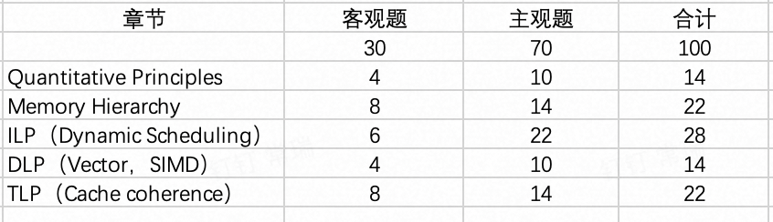

# Computer Architecture Course Review

## Eight great architecture ideas

## 量化分析方法

CPU Performance公式

Amdahl's law

AMAT = HitTime + MissRate*MissPanelty

## Pipeline

Hazard 以及他们由什么原因引起的

WAR, WAW在乱序时才会产生错误，会导致读出的寄存器值不对或者最后写入的值不对

Four Questions for Memory Hierarchy Designers

块的大小和性能对performance的影响

How to Improve

- reduce the miss penalty
- reduce .....

Average Memory access time

虚拟地址， TLB

Cache performance analysis

## Dynamic Scheduling

记分牌三张表

ROB满了，指令不能进保留站

## Parallel Arch

SIMD

Vector Processor

影响性能： 向量长度
    - 等待： Data dependence, 结构冲突

向量的链接技术

MIMD

consistensy

coherence

UMA/NUMA

