# Pseudo-Associative Cache

## 1 背景

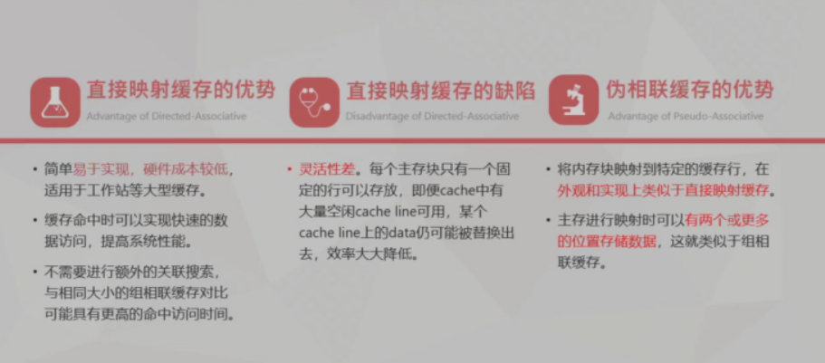
```
一般来说，内存子系统在微处理器的芯片面积中占比很大，缓存消耗的功率超过处理器总功率的 40%

设计缓存以提高性能的一种简单方法是将缓存大小翻倍。然而，在移动处理器中，简单地增加缓存大小会显著影响芯片面积和功耗。随着多核趋势的日益显著，缓存结构变得复杂。为了获得更高的缓存性能，需要更大的共享二级（L2）缓存，但大缓存大小直接关系到互连面积和相关功耗。


cache performance can be significantly increased by doubling cache 
sizes and increasing set associativity, but it results in hardware
cost, larger area and power consumption.

将缓存大小翻倍并增加组相联度可以显著提高缓存性能，但这会导致硬件成本增加、芯片面积增大和功耗上升。
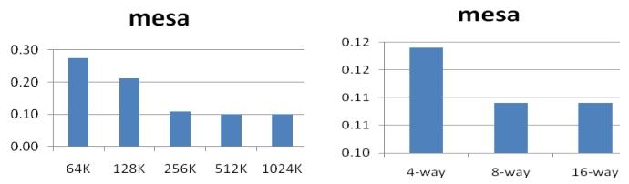
**缓存未命中率（MPKI，每千条指令的未命中数）随缓存大小和组相联度的变化**


随着缓存大小和组相联度的增加，应用程序的性能会达到饱和（或提升很小）。这意味着增大缓存大小并非适用于所有应用程序工作负载的完美解决方案，因为每个应用程序对硬件资源的架构行为不同。

在使用 IP的 SoC设计中，另一种提高缓存性能的简单方法是增加组相联度，但这会带来额外的硬件成本和更高的功耗。具有理想替换方法的全相联缓存可以大幅提升性能，但在实际中难以实现。虽然增加缓存组相联度可以带来一定程度的性能提升，但对于大多数应用程序来说，提升程度在某一点会趋于饱和。


通常，LRU（Least Recently Used，最近最少使用）替换策略在缓存设计中应用广泛，且有多种实现方式。大多数情况下并非所有组都需要特定的相联度，且路的利用往往偏向于主路
```

Overall, direct-mapped caches are often the most economical choice for use in workstations, where cost-performance is the most important criterion.

**直接映射的优缺点：**
由于直接映射缓存只允许一个数据块驻留在由地址索引字段直接指定的缓存组中，其缺失率（缺失次数与总引用次数的比率）往往比相同总大小的组相联缓存更差。然而，直接映射缓存的较低命中访问时间减轻了较高缺失率的影响。

此外，直接映射缓存更简单、更容易设计，并且所需面积更小。总体而言，直接映射缓存在工作站中通常是最经济的选择，因为性价比是最重要的标准。

直接映射缓存中大量的冲突缺失仍然是一个主要问题。当两个地址映射到直接映射缓存中的同一个缓存组时，就会发生冲突缺失（也称为冲突未命中）


## 2 Intoduction

Pseudo-Associative(Column Associative ) Cache

它通过允许冲突地址动态选择备用哈希函数，将直接映射访问中产生的冲突降至最低，从而使大多数冲突数据能够驻留在缓存中。与此同时，关键的命中访问路径保持不变。高效实现该方案的关键是在每个缓存组中添加一个重哈希位，用于指示该组是否存储了由备用哈希函数引用的数据。当多个地址映射到同一位置时，优先替换这些重哈希位置。


列关联缓存的基本思想是通过动态选择不同的位置（由不同的哈希函数访问）来解决冲突，冲突数据可以驻留在这些位置。

另一方面，列关联缓存是直接映射的，当遇到冲突地址时，会动态应用不同的哈希函数，以便将数据放置或定位到不同的组中。一种简单的备用哈希函数选择是将最高位取反的位选择，我们称之为位翻转。

冲突不是在一个组内解决，而是在整个缓存内解决，整个缓存可以看作是一组组，因此得名列关联。

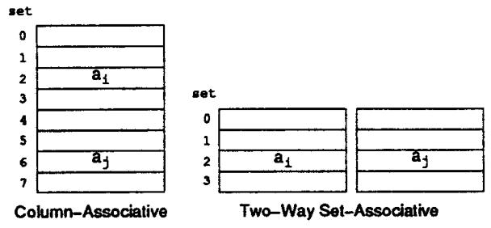


**Multiple Hashing Functions**


列关联缓存使用两个（或可能更多）不同的哈希函数$h_1$和$h_2$来访问缓存，其中$h_1[a]$表示将哈希函数$h_1$应用于地址$a$所获得的索引。如果$h_1[a_i]$索引到有效数据，则发生首次命中；如果未命中，则使用$h_2[a_i]$访问缓存。如果第二次命中，则检索数据。然后交换两条缓存行中的数据，以便下次访问更有可能首次命中。然而，如果第二次访问也未命中，则从主内存中检索数据，将其放置在由$h_2[a_i]$索引的缓存行中，并与第一个位置的数据交换。
_若miss,则从主存读数据至h2对应的缓存，并和h1对应位置的缓存交换_

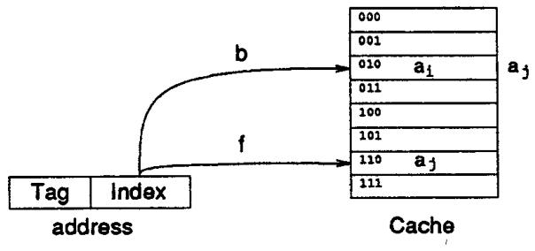

举例：首先使用位选择函数(b)，miss后使用位反转函数（f）

使用两个或更多哈希函数模仿了组相联性，因为对于冲突地址（即$h_1[a_i] = h_1[a_j]$的$a_i$和$a_j$ ），用$h_2$对$a_j$进行重哈希有很高的概率解决冲突（即$h_1[a_i]≠h_2[a_j]$）。不过要注意，首次命中的命中访问时间保持不变。为了简单和快速，首次访问采用位选择方式（即$h_1 = b$），而位翻转通常用于$h_2$（即$h_2 = f$）。

将位翻转用作第二个哈希函数会引发一个潜在问题。考虑两个地址$a_i$和$a_x$，它们仅在索引字段的高位位上有所不同（即$f[a_{i}]=b[a_{x}]$）。这两个地址是不同的，然而它们的标签字段却是相同的。因此，使用$f[a_{i}]$进行重哈希访问时，会命中一个本应仅由$b[a_{x}]$访问的数据块。这是不可接受的，因为一个数据块必须与唯一的地址一一对应。对于那些索引相同从而引用同一缓存组的地址，需要通过比较标签来确定某个地址是否有权访问该数据块。 这就为该问题提供了一个简单的解决方案，即把索引字段的高位位附加到标签上，如图4所示。使用$f[a_{i}]$进行重哈希将正确地失败，因为此时数据块再次与唯一的地址$a_x$关联。只要使用位翻转，就假定采用了这种方案。

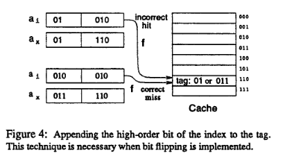

哈希 - 重哈希算法被表示为下图 中的决策树

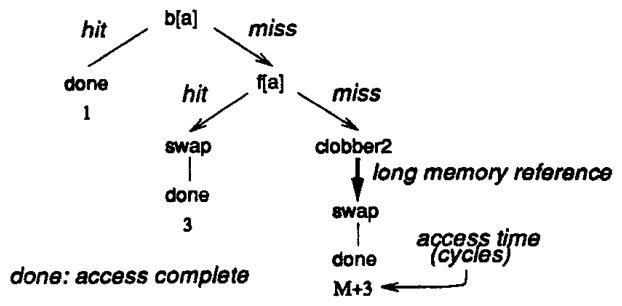
下表中列出了各种符号的 含义和需要的周期数

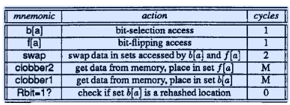

交换分支所示的三个周期（**b(a) miss f(a) hit**），分别来自初始缓存访问的一个周期、重哈希访问的一个周期，以及交换过程中浪费的一个周期。根据表 1，数据交换还需要额外两个周期才能完成。不过，如果缓存有一个额外的缓冲区，那么这次数据交换就无需处理器参与，处理器在等待缓存再次可用的过程中可以去执行其他有用的工作。如果有一半的情况都是如此，那么一次数据交换所浪费的时间就相当于一个周期。所以假定所有的交换操作都是只有一个周期

哈希 - 重哈希缓存存在一个严重的缺陷，这常常使其性能降至与直接映射缓存相同的水平,每次首次未命中后都会尝试重哈希，这可能会替换重哈希位置中潜在有用的数据，即使主位置存在一个未被使用的块。

> 不幸的是，哈希 - 重哈希缓存存在一个严重的缺陷，这常常使其性能降至与直接映射缓存相同的水平，这在5.3节中可以看到。其问题的根源在于，每次首次未命中后都会尝试重哈希，这可能会替换重哈希位置中潜在有用的数据，即使主位置存在一个未被使用的块。考虑以下引用模式$a_i$ $a_j$ $a_x$ $a_y$ $a_z$ $a_y$ $a_z$ ……，其中地址$a_i$和$a_j$通过位选择映射到相同的缓存位置，而$a_x$是通过位翻转映射到相同位置的地址（即$b[a_i] = b[a_j]$，且$f[a_i] = b[a_x]$）。这种情况如图6所示。在前两次引用之后，哈希 - 重哈希算法和列关联算法都会有由$a_j$引用的数据（为简洁起见，将其称为j）以及数据i 。分别位于非重哈希和重哈希位置。当遇到下一个地址$a_x$时，两种算法都会尝试访问集合$b[a_x]$，该集合包含重哈希后的数据$i$。但是当首次未命中发生时，哈希 - 重哈希算法接下来会尝试访问$f[a_x]$，这导致第二次未命中，并覆盖了数据$j$。只要$a_i$和$a_x$交替出现，这种模式就会持续下去；其中一个引用的数据会被覆盖，因为未使用的数据块$i$被来回交换，但从未被替换。我们将这种负面影响称为二次颠簸。

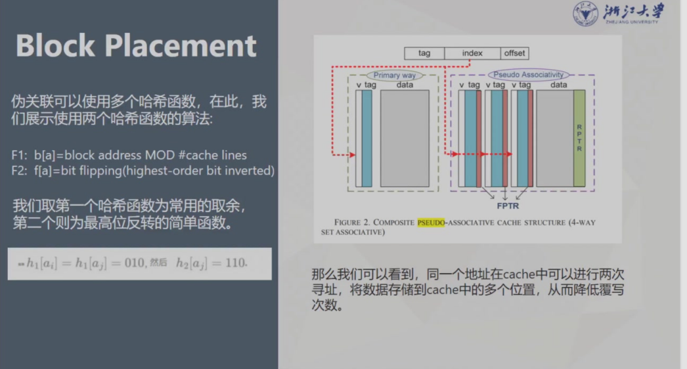

**如何解决上述的重哈希导致的二次颠簸问题？**

有效实现列关联的关键在于，如果首次访问到达的位置本身包含重哈希数据块，就禁止进行重哈希访问。

每个缓存组都包含一个额外的位，用于指示该组是否为重哈希位置，即该组中的数据是否由f[a]进行索引。当必须替换一个缓存组时，总是优先选择重哈希位置（如果可能的话会立即选择）。

因此，如果首次访问未命中，就检查该组的重哈希位置位（或简称重哈希位，即表1中列出的“$Rbit = 1?$”）。如果它被设置为1，就不会尝试重哈希访问，从内存中获取的数据会被放置在该位置。然后将重哈希位重置为0，以表明该组中的数据未来将由$b[a]$进行索引。另一方面，如果重哈希位已经是0，那么在首次未命中时，重哈希访问将按照3.1节中描述的方式继续进行。需要注意的是，如果发生第二次未命中，那么要替换数据的组同样是一个重哈希位置，这正是我们所期望的。

在启动时（或缓存刷新后），所有空的缓存位置的重哈希位都应设置为 1

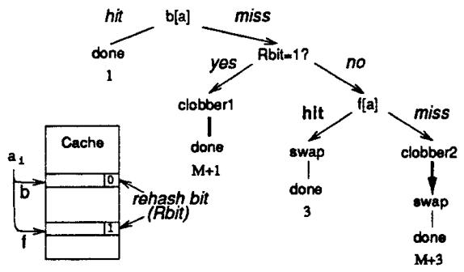
与哈希 - 重哈希缓存一样，如果确实尝试进行重哈希，列关联算法会尝试利用时间局部性，将最近访问的数据交换到非重哈希位置。重哈希位的使用有助于更高效地利用缓存空间，因为它能立即表明某个位置是否为重哈希位置，并且在需要替换时，重哈希位置会优先于非重哈希位置被选择。


## 3 性能分析

最后进行测试使用的方法主要围绕跟踪驱动模拟展开，具体如下： 
1. **模拟器开发**：编写了用于直接映射、组相联、牺牲缓存、哈希-重哈希和列关联缓存的跟踪驱动模拟器。多程序模拟中假设每个引用关联进程标识符以区分不同进程数据，且所有缓存假设为统一的指令和数据缓存。 
2. **跟踪数据选取**：使用来自Sites和Agarwal的ATUM实验的跟踪数据，包含现实工作负载，有操作系统和多程序活动。包括从在VMS下运行的大型程序导出的五个单处理器跟踪数据（LISPO、DECO.1、SPICO、IVEXO、FORLO），以及名为MUL6.0的多程序跟踪数据（含六个进程活动）。每个跟踪数据长度约50万次引用。 
3. **性能指标计算** 
    - **未命中率**：未命中次数与总引用次数的比率。
    - **消除的冲突未命中百分比**：通过特定公式计算，即\(\frac{直接映射缓存未命中率 - 特定缓存未命中率}{直接映射缓存未命中率 - 强制未命中率}\times100\%\) ，其中强制未命中率是跟踪中唯一引用次数与总引用次数的比率。 
    - **平均内存访问时间**：根据不同缓存类型，基于相应公式计算。如直接映射缓存根据命中和未命中情况计算；哈希-重哈希缓存考虑首次命中、重哈希命中和未命中情况；列关联缓存还需考虑第二次访问次数等参数进行计算。模拟器测量每种缓存类型的相关参数（如总引用次数\(R\)、第二次访问总次数\(R_{2}\)、首次访问总命中次数\(H_{1}\)、第二次访问总命中次数\(H_{2}\)）来得出平均内存访问时间。 


模拟结果如下：

Figure 12: **MS rate**s versus cache size, averagedover w six traces. Block Si2e is 16 bytSS.

- **直接映射缓存**：未命中率从 6.0% 迅速降至 2.0%，然后趋于约 1.5% 的平均强制未命中率。
- **其他缓存分组**：哈希 - 重哈希缓存和牺牲缓存为一组，哈希 - 重哈希缓存未命中率从 6.0% 下降到约 1.9%，在过渡点有异常变化；两路组相联缓存和列关联缓存为一组，小缓存时未命中率比直接映射缓存低近 2.0%，过渡点略低于 1.0%，大缓存时与强制未命中率相同。
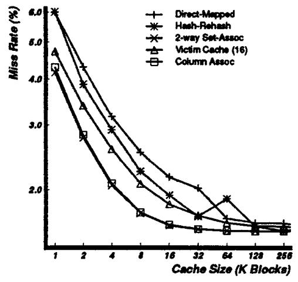


Figure 13: Percentages of interference misses removed versus cache size., averaged over the single process traces. Block size is 16 bytes.

组相联缓存和列关联缓存结果几乎相同，从约 40% 开始，缓存大小达到 256K 块时上升到 100%；随着缓存大小增加，牺牲缓存相对于列关联缓存性能下降；模型的虚线与模拟结果接近。
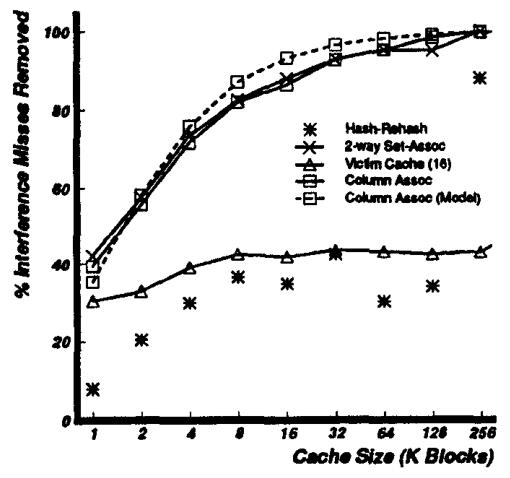

Figure 14: Average memory access times versus cache size, averaged over six traces。 Block size is 16 bytes

列关联缓存在大多数操作条件下是不错的选择，中小缓存时平均内存访问时间减少超过 0.2 个周期，中大型缓存时减少约 0.1 个周期 。
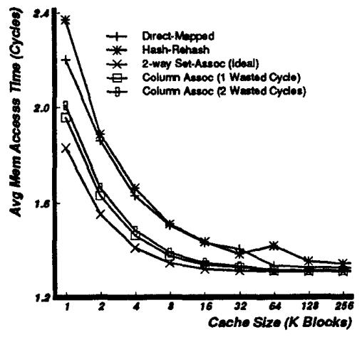


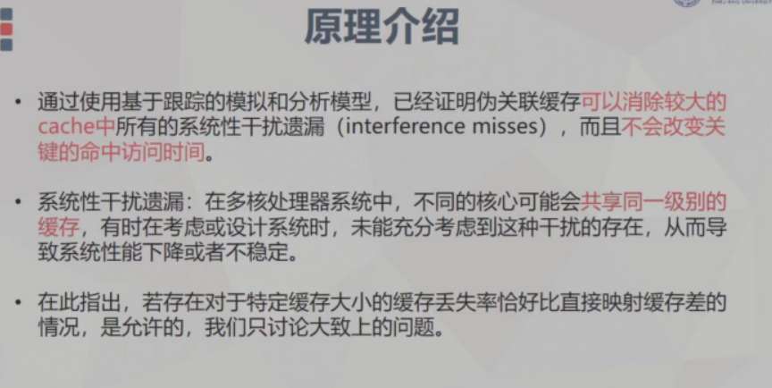
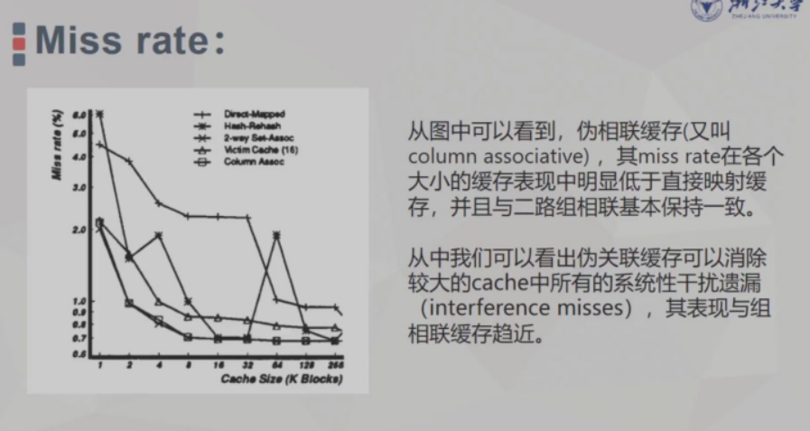

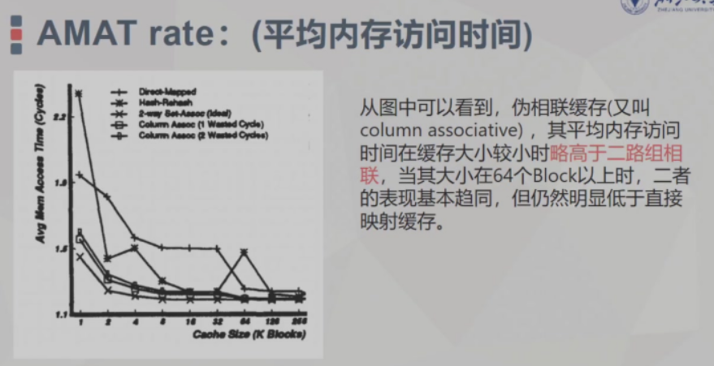