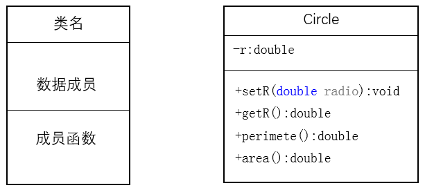
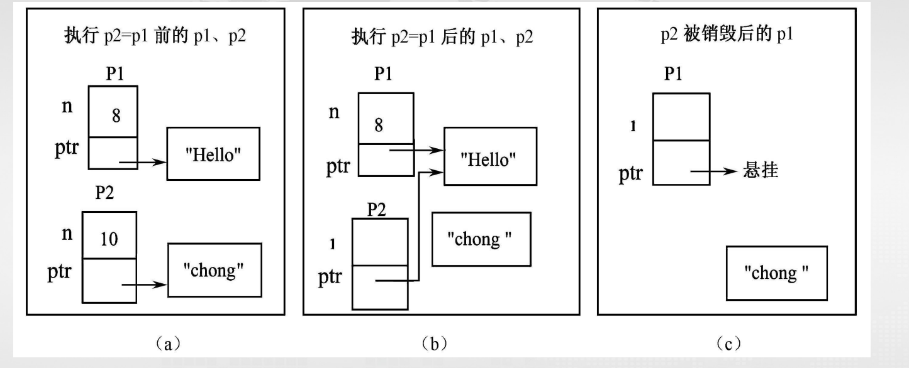

# 类与对象

## 类的抽象和封装

ADT: 是指由用户定义，用以描述应用问题的数据模型，常由基本数据类型组合而成，并包括一组服务（接口）

### 抽象

- 过程抽象
- 数据抽象

抽象的结果： 数据成员和成员函数

### 封装

抽象只是设计出了ADT的接口函数，并没有实现其函数功能，导致了接口与实现的分离，封装是对接口的实现

封装用来完成数据抽象设计的目标：用户只能通过接口访问抽象数
据类型的功能，他只须向接口函数传递正确的参数，就能够使用该
接口的功能，不必知道这些功能的实现细节，以及内部数据的状态。

通过类 class 来实现封装，类是对数据和操作的封装，类的对象是类的实例化

```cpp 
class ClassName{
    public:
    //公有成员 //接口
    private:
    //私有成员 //信息隐藏
};
```

## 结构

### c++对结构的扩展

不仅可以包含数据，而且可以包含函数，同时引入了private,public和protected访问控制符

```cpp
struct ClassName{
    public:
    //公有成员
    private:
    //私有成员
    protected:
    //保护成员，与继承有关
}
```
**成员访问控制符**
- public: 可以从结构（类）外部访问
- private: 只能在结构（类）内部即自身成员函数访问
- protected: 只能在结构（类）内部及其派生类中访问

这些访问控制符可以出现在类的任意位置，且可以多次出现，访问控制符的作用范围是从它出现的位置到下一个访问控制符或类的结束

默认为public

类图是UML中最重要也是最常见的一种图形，用于描述类的成员组成和关系。
类图用一个矩形表示，其中包括类名、数据成员和成员函数三部分。且在类图
中
- '+'表示public
- '-'表示private
- '#'表示protected




### 类

在c++中,class具有和struct相同的功能，class是对数据和操作的封装，class的对象是class的实例化

```cpp
class ClassName{
    public:
    //公有成员
    private:
    //私有成员
    protected:
    //保护成员，与继承有关
};//分号必不可少
```

- 类成员: class 声明中的数据和函数
- 访问控制符: public, private, protected
- 类域: class 或者 struct 后一对大括号，所包围的区域是一个独立的作用域，称为类域。同一类域里的成员不受访问public 、private和protected访问权限的限制，相互之间可以直接访问
- class 和 struct 的区别: 没有指定成员的访问权限时，class 默认是 private, struct 默认是 public

在类外，通过类成员访问符`.`来访问public成员

### 数据成员

- 数据成员可以是任何数据类型
- 数据成员可以是指向自身类的指针或者引用，不能是自身类的对象
- 可以是const类型,不能是constexpr常量
- 可以用decltype推断定义，但是不能用auto推断
- 数据成员不能指定为 register和extern存储类型

```cpp
class A{/*...*/};
class B{
    private:
        int a;
        A obja1, *obja2;
        B *objb, &ogjr;
        B b1; //错误
        auto b=a+1; //错误
        decltype(7.9) a; //正确
        extern int c; //错误
        const int x; //正确
        constexpr int y; //错误
}
```

c++11 标注规定，可以为数据成员提供一个类内初始值，用于创建类时初始化数据成员

- 类的声明只是增加了一种自定义数据类型，只有在用类定义对象是，才会为数据成员分配空间，在这个时间点上才会用相应的
初始值初始化数据成员。

## 成员函数

- 类内定义成员函数：在声明类时，直接在类的内部就给出成员函数的定义，以这种方式定义的成员
函数若符合内联函数的条件就会被处理为内联函数
- 类外定义成员函数：在声明类时，只声明了成员函数的原型，就需要在类的外部定义该成员函数`return_type class_name::function_name(args){}`

### 类外成员函数

- 若采用类外方式定义成员函数，则类声
明时成员函数原型中的形参名可以省略，
只声明各个形参的类型；
- 在类外定义成员函数时，成员函数的返回类型，函数名称，参数表必须域成员函数原型的声明完全相同，而且必须指出每个形参的名字
- 在类外定义成员函数时，必须在成员函数名前面加上类名，并且在类名和成员函数名之间加上作用域解析运算符::，以表明该成员函数是属于哪个类的

!!! example "类外成员函数"
    ```cpp
    class D{
        int d, m, y;
        public: 
        int init(int ,int ,int);//忽略了形参名
        int getDay();
        inline int getMonth();
    }
    int D::init(int dd, int mm, int yy){
        d=dd;
        m=mm;
        y=yy;
    }
    ```

### 常量成员函数

在c++中，常量成员函数用于禁止成员函数修改数据成员的值

```cpp
class ClassName{
    public:
        int getData() const; //常量成员函数
        void setData(int d);
    private:
        int data;
};
```

`getData`函数是一个常量成员函数，不能修改数据成员的值,在其函数体内不能有任何修改`ClassName`数据成员的语句

- 只有类的成员函数才能定义为常量函数，本质上限定`this`指针的类型为`const ClassName*`, 普通函数不能定义为常量函数，例如
```cpp  
int f(int a) const; //错误
```
- 常量参数和常量成员函数是有区别的，常量参数限制函数对参数的修改，但与数据成员是否被修改无关
```cpp
void Employee::init(const char *Name,const double y){
    //参数是常量，但是不是常量函数
    name  = new char(strlen(Name)+1);
    strcpy(name,Name);
    salary = y;
}
```

### 成员函数重载和默认参数

成员函数重载与默认参数规则：

- 重载成员函数必须具有不同的参数表
- 在指定参数确省值时，如果某个参数指定的确省值，则在其后面所有参数都必须指定确省值，就要求它右边的全部参数都必须指定默认值


!!! example "成员函数重载和默认参数"
    ```cpp
    class Date{
        int day, month, year;
        public:
            void init(int d, int m = 8, int y = 2000){
                day = d;
                month = m;
                year = y;
            }
            void init(int d, int m)
                {　day = d; month = m; year = 2016; }
            void init(int d)
                {day = d; month = 8; year = d; 　}
    }
    ```
    这段函数可能发生重载歧义问题，即一个调用能够匹配多个函数

## 对象

用类定义的变量就是对象，在用类定义对象时，才会为数据成员分配内存空间。

**对象的定义**
```cpp
ClassName object_name;
ClassName object_name1, object_name2;
ClassName object_name3(参数表), object_name4(参数表);
```

每个对象的数据成员具有独立的内存空间，而成员函数则只有
一分内存副本，由同类对象所有对象共用。

**对象的引用**

- 通过对象访问成员函数：`对象名.数据成员名`，`对象名.成员函数名(参数表)`
- 通过指针访问成员函数：`对象指针->数据成员名`，`对象指针->成员函数名(参数表)`

在类外只能访问对象的public成员，不能访问private成员

同一个的不同对象之间，以及同一个类的对象的指针之间可以相互赋值

!!! note "对象赋值的注意事项"
    
    - 两个对象必须类型相同
    - 进行数据成员的值拷贝，赋值以后，两不相干
    - 若对象有指针数据成员，赋值可能产生问题

## 构造函数设计

C++编译器会需要的时候为符合条件的类自动在类中添加以下6个成员函数

- 默认构造函数
- 拷贝构造函数
- 赋值运算符
- 析构函数
- 移动构造函数(c++11)
- 移动赋值运算符(c++11)

```cpp
class A{
    int a,b,c;
    char *p;
}
A obj1, obj2;
A obj3(obj1); //拷贝构造函数
A obj4 = obj1; //拷贝构造函数
A f()
{
    A obj5;
    return obj5; //移动构造函数
}
obj2 = f(); //移动赋值运算符
```
函数不能解决这三种对象复制，会产生悬挂指针

!!! note
    编译器为自动为类生成的成员函数在没有指针时
    是可信可用的。当有指针成员且在析构函数中delete
    指针会产生“悬挂指针”，引起运行的错误。两种解决
    办法可参考：

    “5 法则”，是指复制构造函数、移动构造函数、
    赋值运算符函数、移动赋值运算符函数和析构函
    数 5 个操作要么全部显式设计，要么一个也不设
    计。

    “0 法则” ， 是指用C++ 11 中的智能指针
    unique_ptr或shared_ptr 来代替传统指针。

**对象构造、析构和复制函数的禁止**
```cpp
class A{
    int a,b,c;
    char *p;
    public:
    A() = delete;
        A(const A& other) = delete;
        A(const A&& other) = delete;
        A& operator=(const A& other) = delete;
        A& operator=(const A&& other) = delete;
        ~A() = delete;
};
```
如果不允许对象间的复
制、赋值或移动操作，可
以用delete禁止相关成员
函数

### 构造函数和类内初始值

- 构造函数：与类同名，主要用于初始化数据成员
- 类内初始值: 在类的声明中直接为数据成员提供初始值（c++ 11）
```cpp

class A{
    X(...); //构造函数
    int a = 0; //类内初始值
}
```
**构造函数的特点**：

- 构造函数的名称与类名相同，且没有返回类型
- 构造函数可以被重载
- 构造函数由系统自动调用，不允许显式调用
- 构造函数不能被声明为const函数

**执行时间**

- 编译器建立对象，为数据成员分配内存空间
- 若指定了数据成员的类内初始值，则用类内初始值初始化数据成员
- 根据定义对象时提供的参数匹配正确的构造函数，执行构造函数。

**构造函数的调用**

- 只能在定义对象时，由系统自动调用
- `类名 对象名(参数表)`，系统将根据参数表调用某个构造函数，若无参数表，则调用缺省构造函数
- 不允许在程序中显式调用构造函数！！！！

!!! warning "注意点"
    === "注意点"
    - 构造函数不能有返回类型，`void`也不行
    - 构造函数的调用时机是定义对象之后的第一时间，即构造函数是对象的第一个被调用函数
    - 定义对象数组或用new创建动态对象时，也要调用构造函数。但定义数组对象时，必须有不需要参数的构造函数
    - 构造函数通常应定义为公有成员，因为在程序中定义对象时，要涉及构造函数的调用，尽管是由编译系统进行的隐式调用，但也是在类外进行的成员函数访问
    === "错误例子"
    ```cpp
    class Desk{
        Desk(){ weight=high=width=length=0;} //无参构造函数为private
        public:
        void Desk::Desk(int ww,int l,int w,int h) { // 错误，不能有返回类型
        weight=ww; high=l;
        width=w; length=h;
        }
    private:
        int weight,length,widthp,high;
    };
    void main(){
        Desk d(2,3,3,5); //构造函数在定义对象时调用
        d.Desk(1,2,3,4); //错误，构造函数不能被显式调用
        Desk a[10]; //错误,须无参构造函数，但它是private
        Desk *pd;
        Desk d; //错误，调用Desk::Desk()，但它是private
        pd=new Desk(1,1,1,1); // 调用构造函数Desk::Desk(int,int,int,int)
    }
    ```

### 默认构造函数

创建类对象时没有显式提供初始化值时调用的函数

**默认构造函数的类型**

- 不带参数的构造函数
- 为所有参数提供默认值的构造函数

!!! example "对象定义规则和应用默认构造函数的典型情况"
    - 定义无参对象时，调用默认构造函数
    - 定义对象数组时，调用默认构造函数
    - 在派生类中可由系统自动调用基类或子对象的默认构造函数实施相应对象的初始化

#### 系统添加的默认构造函数

C++规定，每个类必须有构造函数，如果一个类没有定义任何构造函数，在需要时
编译器将会为自动为它生成一个默认构造函数。

在使用默认构造函数创建对象时

- 如果创建的是全局对象或静态对象，则对象所有数据成员都被初始化为0
- 如果创建的是局部对象，则不会初始化数据成员

!!! warning "注意事项"

    === "使用默认构造函数的注意事项"
        在类没有定义任何构造函数时，系统才会自动添加默认构造函数。一旦有了任何形式的构造函数，系统就不会再添加默认构造函数了

        在类有需要参数构造数时，若需要创建无
        参对象，必须显式定义无参构造函数。但
        在C++11中，也可以用下面的方式要求编
        译器创建合成的默认构造函数。

        ```cpp
        class A{
            public:
                A() = default; //要求编译器创建合成的默认构造函数
                A(int a, int b) : a(a), b(b) {} //有参构造函数
        };
        ```
    === "默认构造函数引发的错误"
        在某些情况下合成的默认构造函数会执行错误操作。比如，
        类具有数组或指针成员时，默认构造函数执行对象初始化时，
        很有可能产生“指针悬挂”问题。
    === "编译器不生成默认构造函数的情况"
        - 类A的一个数据成员是用类B创建的，但类B有其它构造函数，
            却没有默认构造函数，在这种情况下类A必须定义构造函数，并负
            责为对象成员提供构造函数初值。
        - 为类定义了某个构造函数
        - 有常量、引用成员，且未用类内实始值初始化

!!! example "默认构造函数的使用"

    === "一般情况"

        ```cpp
        #include <iostream>
        using namespace std;
        class Point {
            private:
                int x, y;
            public:
                Point(int a, int b) { setPoint(a, b); } //L1
                int getx() { return x; }
                int gety() { return y; }
                Point() { x = 0; y = 0; } //L2 显式定义无参构造函数
                void setPoint(int a, int b) { x = a; y = b; }
                };
        Point p0; //L3
        Point p1(1, 1); //L4 调用构造函数Point(int,int)
        void main() {
            static Point p2; //L5 调用构造函数Point()
            Point p3; //L6 调用构造函数Point()
            Point a[10]; //L7 调用构造函数Point()
            Point *p4; //L8 不调用任何构造函数
            p4 = new Point; //L9 调用构造函数Point()
            p4->setPoint(8, 9);
            cout << "p0: " << p0.getx() << "," << p0.gety() << endl;
            cout << "p1: " << p1.getx() << "," << p1.gety() << endl; //L10
            cout << "p2: " << p2.getx() << "," << p2.gety() << endl;
            cout << "p3: " << p3.getx() << "," << p3.gety() << endl;
            cout << "p4: " << p4->getx() << "," << p4->gety() << endl;
            cout << "a[0]: " << a[0].getx() << "," << a[0].gety() << endl;
        }
        ```

    === "缺省参数构造函数"

        在数据成员的取值比较固定时，可以通过为构造函数参数提供缺省参数初始化它们。
       
        ```cpp
        class Point {
        private:
        int x, y;
        public:
        Point(int a=0, int b=0) { setPoint(a, b); } //L1
        //Point() { x = 0; y = 0; } //定义无参对象时会与缺省参数构造函数冲突
        void setPoint(int a, int b) { x = a; y = b; }
        ……
        };
        ```

### 重载构造函数

与普通函数的重载一样，重载的构造函数必须具有不同的函数原型

```cpp
class A{
A(int ){…}
A(int,int){….}
A(double ){…}
};
A a(1),b(2,3),c(3.4)
```


!!! example "重载构造函数的使用"

    ```cpp
    #include <iostream>
    using namespace std;
    class Tdate {
        public:
            Tdate();
            Tdate(int d);
            Tdate(int m, int d);
            Tdate(int m, int d, int y);
    //…… // 省略掉了设置和读取数据成员值的接口函数
            void display(){ cout << month << "/" << day
            << "/" << year << endl; }
        private:
            int year=2008,month=8, day=8; // 11C++
    };

    Tdate::Tdate() {display();}
        Tdate::Tdate(int d) {
        day = d;
        display();
    }
    Tdate::Tdate(int m, int d) {
    month = m; day = d;
        display();
    }
    Tdate::Tdate(int m, int d, int y) {
        month = m; day = d; year = y;
        display();
    }
    void main() {
        Tdate oneday; //L1
        Tdate aday(); //L2，可以吗？
        Tdate bday1(10); //L3
        Tdate bday2 = 10; //L4
        Tdate cday(2, 12); //L5
        Tdate dday(1, 2, 1998); //L6
    }

    ```

    L2语句不会调用构造函数，它声明了一个函数，返回值为Tdate类型，参数为空

    L4是一种拷贝初始化，编译器会尝试将整数 10 转换为 Tdate 对象。由于存在一个可以接受整数参数的构造函数 `Tdate(int d)`,编译器会用它进行隐式转换

    - 首先，会使用 Tdate(10) 创建一个临时的 `Tdate` 对象。在这个过程中：`day` 被设置为 10。`month` 和 `year` 保留其默认值 (8 和 2008)。
    - 然后这个临时对象被用来初始化 bday2（在现代 C++ 中，编译器通常会优化掉这个拷贝过程，直接在 bday2 上构造，但概念上是这样）。 

### 构造函数与初始化列表

构造函数的初始化列表是一个特殊的语法结构，用于在对象创建时初始化成员变量。它在构造函数体执行之前被调用，允许我们在对象创建时直接初始化成员变量，而不是在构造函数体内赋值。

```cpp
class ClassName{
    public:
        ClassName(int a, int b){ 
            //构造函数体
        }
    private:
        int data1;
        int data2;
};

ClassName::ClassName(int a, int b): data1(a), data2(b) {//初始化列表
    //构造函数体
}
```
介于参数表后面的`:`与函数体之间的内容就是成员初始化列表，其含义是将括号中的初始值参数赋给该括号前面的成员

!!! warning "注意事项"

    - 初始化列表中成员初始化次序与他们在类中的声明次序相同，与初始化列表中的次序无关
        ```cpp
        //初始化顺序完全相同
        Tdate::Tdate(int m,int d,int y)
            :month(m),day(d),year(y){}
        Tdate::Tdate(int m,int d,int y)
            :year(y),month(m),day(d){}
        Tdate::Tdate(int m,int d,int y)
            :day(d),year(y),month(m){}
        ```
    - 构造函数初始化列表的执行时间
        如果数据成员有类内初始值，则执行次序：类内初始值->初始化列表->构造函数体
    - 必须采用初始化列表（或类内初始值）进行初始化的成员
        - const成员
        - 引用成员
        - 类对象成员
        - 派生类构造函数对基类构造函数的调用

```cpp
class A {
    int x, y, j;      // 成员声明顺序：x, y, j
    const int i = 4;  // C++11 类内初始化
    int &k;
public:
    A(int a, int b, int c) : j(b), k(c), x(y) { // 初始化列表
        y = a; // 构造函数体
        cout << "x=" << x << "\t" << "y=" << y << endl;
        cout << "i=" << i << "\t" << "j=" << j << "\t" << "k=" << k << endl;
    }
};
```
得到的`x`是一个未定义的值，因为`y`在初始化列表中没有被初始化。 

### 委托构造函数

一个构造函数使用它所在类的其它构造函数执行自己的初始
化功能，或者说一个构造函数把它自己的一些（或全部）职
责委托给其它构造函数，就称为委托构造函数）

委托构造函数只能够在初始化列表中调用它要委托的构造函
数，而且初始化列表中不允许再有其它的成员初始化列表了，
但委托构造函数体中可以有程序代码。

!!! example "委托构造函数的使用"
    ```cpp
    class A {
    public:
    A()：A（1，2）{}
    A(int,int){}
    };
    A a1;
    A a2(3,4);
    A &a=a1;
    ```
    本程序调用构造函的次数为3次，`A a1`调用了`A()`构造函数，`A()`构造函数又调用了`A(int,int)`构造函数，`A a2(3,4)`直接调用了`A(int,int)`构造函数


## 析构函数

```cpp
class X{
    ~X(); //析构函数
}
```
#### 析构函数特点

- 析构函数的名称与类名相同，前面加上`~`符号
- 析构函数没有返回值
- 析构函数不能有参数
- 析构函数不能被重载

**析构函数调用时机**

- 对象生命期结束时自动调用

!!! note

    - 每个类都应该有一个析构函数。如果没有显式定义析构函数，c++编译器将产生一个最小化的默认析构函数
    - 若有多个对象同时结束生存周期，c++将按照与调用构造函数相反的顺序调用析构函数
    - 构造函数和析构函数都可以是inline函数
    - 构造函数和析构函数通常都需要在类外被调用，public
    - 合成的析构函数通常都能够满足对象析构的要求。但在某些情况下，必须编写析构函数才能够完成对象销毁前的资源清理工作。常见情况是用它来释放由构造函数分配的自由存储空间。

!!! info RAII

    即“资源获取即初始化”，是指在对象的构造函数中获取资源，在析构函数中释放资源。RAII法则是C++中管理资源的一个重要原则，确保了资源的正确释放和内存泄漏的避免。

    ```cpp
    class B{
        private:
            int *p; char *q;
        public:
            inline B(int x){
                a = new int[x];
                pc = new char;

            }
            inline ~B(){
                delete []a; 
                delete pc;
            }
    };
    ```

    像B这样的类，在
    构造函数中进行了动
    态内存空间的分配，
    系统合成的默认析构
    函数就不能回收此空
    间，必须编写析构函
    数，回收动态内存空
    间，否则会产生内存
    泄漏


### 弱指针和析构函数

共享指针管理对象的堆内存时，可能产生循环引用，导致死锁或不能回收内存等问题

弱指针`weak_ptr`可以协助共享指针解决问题

!!! example
    
    ```cpp
    #include<iostream>
    #include<memory>
    using namespace std;
    class B;//L1 前向声明
    class A{
        public:
        A(){cout << "A constructor" <<endl;}
        ~A(){cout << "A Deconstructor" << endl;}
        shared_ptr<B> pb; //L2 在A中引用B
        // weak_ptr<B>pb; // L3 ，弱指针
    };

    class B{
        B() { cout<<"B Constructor …"<<endl; }
        ~B() { cout<<"B Destructor …"<<endl; }
        shared_ptr<A> pa; // L4，在B中引用A
    }；
    int main() {
    shared_ptr<A> spa{ new A() }; // L5
    shared_ptr<B> spb{ new B() }; // L6
    spa->pb = spb; // L7，循环引用了A
    spb->pa = spa; // L8，循环引用了B
    cout<<"spa.count = "<<spa.use_count()<<"\tspb.count = "<<spb.use_count()<<endl;
    }
    ```

    由于pa,pb相互引用，使它们的内存引用计数
    都是2，在失去其生存其期时，引数计数器减
    1，但仍不为0，所以其析构函数（回收内
    存）不被调有，内存未被回收，产生内存泄
    漏。

    解决办法：用语句L3取代语句L2

## 赋值运算符函数、拷贝构造函数和移动函数设计

- 由于赋值、拷贝操作的普遍性，致使每个类都应该具有这些成员函数，如果在设计类时没有显式
地定义它们，编译器就会自动为该类添加默认的赋值运算符函数、拷贝构造函和移动构造函数，
定义各函数的默认操作。
- 系统生成的默认函数大多数情况能够正确完成对象的赋值、拷贝和移动操作。但在某些情况下，
默认函数的默认操作会出问题。
- 比较典型的情况是当类具有指针类型数据成员的时候，依赖默认赋值运算符函数进行对象赋值，
或默认拷贝构造函数进行对象复制都会产生“指针悬挂”问题。这时，就必须显式定义类的赋值
运算符函数和拷贝构造函数了。

**各个默认函数的形式和时机**

```cpp
class A{
    int a,b,c;
    char *p;
    public:
        A(); //默认构造函数
        A(const A& other); //拷贝构造函数
        A(A&& other); //移动构造函数
        A& operator=(const A& other); //赋值运算符函数
        A& operator=(A&& other); //移动赋值运算符函数
        ~A(); //析构函数
};
```

**调用时机**

```cpp
A a2(a1), a3 = a1, a4{a1}, a5={a1}; //拷贝构造函数
A f(A o){
    A t;
    return t; //移动构造函数
}

a2 = a1; //赋值运算符函数
a2 = f(a1); //调用移动构造函数和移动复制函数

```

### 赋值运算符和复制构造函数的设计

**调用时机**

- 用于实现同类对象间的赋值复制或复制构造
- 当把类的一个对象赋值给另一个对象时，编译器会自动调用赋值运算符函数 
- 用一个已定义对象初始化新建对象时，调用赋值构造函数

**默认**: 如果类没有显示定义赋值运算符函数和拷贝构造函数，编译器会自动为它们生成默认的赋值运算符函数和拷贝构造函数，以按位复制的方式实现对象非静态数据成员的赋值和复制操作

**对象赋值操作的执行过程**

- 查找该类是否提供了显式的赋值运算符/复制构造函数，如果有可访问的，就是用这个，如果提供了但是不是可以访问的，就产生编译错误
- 如果该类没有显式定义，就为该类合成，执行默认的操作

**需要定义的情况**：类包含有指针数据对象时

!!! example "指针悬挂"
    ```cpp
    #include <iostream>
    #include <string>
    using namespace std;
    class String{
        char *str;
        int n;
    public:
        String(char *s, int a){
            ptr = new char[strlen(s)+1];
            strcpy(str, s);
            n = a;
        }
        ~String(){
            delete str;
        }
        void print(){
            cout << str << endl;
        }
    }
    int main(){
        String p1((char *)"Hello", 8);
        {
            String p2((char *)"chong qing", 10);//L2
            p2 = p1;
            cout << "p2: ";
            p2.print();
        }
        cout << "p1: ";
        p1.print();
        String s1((char*)"string1",1);
        {String s2 ={s1};
        s2.print();}
    }
    s1.print();
    ```
    什么时候使用赋值运算符，什么时候使用复制构造函数？

    - 赋值运算符函数用于对象间的赋值操作
    - 复制构造函数用于对象间的复制操作
    - 赋值运算符函数和复制构造函数的调用时机不同
        - 赋值运算符函数在对象已经存在时调用
        - 复制构造函数在对象创建时调用

    当执行`p2 = p1`时，由于String 类没有提供赋值运算符函数，C++将为它生成合成赋值运算符函数，并调用他进行对象赋值

    编译器合成的赋值运算符函数类似于下面的形式：
    ```cpp
    String& String::operator=(const String& other){
        ptr = other.ptr;
        n = other.n;
        return *this;
    }
    ```
    1. L2 执行后， p1,p2 的 ptr 指针指向了同一
    内存单元。 P2 对象析构时就会调用它的析
    构函数 delete 此内存区域。因此输出
    p1.ptr 所指内容时是无效字符。

    2. 当 p1 析构函数调用时，会再次 delete 同
    一内存区域，产生错误。称为“指针悬
    挂”

    

### 赋值运算符/复制构造的重载方法

赋值运算符是一个二元运算符，常返回本类对象的引用，其定义形式：
```cpp
class ClassName{
    public:
        ClassName& operator=(const ClassName& other);
        ClassName (const ClassName& other);
};
```

可以有多个参数，若有多个参数，则要求除了第一个参数外的其余参数都要有默认值。第一个参数必须是自身类类型的引用，且通常是const类型

```cpp
class String{
String& operator=(const String& s); // 重载赋值运算符函数
……
};

String& String::operator=(const String& s){
    if(this != &s){ //避免自赋值
        delete []str; //释放原有内存
        str = new char[strlen(s.str)+1]; //分配新内存
        strcpy(str, s.str); //复制字符串
    }
    return *this; //返回对象本身的引用
}
```

**至少下面几种情况会调用拷贝构造函数**
```cpp
class X{};
X obj1; //调用默认构造函数
X obj2(obj1); //调用拷贝构造函数
X obj3 = obj1; //调用拷贝构造函数
f(X o); //对象作函数参数，调用拷贝构造函数
X f(...){return t;}//调用（移动构造函数）
X a[4] = {obj1, obj2}; //a[0],a[1]调用拷贝构造函数,a[2],a[3]调用默认构造函数
```
**对象定义域构造函数关系**

- 类名 对象名：无参构造函数

- 类名 对象名(参数表)：参数匹配的构造函数
- 类名 对象名 = 类名(参数表)：参数匹配的构造函数
- 类名 对象名= (参数表)：参数匹配的构造函数

- 类名 对象名（已定义对象）： 拷贝构造函数
- 类名 对象名 = 已定义对象： 拷贝构造函数

### 移动函数

移动即转移，即把一个在内存区域中的内容转移给另一个对象。

主要解决临时对象复制时的系统开销，提高效率

!!! example 
    ```cpp
    class A{......};
    A f(){A t; ....; return t;}
    int main(){
        A b;
        b = f(); //L1
    }
    ```

    L1 的执行过程：

    - 调用f
    - 执行`return t` 将拆关键无名临时对象并返回调用语句
    - 将无名对象拷贝给对象 b
    - 销毁无名临时对象

    而对象移动技术直接将无名对象的内存内容转移给了b，省去了第3，4步的系统开销


对象移动相当于把某对象拥有的内存资源“转让”给另一对象使用，
其实质是把对象的内存资源（即右值）绑定到要转移给的对象。

C++11 标准库中提供 `move` 函数实现对象的右值绑定，此函数定义在
`utility` 头文件中。

```cpp
int x = 0;
int &lrx = x; //正确，左值引用
int &&rrx = x; //错误，右值引用
int &&rrx = std::move(x); //正确，右值引用
```

如果要是实现对象移动，就需要为类定义移动运算符函数和移动拷贝构造函数

```cpp
class A{
    ...
    A(A&& o){......}
    A &operator=(A&& o){....}
};
```

**默认移动函数**

生成条件：

- 类并没有定义这些函数
- 每个非static数据成员都可以移动；内置数据类型是可移动的，如果数据
成员是自定义类类型，只有当它也定义了移动函数时，才是可移动的
- 类并没有定义赋值运算符函数、拷贝构造函数和析构函数。

!!! example 
    ```cpp
    struct A {
        int x; // 内置类型可以移动
        std::string s; //string 定义了移动操作
    };
    class B {
        A a; //A 编译器会为 A 合成移动函数
    };
    class C {
        A a;
        public:
        C() {}
        C(C&o) {} // 定义了拷贝构造涵数，不会有合成移动函数
    };
    B a1, a2 = std::move(a1); //a2 使用合成移动拷贝构造函数
    C c1, c2 = std::move(c1); //c2 使用拷贝构造函数，原因是 C 没有移动函数
    ```

- 对象资源被移动之后，它应该时可析构和有效的，因此指针被移动之后，应该将它置为`nullptr`
- 拷贝左值，移动右值。一个类同时设置了拷贝构造函数、赋值运算符函数、移动拷贝构造函数和移动赋值函数时，
编译器就会使用与普通函数相同的参数匹配规则进行函数调用。当需要左值时，执行拷贝
构造函数或赋值运算符函数；当需要右值时，执行移动拷贝或移动赋值函数。
- 如果一个类定义了拷贝构造函数和赋值运算符函数，但没有移动构造函数和移动赋值运算
符，就不能执行移动操作，即使调用 move 函数也只能执行对象拷贝操作。

## 静态成员

```cpp
class X{
    static 类型 静态数据成员名;
    static 类型 静态成员函数名(参数表);
}
```
- `类型 类名::静态数据成员名`
- `类型 类名::静态成员成员名=初始值;`
- 静态成员函数的定义，除了在类声明中的成员函数前面加上 `static` 关键字之外，其定义与普通函数没
有区别。
- 在类外定义静态数据成员时，不能加上static 关键字
- 在定义静态数据成员时可以指定它的初始值，若没有指定初始值，则它的初始值为0


**静态成员访问**：
- 通过类名访问（非静态成员不具备这种访问方式）
    - `类名::静态成员名`
    - `类名::静态成员函数名(参数表)`
- 通过对象访问（静态成员函数不能通过对象访问）
    - `对象名.静态成员名`
    - `对象名.静态成员函数名(参数表)`


同普通成员函数一样，静态成员函数也可以在类内或类外定义，还可以定义
成内联函数；

静态函数只能访问静态成员（包括静态的数据成员和成员函数），不能访问
非静态成员。

在类外定义静态成员函数时，不能加上 `static` 限定词。

静态成员函数可以在定义类的任何对象之前被调用，非静态成员只有在定义
对象后，通过对象才能访问。 

## `this` 指针

`this` 是一个指针，指向当前对象的地址。它是一个隐式参数，传递给非静态成员函数

!!! example 
    ```cpp
    struct Point{
        int x, y;
    };
    Point & move(Point *this, int a, int b){
        this->x = a;
        this->y = b;
        return *this;
    }
    int getX(Point *this){
        return this->x;
    }
    int getY(Point *this){
        return this->y;
    }
    void main(){
        Point p;
        move(&p, 1, 2);
        cout << getX(&p) << "," << getY(&p) << endl;
    }
    ```

`this`指针式类成员函数中用于表示调用对象自引用的隐式指针参数，代表调用成员函数的对象自身的地址，并且并不允许修改，所以被指定为`const`类型

常见应用：

- 使用`this`指针返回调用对象
- 区分二义性

在类`X`的非`const`成员函数中，`this`指针的类型是`X*`，可以通过它修改数据成员的值，而在类的`const`成员函数中，`this`指针的类型是`const X*`,不能通过它修改对象的数据成员值

静态成员函数没有`this` 指针，因此在静态成员函数中不能访问非静态成员

在类成员函数总，可以通过`this`执政返回对象的地址或者引用，这也是`this`指针的一个重要应用

## 对象应用

成员访问操作符

- `.`：对象名.成员名
- `->`：对象指针名->成员名
- `*`: 解引用
- `.*`: 对象名.*成员名
- `->*`: 对象指针名->*成员名

### 对象数组

```cpp
#include <iostream>
using namespace std;

class point{
    private:
        int x = 0, y = 0;
    public:
        point(){x = 1; y = 1;}
        point(int a = 0, int b = 0){x = a; y = b;}
        int getx(){return x;}
        int gety(){return y;}
}

int main(){
    //point p; 产生二义性
    point p1(3, 3); // 定义单个对象
    point p[3]={ {2,2},{3,3}, {4,4} }; //L4 ，列表是 3 次调用构造函数的参数
    point p2[3]; //L5
    point* pt; //L6
    for (int i = 0; i<2; i++) {
        cout<<"p["<<i<<"].x="<<p[i].getx()<< "\t";
        cout<<"p["<<i<<"].y="<<p[i].gety()<< endl;
    }
    pt = &p1; // 指向单个对象的指针
    cout<<"Point pt->x:"<<pt->getx()<<endl; // 指针对象访问方法 1
    pt = p2; // 指向对象数组的指针
    cout<<"Point Array pt->x :"<<pt->getx()<< endl;
    pt++; // 指向对象数组下一元素
    cout<<"Point Array pt->x :"<<pt->getx()<< endl;
    cout<<"Point (*pt).x :"<<(*pt).getx()<< endl; // 指针对象访问方法 2 
}
```

**几点说明**
- 定义对象数组时通常要调用默认构造函数。没有定义任何构造函数的类可以定义对象数组，因为c++会为这种类自动合成一个默认构造函数
- 如果一个类同时具有无参构造函数和全部参数都有缺省值的构造函数，但在定义无参对象或数组时，将产生二义性
- 如果一个类只有需要参数的构造函数（不包括全部参数都有默认值的情况），只能采用列表方式定义数组

### 向函数传递对象

**类类型**可以作为函数的参数类型，通过它向函数传递对象，再函数中访问参数对象时，只能访问参数对象的`public`成员

**类类型参数的传递方式**

- 值传递（对象的一个拷贝），以按位复制的方式，将实参对象的每个数据成员的值按位拷贝到形参对象的各个数据成员中。参数传递完成之后，形参与实参就没有关系了，所以按值传递对象的方式不能修改实参对象的值
- 地址（指针）传递
- 引用传递（对象的一个别名），引用传递是将实参对象的地址传递给形参对象，形参对象和实参对象共享同一块内存区域，所以在函数中对形参对象的修改会影响到实参对象

!!! example 
    ```cpp
    #include <iostream>
    using namespace std;
    class A{
        int val;
    public:
        A(int i){val = i;}
        int getval(){return val;}
        void setval(int i){val = i;}
    };
    void display(A op){
        cout << "display: " << op.getval() << endl;
    }
    void change1(A op){
        op.setval(100);
        cout << "change1: " << op.getval() << endl;
    }
    void change2(A &op){
        op.setval(200);
        cout << "change2: " << op.getval() << endl;
    }
    void change3(A *op){
        op->setval(300);
        cout << "change3: " << op->getval() << endl;
    }

    int main(){
        A a(10);
        cout << "Value of a before: " << a.getval() << endl;
        display(a); 
        change1(a); 
        cout << "Value of a after change1: "  << endl;
        display(a);
        change2(a);
        cout << "Value of a after change2: "  << endl;
        display(a);
        change3(&a);
        cout << "Value of a after change3: " << endl;
        display(a);
    }
    ```

**对参数的访问**：

- 普通函数（非类成员）接受参数对象之后，在函数体内必须按照访问权限访问对象成员，即只能访问对象的公有成员
- 类成员函数可以访问本类参数对象的私有、保护成员、公有成员

函数返回对象：返回对象时要调用拷贝构造函数

### 类对象成员

- 类的数据成员一般都是基本数据类型，但也可以是结构、联合、枚举之类的自定义数据类型，还可以是其他类的对象
- 如果用其他类的对象作为类的成员，则称之为对象成员

```cpp
class A{
    int x;
    B b; //B是类A的对象成员
};
```

- 拥有对象成员的类必须对对象成员进行初始化
- 对象成员的初始化方式包括**类内初始化**、**构造函数初始化列表**
- 当对象成员所在类有类内初始值或默认构造函数时（包括系统生成的），可以省略对象成员的初始化代码，编译器自动调用
- 若对象成员没有类内初始值或默认构造函数，则必须在类的构造函数初始化列表中进行初始化
    ```cpp
    X::X(参数表)：成员名1（参数表1）...{
        构造函数体
    }
    ```

对象成员的构造次序与它们在类中声明的顺序相同，与初始化列表中的顺序无关

## 类的作用域和对象的生命周期

```cpp
class A{//类域开始
    public:
        A(){cout<<"A()"<<endl;}
        ~A(){cout<<"~A()"<<endl;}
};//类域结束
```
- 类域范围内的成员之间可以互相访问，不受访问权限的限制
- 类外的函数只能访问类的公有成员

### 对象的生命周期

- 静态生存期，是指对象具有域程序运行期相同的生存期，这类对象一旦被建立之后，它将一直存在，指导程序运行结束才被销毁
- 动态生存期是指局部对象的生存期，局部对象具有块作用域，它的生存期是从它的定义位置开始，遇到离它最近的右大括号时结束

全局对象和静态对象具有静态生存期

- 局部对象和静态对象的构造次序与它们在块中的声明次序相同，即在块中先声
明的就先构造，块即对象定义所在的一对 {} 所框定的代码区域。
-  所有的全局对象在 main 之前构造，在 main 结束之后销毁。
- 对象数据成员（包括对象成员）的构造次序与其在类中的声明次序相同，而与
它们在构造函数的初始化列表中的次序无关。
- 在对象生存期结束时，具有相同生存期的对象将按与构造的相反次序销毁。
- 非静态对象的生存期和作用域是一样的，而静态对象的生存期长于作用域

## 友元

类可以授予指定函数特权，让他可以访问该类的所有成员

```cpp
class ClassName{
    friend T f(...);//声明 f 为 X 类的友元， f 的形参通常是 X 类的对象
};
.....
T f(...){...};//友元函数不是类的成员函数

```

### 友元类

一个类可以是另一个类的友元，友元类的所有成员函数都是另一个类的友元函数，能够直接访问另一个类的所有成员

!!! example "友元类"
```cpp
    #include <iostream>
    using namespace std;
    class A{
        private:
            int x, y;
        public:
        A(int a, int b){
            x = a;
            y = b;
        }
        int getx(){
            return x;
        }
        int gety(){
            return y;
        }
        friend class B; //B是A的友元类
    }
    class B{
        private:
            int z;
        public:
            int add (A a){
                return a.x + a.y + z;
            }
            int multiply(A a){
                return a.x * a.y * z;}
            B(int i = 0){z=i;}
    }
    int main (){
        A a(2,3);
        B b(4);
        cout << b.add(a) << endl;//9
        cout << b.mul(a) << endl;//24
    }
```

### 友元成员函数

可以指定类的某个成员函数是另一个类的友元，也就是友元成员函数，友元成员函数可以直接访问另一个类的所有成员，但是该类不是友元的成员函数就只能通过公有成员函数访问其他类的私有和保护成员

```cpp

#include <iostream>
using namespace std;
class B; //L1 ：前向引用声明
class A{
private:
 int x,y;
public:
 A(int i,int j){x=i;y=j;}
 int sum(B b); // 在此只能声明 sum() ，其定义须在 class B 定义之后
};
class B{
private:
 int z;
public:
 B(int i=0){z=i;}
 friend int A::sum(B b);
};
int A::sum(B b){return x+y+b.z;} //sum() 的定义只能在 B 定义之后
void main(){
 A a(2,3);
 B b(4);
 cout<<a.sum(b)<<endl; // 输出 9
}
```

!!! warning 
    
    - 在类域中的函数原型前加上关键字 friend ，就将该函数指定为该类的友元了。关键字 friend 用于声明友元，它只能出现在类的声明中
    - 友元函数并非类的成员函数，所以不受限定词限定，放在任何区域都是一样的
    - 友元不具逆向性和传递性

