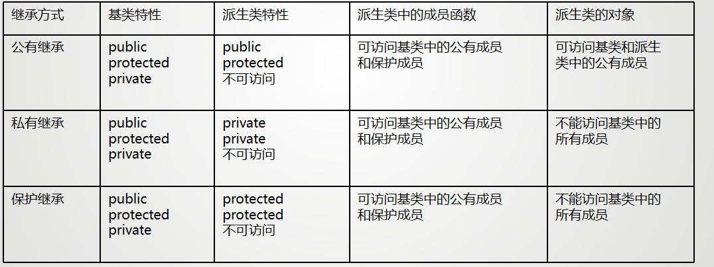
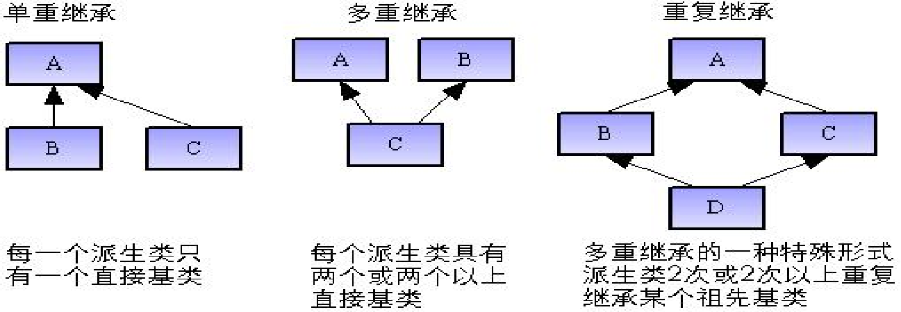
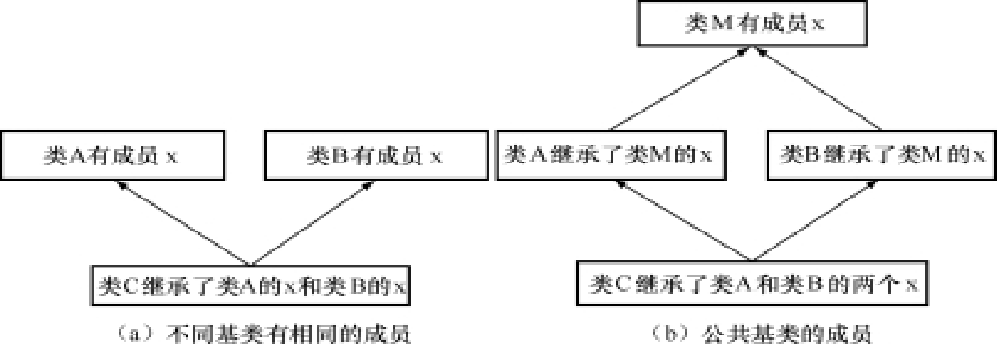
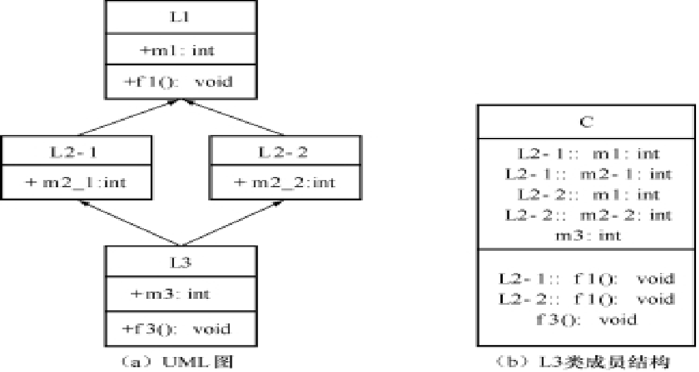
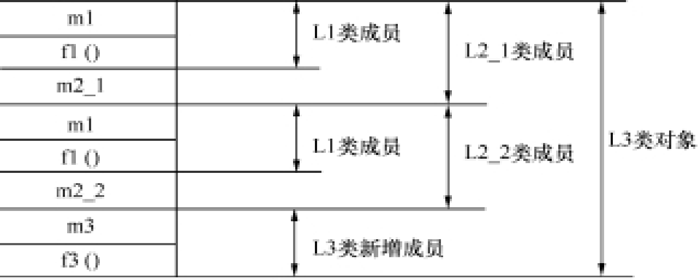

# 继承与派生

## 类的继承与派生概念

继承就是在一个已存在的类的基础上创建一个新类，即利用已有的数据类型定义出新的数据类型

- 被继承的类被称为基类
- 定义出来的新类称为派生类

派生类又可以作为另一个类的基类，派生出其他更“新”的类 

- 单继承：一个派生类只能有一个基类
- 多继承：一个派生类可以有多个基类

## 基类与派生类

新的派生类，不仅拥有新定义的成员，同时还拥有旧的基类的成员

**派生类的声明**:
```cpp
class 派生类名 : 继承方式 基类名 {
    // 成员声明
};
```

**多继承下的派生类声明**:
```cpp
class 派生类名 : 继承方式 基类1, 继承方式 基类2, ... {
    private:
    新增数据成员和成员函数声明
};
```

继承方式有以下三种：

- public：公有继承
- protected：保护继承
- private：私有继承

派生类的成员包括三种：

- 吸收基类的成员：派生类继承了基类除了构造函数、析构函数之外的所有成员
- 新增成员：派生类新增的成员
- 对基类成员进行改造：
    - 对基类成员的访问控制方式进行改造
    - 定义与基类同名的成员，同名覆盖

!!! example

    ```cpp
    class Point
    {                         
    protected:                        
        float x,y;      //点的坐标x,y
    public:                        
        Point(int a,int b) {x=a; y=b; cout<<"Point..."<<endl; }  //构造函数
        void showX() {cout << "x="<<x<<endl;}
        void showY() {cout << "y="<<y<<endl;}
        void Show() {cout<<"x="<<x<<",y="<<y<<endl;}
        ~Point() {cout<<"Delete Point"<<endl;}
    };
    class Rectangle:public Point
    {        
        private:                         
        float H,W;   //矩形的高和宽
        public:                    
        Rectangle(int a,int b,int h,int w):Point(a,b)
        {H=h;W=w;cout<<"Rectangle..."<<endl;}
        void ShowH() {cout<<"H="<<H<<endl;}
        void ShowW() {cout<<"W="<<W<<endl;}           
        void Show() {cout<<"H="<<H<<",W="<<W<<endl;}  
        ~Rectangle() {cout<<"Delete Retangle！"<<endl;}
    };
  
    ```

**继承方式与派生类的访问权限**

- 在声明派生类之后，派生类就继承了基类的数据成员和成员函数，但是这些成员并不都能直接被派生类锁访问。对于不同的继承方式，会导致基类成员原来的访问属性在派生类中发生变化。



在c++程序设计中，访问来自于两个方面：

- 派生类的新增成员对基类继承来的成员的访问
- 派生类外部（非类成员），通过派生类对象从基类继承来的成员的访问

!!! note "访问权限"

    === public inheritance

        派生类 类内： 可以访问基类中的public 和 protected, 不能访问 private

        派生类类外： 只能通过派生类对象访问继承来的基类中的公有成员
    
    === private inheritance

        protected 和 public 称为 派生类的 private ，派生类的其他成员可以直接访问，但是基类的private 仍不能访问

        派生类类内： 可以访问基类的Public和protected,不能访问基类的private

        派生类类外： 不能访问基类对象

    === protected

        基类的保护成员只能被基类的成员函数或派生类的成员函数访问，不能被派生类以外的成员函数访问。 


        派生类类内：可以访问基类中的公有成员和保护成员，而基类的私有成员则不能被访问。

        派生类类外：通过派生类对象不能访问基类中的任何成员。


### 调整派生类中访问属性的其他方法

#### 同名成员

c++允许派生类中说明的成员与基类的成员名字相同

派生类的同名成员覆盖了基类的同名成员


#### 访问声明

可以个别调整基类的模型成员，使之在派生类中保持原来的访问属性

**方法：**在public区添加`基类名：：成员名字；`

!!! example

    ```cpp
    class X{
        int a;
    public:
        int a;
    void print();
    }

    class Y : private X{
        int b;
    public: 
        X::print;
        x::a;
    void show(){
        cout << b << endl;
    }
    }
    ```

## 派生类的构造函数和析构函数

基类的构造函数和析构函数时不能被继承的，需要在派生类中重新定义

由于派生类继承了基类的成员，在初始化时，也要同时初始化基类对象，可通过调用基类的构造函数完成初始化

### 构造函数

在c++ 中， 派生类构造函数的一般性声明语法如下：
```cpp
<派生类名>::<派生类名>（基类形参，内嵌对象形参，本类形参）：<基类名>（参数表），<内嵌对象1>（参数表1），<内嵌对象2>（参数表2），…，<内嵌对象n>（参数表n）
{
	本类成员初始化赋值语句；
    …
};
```

派生类的构造函数与派生类名相同

- 冒号之后，累出需要使用参数进行初始化的基类名和内嵌成员对象名以及各自的参数表，各项之间用逗号分隔
- 对于基类对象，如使用默认构造函数，可以不给出基类名和参数表。
- 对于内嵌对象成员，如使用默认构造函数，也无需写出对象名和参数表


**派生类构造函数的执行**

    - 先调用基类的构造函数对继承成员进行初始化，再调用对新加成员部分的初始化
    - 若基类构造函数带有参数：必须由派生类构造函数的形式参数中为基类函数提供实参
        - 定义派生类构造函数时必须显式调用基类构造函数，并用在派生类构造函数的形参部分为基类构造函数提供实际参数。
        - 即使派生类本身的构造函数不带参数也必须在冒号“：”之后调用基类的构造函数，但这时传递给基类构造函数的实际参数通常是一些常量表达式。

    - 若基类构造不带参数：定义派生类构造函数时，可以不必显式地调用基类的构造函数。C++编译程序认为调用的是基类中形式参数为空的构造函数

### 析构函数

在派生过程中，由于基类的析构函数也不能被继承，因此在执行派生类的析构函数时，基类的析构函数也将被调用。析构函数没有类型，也无参数，与构造函数相比，情况相对比较简单。如果未显式定义某个类的析构函数，系统会自动为每一个类都生成一个默认的析构函数。

派生类析构函数的定义方法与没有继承关系的类中析构函数的定义方法完全相同，只需在派生类析构函数体中把派生类**新增的成员（非成员对象）**的清理工作做好，系统就会自己调用基类及成员对象的析构函数来对基类及成员对象进行清理。

**派生类构造函数的执行过程**

- 先基类，再内嵌对象，后派生类自己
- 先调用基类的构造函数
- 然后按照数据成员的声明顺序，调用数据成员的构造函数
- 最后执行派生类构造函数的函数体

**派生类析构函数的执行顺序**

- 先执行派生类的析构函数，对派生类新增普通成员进行清理
- 然后按照内嵌对象声明的相反顺序，一次调用内嵌对象的析构函数，对派生类新增的对象成员进行清理
- 最后调用基类的析构函数，对所有从基类继承来的成员进行清理


## 多重继承

所谓多重继承是指派生类具有多个基类，派生类与每一个基类之间关系可以看作是一个单继承

### 多重继承的声明

```cpp
class 派生类名 : 继承方式 基类1, 继承方式 基类2, ... {
    // 成员声明
};
```
不同的基类可以使用不同的继承方式，如果没有显式地指出继承方式，系统默认继承方式为private.

各个基类之间用逗号隔开，派生类继承了多个基类的成员，基类中的成员按照继承方式来确定其再派生类中的访问方式

### 多重继承的构造函数和析构函数

派生类的构造函数声明：
```cpp
class 派生类名 : 继承方式 基类1, 继承方式 基类2, ... {
    // 成员声明
    派生类名(基类1形参, 基类2形参, ...) : 基类1(参数表1), 基类2(参数表2), 内嵌对象1（参数表），内嵌对象2（参数表）... {
        // 成员初始化
    }
};

```

### 多重继承中的二义性

在多重继承中，派生类对基类成员访问在下列两种情况下可能出现二义性。

- 访问不同基类的相同成员时可能出现二义性
- 访问共同基类中成员时可能出现二义性





+ 派生类的不同基类有同名成员
    - 当派生类的不同基类有同名成员，则派生类中将产生二义性问题
        - 派生类类内： 访问同名基类成员时将产生二义性问题
        - 派生类类外： 通过派生类对象访问同名基类成员时将产生二义性问题
    - 解决方法：使用作用域标识符/使用同名覆盖的原则
        - 使用作用域标识符：`对象名.基类名::成员名`,`对象名.基类名::成员名(参数表)`，在类内则使用`基类名::成员名`或`基类名::成员名(参数表)`来访问
        - 使用同名覆盖的原则：在派生类中重新定义一个同名成员，覆盖基类中的同名成员
            - 这种方式会导致派生类中无法访问到基类中的同名成员
+ 在派生类中引用公共基类中成员时出现二义性
    - 在继承与派生的类层次结构中，被继承的多个基类如果有一个共同的基类，在派生类中访问这个共同基类的成员时也会产生二义性问题。
    - 解决这种二义性的方法：
        - 使用作用域标识符
        ```cpp
        #include <iostream>
        using namespace std;
        class L1
        {
        public:
            int m1;
            void f1(){cout<<"layer 1-> m1="<<m1<<endl;}
        };
        class L2_1:public L1
        {
        public:
            int m2_1;
        };
        
        class L2_2:public L1
        {
        public:
            int m2_2;
        };
        class L3:public L2_1,public L2_2
        {
        public:
            int m3;
            void f3(){cout<<"layer 3-> m3="<<m3<<endl;}
        };
        int main()
        {	
            L3 obj;
            obj.m3=4;
            obj.f3();
            obj.L2_1::m1=5;	//正确！使用直接基类
            obj.L2_1::f1();                //正确！使用直接基类
            obj.L2_2::m1=6;	//正确！使用直接基类
            obj.L2_2::f1();	               //正确！使用直接基类
            // obj.m1=1;		//错误！产生二义性
            //  obj. f1();		//错误！产生二义性
        }

        ```
        
        ```cpp
        L3 obj1;
        obj1.m1;		//错误！存在二义性
        obj1.f1();		//错误！存在二义性
        obj1.L1::m1;		//错误！存在二义性
        obj1.L1::f1();		//错误！存在二义性
        obj1.L2_1::m1;		//正确！
        obj1.L2_1::f1();		//正确！
        obj1.L2_2::m1;		//正确！
        obj1.L2_1::f1();
        ```
        当通过派生类L3的对象或者在派生类L3中访问间接基类L1的成员时就会产生二义性。
    - 上述使用作用域标识符虽然解决了访问基类L1的成员m1和f1()的二义性问题，但是派生类L3对象在内存中同时拥有基类L1的成员m1和f1()的两份拷贝，同一成员的多份拷贝增加了内存的开销。
        
        - 解决方法：虚基类。将共同基类设置为虚基类，这样从不同的途径继承过来的同名成员只有一个副本，这样就不会再会引起二义性问题。
        - 虚基类一般性声明语法：
        ```cpp
        class 派生类名: virtual 继承方式 基类名{};
        ```
            - `virtual`是虚基类的关键字
            -  在多重继承方式下，虚基类关键字的作用范围只是对紧跟其后的基类起作用
            - 声明了虚基类后，在进一步派生过程中，虚基类的成员和派生类一起维护同一个内存数据拷贝。
            - 在第一级继承时，就要将共同基类设计为虚基类。

        ```cpp
        #include <iostream>
        using namespace std;
        class L1
        {
        public:
            int m1;
            void f1(){cout<<"layer 1-> m1="<<m1<<endl;}
        };
        class L2_1: virtual public L1  //L1为虚基类，公有派生L2_1类
        {
        public:
            int m2_1;
        };
        class L2_2: virtual public L1  //L1为虚基类，公有派生L2_2类
        {
        public:
            int m2_2;
        };
        class L3:public L2_1,public L2_2 //L3多重继承
        {
        public:
            int m3;
            void f3(){cout<<"layer 3-> m3="<<m3<<endl;}
        };

        ```
    - 虚基类的构造函数： 如果虚基类定义有非默认构造函数（如带形参），情况就有所不同。此时，在整个继承结构中，直接或间接继承虚基类的所有派生类，都必须在构造函数的成员初始化列表中给出对虚基类的初始化。
    ```cpp
    #include <iostream>
    using namespace std;
    class L1
    {
    public:
        int m1;
        L1(int i){m1=i;cout << "Layer 1 -> m1="<<m1<<endl;}  //类L1的构造函数
    };
    class L2_1: virtual public L1    //L1为虚基类，公有派生L2_1类
    {
    public:
        int m2_1;
        L2_1(int i):L1(i){m2_1=i;cout<<"Layer 2_1 -> m2_1="<<m2_1<<endl;}
        //类L2_1的构造函数，需对虚基类L1进行初始化
    };
    class L2_2:virtual public
    {
    public:
        int m2_2;
        L2_2(int i):L1(i){m2_2=i;cout<<"Layer 2_2 -> m2_2="<<m2_2<<endl;}
    };
    class L3:public L2_1,public L2_2 {
    public:
        int m3;
        L3(int i):L1(i),L2_1(i),L2_2(i)	{m3=i;cout <<"Layer 3-> m3="<<m3<<endl;}
    };
    int main(int argc, char* argv[])
    {
        L3 obj(1);
        return 0;
    }
    ```
    虚基类L1中的构造函数带有形参，因此从虚基类L1中直接继承（类L2_1、类L2_2）或间接继承（类L3）的派生类，其构造函数的成员列表都要列出对虚基类L1构造函数的调用。

## 子类型与赋值兼容规则


所谓子类型，是指当一个类型至少包含了另一个类型的所有行为，则称该类型是另一个类型的子类型。

在公有继承下，派生类是基类的子类型。子类型反映类型之间的一般和特殊的关系，并且子类型关系是不可逆的。


### 类型适应
类型适应是指两种类型之间的关系。如果类型B是类型A的子类型，则称类型B适应于类型A，也就是说B类型的对象能够用于A类型的对象所能使用的场合。

一个函数可以适应于某个类型的对象，则它同样也适用于该类型的各个子类型的对象，这样就大可不必为处理这些子类型的对象去重载该函数。

### 赋值兼容规则

在公有继承方式下，对于某些场合，一个派生类的对象可以作为基类的对象来使用。也就是说在需要基类对象的任何地方，都可以使用公有派生类的对象来替代。包括以下三种情况：

- 派生类的对象可以赋值给基类对象：`Derived d; Base b = d;`
- 派生类的对象可以初始化基类的引用：`Derived d; Base &b = d;`
- 派生类的对象可以初始化基类的指针：`Derived d; Base *b = &d;`

## 虚基类

定义虚基类就是要保证派生类对象中只有一个虚基类对象，要求虚基类的构造函数只能被调用一次。因此，虚基类的出现改变了构造函数的调用顺序。在初始化任何非虚基类之前，将先初始化虚基类。这时，在整个继承结构中，直接或间接继承虚基类的所有派生类，都必须在构造函数的成员初始化表中列出对虚基类的初始化。如果存在多个虚基类，初始化顺序由它们在继承结构中的位置决定，其顺序是从上到下、从左到右。调用析构函数也遵守相同的规则，但是顺序相反。

虚基类的初始化与一般多继承的初始化在语法上是一样的，但构造函数的执行顺序不同。虚基类及派生类构造函数的执行顺序如下：
（1）虚基类的构造函数在所有非虚基类之前执行；
（2）若同一层次中包含多个虚基类，这些虚基类的构造函数按它们声明的次序调用；
（3）若虚基类由非虚基类派生而来，则仍然先调用基类构造函数，再调用派生类的构造函数。

## 基类和派生类的转换

基类和派生类之间也能进行类似的类型转换。由于派生类包含从基类继承的成员，因此可以将派生类对象赋值给基类对象，反之不能

- 派生类的对象可以赋值给基类的对象
- 派生类的对象可以初始化基类对象的引用
    ```cpp
    Base b;       	//定义基类对象
    Derived d;    	//定义派生类对象
    Base &r1=b;  	//定义基类对象的引用r1，用基类对象b初始化
    Base &r2=d;  	//定义基类对象的引用r2，用派生类对象d初始化
    ```
    基类对象的引用r1是b的别名，b和r1共享同一存储空间。但r2并不是d的别名，它只是d中基类部分的别名，r2与d中的基类部分共享同一存储空间。
- 派生类对象的地址可以赋给基类指针变量:若定义了指向基类对象的指针变量，也可以用派生类的对象取地址给它赋值，即指向基类对象的指针变量可以指向派生类对象。
    ```cpp
    Base b;       	//定义基类对象
    Derived d;    	//定义派生类对象
    Base *p=&d;  	//定义基类的指针p，指向派生类的对象d
    ```
    以上的表现形式同样可用在函数参数中。如果函数的形参是基类的对象、基类对象的引用或是指向基类对象的指针变量，那么实参可以是一个派生类的对象
