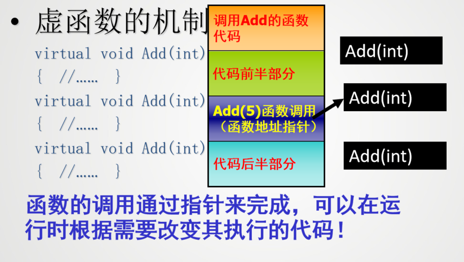

# 多态

**多态的概念**：
- 不同对象接收到统一消息时会产生不同行为
- 简单来说，就是在哦同一个类或继承体系结构的基类与派生类中，用同名函数来实现不同的功能

**多态与继承的关系**：
- 继承所处理的是类与类之间的层次关系问题
- 多态处理的是类的层次结构之间以及同一个类内部同名函数的关系问题通常是指继承结构中基类和派生类之间通过同名虚函数实现不同函数功能
的问题。

单接口，多实现

**类型**：
- 重载多态：
  - 函数重载：同名函数参数不同
  - 运算符重载：运算符的操作数类型不同
- 模板多态：通过一个模板生成不同的函数和类
- 继承多态：（一般指这个）
  - 虚函数：基类指针或引用指向派生类对象时，调用派生类的虚函数
  - 接口：通过接口实现多态


**多态的实现**：
- 要有继承
- 派生类要覆盖（重定义）基类的虚函数，即派生类具有和基类函数数据原型完全相同的虚函数成员
- 把基类的指针或引用绑定到派生类对象上

也就是说，没有继承，或者没有派生类没有重定义基类的虚函数，
或者具备前两者，但直接把派生类对象赋值给基类对象（没有通
过指针或引用），都不能实现多态。


### 多态的实现


```cpp

class Animal { // 不知道动物会怎么叫！
    public: virtual void sound() { cout << "unknow!" << endl; }
};
class Dog :public Animal { // 狗儿叫声“汪汪汪！”
    public: void sound() { cout << "wang,wang,wang!" << endl; }
};
class Cat :public Animal { // 猫儿叫声“”喵喵喵！
    public: void sound() { cout << "miao,miao,miao!" << endl; }
};
class Wlof :public Animal { // 狼嚎叫声“”！
    public: void sound() { cout << "wu,wu,wu!" << endl; }
};
```

多态是指当基类的指针（或引用）绑定到派生类对象上，通过此指针（引用）调用基
类的成员函数时，实际上调用到的是该函数在派生类中的覆盖函数版本。

例如，对于上面的继承结构，下面的pa实现的就是多态：
```cpp
void main() {
Animal *pA;
Dog dog;
Cat cat;
Wlof wlof;
pA = &dog; pA->sound(); //pA 调用 Dog 的 sound 函数
pA = &cat; pA->sound(); //pA 调用 Cat 的 sound 函数
pA = &wlof; pA->sound(); //pA 调用 Wlof 的 sound 函数
}
```

更一般地，多态更多地体现在用基类对象的指针或引用作为函数的参数，通过它
调用派生类对象中的覆盖函数版本。

例如，针对 Animal 继承体系，设计 animalSound 函数管理每种动物的声音，多态
能够很好地实现此需求。

```cpp
void animalSound(Animal &animal) {
    animal.sound(); // 调用 Animal 的 sound 函数
}

Animal *pA;
Dog dog;
Cat cat;
Wlof wlof;
animalSound(dog); // 调用 Dog 的 sound 函数
animalSound(cat); // 调用 Cat 的 sound 函数
animalSound(wlof); // 调用 Wlof 的 sound 函数
```

即以基类 Animal 的引用为接口，可以访问到图 5-1 所示继承体系中 Animal 类的任
何派生类对象的 sound 函数。

### 多态与联编

一个程序常常会调用到来自于不同文件或 C++ 库中的资源（如函数、对话框）
等，需要经过编译、连接才能形成为可执行文件，

在这个过程中要把调用函数名与对应函数（这些函数可能来源于不同的文件或
库）关联在一起，这个过程就是绑定（ binding ），又称联编。

- 静态联编（静态绑定）
    - 是指在编译程序时就根据调用函数提供的信息，把
        它所对应的具体函数确定下来，即在编译时就把调用函数名与具体函数绑定在一起。
- 动态联编（动态绑定）
    - 是指在编译程序时还不能确定函数调用所对应的具体函数，只有在程序运行过程中才能够确定函数调用所对应的具体函数，即在程序运行时才把调用函数名与具体函数绑定在一起。

**多态性的实现方式**：

- 编译时多态性：系统在编译时就决定如何实现某一动作 , 即对某一消息如何处理。静态联编具有执行速度快的优点。
    - 函数重载
    - 运算符重载
- 运行时多态性：系统在运行时才决定如何实现某一动作，即对某一消息如何处理。动态联编具有灵活性和可扩展性。
    - 虚函数
    - 继承

!!! question
    

## 运算符重载

运算符重载实质上将运算对象转化为运算函数的实参，并根据实参的类型来确定重载的运算函数

运算符重载和类型重载是多态的另外两种表现形式

运算符重载实质上是函数的重载

一般格式如下：
```cpp
函数类型 operator 运算符名(形参列表) {
    // 函数体
}
Complex operator +(Complex &c1, Complex &c2);
```

### 重载运算符的规则

- 不允许用户自己定义新的运算符
- 并不是所有的运算符都可以进行重载
- 操作符所允许的操作数的个数、优先级、结合性等都不能改变
- 重载运算符的函数不能有默认参数
- 重载的操作符必须有一个用户定义的类型作为操作数。不能对内置类型重载
- 用户定义的类型都自动拥有 “=”、“&”、“，”运算符，除非有特殊需要，一般不必重载这3个运算符。


!!! note "不能重载的运算符"

    - `.`（成员访问运算符）
    - `.*`（成员指针访问运算符）
    - `::`（域解析运算符）
    - `?:`（条件运算符）
    - `sizeof`（大小运算符）

### 运算符的重载形式

- 重载为类的成员函数
- 重载为类的友员函数

如果将运算符重载作为成员函数，由于它可以通过this指针自由访问本类的数据成员，因此可以少写一个函数的参数。但必须要求运算表达式第一个参数(即运算符左侧的操作数)是一个类对象，因为必须通过类的对象去调用该类的成员函数，而且重载函数的返回值与该对象类型相同。

c++规定，当重载以下的运算符时，必须重载为某个类的成员函数：

- `=`
- `[]`
- `->`
- `()`

当重载为以下的运算符时，必须是普通函数或友元函数：

- `>>`
- `<<`

一般将双目运算符重载为友元函数，单目运算符重载为成员函数。

### 重载双目运算符

 在String类中声明一个友元函数：
 ```cpp
 friend bool operator >(String &string1, String &string2);
 ```
 在类外定义“>”运算符的重载函数：
 ```cpp
 bool operator >(String &string1, String &string2)
{ if(strcmp(string1.p, string2.p)>0)
     return true;
 else return false;
}
```
### 单目运算符

```cpp
#include<iostream>

using namespace std;

class Time{
public:
    Time() {minute = 0; second = 0;}
    Time(int m, int s):minute(m),second(s){}
    Time operator ++();//前置运算符
    Time operator ++(int);//后置运算符
    void show();

private:
    int minute;
    int second;
};

Time Time::operator++(){
    if(++second >= 60){
        second -= 60;
        ++minute;
    }
    return *this;
}

Time Time::operator++(int){
    Time time(this->minute,this->second);
    second++;
    if(second >=60)
    {
        second -= 60;
        minute++;
    }
    return time;
}
```

重载后置自增运算符时，多了一个int型的参数，增加这个参数只是为了与前置自增运算符重载函数有所区别，此外没有任何作用，在定义函数时也不必使用此参数，因此可省写参数名，只需要在括号中写参数类型int即可。编译系统在遇到重载后置自增运算符时，会自动调用此函数。

### 重载流插入运算符和流提取运算符

用户自己定义的类型的数据，是不能直接用“<<”和“>>”来输出和输入的。如果想用它们输出和输入自己定义的类型的数据，必须在自己定义的类中对这两个运算符进行重载。

形式如下：
```cpp
ostream &operator <<(ostream &os, const ClassName &obj) {
    // 输出对象的成员
    return os;
}
istream &operator >>(istream &is, ClassName &obj) {
    // 输入对象的成员
    return is;
}
```

### 下标运算符的重载

在c++中，在重载下表运算符时，认为它是一个双目运算符

对于下标运算符重载定义只能使用成员函数
```cpp
返回类型 类名::operator [](参数列表) {
    // 函数体
}
```

### 函数调用运算符()的重载

也认为是一个双目运算符

对于函数调用运算符重载定义只能使用成员函数

```cpp
返回类型 类名::operator ()(参数列表) {
    // 函数体
}
```

## 不同类型数据间的转换

- 标准类型数据间的转换
    - 隐式转换：编译器自动完成的类型转换
    - 显式转换：程序员手动完成的类型转换`类型名(表达式)`
- 使用转换构造函数实现类型转化
    - `Complex(double r){real = r; imag = 0;}`
- 使用转换运算符实现类型转化
    - `operator Complex() { return Complex(real, imag); }`


转换运算符函数用于将一个类对象转换成内置数据类型或其他类对象。转换运算符函数与它要转换成的数据类型具有相同的名字。

与其他重载运算符的不同：

- 转换运算符函数没有返回值类型
- 转换运算符函数没有参数列表

## 虚函数

!!! example "静态联编"

    ```cpp
    #include <iostream>
    using namespace std;
    class Shape  //形状类
    {
    public:
        Shape(){}
        ~Shape(){}
        float getArea()const {return 0;}
    };
    class Circle:public Shape
    {
    public:
        Circle(float Radius):radius(Radius){}
        Circle(){}
        float getArea()const{return 3.14*radius*radius;}
        float getRadius() const {return radius;}
        void setRadius(float Radius) { radius = Radius; }
    private:
        float radius;
    };
    class Rectangle:public Shape
    {
    public:
        Rectangle(float Length,float Width):length(Length),width(Width){ };
        ~Rectangle(){}
        float getArea()const {return length*width;}
        float getLength()const { return length; }
        float getWidth()const { return width; }
        void setLength(float Length) { length = Length; }
        void setWidth(float Width) { width = Width; }
    private:
        float length;
        float width;
    };
    class Square: public Rectangle //正方形类   { 
    public:
        Square(float Side): Rectangle(Side,Side) {}
        ~Square() {}
        void setLength(float Length) { Rectangle::setLength(Length);Rectangle::setWidth(Length); }
        void setWidth(float Width) { Rectangle::setLength(Width);Rectangle::setWidth(Width); }
        void setSide(float Side) //设置边长。
        {  
        setLength(Side);  setWidth(Side);  
        }
        float getSide() const //获取边长。
        { return getWidth();}
        float getArea()const {return Rectangle::getArea();}
    };
    int main()     {
    Shape *sp;
    Circle c1(5);
    cout<<"圆的面积是"<<c1.getArea()<<endl;
    sp=&c1;
    cout <<"通过Shape指针访问，圆的面积是" <<                    sp->getArea()<<endl;
    Rectangle r1(4,6);
    cout<<"长方形的面积是"<<r1.getArea()<<endl;
    sp=&r1;
    cout<<"通过Shape指针访问，长方形的面积是"<<             sp->getArea()<<endl;
    Square s1(5);
    cout<<"正方形的面积是"<<s1.getArea()<<endl;
    sp=&s1;
    cout<<"通过Shape指针访问，正方形的面积是"<<sp->getArea()<<endl;
    return 0;     }
    ```
    运行结果：
    圆的面积是78.5
    通过Shape指针访问，圆的面积是0
    长方形的面积是24
    通过Shape指针访问，长方形的面积是0
    正方形的面积是25
    通过Shape指针访问，正方形的面积是0
    Press any key to continue

    **应该如果通过基类指针访问派生类的成员函数，应该是调用派生类的成员函数，而不是基类的成员函数?**

通过在基类中将同名的成员函数设为虚函数，当用基类的指引或引用指向派生类时，实际运行时调用的是实际指向或引用的对象的相应函数而不是基类的同名函数。

**虚函数**：
- **概念**：被`virtual`修饰的成员函数称为虚函数。虚函数是基类中声明的成员函数，派生类可以重写（覆盖）它。
- **格式**: `virtual 函数类型 函数名(形参列表);`
- 虚函数是重载的另一种表现形式（动态重载）
- 实现机制：通过函数指针，在运行时建立函数调用和函数体之间的联系，然后执行相应的操作




### 虚函数的定义

虚函数的定义是在基类中进行的，它是在某基类中声明为virtual并在一个或者多个派生类中被重新定义的成员函数

虚函数是一个成员函数，在基类的类定义中定义虚函数的一般形式：
```cpp
class Base {
public:
    virtual void func(); // 基类中的虚函数
};
```

当基类中的某个成员函数被声明为虚函数后，它就可以在基类的派生类中对虚函数重新定义。

在派生类中重新定义的函数应与虚函数具有相同的形参个数和类型。

如果在派生类中没有对虚函数重新定义，则它继承其基类的虚函数

当程序发现虚函数名前的关键字virtual后，会自动将其作为动态联编处理，即在程序运行时动态地选择合适的成员函数

!!! warning "注意"
    - 只有成员函数才能被声明为虚函数，普通函数和友元函数都不可以
    - 虚函数的声明只能出现在类声明中的函数原型声明或定义中，在类外定义时不能出现`virtual`关键字
    - 通过定义虚函数来使用C++语言提供的多态性机制时，派生类应该是从基类公有派生的
    - 类的静态成员函数不可以被声明为虚函数
    - 类的构造函数不可以是虚函数
    - 析构函数可以且通常声明为虚函数
    - 内联函数不能被声明为虚函数
    - 基类的虚函数无论被公有继承多少次，在多级派生类中仍然为虚函数


### 虚函数和重载函数的关系

一般的函数重载时，只要函数名相同，函数的参数个数、参数类型或顺序必须不同，函数的返回类型也可以不同。但是，当重载一个虚函数时，也就是说在派生类中重新定义此虚函数时，要求函数名、返回类型、参数个数、参数类型以及参数的顺序都必须与基类中的虚函数原型完全相同。如果仅仅是返回类型不同，其余均相同，系统会给出错误信息；若仅仅是函数名相同，而参数的个数、类型或顺序不同，则系统将它作为普通的函数重载，这时将丢失虚函数的特性。


### 虚函数的作用

虚函数的作用是实现动态联编，在运行时根据实际对象的类型来决定调用哪个函数。

实现动态关联需要满足三个条件:

- 必须把许哟啊动态关联的行为定义为类的**公共属性**的**虚函数**
- 类之间存在子类型关系
- 必须先使用基类指针指向子类型的对象，然后直接或者渐渐使用基类指针调用虚函数

实现动态关联，只能通过指向基类的指针或者基类对象的引用来调用虚函数，其格式 如下
```cpp
Base *p = new Derived(); // 基类指针指向派生类对象
p->virtualFunction(); // 调用虚函数
```
```cpp
Derived derived;
Base &ref = derived; // 基类引用绑定到派生类对象
ref.virtualFunction(); // 调用虚函数
```

一个基类指针，可以调用同一类族中不同类的虚函数，这就是多态性，对同一消息，不同对象有不同的响应方式。

基类的指针是用来指向基类对象的，如果用它指向派生类对象，则进行指针类型转换，将派生类对象的指针先转换为基类的指针，所以基类的指针指向的是派生类对象中的基类部分。

如果不设置虚函数，是无法通过基类指针去调用派生类对象中的成员函数。

虚函数突破了这一限制，在派生类的基类部分，派生类的函数取代了基类原来的函数，因此在使用基类指针指向派生类对象后，调用基类函数时就调用了派生类的同名函数。

当把基类的某个成员函数声明为虚函数后，允许在其派生类中对该函数的定义进行覆盖，赋予它新的功能，并且在通过指向基类的指针指向同一类族中不同类的对象时调用所指向类的同名函数。


**纯虚函数**：
- 在定义虚函数时，并不定义其函数体
- 包含纯虚函数的类称为抽象类


!!! warning "使用虚函数的注意点"

    - 只能用`virtual`关键字声明虚函数，不能在类外定义时使用
    - 一个成员函数被声明为虚函数后，在同一类族中的类就不能在定义一个非`virtual`的但与该虚函数具有相同的参数和函数返回值类型的同名函数


### 对象的存储

当定义一个对象时，它的数据成员按顺序存储在内存中。当有派生类对象时，新增的数据成员加在基类的数据成员之后。

为了管理虚函数的调用，需要在对象中增加一个数据项，用来说明在调用虚函数时具体调用的是哪个函数。通常这一数据项是vtbl（virtual table，虚函数表）的地址，称为vptr（virtual pointer，虚函数指针）。


虚函数的使用只是增加了两次访存，并不会过多影响程序的执行速度；在存储上每个类多了一个vtbl表，并没有过多增加内存。

### 虚析构函数

如果用new运算符建立了派生类的临时对象，对指向基类的指针指向这个临时对象，当用delete运算符撤销对象时，系统执行的是基类的析构函数，而不是派生类的析构函数，不能彻底完成“清理现场”的工作

将基类及派生类的析构函数设为虚函数，这时无论基类指针指的是同一类族中的哪一个类对象，系统会采用动态关联，调用相应的析构函数，对该对象进行清理工作

```cpp
virtual ~类名();
```

有可能通过基类指针删除派生类时，要使用虚析构函数

在对指向动态分配对象(由new操作产生)的指针进行delete操作时，隐含着对析构函数的调用，而该指针的声明类型可能是对象类型的基类

## 纯虚函数和抽象类

纯虚函数的一般形式：
```cpp
virtual 返回值类型 函数名(形参列表) = 0;
```
将一个虚函数声明为纯虚函数，需要在虚函数原型的语句结束符“；”之前加上=0，没有代码。

包含纯虚函数的类是一个抽象类，不能定义抽象类的对象

如果一个类中至少有一个纯虚函数，这个类就是为抽象类，通常也称为抽象基类。它的主要作用是为一个类族提供统一的公共接口，使它们更有效地发挥多态性的特性

!!! warning "抽象类的特点"

    - 抽象类不能定义对象
    - 抽象类不能用作参数类型，函数返回值或者显式转换的类型
    - 不能定义对象，但是可以声明一个抽象类的指针或引用
    - 抽象类派生出新的类之后，如果派生类给出所有纯虚函数的函数实现，这个派生类就可以声明自己的对象，因而不再是抽象类；反之，如果派生类没有给出全部纯虚函数的实现，这时的派生类仍然是一个抽象类。

### 知识扩展

**运行时类型识别**

运行时类型识别（RTTI）是C++的一种机制，用于在程序运行时确定对象的实际类型。它允许程序在运行时检查对象的类型，并进行相应的处理。
RTTI主要通过以下两种方式实现：
- `typeid`运算符：用于获取对象的类型信息。
- `dynamic_cast`运算符：用于在类层次结构中安全地转换指针或引用。

`dynamic_cats`安全向下转型，将基类指针/引用转换为派生类指针/引用，如果转换失败，则返回`nullptr`。

语法： `dynamic_cast<目标类型>(表达式)`

- `dynamic_cast`和`static_cast`的区别：
  - `dynamic_cast`：在运行时检查类型安全，适用于多态类型转换。
  - `static_cast`：在编译时进行类型转换，不进行运行时检查，可能导致未定义行为。

转换是有条件的：
- 如果指针（或引用）所指对象的实际类型与转换的目的类型兼容，则转换成功进行
- 否则如执行的是指针类型的转换，则得到空指针；如执行的是引用类型的转换，则抛出异常。

使用`typeid`获取运行时类型信息

- 语法： `typeid(表达式).name()`/`typeid(类型说明符)`

返回一个对应于该类型的type_info类型的常引用，以描述对象的确切类型

表达式有多态类型时，会被求值，并得到动态类型信息；
否则，表达式不被求值，只能得到静态的类型信息。

类型信息由`type_info`对象表示，为所有的内置类型和多态类型的对象保存运行时类型信息，其定义在头文件 < typeinfo >中

`type_info`提供以下操作：

- `t1==t2`：判断两个类型是否相同。
- `t1!=t2`：判断两个类型是否不同。
- `t1.before(t2)`：判断`t1`是否在`t2`之前。
- `t.name()`：返回类型的名称。


**使用`typeid`运算符**：
```cpp
#include <iostream>
#include <typeinfo>
using namespace std;
class Base {
public:
    virtual ~Base() {}
};
class Derived : public Base {
public:
    void display() { cout << "Derived class" << endl; }
};

int main() {
    Base* b = new Derived();
    cout << "Type of b: " << typeid(*b).name() << endl; // 输出Derived类的类型信息
    delete b;
    return 0;
}
```
**使用`dynamic_cast`运算符**：
```cpp
#include <iostream>
using namespace std;
class Base {
public:
    virtual ~Base() {}
};
class Derived : public Base {
public:
    void display() { cout << "Derived class" << endl; }
};
int main() {
    Base* b = new Derived();
    Derived* d = dynamic_cast<Derived*>(b); // 安全地转换
    if (d) {
        d->display(); // 调用Derived类的方法
    } else {
        cout << "Conversion failed" << endl;
    }
    delete b;
    return 0;
}
```
