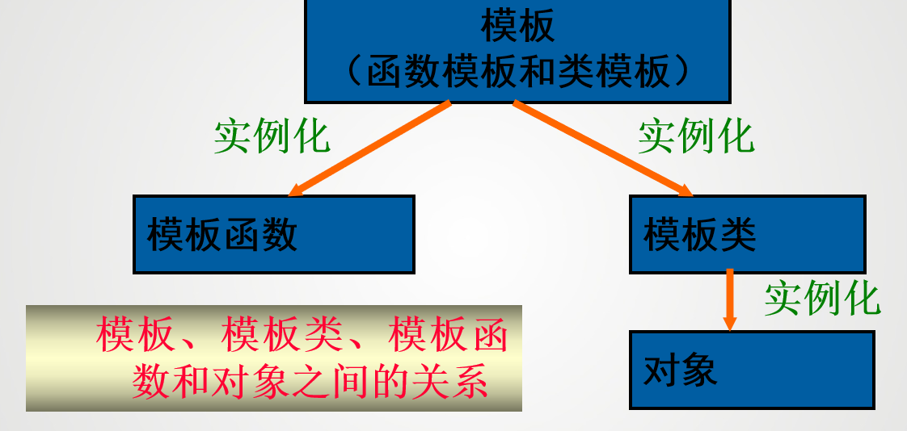

# 模板

## 模板的概念

在C++中，模板是实现代码重用机制的一种工具，它可以实现类型参数化，即把类型定义为参数

模板可以分为两种：函数模板和类模板。

!!! example "函数模板"

    ```cpp
    template <typename T>
    T add(T a, T b) {
        return a + b;
    }
    ```



在进行相同方式的处理时，只有当参加运行的数据类型不同时，才可以定义模板


## 函数模板与模板函数

所谓函数模板，实际上是建立一个通用函数，其函数类型和形参类型不具体指定，用一个虚拟的类型（如：T）来代替，这个通用函数就称为函数模板。

在定义了一个函数模板后，当编译系统发现有一个对应的函数调用时，将根据实参中的类型来确认是否匹配函数模板中对应的形参，然后生成一个重载函数，该函数的定义与函数模板的函数定义体相同，称之为模板函数。

定义函数模板的一般形式：
```cpp
template <class 类型参数1， class 类型参数2，...>
函数返回值类型 函数名(形参列表) {
    // 函数体
}
```
- `template` 关键字表示这是一个模板
- `class`后面跟着的是类型参数的名称，可以是基本数据类型，也可以是类

函数模板根据传入参数的类型不同，会生成不同的模板函数

!!! warning

    - 在`template`语句和函数模板定义语句之间不允许有其他的语句
    - 模板函数中的动作必须相同。例如，下面的函数只能用函数重载，而不能用模板函数来实现：
    ```cpp
    void print(int a) {
        cout << a << endl;
    }
    void print(double a) {
        cout << a << "no" << endl;
    }
    ```
    - 函数可以带有模板参数表中未给出的、已存在的数据类型的参数。并非函数的所有参数都必须是模板参数类型
    ```cpp
    template <class T>
    T func(T arg1, int arg2) {
    //...
    }
    ```
    - 虽然函数模板中的模板形参T可以实例化为各种类型，但是实例化T的各个模板实参之间必须保持完全一致的类型。模板类型并不具有隐式的类型转化。
    ```cpp
    void func(int i,char c)
    {
      max(i, i);   //正确 ,调用max(int,int)
      max(c, c);  //正确 ,调用max(char,char)
      max(i, c);   //错误 ,类型不匹配
      max(c, i);   //错误 ,类型不匹配
    }
    ```
        - 解决方法：
            - 强制类型转换
            - 显式给出模板实参
            ```cpp
            max<int>(i, c); //强制类型转换,使用int类型来实例化函数模板
            ```
            - 将函数模板中的类型定义为多个类型参数
            - 显式具体化模板函数：声明一个非模板函数的原型，定义一个完整的非模板函数重载模板函数


在c++中函数模板与同名的非模板函数重载时，调用顺序：

- 寻找一个参数完全匹配的函数，如果找到就调用它
- 寻找一个函数模板，将其实例化，产生一个匹配的模板函数。若找到了，就调用它
- 如果前两步都失败,再试一试低一级的对函数的重载方法。例如通过类型转换可产生参数匹配等
- 如果前面都失败了，编译器就会报错。如果在第一步有多于一个的选择，那么这个调用是意义不明确的，错误


## 类模板和模板类

类是对一组对象的公共性质的抽象，而类模板则是对一组类的公共性质的抽象。类模板是一系列相关类的模板，这些相关类的成员组成相同，成员函数的源代码形式也相同，不同的只是所针对的类型。类模板为类声明了一种模式，使得类中的某些数据成员、成员函数的参数和成员函数的返回值能取任意类型


类模板的定义形式如下：
```cpp
template <class 类型参数1， class 类型参数2，...>
class 类名 {
    // 成员变量
    类型参数1 变量1;
    类型参数2 变量2;
    // 成员函数
    返回值类型 函数名(形参列表) {
        // 函数体
    }
};
```

类模板只是代表一种类型的类，编译程序不会为类模板创建程序代码，但是通过对类模板的实例化生成一个具体的类和该类的对象

实例化的一般形式：
```cpp
类名<类型参数1，类型参数2，...> 对象名;
Compare <int> cmp(4,7);
```
在类模板后的尖括号中指定实际的类型为int，编译系统就用int来取代类模板中的类型参数，生成一个具体的类Compare<int>，并创建一个对象cmp

还可以在类定义体外定义成员函数,一般格式为：
```cpp
template <class 类型参数1， class 类型参数2，...>
类名<类型参数1，类型参数2，...>::成员函数返回值类型 函数名(形参列表) {
    // 函数体
}
```

模板参数可以是一个，也可以是多个，可以是类型参数，也可以是非类型参数。参数类型由关键字class或typename及其后面的标识符构成。非类型参数由一个普通参数构成，代表模板定义中的一个常量。


### 类模板的派生

两种方式：

- 从类模板派生类模板
```cpp
template <class T>
class Base {
    // 基类成员
};
template <class T>
class Derived : public Base<T> {
    // 派生类成员
};
```
- 从类模板派生非模板类
```cpp
template <class T>
class Base{
    // 基类成员
};
template <class T>
class Derived : public Base <int>{
    // 派生类成员
};
```

### 类模板显式具体化

类模板显式具体化与模板函数显式具体化类似，也是特定类型用于替换模板中类型参数的定义。通过显式具体化类模板，可以优化类模板基于某种特殊数据类型的实现，可以克服某种特定数据类型在实例化类模板所出现的不足。

模板有两种特化：**全特化**和**偏特化**。
- **全特化**：为模板的所有类型参数提供具体的类型
- **偏特化**：为模板的部分类型参数提供具体的类型

模板函数只能全特化，而类模板可以全特化和偏特化。

!!! example "类模板全特化"

    ```cpp
    template <class T1, class T2>
    class MyClass {
        //...
    };
    
    // 全特化
    template <>
    class MyClass<int, int> {
        
    };

    template <class T>
    class MyClass<T, int> {
        // 偏特化
    };
    ```

- **浅拷贝**： 指向同一片内存空间
- **深拷贝**： 指向不同的内存空间


## c++标准模板库

**泛型程序设计**

泛型是指将类型参数化以达到代码复用

泛型程序设计是指在编写程序时，使用类型参数化的方式来编写代码，使得同一段代码可以处理多种数据类型。C++标准模板库（STL）就是一个典型的泛型程序设计的例子。


**什么是类库？**

类库是类的集合，并且给出了多种类之间的关系描述

一组类，通过建立彼此间的继承关系形成类库，以类的形式提供给用户重用


### STL

**C++标准模板库（STL）**
C++标准模板库（STL）是C++的一个重要组成部分，它提供了一组通用的类和函数模板，用于处理数据结构和算法。STL包含以下几个主要组件：
- **容器**：用于存储数据的类模板，如`vector`、`list`、`deque`、`set`、`map`等。
- **算法**：用于处理容器中的数据的函数模板，如`sort`、`find`、`copy`等。
- **迭代器**：用于访问容器中元素的对象，如`iterator`、`const_iterator`等。
- **函数对象**：用于定义自定义的操作，如比较函数、算术运算等。

整个STL是以一种类型参数化（type parameterized）的方式基于模板（template）实现的。

#### container（容器）

用来容纳、包含一组元素或者元素集合的对象的

- vector：动态数组
- list：双向链表
- queue：队列
- stack：栈
- set：集合
- map：映射
- unordered_set：无序集合

#### algorithm（算法）

STL提供了许多算法来处理容器中的数据，这些算法都是模板函数，可以作用于任何类型的容器。常用的算法包括：

- `sort`：对容器中的元素进行排序
- `find`：查找容器中的元素
- `copy`：复制容器中的元素
- `accumulate`：计算容器中元素的累积和
- `for_each`：对容器中的每个元素执行指定操作
- `replace`：替换容器中的元素
- `merge`：合并两个已排序的容器
- `count`：统计容器中满足特定条件的元素个数
- `reverse`：反转容器中的元素顺序

#### iterator（迭代器）

迭代器是一种给类似于指针的对象，可以使用迭代器来访问容器中的元素

迭代器提供了一种统一的方式来访问容器中的元素，无论容器的具体类型如何。STL提供了多种类型的迭代器，包括：

- **输入迭代器**：只能读取元素
- **输出迭代器**：只能写入元素
- **前向迭代器**：可以读取和写入元素，但只能向前移动
- **双向迭代器**：可以读取和写入元素，可以向前和向后移动
- **随机访问迭代器**：可以读取和写入元素，可以向前和向后移动，并且支持随机访问


##### vector迭代器

声明

```cpp
vector<int> vec = {1, 2, 3, 4, 5};
vector<int> vec2 = (5,'x'); // 创建一个包含5个元素的vector，元素值为'x'
```
