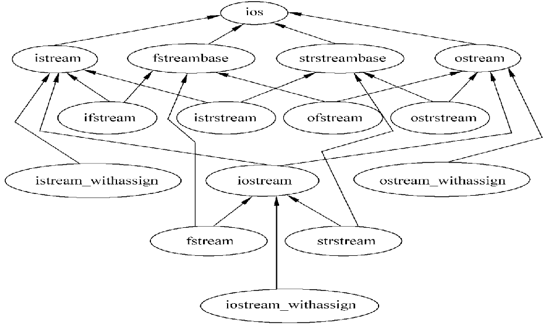
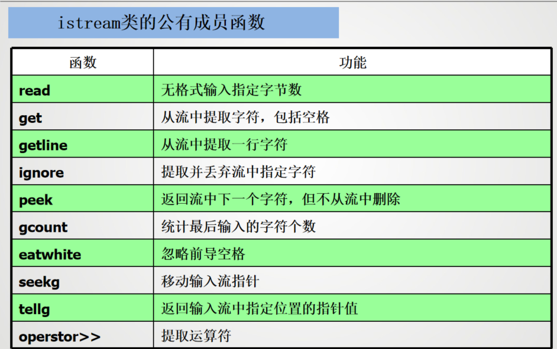

# 文件操作和输入输出流
## C++的输入输出

C++的输入输出流是指由若干字节组成的字节序列，按顺序从一个对象传送到另一个对象。输入时，程序从输入流中抽取字节；输出时，程序将字节插入到输出流中

对于面向文本的程序，每个字节代表一个字符。


读操作在流数据抽象中被称为（从流中）提取，写操作被称为（向流中）插入。

**I/O流类库提供对象之间的数据交互服务**
- 输出流：表示数据从内存传送到外部设备
- 输入流：表示数据从外部设备传送到内存缓冲区变量中
- 流类库预定义了多种流对象，连接到不同的设备
- 程序员可以定义所需的流对象
- 流类对象可以建立和删除，可以从流中获取数据和向流添加数据

常用的流类继承关系：
```
ios
├── istream -----------|
│   ├── ifstream       |____iostream----fstream
│   └── istringstream  |
├── ostream------------|
│   ├── ofstream
│   └── ostringstream
```



`cin`对象管理标准输入流，默认与标准输入设备（通常为键盘）相连；`cout`对象管理标准输出流，默认与标准输出设备（通常为显示器）相连。除此之外，还有`cerr`、`clog`、`wcin`、`wcout`、`wcerr`和`wclog`。

插入运算符`<<`和提取运算符`>>`是C++流类的成员函数。它们分别用于向输出流插入数据和从输入流提取数据。插入运算符的左操作数是输出流对象，右操作数是要插入的数据；提取运算符的左操作数是输入流对象，右操作数是要提取的数据。


`iostream`类库中不同的类的声明被放在不同的头文件中。`iostream`类库的头文件有：
- `iostream`：定义了`istream`、`ostream`和`iostream`类，包含了对输入输出流的基本操作
- `fstream`：定义了`ifstream`、`ofstream`和`fstream`类，包含了对文件流的基本操作
- `strstream`：定义了`istringstream`、`ostringstream`和`stringstream`类，包含了对字符串流的基本操作
- `stdiostream`: 用于混合使用C和C++的输入输出流
- `iomanip`：定义了格式化输入输出流的类和函数


### 输入输出流分类

- 标准流：对系统指定的标准设备的I/O操作
- 文件流：以外存中的文件为对象进行输入和输出；
       以文件为对象的输入输出，包括从磁盘文件输入数据，   
       或将数据输出到磁盘文件；
- 字符串流：对内存中指定空间进行输入和输出；
        通常指定一个字符数组作为存储空间；

## 标准输入流

### 使用`cin`进行输入

C++提供了实用的输入功能，通过键盘产生输入的内容，从而形成字节流。`cin`对象可以将输入字节流中的信息存储到相应的内存单元。通常，可以这样使用`cin`:
```cpp
cin >> variable;
```
其中 ，`>>`是流读取运算符，它重载右移位运算符`>>`，用于从输入流中提取数据。`variable`是一个变量，表示要存储输入数据的内存单元。`cin`对象会将输入的字节流转换为相应的数据类型，并存储到变量中。

左边的`cin`是一个输入流对象，右边的`variable`是一个变量，表示要存储输入数据的内存单元。`>>`是流读取运算符，它重载了右移位运算符，用于从输入流中提取数据。`cin`对象会将输入的字节流转换为相应的数据类型，并存储到变量中。

流提取符从流中提取数据时通常跳过输入流中的空格、tab键、换行符等空白字符。


输入运算符`>>`也支持级联输入。在默认情况下，运算符`>>`跳过空格，读入后面与变量类型相应的值。因此给一组变量输入值时，用空格或换行将输入的数值间隔开。
```cpp
int a, b, c;
cin >> a >> b >> c;
```

当输入字符串(`char*` 类型)时，输入运算符`>>`会跳过空格，读入后面的非空格符，直到遇到另外一个空格结束，并在字符串末尾自动放置字符`‘\0’`作为结束标志，例如
```cpp
char str[20];
cin >> str;
```
当输入"Hello World"时，`str`中只存储"Hell"。如果要输入带空格的字符串，可以使用`getline()`函数。

数据输入时，不仅检查数据间的空格，还做类型检查，自动匹配数据类型。
```cpp
int i;
float f;
cin >> i >> f;
```
如果输入`12.34 34.56`，则`i`的值为`12`，`f`的值为`34.56`。如果输入`12.34 34.56abc`，则会报错，提示类型不匹配。



**常用istream成员函数**
- `int istream::get()`: 
    如果输入流中包括附加的数据，函数取得并返回下一个字符，否则返回EOF
- `istream istream::get(char& c)`:
    如果输入流包括附加的数据，函数取得并将下一个字符分配给c；否则就是没有定义对c的作用。返回一个对*this（调用对象）的引用。
- `istream istream::get(char s[], int n, char delim = '\n')`:
    从输入流获取字符并将它们分配给s直到下面的一个条件发生：取得n-1个字符，没有输入字符了，或者下一个接收的字符的值为delim。
- `istream istream::getline(char s[], int n, char delim = '\n')`:
    从输入流获取字符并将它们分配给s直到下面的一个条件发生：取得n-1个字符，没有输入字符了，或者下一个接收的字符的值为delim。
- `int istream::peek()`:
    返回下一个字符，但不从输入流中删除它。返回EOF表示没有更多的字符。
- `istream& istream::unget(char c)`:
    将字符c放回输入流中,它将是下一个要接收的字符。返回一个对*this（调用对象）的引用。
- `bool istream::eof()`:
    如果输入流到达文件的末尾，返回true，否则返回false。

!!! note "其他istream 类方法"
    === `get()` 方法
    istream类中的get()方法提供不跳过空格的单字符输入功能
    使用方法：
    ```cpp
    char ch;
    cin.get(ch);
    ```
    三种重载形式
    - 无参数
    - 两个参数:`istream::get(char * s, int n)`,第一个参数用于放置字符串的内存单元的地址，第二个参数为读取的最大字符数（最后一位存放`\0`,最多读n-1位）
        ```cpp
        char str[20];
        cin.get(str, 20);
        ```
    - 三个参数:`istream::get(char * s, int n, char delim)`,第三个参数为分隔符，读取到分隔符时停止,只有两个参数的`get`函数将换行符用作分界符
    === `getline()` 方法
    读取整行输入
    `输入流对象.getline(字符数组, 字符个数)`，但是只能读字符数-1个字符
    
    getline()重载方法同样也有三个参数的方法,三个参数的作用和上面get()方法类似，其原型如下
    ```cpp
    istream& getline(char * s, int n, char delim = '\n');
    ```

    === `read()` 方法
    读取指定字节数的字符
    ```cpp
    char str[50];
    cin.read(str, 20);
    ```
    `read()`方法不会在输入后加上空值字符，因此不能将输入转换为字符串，该方法的返回类型为`istream&`，可以进行级联输入
    ```cpp
    cin.read(str, 20).read(str2, 30);
    ```


## 标准输出流

### 使用`cout`进行输出

`cout`是输出流类`ostream`的对象，输出结果流向标准的输出设备显示器。在C++中，流输出使用插入运算符`<<`(重载左移位运算符)完成输出，使之能够识别C++中所有的基本类型。插入运算符`<<`左边的操作数是`ostream`类的一个对象(如`cout`)，右边可以是C++的合法表达式。

`ostream` 类的对象(console output)通常连向显示器，可以重定向到文件或其他设备。`cout`对象的输出格式是文本格式，输出时自动转换为字符流。
```cpp
ostream & operator<<(类型识别符);
```
`cout`流在内存中对应开辟了一个缓冲区

C++用指向字符串存储位置的指针来表示字符串。指针的形式可以是`char`数组名、显式的`char`指针或用引号括起的字符串。C++还允许输出项为显式对象的地址。默认情况下，地址以十六进制的形式显示。但对于其他类型的指针，C++可以使用`void *`来强制转换输出。

其他`ostream`类方法：
- `put()`: 无格式，插入一个字节
- `write()`: 无格式，插入n个字节
- `flush()`: 刷新输出流
- `seekp()`: 移动输出流指针
- `tellp()`: 返回输出流指针位置

`ostream& ostream::put(char c)`:将字符c插入到输出流中，返回一个对*this（调用对象）的引用。

`ostream& ostream::write(const char* s, int n)`:将n个字符插入到输出流中，空字符也是有效的，返回一个对*this（调用对象）的引用。`s`是一个指向字符数组的指针，表示要插入的字符序列。

`ostream& ostream::flush()`:刷新输出流，强制任何没有完成的操作符插入完成，返回一个对*this（调用对象）的引用。

!!! note "其他ostream 类方法"
    === `put()` 方法
    `put()`方法用于输出一个字符，返回值为ostream对象的引用
    ```cpp
    char ch = 'A';
    cout.put(ch);
    ```
    === `write()` 方法
    `write()`方法用于输出指定字节数的字符，返回值为ostream对象的引用
    ```cpp
    char str[20] = "Hello World";
    cout.write(str, 5); // 输出 Hello
    ```

### 其他ostream 类方法

#### `put()` 方法
```ostream & put(char c)```

可以使用类方法来调用：
```cpp
cout.put('A');
```
由于该函数返回ostream对象的引用，因此可以进行级联输出
```cpp 
cout.put('A').put('B').put('C');
```

成员函数`put`不仅可以用`cout`对象调用,也可以用`ostream`类的对象调用

#### `write()` 方法
```ostream & write(const char * s, streamsize n)```

`write()`方法不会在遇到空字符时自动停止，而会按照指定数量输出字符，即使超出了字符串的长度也不会报错


## 格式化控制

插入和提取运算符与预先定义的操作符一起工作，用来控制输入和输出格式。

+ 输出宽度：为了调整输出的宽度，可以使用`setw()`函数。该函数定义在`iomanip`头文件中，返回一个流操纵符对象。它的参数是一个整数，表示输出的宽度。`setw()`函数的返回值是一个流操纵符对象，可以与插入运算符`<<`结合使用。
+ 对齐方式：输出流默认的对齐方式是右对齐。可以使用`setiosflags()`函数设置对齐方式。该函数的参数是一个整数，表示对齐方式。可以使用`ios::left`、`ios::right`和`ios::internal`来设置左对齐、右对齐和内部对齐。可以使用`resetiosflags()`函数重置对齐方式。
+ 精度：使用`setprecision()`函数设置输出的精度。该函数的参数是一个整数，表示小数点后保留的位数。可以使用`fixed`和`scientific`来设置定点格式和科学计数法格式。
+ 进制：可以使用`hex`、`dec`和`oct`来设置输出的进制格式。可以使用`setbase()`函数设置进制格式。该函数的参数是一个整数，表示进制格式。可以使用`resetiosflags()`函数重置进制格式。

