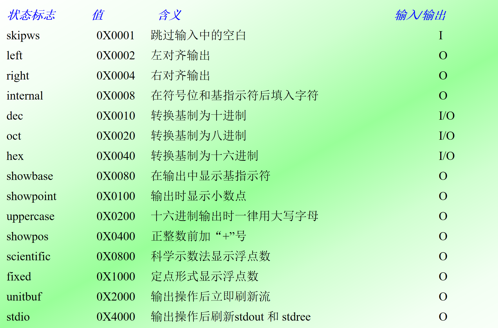
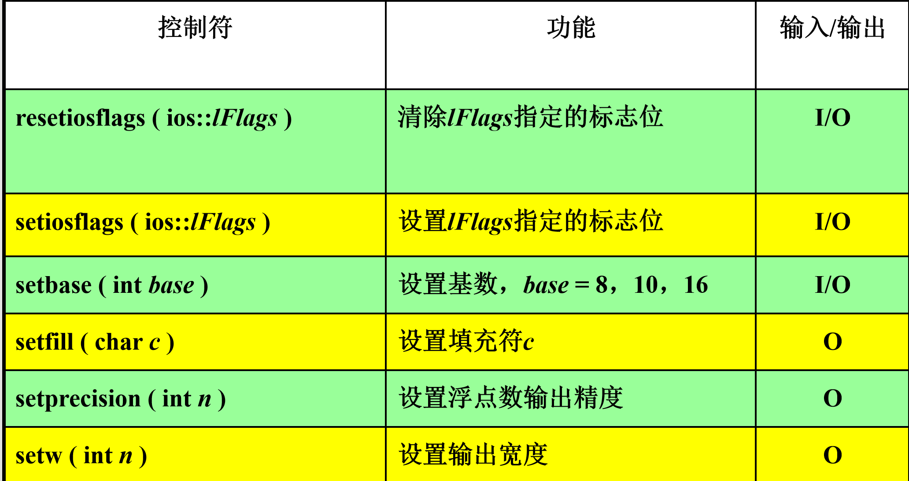
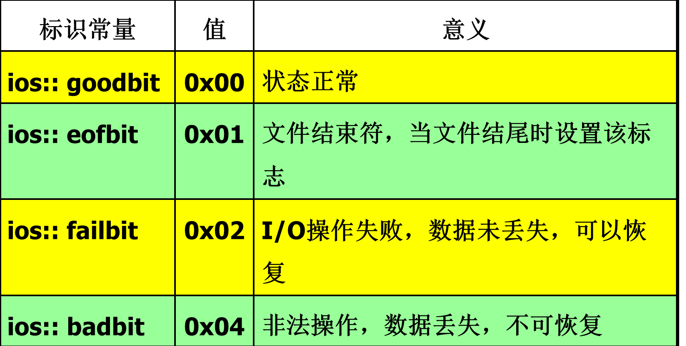
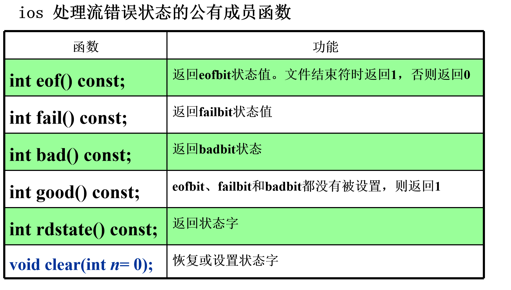
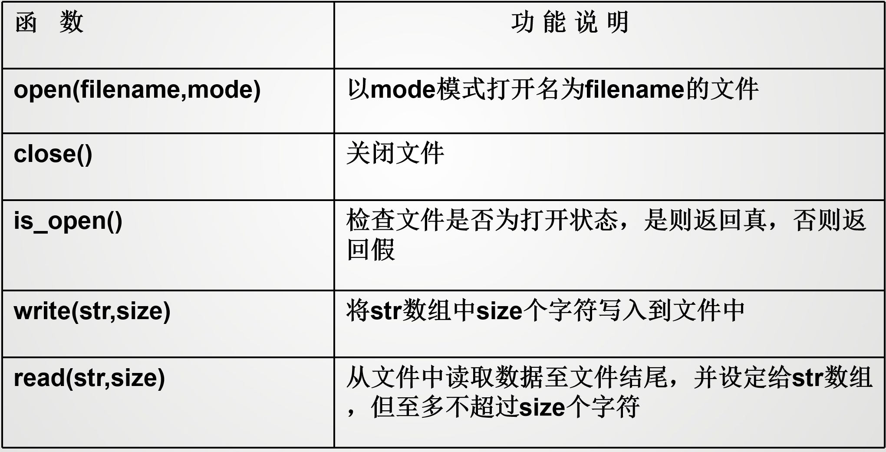
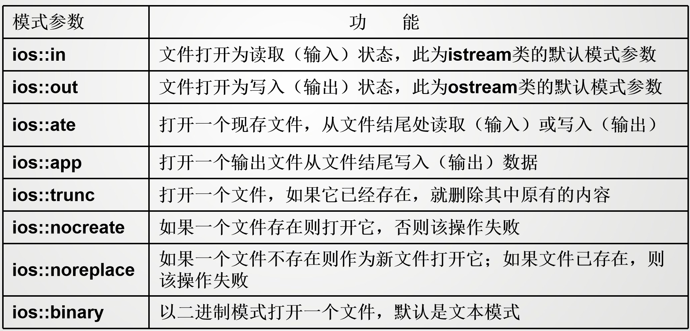
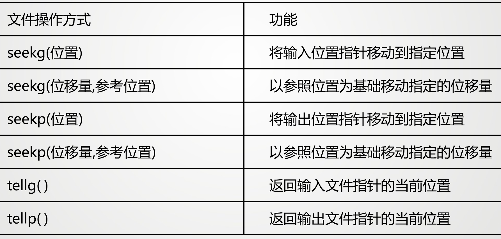

# 文件操作和输入输出流
## C++的输入输出

C++的输入输出流是指由若干字节组成的字节序列，按顺序从一个对象传送到另一个对象。输入时，程序从输入流中抽取字节；输出时，程序将字节插入到输出流中

对于面向文本的程序，每个字节代表一个字符。


读操作在流数据抽象中被称为（从流中）提取，写操作被称为（向流中）插入。

**I/O流类库提供对象之间的数据交互服务**
- 输出流：表示数据从内存传送到外部设备
- 输入流：表示数据从外部设备传送到内存缓冲区变量中
- 流类库预定义了多种流对象，连接到不同的设备
- 程序员可以定义所需的流对象
- 流类对象可以建立和删除，可以从流中获取数据和向流添加数据

常用的流类继承关系：
```
ios
├── istream -----------|
│   ├── ifstream       |____iostream----fstream
│   └── istringstream  |
├── ostream------------|
│   ├── ofstream
│   └── ostringstream
```


`cin`对象管理标准输入流，默认与标准输入设备（通常为键盘）相连；`cout`对象管理标准输出流，默认与标准输出设备（通常为显示器）相连。除此之外，还有`cerr`、`clog`、`wcin`、`wcout`、`wcerr`和`wclog`。

插入运算符`<<`和提取运算符`>>`是C++流类的成员函数。它们分别用于向输出流插入数据和从输入流提取数据。插入运算符的左操作数是输出流对象，右操作数是要插入的数据；提取运算符的左操作数是输入流对象，右操作数是要提取的数据。


`iostream`类库中不同的类的声明被放在不同的头文件中。`iostream`类库的头文件有：
- `iostream`：定义了`istream`、`ostream`和`iostream`类，包含了对输入输出流的基本操作
- `fstream`：定义了`ifstream`、`ofstream`和`fstream`类，包含了对文件流的基本操作
- `strstream`：定义了`istringstream`、`ostringstream`和`stringstream`类，包含了对字符串流的基本操作
- `stdiostream`: 用于混合使用C和C++的输入输出流
- `iomanip`：定义了格式化输入输出流的类和函数


### 输入输出流分类

- 标准流：对系统指定的标准设备的I/O操作
- 文件流：以外存中的文件为对象进行输入和输出；
       以文件为对象的输入输出，包括从磁盘文件输入数据，   
       或将数据输出到磁盘文件；
- 字符串流：对内存中指定空间进行输入和输出；
        通常指定一个字符数组作为存储空间；

## 标准输入流

### 使用`cin`进行输入

C++提供了实用的输入功能，通过键盘产生输入的内容，从而形成字节流。`cin`对象可以将输入字节流中的信息存储到相应的内存单元。通常，可以这样使用`cin`:
```cpp
cin >> variable;
```
其中 ，`>>`是流读取运算符，它重载右移位运算符`>>`，用于从输入流中提取数据。`variable`是一个变量，表示要存储输入数据的内存单元。`cin`对象会将输入的字节流转换为相应的数据类型，并存储到变量中。

左边的`cin`是一个输入流对象，右边的`variable`是一个变量，表示要存储输入数据的内存单元。`>>`是流读取运算符，它重载了右移位运算符，用于从输入流中提取数据。`cin`对象会将输入的字节流转换为相应的数据类型，并存储到变量中。

流提取符从流中提取数据时通常跳过输入流中的空格、tab键、换行符等空白字符。


输入运算符`>>`也支持级联输入。在默认情况下，运算符`>>`跳过空格，读入后面与变量类型相应的值。因此给一组变量输入值时，用空格或换行将输入的数值间隔开。
```cpp
int a, b, c;
cin >> a >> b >> c;
```

当输入字符串(`char*` 类型)时，输入运算符`>>`会跳过空格，读入后面的非空格符，直到遇到另外一个空格结束，并在字符串末尾自动放置字符`‘\0’`作为结束标志，例如
```cpp
char str[20];
cin >> str;
```
当输入"Hello World"时，`str`中只存储"Hell"。如果要输入带空格的字符串，可以使用`getline()`函数。

数据输入时，不仅检查数据间的空格，还做类型检查，自动匹配数据类型。
```cpp
int i;
float f;
cin >> i >> f;
```
如果输入`12.34 34.56`，则`i`的值为`12`，`f`的值为`34.56`。如果输入`12.34 34.56abc`，则会报错，提示类型不匹配。


**常用istream成员函数**
- `int istream::get()`: 
    如果输入流中包括附加的数据，函数取得并返回下一个字符，否则返回EOF
- `istream istream::get(char& c)`:
    如果输入流包括附加的数据，函数取得并将下一个字符分配给c；否则就是没有定义对c的作用。返回一个对*this（调用对象）的引用。
- `istream istream::get(char s[], int n, char delim = '\n')`:
    从输入流获取字符并将它们分配给s直到下面的一个条件发生：取得n-1个字符，没有输入字符了，或者下一个接收的字符的值为delim。
- `istream istream::getline(char s[], int n, char delim = '\n')`:
    从输入流获取字符并将它们分配给s直到下面的一个条件发生：取得n-1个字符，没有输入字符了，或者下一个接收的字符的值为delim。
- `int istream::peek()`:
    返回下一个字符，但不从输入流中删除它。返回EOF表示没有更多的字符。
- `istream& istream::unget(char c)`:
    将字符c放回输入流中,它将是下一个要接收的字符。返回一个对*this（调用对象）的引用。
- `bool istream::eof()`:
    如果输入流到达文件的末尾，返回true，否则返回false。

!!! note "其他istream 类方法"
    === `get()` 方法
    istream类中的get()方法提供不跳过空格的单字符输入功能
    使用方法：
    ```cpp
    char ch;
    cin.get(ch);
    ```
    三种重载形式
    - 无参数
    - 两个参数:`istream::get(char * s, int n)`,第一个参数用于放置字符串的内存单元的地址，第二个参数为读取的最大字符数（最后一位存放`\0`,最多读n-1位）
        ```cpp
        char str[20];
        cin.get(str, 20);
        ```
    - 三个参数:`istream::get(char * s, int n, char delim)`,第三个参数为分隔符，读取到分隔符时停止,只有两个参数的`get`函数将换行符用作分界符
    === `getline()` 方法
    读取整行输入
    `输入流对象.getline(字符数组, 字符个数)`，但是只能读字符数-1个字符
    
    getline()重载方法同样也有三个参数的方法,三个参数的作用和上面get()方法类似，其原型如下
    ```cpp
    istream& getline(char * s, int n, char delim = '\n');
    ```

    === `read()` 方法
    读取指定字节数的字符
    ```cpp
    char str[50];
    cin.read(str, 20);
    ```
    `read()`方法不会在输入后加上空值字符，因此不能将输入转换为字符串，该方法的返回类型为`istream&`，可以进行级联输入
    ```cpp
    cin.read(str, 20).read(str2, 30);
    ```


## 标准输出流

### 使用`cout`进行输出

`cout`是输出流类`ostream`的对象，输出结果流向标准的输出设备显示器。在C++中，流输出使用插入运算符`<<`(重载左移位运算符)完成输出，使之能够识别C++中所有的基本类型。插入运算符`<<`左边的操作数是`ostream`类的一个对象(如`cout`)，右边可以是C++的合法表达式。

`ostream` 类的对象(console output)通常连向显示器，可以重定向到文件或其他设备。`cout`对象的输出格式是文本格式，输出时自动转换为字符流。
```cpp
ostream & operator<<(类型识别符);
```
`cout`流在内存中对应开辟了一个缓冲区

C++用指向字符串存储位置的指针来表示字符串。指针的形式可以是`char`数组名、显式的`char`指针或用引号括起的字符串。C++还允许输出项为显式对象的地址。默认情况下，地址以十六进制的形式显示。但对于其他类型的指针，C++可以使用`void *`来强制转换输出。

其他`ostream`类方法：
- `put()`: 无格式，插入一个字节
- `write()`: 无格式，插入n个字节
- `flush()`: 刷新输出流
- `seekp()`: 移动输出流指针
- `tellp()`: 返回输出流指针位置

`ostream& ostream::put(char c)`:将字符c插入到输出流中，返回一个对*this（调用对象）的引用。

`ostream& ostream::write(const char* s, int n)`:将n个字符插入到输出流中，空字符也是有效的，返回一个对*this（调用对象）的引用。`s`是一个指向字符数组的指针，表示要插入的字符序列。

`ostream& ostream::flush()`:刷新输出流，强制任何没有完成的操作符插入完成，返回一个对*this（调用对象）的引用。

!!! note "其他ostream 类方法"
    === `put()` 方法
    `put()`方法用于输出一个字符，返回值为ostream对象的引用
    ```cpp
    char ch = 'A';
    cout.put(ch);
    ```
    === `write()` 方法
    `write()`方法用于输出指定字节数的字符，返回值为ostream对象的引用
    ```cpp
    char str[20] = "Hello World";
    cout.write(str, 5); // 输出 Hello
    ```

### 其他ostream 类方法

#### `put()` 方法
```ostream & put(char c)```

可以使用类方法来调用：
```cpp
cout.put('A');
```
由于该函数返回ostream对象的引用，因此可以进行级联输出
```cpp 
cout.put('A').put('B').put('C');
```

成员函数`put`不仅可以用`cout`对象调用,也可以用`ostream`类的对象调用

#### `write()` 方法
```ostream & write(const char * s, streamsize n)```

`write()`方法不会在遇到空字符时自动停止，而会按照指定数量输出字符，即使超出了字符串的长度也不会报错


## 格式化控制

插入和提取运算符与预先定义的操作符一起工作，用来控制输入和输出格式。

+ 输出宽度：为了调整输出的宽度，可以使用`setw()`函数。该函数定义在`iomanip`头文件中，返回一个流操纵符对象。它的参数是一个整数，表示输出的宽度。`setw()`函数的返回值是一个流操纵符对象，可以与插入运算符`<<`结合使用。
+ 对齐方式：输出流默认的对齐方式是右对齐。可以使用`setiosflags()`函数设置对齐方式。该函数的参数是一个整数，表示对齐方式。可以使用`ios::left`、`ios::right`和`ios::internal`来设置左对齐、右对齐和内部对齐。可以使用`resetiosflags()`函数重置对齐方式。
+ 精度：使用`setprecision()`函数设置输出的精度。该函数的参数是一个整数，表示小数点后保留的位数。可以使用`fixed`和`scientific`来设置定点格式和科学计数法格式。
+ 进制：可以使用`hex`、`dec`和`oct`来设置输出的进制格式。可以使用`setbase()`函数设置进制格式。该函数的参数是一个整数，表示进制格式。可以使用`resetiosflags()`函数重置进制格式。

格式化标志是类定义的枚举集合，指定输入输出格式化和操作的不同选择：
```cpp
enum {skipwsleft, right, internal, dec, oct, hex, showbase,  showpoint,  uppercase,  showpos,  scientific,  fixed,  unitbuf,    stdio}
```

**引用格式化标志**： `iso::格式化标志`

#### 数据流的格式控制


ios控制格式的函数：
- `long flags(long lFlags)`: 用参数lFlags更新标志字，返回标志字
- `long flags() const`: 返回当前的格式化标志
- `long setf(long lFlags)`: 用参数lFlags设置格式化标志，返回当前的格式化标志
- `long unsetf(long lFlags)`: 将参数IMask指定的标志位清零
- `int width(int nw)`: 设置下一个输出项的宽度为nw
- `char fill(char cFill)`: 设置空白位置以字符参数cFill填充
- `int precision(int n)`: 设置浮点数的精度为n

!!! example "格式化输出"
    === "设置输出宽度"
    ```cpp
    #include<iostream>
    using namespace std;
    int main(){
        string c = "hworld";
        cout.fill('*');
        cout.width(10);
        cout.setf(ios::left);
        cout << c << endl;
        cout.width(15);
        cout.setf(ios::right,ios::left);
        cout << c << endl;
        return 0;
    }
    ```
    ```
    hworld****
    *********hworld
    ```
    === "设置输出精度"
    ```cpp
    #include <iostream>
    using namespace std;
    int main()
    { 
        double x = 22.0/7 ;
        int i ;
        cout << "output in fixed :\n" ;
        cout.setf( ios::fixed | ios::showpos ) ;	// 定点输出，显示 +
        for( i=1; i<=5; i++ )
        { cout.precision( i ) ;  cout << x << endl ; }
        cout << "output in scientific :\n" ;
    // 清除原有设置，科学示数法输出
        cout.setf(ios::scientific, ios::fixed|ios::showpos ) ;	
        for( i=1; i<=5; i++ )
        { cout.precision(i) ;   cout << x*1e5 << endl ; }
    }
    ```
    ```
    output in fixed :
    +3.1
    +3.14
    +3.143
    +3.1429
    +3.14286
    output in scientific :
    3e+05
    3.1e+05
    3.14e+05
    3.143e+05
    3.1429e+05
    ``` 
  

控制符是`istream`和`ostream`类定义了一批函数，作为重载插入运算符`<<`和提取运算符`>>`的右操作数，控制I/O格式；
`iostream`类的常用控制符函数有：
- `endl`: 输出一个新行符，并清空流
- `ends`: 输出一个空字符，并清空流
- `flush`: 清空流缓冲区
- `dec`: 设置十进制输入/输出格式
- `oct`: 设置八进制输入/输出格式
- `hex`: 设置十六进制输入/输出格式
- `ws`: 提取空白字符

!!! example "不同基数输出"
    ```cpp
    #include<iostream>
    using namespace std;
    int main(){
        int a,b,c;
        cout << "please input a decimal";
        cin >> dec >> a;
        cout << "please input a hexadeimal";
        cin >> hex >> b;
        cout << "please input a octal";
        cin >> oct >> c;
        cout << " output in deciaml" << endl;
        cout << a << b << c << endl;
        cout << " output in hexadeimal" << endl;
        cout << hex << a  << b  << c << endl;
        cout << " output in octal" << endl;
        cout << oct << a  << b  << c << endl;
    }
    ```

`iomanip`的控制符：


!!! example "iomanip 控制符"

    ```cpp
    #include <iostream>
    #include <iomanip>
    using namespace std ;
    void main()
    { 
            const int k = 618 ;
            cout << setw(10) << setfill('#') << setiosflags(ios::right) << k <<endl ;
            cout << setw(10) << setbase(8) << setfill('*')
                << resetiosflags(ios::right) << setiosflags(ios::left) << k << endl ;
    } 
    ```

- `cout.width(n)`设置下一个输出项的宽度
- `cout.fill(c)`设置空白位置以字符c填充
- `cout.setf(ios::left)`设置左对齐
- `setiosflags(ios::right)`设置右对齐
- `resetiosflags(ios::right)`取消右对齐
- `setprecision(n)`设置浮点数的精度为n

!!! example "格式化输出"
    ```cpp
    #include <iostream>
    using namespace std;

    int main() {
        int a = 21;
        cout.setf(ios::showbase);           // 显示基数符号(0x或0)
        cout << "dec:" << a << endl;        // 默认以十进制形式输出a

        cout.unsetf(ios::dec);              // 终止十进制的格式设置
        cout.setf(ios::hex);                // 设置以十六进制输出的状态
        cout << "hex:" << a << endl;        // 以十六进制形式输出a

        cout.unsetf(ios::hex);              // 终止十六进制的格式设置
        cout.setf(ios::oct);                // 设置以八进制输出的状态
        cout << "oct:" << a << endl;        // 以八进制形式输出a

        cout.unsetf(ios::oct);              // 终止八进制的格式设置

        char *pt = "China";                 // pt指向字符串"China"
        cout.width(10);                     // 指定域宽为10
        cout << pt << endl;                 // 输出字符串

        cout.width(10);                     // 指定域宽为10
        cout.fill('*');                     // 指定空白处以'*'填充
        cout << pt << endl;                 // 输出字符串

        double pi = 22.0 / 7.0;             // 输出pi值
        cout.setf(ios::scientific);         // 指定用科学记数法输出
        cout << "pi=";                      // 输出"pi="
        cout.width(14);                     // 指定域宽为14
        cout << pi << endl;                 // 输出pi值

        cout.unsetf(ios::scientific);       // 终止科学记数法状态
        cout.setf(ios::fixed);              // 指定用定点形式输出
        cout.width(12);                     // 指定域宽为12
        cout.setf(ios::showpos);            // 正数输出“+”号
        cout.setf(ios::internal);           // 数符出现在左侧
        cout.precision(6);                  // 保留6位小数
        cout << pi << endl;                 // 输出pi，注意数符“+”的位置

        return 0;
    }
    ```
    ```txt
    dec:21
    hex:0x15
    oct:025
        China
    *****China
    pi=**3.142857e+00
    +***3.142857
    ```

## 标准错误输出流

- `cerr`：标准错误输出流，默认与标准输出设备（通常为显示器）相连。`cerr`对象是一个输出流对象，用于输出错误信息。`cerr`对象的输出格式是文本格式，输出时自动转换为字符流。
    - `cerr`不能被重定向，不能被缓冲
- `clog`：标准日志输出流，默认与标准输出设备（通常为显示器）相连。`clog`对象是一个输出流对象，用于输出日志信息。`clog`对象的输出格式是文本格式，输出时自动转换为字符流。
    - `clog`与`cerr`比，可以被缓冲，缓冲区满时输出
    

所有流都把流的状态存储在状态字中,不同标志位中存储不同的错误状态位;
包含在类ios的enum成员中 





流`cerr`和`clog`把显示输出到默认错误日志上，该日志通常是控制台显示器。对流`cerr`的每个插入请求应该立即送出显示

如果出于效率的缘故，则有必要缓冲错误和系统状态消息，这样就应该使用带缓冲的错误流`clog`。

## 文件的输入输出

C++在进行文件操作时，必须首先建立一个文件流，把这个流与实际的文件相关联，然后就可以按照要求进行读写操作。C++的文件流实际上就是以外存文件为输入输出对象的数据流。输入文件流是指从外存文件流向内存的过程，输出文件流是指从内存流向外存的过程

c++将文件流分为3类：
- `ifstream`：输入文件流类，继承自`istream`类
- `ofstream`：输出文件流类，继承自`ostream`类
- `fstream`：输入输出文件流类，继承自`iostream`类

C++的文件I/O模式分为两种，一种为格式化文字模式，另一种为二进制模式，默认的文件I/O模式为文字模式

格式化文字模式适合储存字符或字符串，
在储存数字时使用二进制模式是比较合适的。

文件的最小单位为字符，由字符组成一个字段，好几个字段组成一个记录，而一个文件则由好几笔记录组成

将数据输入输出到文件中，除了可以使用`write()`和`read()`函数外，还可以使用`<<`和`>>`运算符。



### 文件的打开和关闭

#### 文件的打开

```cpp
fstream file;//定义一个文件流对象
```

文件在进行读写操作前，应先打开，其目的是为文件流对象和特定的外存文件建立关联，并指定文件的操作方式

- 使用`open()`函数打开文件:`file.open("filename", mode);`
    
    - 每个被打开的文件都有一个文件指针，该指针的初始位置由打开方式指定。文件每次读写都从文件指针的当前位置开始。当读出或写入一个字符，指针自动后移一个字节。当文件指针指向文件尾时，将遇到文件结束符EOF（文件结束符占一个字节，其值为-1）。此时，流对象的成员函数eof()的值为非0值（一般为1），表示文件结束
        - 文件指针由两种，一个是写入指针，一个是读取指针。当文件被打开时，这两个指针都被设定指向文件的起始处
        - 在`ios`类，定义了三个特定的文件指针。通过指定函数与特定指针的配合使用是，可供在文件的不同位置进行读写操作
            - `ios::beg`：文件开头
            - `ios::cur`：当前文件指针位置
            - `ios::end`：文件末尾
    - 用`ios::in`方式打开文件只能读文件，不能写文件。如果文件不存在，则打开失败。如果使用`ifstream`类打开文件，将隐含为输入流，默认为"ios:in",则不必显式地声明打开方式
    - 用`ios::out`方式打开文件,表示计算机向该文件输出数据。如果用类`ofstream`产生的流，将隐含为输出流，默认`ios::out|ios::trunc`,可以不必显式地声明打开方式。以这种方式打开文件进行输出时，如果没有这样的文件，将创建一个新文件；如果有这样的文件，则打开文件并清空文件，输出将进入一个空文件中。
    - `fstream`类不提供默认的模式值，所以用`fstream`类打开文件时，必须显式地声明打开方式
    - 如果希望不删除文件原来的数据，向文件末尾，添加新数据，则可以用`ios::app`方式打开文件(文件必须存在，而且只能用于输出)
    - `ios::ate`：打开一个已存在的文件，文件指针自动位于原有文件的尾部
    - 在默认情况下，打开的文件均以文本方式打开文件。在用文本文件向计算机输入时，把回车和换行两个字符转换为一个换行符，而在输出时把换行符转换为回车和换行两个字符。若需要以二进制方式打开文件，则需要将打开方式设置为`ios::binary`。用二进制方式时，在内存中的数据形式与输出到外部文件中的数据形式完全一致。
    - 打开方式可以用位运算符`|`连接起来，例如`ios::in | ios::out | ios::app`，表示以读写方式打开文件，并在文件末尾添加新数据
- 使用构造函数打开文件，与`open()`函数类似
    ```cpp
    ifstream file("filename", ios::in);
    ofstream file("filename", ios::out);
    fstream file("filename", ios::in | ios::out);
    ```
    - `ifstream`类的构造函数隐含为输入流，默认`ios::in`
    - `ofstream`类的构造函数隐含为输出流，默认`ios::out|ios::trunc`
    - 只有在成功打开文件之后，才能对文件进行读写操作，如果由于某些原因打不开文件，则流变量的值为0。为了确保成功打开文件：
        ```cpp
        if (!file) {
            cout << "open file error!" << endl;
            exit(1);
        }
        ```
#### 文件的关闭

当对一个文件的读写操作完成后，为了保证数据安全，切断文件与流的联系，应及时关闭文件。
```cpp
file.close();
```
关闭这样的连接并不会删除流，而只是断开流与文件的连接。而流对象还仍然存在，并可以重新连接到同一个文件或另一个文件。

### 文本文件的读写操作

- 用流输入运算符`>>`和输出运算符`<<`输入输出标准类型的数据，在对文件的操作中，可以通过对文件流对象使用`>>`和`<<`运算符来实现对文件的读写操作
- 由于`ifstream`、`ofstream`和`fstream`类继承了`istream`、`ostream`和`iostream`类的`put`、`get`和`getline`成员函数，因此可以使用put、`get`和`getline`成员函数进行字符的输入输出。

### 二进制文件的读写操作

二进制文件不同文本文件以ASCII码的形式存储数据，二进制文件以二进制的形式存储数据。对于字符来说，二进制表示与文本表示是一样的，即字符的ASCII码的二进制表示。但对于数字来说，由于不需要转换，用二进制格式保存数字速度更快，占用空间更小，并可以大块地存储数据

对二进制文件的读写，主要用`istream`类的`read()`方法和`ostream`类的`write()`方法。

### 使用文件指针成员函数实现随机存取

随机存取指在访问文件中的元素时，不必考虑各个元素的排列次序或位置，根据需要直接访问文件中任一个元素。为了进行随机存取，必须先确定文件指针的位置。

文件流提供了常用的文件指针成员函数：


参数中的位置和位移量均为长整型，以字节为单位。参照位置可以是：
- `ios::beg`：文件开头
- `ios::cur`：当前文件指针位置
- `ios::end`：文件末尾

!!! example "随机存取文件"

    === "fin是一个ifstream对象"
        ```cpp
        fin.seekg(10);  //把输入位置指针移动到离文件头10个字节处
        fin.seekg(10,ios::beg);  //把输入位置指针移动到离文件头10个字节处
        fin.seekg(5,ios::cur);  //把输入位置指针移动到当前位置后5个字节处
        fin.seekg(-20,ios::end);  //把输入位置指针向前移动到离文件尾20个字节处
        ```

    === "有一个整型数组，含10个元素，从键盘输入10个整数给数组，将此数组送到磁盘文件中存放"
        ```cpp
        #include <fstream>
        using namespace std;
        int main( )
        {
            int a[10];
            ofstream outfile(″f1.dat″,ios::out);//定义文件流对象，打开磁盘文件″f1.dat″
            if(!outfile)                        //如果打开失败，outfile返回0值
                {cerr<<″open error!″<<endl;
                exit(1);
                }
            cout<<"enter 10 integer numbers:"<<endl;
            for(int i=0;i<10;i++)
                {cin>>a[i];
                outfile<<a[i]<<″ ″;}            //向磁盘文件″f1.dat″输出数据
            outfile.close();                   //关闭磁盘文件″f1.dat″
            return 0;
        } 
        ```

    === "设置位置指针"
        ```cpp
        #include <iostream>
        #include <fstream>
        using namespace std;
        void main() { 
        char ch;
        ifstream tfile("payroll",ios::binary|ios::nocreate);
        if(tfile)
        { tfile.seekg(8);
            while(tfile.good()) 
            { tfile.get(ch);
            if (!ch) break; cout<<ch; }
        }
        else 
        { cout<<"ERROR: Cannot open file 'payroll'."<<endl; }
        tfile.close();
        }
        ```