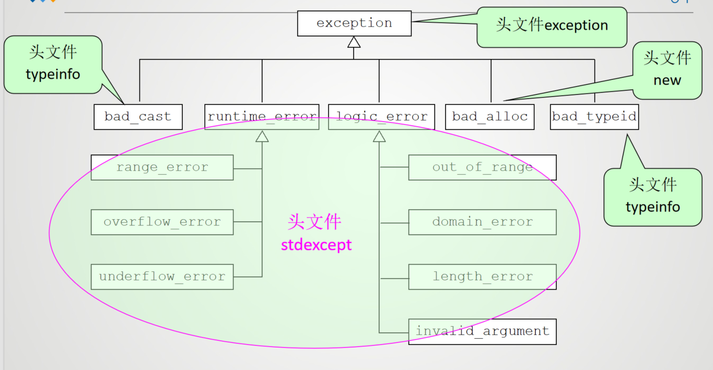

# 异常处理

## 1 异常、异常处理的概念

 异常就是在程序运行过程中发生的不正常的事件而导致偏离正常流程的现象

异常处理就是在运行时刻对异常进行检测、捕获、提示、传递等过程

**这里的异常指的是软件异常**

c++语言异常处理机制的基本思想是将异常的检测与处理分离

- 过程1：当在一个函数体中检测到异常条件存在，但却无法确定相应的处理方法时，该函数将引发一个异常，由函数的直接或间接调用者捕获这个异常并处理这个错误。
- 过程2：如果程序始终没有处理这个异常，最终它会被传到C++运行系统那里，运行系统捕获异常后，通常只是简单地终止这个程序。

### 1.1 异常处理的基本思想


## 2 异常处理的实现

- 抛掷异常的程序段：```throw 表达式```
- 捕获并处理异常的程序段
```cpp
try {
    // 可能发生异常的代码
} catch (异常类型 异常对象) {
    // 处理异常的代码
} catch (异常类型) {
    // 处理异常的代码
} catch (...) {
    // 处理所有异常的代码
}
```

- 若有异常则通过`throw`语句抛出异常
- `try`语句块中可能发生异常的代码
- `catch`语句块中处理异常的代码
- `catch`子句按其在`try`语句块中出现的顺序被检查，类型匹配的`catch`子句将捕获并处理异常
- 如果找不到匹配的处理代码，则自动调用标注库函数`terminate()`终止程序,其功能是调用`abort()`函数终止程序

### 2.1 异常处理的基本语法

`throw`语句的基本语法
```cpp
throw 异常对象;
```
`throw`语句的作用是抛出一个异常对象，异常对象可以是任何类型的对象，包括内置类型、类类型、指针类型等。
`throw`一般是由`throw`运算符和一个数据组成

`try-catch`语句的基本语法
```cpp
try {
    // 可能发生异常的代码
} catch (异常类型 异常对象) {
    // 处理异常的代码
} catch (异常类型) {
    // 处理异常的代码
} catch (...) {
    // 处理所有异常的代码
}
```
`try`语句块中包含可能发生异常的代码，如果发生异常，则会跳转到对应的`catch`语句块中进行处理。

**异常处理的执行过程**
+ 控制通过正常的顺序执行倒`try`语句，然后执行`try`语句块中的代码
+ 如果`try`语句块中的代码没有发生异常，则跳过所有的`catch`语句块，继续执行`try`语句块后面的代码
+ 如果在保护段执行期间或在保护段调用的任何函数中(直接或间接的调用)有异常被抛掷，则从`throw`创建的对象中创建一个异常对象（隐含调用一个拷贝构造函数）,程序转到`catch`处理段
    这一点上，编译器能够处理抛掷类型的异常，在更高执行上下文中寻找一个`catch`语句(或一个能处理任何类型异常的`catch`处理程序)。`catch`处理程序按其在`try`块后出现的顺序被检查。如果没有找到合适的处理程序，则继续检查下一个动态封闭的try块。此处理继续下去，直到最外层的封闭`try`块被检查完。
+ 如果匹配的`catch`处理器未找到，则`terminate()`将被自动调用
+ 如果找到了一个匹配的`catch`处理器，且它通过值进行捕获，则其形参通过拷贝异常对象进行初始化。如果它通过引用进行捕获，则参量被初始化为指向异常对象，在形参被初始化之后，“循环展开栈”的过程开始，这包括对那些在与`catch`处理器相对于的try块开始和异常丢弃地点之间创建但尚未析构的所有自动对象的析构


`throw`块的重要性：异常出现时发出一个对象，编译器初始化一个`throw`操作数的静态类型的临时对象

在c++异常处理块中，比较特殊的是`catch(...)`，它可以捕获所有类型的异常
```cpp
try {
    // 可能发生异常的代码
} catch (...) {
    // 处理所有异常的代码
}
```
因此，`catch(...)`语句块必须放在所有其他`catch`语句块的最后面，因为它会捕获所有类型的异常，包括其他`catch`语句块中捕获的异常

!!! example 
    === "处理除0异常"
        ```cpp
        #include <iostream>
        using namespace std;

        double fun(double a, double b) {
            if (b == 0) {
                throw b;//除数为0，抛出异常
            }
            return a / b;
        }

        int main(){
            double res;
            try//定义异常
            {
                res = fun(4,5);
                cout << "4/5 = " << res << endl;
                res = fun(4,0);//出现异常，函数内部会抛出异常
            }
            catch(double num){
                cout << num << endl;
                cerr << "除数不能为0" << endl;
                exit(1);
            }
            return 0;
        }
        ```
    === "异常处理代码的搜索"
        ```cpp
        #include <iostream>
        using namespace std;

        void f3(){
            double a = 0;
            try{
                throw a;//抛出double类型异常信息
            }
            catch(double){
                cout<<"ok3"<<endl;
            }
            cout<<"end3"<<endl;
        }
        void f2(){
            try{
                f3();
            }
            catch(int){
                cout<<"ok2"<<endl;
            }
            cout<<"end2"<<endl;
        }
        void f1(){
            try{
                f2();
            }
            catch(char){
                cout<<"ok1"<<endl;
            }
            cout<<"end1"<<endl;
        }

        int main(){
            try{
                f1();
            }
            catch(double){
                cout<<"ok"<<endl;
            }
            cout<<"end"<<endl;
            return 0;
        }
        ```
        
异常处理流程：
- 把可能出现异常的、需要检查的语句或程序段放在try后面的花括号中
- 程序开始之后，按正常的顺序执行到try语句，开始执行try语句块中的代码
- 如果try语句块中的代码没有发生异常，则跳过所有的catch语句块，继续执行try语句块后面的代码
- 如果在执行try语句块内的语句（包括其所调用的函数）过程中发生异常，则throw运算符抛出一个异常信息。`throw`运算符抛出一个异常信息之后，流程立即离开本函数，转到其上一级的函数。
- 这个异常信息提供给try-catch结构，系统会寻找与之匹配的catch子句
- 在进行异常处理后，程序并不会自动终止，继续执行catch子句后面的语句

### 2.2 异常接口声明

C++语言提供了异常接口声明语法，异常接口声明也称为异常接口声明，利用它可以清晰地告诉使用者异常抛出的类型，异常接口声明再次使用关键字throw，语法如下：
```cpp
返回值类型 函数名(参数列表) throw(异常类型1, 异常类型2, ...);
```

!!! example 
    ```cpp
    double triangle(double, double, double) throw(double);
    ```
    只能抛出`duoble`类型的异常
    ```cpp
    double triangle(double, double, double) throw(int, double);
    ```
    可以抛出`int`和`double`类型的异常信息。异常指定是函数声明一部分，必须同时在函数声明和函数定义的首行中，否则在进行函数的另一次声明时，编译器会报错


如果在声明函数时未列出可能抛出的异常类型，则该函数可以抛出任何类型的异常信息

如果想声明一个函数不抛出任何异常，则可以使用`throw()`，语法如下：
```cpp
返回值类型 函数名(参数列表) throw();
```

## 3 构造函数、析构函数的异常处理

C++异常处理的真正能力不仅在于能处理各种不同类型异常，还在于它具有在异常抛掷前为构造的所有局部对象自动调用析构函数的能力

在程序中，找到一个匹配的catch异常处理后，如果catch语句的异常类型声明是一个值参数，则其初始化方式是复制被抛掷的异常对象；如果catch语句的异常类型声明是
一个引用，则其初始化方式是使该引用指向异常对象

当catch语句的异常类型声明参数被初始化后，栈的展开过程便开始了。这包括从对应的try块开始到异常被抛掷处之间对构造（且尚未析构）的所有自动对象进行析构。析构的顺序与构造的顺序相反。然后程序从最后一个catch处理之后开始恢复执行。


**构造函数的异常处理**
- 如果对象有成员函数，且如果在外层对象构造完成之前有异常抛出，则在发生异常之前，执行构造函数的成员对象的析构
- 如果异常发生时，对象数组被部分构造，则只调用已构造的数组元素的析构函数
- 异常可能跳过通常释放资源的代码，从而导致资源泄漏。解决方法是，请求资源时初始化一个局部对象，发生异常时，该对象的析构函数会自动释放资源
- 要捕捉析构函数中的异常，可以将调用析构函数的函数放入try块中，并提供相应类型的catch处理程序块。抛出对象的析构函数字啊异常处理程序执行完毕后执行

!!! exmaple "异常处理"
    === "exampel1"
        ```cpp
        #include <iostream>
        #include <memory>
        #include <string>
        using namespace std;

        class DemoClass{
            public:
                DemoClass(const string objname):name(objname){
                    cout << "DemoClass constructor" << endl;
                }
                ~DemoClass(){
                    cout << "DemoClass destructor" << endl;
                }
                string who() const{
                    return name;
                }
            private:
                string name;
        }

        void f(){
            //定义一个auto_ptr对象，指向一个动态创建的DemoClass对象
            auto_ptr<DemoClass> p(new DemoClass("DemoClass"));
            cout << "name of DemoClass constructed is " << p->who() << endl;

            //创建另一个对象，将p赋值给该对象
            auto_ptr<DemoClass> p2(p);
            cout << "name of DemoClass constructed 2 is " << p2->who() << endl;
            //抛出异常
            throw 8;
        }

        int main(){
            try{
                f();
            }
            catch(int){
                cout << "catch int exception" << endl;
            }
            cout << "end" << endl;
            return 0;
        }
        ```
        结果：
        ```
        DemoClass constructor
        name of DemoClass constructed is DemoClass
        name of DemoClass constructed 2 is DemoClass
        DemoClass destructor
        catch int exception
        end
        ```
        用new操作拆功能键的DemoClass对象的析构函数被调用，析构函数在异常抛出之前被调用

    === "exampel2"
        ```cpp
        #include <iostream.h>
        void MyFunc(void);
        class Expt
        {
        public:
            Expt(){   };
            ~Expt(){   };
            const char* ShowReason() const
            {	 return "Expt类异常。";      }
        };
        class Demo
        {
        public:
            Demo() {     cout<<"构造Demo。"<<endl;     }
            ~Demo(){     cout<<"析构Demo。"<<endl;     }
        };
        void MyFunc()
        {	  
            Demo D;
            cout<<“在MyFunc()中抛掷Expt类异常。“<<endl;
            throw Expt();
        }

        void main()
        {
        cout<<"在main()函数中。"<<endl;
        try {
              cout<<"在try块中，调用MyFunc()。"<<endl; 
              MyFunc();        
         }
        catch(Expt E)   
        {
              cout<<"在catch异常处理程序中。"<<endl;
              cout<<"捕获到Expt类型异常：";
              cout<<E.ShowReason()<<endl;        
        }
        catch(char* str) {
		 cout<<"捕获到其它的异常："<<str<<endl;    }
		 cout<<"回到main()函数。从这里恢复执行。"<<endl;
        }
        ```
以`catch(Expt E)`为例，这个catch 处理器之后都有异常参量，其实也可以不说明这些参量，但是在访问异常对象时就要说明参量，否则无法访问异常对象
```cpp
catch(Expt){
    //在这里无法访问异常对象
}

不带操作数的throw表达式可将当前正被处理的异常再次抛掷，这样的表达式只能出现在一个catch处理程序中或catch处理程序内部调用的函数中。再次抛掷的异常对象是源异常对象(不是拷贝)
```cpp
try{
    throwCSomeException();
}
catch(...){
    //处理异常
    throw; //再次抛掷异常
}
```


 try和catch块中必须有用花括号括起来的复合语句，即使花括号内只有一个语句，也不能省略花括号

`catch`后面的圆括号中国，一般致谢异常信息的类型名，如：
```cpp
catch(int) //捕获int类型的异常
catch(double) //捕获double类型的异常
catch(char*) //捕获char*类型的异常
catch(string) //捕获string类型的异常
```
`catch`只检查所捕获异常信息的类型，而不检查它们的值。

```cpp
catch(double a) //捕获double类型的异常，并将异常信息赋值给d
```
如果throw抛出的异常信息是double型的变量a，则catch在捕获异常信息a的同时，还使d获得a的值，或者说d得到a的一个拷贝

如果在catch子句中没有指定异常信息的类型，而用了删节号“…”，则表示它可以捕捉任何类型的异常信息

在某些情况下，在throw语句中可以不包括表达式，如
throw;
表示“我不处理这个异常，请上级处理”。


C++的异常处理机制会在throw抛出异常信息被catch捕获时，对有关的局部对象进行析构(调用类对象的析构函数)， 析构对象的顺序与构造的顺序相反，然后执行与异常信息匹配的catch块中的语句

## 异常匹配

从基类可以派生各种异常类，当一个异常抛出时，异常处理器会根据异常处理顺序找到“最近”的异常类型进行处理。如果catch捕获了一个指向基类类型异常对象的指针或引用，那么它也可以捕获该基类所派生的异常对象的指针或引用。相关错误的多态处理是允许的。

## 标准异常与层次结构

c++标准提供了标准库异常及层次结构。标准异常以基类`exception`为根类，所有的异常类都继承自它,在头文件`<exception>`中定义

- 由基类`exception`派生的异常类
    - `bad_alloc`：内存分配失败
    - `bad_cast`：类型转换失败
    - `bad_exception`：异常处理失败
    - `bad_typeid`：类型不匹配
    - `logic_error`：逻辑错误
    - `runtime_error`：运行时错误
    - `ios::failure`：输入输出错误

_异常处理不能用于处理异步情况，比如磁盘I/O完成、网络消息到达、鼠标单击等_



各种异常与对应的头文件：
| 异常类型 | 头文件 |
| :--- | :--- |
| `bad_alloc` | `<new>` |
| `bad_cast` | `<typeinfo>` |
| `bad_exception` | `<exception>` |
| `bad_typeid` | `<typeinfo>` |
| `ios::failure` | `<ios>` |
| `logic_error` | `<stdexcept>` |
| `runtime_error` | `<stdexcept>` |
| `out_of_range` | `<stdexcept>` |
| `underflow_error` | `<stdexcept>` |
| `overflow_error` | `<stdexcept>` |
| `length_error` | `<stdexcept>` |
| `domain_error` | `<stdexcept>` |
| `invalid_argument` | `<stdexcept>` |
| `range_error` | `<stdexcept>` |
| `overflow_error` | `<stdexcept>` |
| `out_of_range` | `<stdexcept>` |
| `system_error` | `<system_error>` |
| `future_error` | `<future>` |


**exception**类位于头文件`<exception>`中，提供了一个虚函数`what()`，返回一个指向描述异常的字符串的指针，被声明为
```cpp
    class exception {
        public:
            exception() throw();//构造函数
            exception(const exception&) throw();//拷贝构造函数
            virtual ~exception() throw();//虚析构函数
            exception& operator=(const exception&) throw();//赋值运算符重载
            virtual const char* what() const throw();
    };
```    

这里需要说明的是 what() 函数。what() 函数返回一个能识别异常的字符串，正如它的名字“what”一样，可以粗略地告诉你这是什么异常。不过C++标准并没有规定这个字符串的格式，各个编译器的实现也不同，所以 what() 的返回值仅供参考


exception类的直接派生类有
- `bad_alloc`：内存分配失败
- `bad_cast`：使用 dynamic_cast转换失败
- `bad_exception`：异常处理失败
- `bad_typeid`：使用 typeid 操作一个 NULL 指针，而且该指针是带有虚函数的类，这时抛出 bad_typeid 异常。
- `ios::failure`：输入输出错误
- `logic_error`：逻辑错误
- `runtime_error`：运行时错误
- `out_of_range`：下标越界
- `underflow_error`：下溢错误
- `overflow_error`：上溢错误
- `length_error`：长度错误
- `domain_error`：参数的值域错误，
- `invalid_argument`：参数无效


## 异常说明
作用：在函数原型中对函数是否会抛出异常以及抛出什么类型的异常进行说明
```cpp
返回值类型 函数名(参数列表) throw(异常类型1, 异常类型2, ...);
```
- 异常类型列表为空，表示该函数不抛出任何异常
- 不带异常说明的函数可以抛出任意类型的异常
- const成员函数的异常说明放在保留字const之后
- 基类虚函数的异常列表是派生类中对应虚函数的异常列表的超集