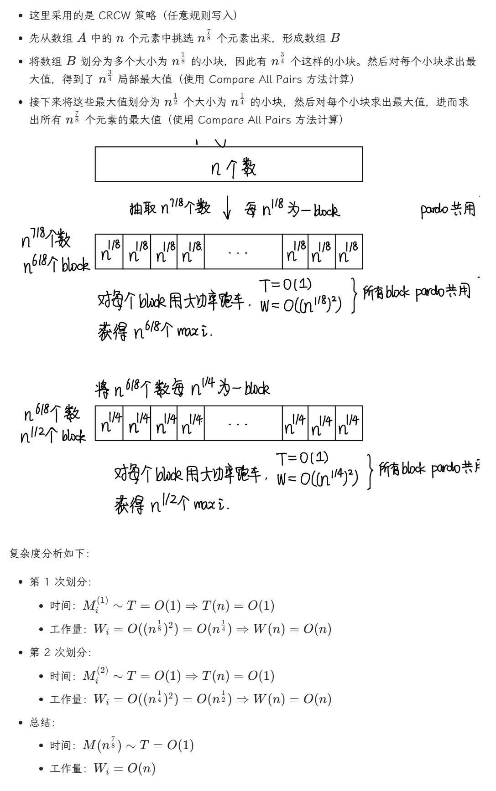

# Lec 13: Randomized Algorithm

- 将随机算法分为两大类：
    - 高效性：只需在**较高概率**下得到正确解的**高效**随机算法
    - 确定性：只需在**预期**效率内始终得到**正确解**的随机算法

!!! note Definition  
    - $Pr[A]:$事件A发生的概率
    - $\overline A$：事件A 的补
    - $E[X]$:随机变量X的期望

## 1 Hiring Problems

面试成本$C_i$,雇佣成本$C_h$,-在 N 天时间内，每天需要面试一位不同的助理,假设雇佣了M人，那么总成本为$O(NC_i+MC_h)$

### 1.1 Naive Solution

采取策略：每次能被雇佣的候选者需要有高于已被雇佣的候选者的能力

- 最坏情况：候选者按照能力的顺序进行面试，此时时间复杂度为$O(NC_h)$

### 1.2 Offline Randomized Solution

前 i 个候选者等可能地具备最佳能力, $E[X_i]=Pr[candidate~i~is~hired]=\frac 1 i$, $E[X]=\sum_{i=1}^N\frac 1 i=ln ~N+O(1)$

所以总成本为$O(ln~N\cdot C_h+NC_i)$

这样，我们仅需在处理数据前先对数据进行**随机排列**（Randomized Permutation），即可得到随机排序的数据，从而避免了最坏情况；但缺点在于随机排列数据需要额外的时间成本。

随机排列思想非常简单，我们为数组 `A[]` 的每个元素 `A[i]` 预先赋予一个**随机的优先值** `P[i]`，然后对数组进行排序

### 1.3 Online Randomized Solution

离线算法（Offline Algorithm）在正式处理数据前需要知道所有的输入数据，它虽然能够确保计算结果总是正确的，但是效率并不是很高。现在我们考虑一种更高效的**在线算法**（Online Algorithm）

我们先面试前 k 个候选者，找到他们之中最高的能力值，但并不会雇佣他们；然后面试后面的候选者，以先前确定的最高能力值作为阈值筛选这些候选者，如果高于这个阈值，就雇佣这个人并不再面试后面的人。

最佳的k值是N/e,通过这一算法雇佣到能力最佳的候选者的概率至少为$\frac 1 e$

!!! warning 注意
    如果能力最佳的候选者出现在前 k 个人里面，那么这种在线算法就无法得到正确结果，因此该算法**无法保证**总是能够找到正确解。


## 2 Randomized Quicksort

快速排序的事件复杂度：
- $\Theta(N^2)$:最坏情况下的运行事件
- $\Theta(NlogN)$:平均运行事件

寻找Central Splitter的期望迭代次数为2

# Lec 14: Parallel Algorithms
## 1 PRAM 并行随机访问机

求和问题： 自底向上两两相加，整个过程中所有工作的处理器构成了一棵满二叉树，层数为$\mathrm{log}~n$, $B(h,i)$表示第h步中第i个处理器的计算结果，有一下关系式成立：
$$B(h,i)=B(h-1,2i-1)+B(h-1,2i)$$
时间复杂度：$T(n)=\mathrm{log}~n+2$

PRAM模型无法揭示算法和实际使用的处理器个数之间的关系，且需要指定哪个处理器处理哪部分的指令

## 2 Work Depth
{ width= "300" }
///caption
Work Depth
///

对 PRAM 模型来说，如果有 W(n)W(n) 次操作，需要花费 T(n)T(n) 时间：

- 当使用处理器数量为 P(n)=W(n)T(n)P(n)=T(n)W(n)​ 时，所需时间为 T(n)T(n)
- 当使用处理器数量为 P(n)≤W(n)T(n)P(n)≤T(n)W(n)​ 时，所需时间为 W(n)P(n)P(n)W(n)​（对应处理器不足的情况）
- 当使用任意数量为 P(n)P(n) 的处理器时，所需时间为 W(n)P(n)+T(n)P(n)W(n)​+T(n)（对应处理器冗余的情况）

这三个指标实际上是**渐进等价的**（Asymptotically Equivalent），即对于任意大的 nn，这三者位于同一复杂度下。

---

对 WD 模型来说，有如下定理：

- **WD 表示法充分性定理**（WD-Presentation Sufficiency Theorem）：用 WD 模型表示的算法能够被任意 P(n)P(n) 个处理器在 O(W(n)P(n)+T(n))O(P(n)W(n)​+T(n)) 时间内实现，此时采用并发写入规则。

虽然 PRAM 模型和 WD 模型本质上没有太大的区别，但是 WD 模型可以反映算法与处理器数量之间的关系，因此表现会更好。

## 3 Prefix Sums

节点从1开始

- 最左边路径上的节点：
```
if(i==1)
    C(h,i):=B(h,i)
```

- 偶数位节点
```
if(i%2==0)
    C(h,i):=C(h+1,i/2)
```

- 除最左边外奇数位上的节点
```
if(i%2!=0 && i!=1)
    C(h,i):= C(h+1,(i-1)/2)+B(h,i)
```

{width=“400”}

## 4 Merging


```
for P_i, 1 <= i <= n pardo
    C(i + RANK(i, B)) := A(i)
for P_i, 1 <= i <= n pardo
    C(i + RANK(i, A)) := B(i)
```

**如何求Ranking?**
先选p个select，二分查找划分子问题，然后每个子问题顺序排序

整个并行排行的 $T(n)=O(log⁡n),W(n)=O(n)T(n)=O(logn),W(n)=O(n)$

解决 Ranking 求解之后，整个 Merging 问题就可以在 $T(n)=O(1)T(n)=O(1)$ 和$W(n)=O(n+m)W(n)=O(n+m)$下求解了


## 5 Maximum Finding 

- 可以当作求和问题的变式$T(n)=O(logN),W(n)=O(n)$
-  Compare All Pairs: $T(n)=O(1),W(n)=O(n^2)$,CRCW
- Doubly-Logarithmic Paradigm,会影响T/W
- Random Sampling: CRCW, 不能保证得到正确结果



# Lec 15： External Sorting

若要对N条记录进行外部排序，且主存最多对M条记录进行排序，那么需要的趟数（number of passes ）为$1+\lceil log_2 \frac NM\rceil$ 


## 1 k-way Merge

Number of passes:$1+\lceil log_k \frac NM\rceil$

需要2k条taps

### 1.1 Polymerge Sort

在起始步的时候，对原序列进行**不均等的分割**，形成大小不一的子序列。这样可以确保在每一趟结束后，（除了最后阶段外）始终会有多个包含记录的子序列，因此无需额外高昂的拷贝操作。

- 对于两路归并排序，如果序列中 Run 的数量是一个**斐波那契数** FNFN​​，那么最好的分割情况是将它分成包含 $F_{N−1}$​ 个 run 和 $F_{N−2}$​ 个 run 的子序列。
    - 如果初始 run 的数量不是一个斐波那契数的话也没有问题，只需找到离该数最接近的斐波那契数，然后按照这个斐波那契数的递推式将其分成两个子序列（注意其中一个子序列可能也不是斐波那契数）
- 对于 k 路归并排序，$F_N(k)=F_{N−1}(k)+⋯+F_{N−k}(k)$，其中 $F_N(k)=0(0≤N≤k−2),F_{k−1}(k)=1$
    - 因此，对于 k 路归并排序，只需要 k+1 个磁带就够了
    - 一般情况下，可能很难做到将 Run 的数量划分为多个斐波那契数，但我们应确保有尽可能多的斐波那契数


### 1.2 Replacement Selection
- 用这种算法生成得到的Run的平均长度$L_{avg}=2M$
- 当序列的数据处于接近排好序的状态时，这种算法的表现就非常不错

## 2 Buffer Handling

k↑⇒number of input buffers↑⇒buffer size↓⇒block size on disk↓⇒seek time↑（即 I/O 时间的增加）,因此这种划分方法对于更大的 k 而言效果可能不是特别好。为了取得最佳效果，我们需要综合磁盘参数和用于缓存的主存空间容量来选择合适的 k值

### 2.1 Minimizing the Merge Time

这里我们借助哈夫曼编码——在合并数个长度不一的 run 时，我们应避免多次合并长度较长的 run，而哈夫曼编码的贪心策略正符合我们的需求。下面来看个例子，以便更清楚地了解该算法在合并过程中的应用：

!!! example "Example"

    === "Question"
    
    	假设我们有 4 个 Run，长度分别为 2, 4, 5, 15。请计算最小的合并时长。
    
    === "Answer"
    
    	最小时间 $= 2 * 3 + 4 * 3 + 5 * 2 + 15 * 1 = 43$

结论：最小合并时间 $= O(\text{the weighted external path length})$（哈夫曼树的带权路径和）

