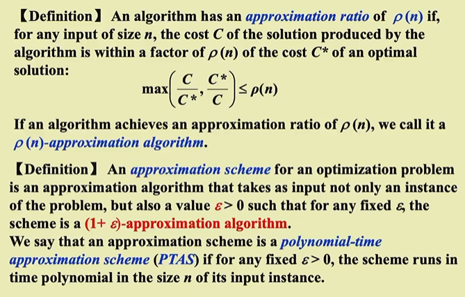

# Approximation
————Dealing with Hard problems
几种思路：
- N很小，及时时间复杂度很差也可以接受
- 在多项式时间里面解决一些special case
- 在多项式时间内找出一个近似最优解

## 1 Approximation Ratio
>[!note] Definition
>

 对于一个优化问题，假设 ( $\text{OPT}$) 是最优解的值，( $\text{ALG}$) 是近似算法给出的解的值。近似比定义为：

- 对于最小化问题：$[ \text{Approximation Ratio} = \frac{\text{ALG}}{\text{OPT}} ]$
- 对于最大化问题：$[ \text{Approximation Ratio} = \frac{\text{OPT}}{\text{ALG}} ]$

其中：
- ( $\text{ALG}$ ) 是近似算法的解的值。
- ( $\text{OPT}$) 是最优解的值。

近似比越接近1，表示近似算法的解越接近最优解。一个近似比为 ( $\rho(n)$ ) 的算法被称为 ( $\rho(n)$ )-近似算法。

 ***近似模式（Approximation Scheme)***:
 给定了一个问题的实例，还给定了一个常数$\varepsilon$,如果对于这个实例，我们可以得到一个近似比为$1+\varepsilon$的近似算法的话，我们就称其为近似模式。近似算法的事件复杂度可能和问题规模和近似比都成多项式的关系

***完全多项式时间的近似算法（PTAS）：***
和问题规模和近似比都成多项式的关系

## 2 集装箱问题（Approximate Bin Packing）

给定 N 个大小分别为 $S_1,S_2,S_N$ 的物品，满足 $\forall 1≤i≤N,0<S_i≤1$，并假设有若干个容量为 1 的桶。现在请你求出能够装下所有物品的最小桶数。