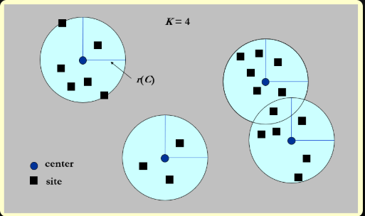

# Approximation
————Dealing with Hard problems
几种思路：
- N很小，及时时间复杂度很差也可以接受
- 在多项式时间里面解决一些special case
- 在多项式时间内找出一个近似最优解

## 1 Approximation Ratio
>[!note] Definition
>

 对于一个优化问题，假设 ( $\text{OPT}$) 是最优解的值，( $\text{ALG}$) 是近似算法给出的解的值。近似比定义为：

- 对于最小化问题：$[ \text{Approximation Ratio} = \frac{\text{ALG}}{\text{OPT}} ]$
- 对于最大化问题：$[ \text{Approximation Ratio} = \frac{\text{OPT}}{\text{ALG}} ]$

其中：
- ( $\text{ALG}$ ) 是近似算法的解的值。
- ( $\text{OPT}$) 是最优解的值。

近似比越接近1，表示近似算法的解越接近最优解。一个近似比为 ( $\rho(n)$ ) 的算法被称为 ( $\rho(n)$ )-近似算法。

最优解的**近似方案**(approximation scheme)指的是一类近似算法，它不仅能够将输入作为问题的实例，而且对于任意给定值$\varepsilon > 0$，它是一个$(1 + \varepsilon)$近似算法。

- **多项式时间近似方案**(polynomial-time approximation scheme, PTAS)：对于任意给定值$\varepsilon > 0$，当输入实例规模为$n$时，该方案能在多项式时间内完成计算，时间复杂度可记为$O(n^{f(\frac{1}{\varepsilon})})$
    - **满多项式时间近似方案**(fully polynomial-time approximation scheme, FPTAS)：在PTAS的基础上，要求该方案的运行时间关于$n$和$\varepsilon$都是多项式级的，时间复杂度可记为$O(n^{O(1)} (\dfrac{1}{\varepsilon})^{O(1)})$
    - **高效多项式时间近似方案**(efficient polynomial-time approximation scheme, **EPTAS**)：在 PTAS 的基础上，要求该方案的运行时间是与 εε 无关，关于 nn 的多项式时间，即时间复杂度为$O(n^{O(1)f(\frac{1}{\varepsilon})})$

!!! warning 
    如果A问题能被规约到B，且B问题有一个$\belta$-近似算法，那么并不能说明A一定也有一个$\belta$近似算法


## 2 集装箱问题（Approximate Bin Packing）

给定 N 个大小分别为 $S_1,S_2,S_N$ 的物品，满足 $\forall 1≤i≤N,0<S_i≤1$，并假设有若干个容量为 1 的桶。现在请你求出能够装下所有物品的最小桶数。

!!! note
    这是一个NPH问题，而其决策版本，给定K个桶，能否装下N个物品是一个NPC问题

### 2.1 Online Algorithms

- Next Fit : 按照输入顺序一个个方物品,$O(N)$;令M为装下这些物品的最优解桶数，那么该方法所得同属不超过2M-1
- First Fit : 对于当前物品，找到第一个现存的能够容得下它的桶，如果不存在这样的桶再添加新的桶。$O(NlogN)$,所得桶数不超过$\frac{17M}{10}$
- Best Fit: 和FF差不多

对于本题所有的近似算法，得到的近似解桶数至少是最优解的5/3倍

### 2.2 Offline Algorithms

先将物品按大小的非递增顺序排序，然后用FF or BF

FFD所得桶数不超过$\frac {11M}9+\frac 69$


## 3 Knapsack Problems

问题： 分数版本的0-1背包问题

按价值密度的降序挑选物品，直到背包被填满

### 3.1 0-1 version

**NPH**

同上的贪心法是一个2-近似算法

通常解法（dp）：

- 令$W_{i, p}$为物品1到物品$i$之间的最小质量，总价值为$p$
- 分类讨论：
    - 取物品$i$：$W_{i, p} = w_i + W_{i - 1, p - p_i}$
    - 不取物品$i$：$W_{i, p} = W_{i - 1, p}$
    - 不可能得到价值$p$：$W_{i, p} = \infty$
- 状态转移方程为：

Wi,p={∞i=0 Wi−1,ppi>p minWi−1,p,wi+Wi−1,p−piotherwise

- 其中，$i = 1, \dots, n, p = 1, \dots, np_{\text{max}}$，因此时间复杂度为$O(n^2 p_{\text{max}})$

## 4 K-center Problems

!!! question 问题描述

    给定$n$个地址$s_1, \dots, s_n$，在地图上选择$K$个中心点$c$，使任意地址到离它距离最近的中心点之间的距离中的最大值最小化。
    
    <div style="text-align: center">
        
    </div>  
    
    ---
    这么说可能不太好理解，下面给出符号化的定义：
    
    本问题提到的距离(distance)不同于图论中边的权重，实际上它就是数学上本来的意思：
    
    - 同一性(identity)：$dist(x, x) = 0$
    - 对称性(symmetry)：$dist(x, y) = dist(y, x)$
    - 三角不等式(triangle inequality)：$dist(x, y) \le dist(x, z) + dist(z, y)$
    
    令：
    
    - $dist(s_i, C) = \min\limits_{c \in C} \{dist(s_i, c)\}$，即$s_i$到最近中心点间的距离
    - $r(C) = \max\limits_{i} \{dist(s_i, C)\}$，即所有中心点中最大的最小覆盖半径
    
    目标：找到一组中心点集$C$，使得$r(C)$最小化，且保证$|C| = K$（$K$为常数）

### 4.1 Naive Greedy

- 让第一个中心点作为所有地址的中点
- 随后加入的中心点能够减少r(C)的值

但是在整个点集包括两个相隔很远的子集且K=2时，这种贪心策略就失效了


### 4.2 2-r Greedy

```
Centers Greedy-2r(Sites S[], int n, int K, double r) {
    Sites S`[] = S[];  // S` is the set of the remaining sites
    Centers C[] = NULL;
    while (S`[] != NULL) {
        Select any s form S` and add it to C;
        Delete all s` from S` that are at dist(s`, s) <= 2r;
    } // end-while
    if (|C| <= K) 
        return C;
    else
        ERROR("No set of K centers with covering radius at most r");
}
```


二分法不断减小r的值直到找到合适的r,时间复杂度$O(log r_{max})$

- 从输入点集中随机选取第一个点作为第一个中心，然后删除该点为中心，$2r$为半径的所有点
- 然后在剩余点中随机选择第二个中心，以此类推
- 如果该$r$值确实是最优解，那么这一算法在$K$步之内必然停止，且得到的解是最优解的2倍，即该算法是一个**2-近似算法**
- 定理：假设该算法选择的中心点数超过$K$，那么对于任意规模至多为$K$的中心点集$C^_$，覆盖半径为$r(C_) > r$

### 4.3 Smarter Greedy

这个贪心法还可以再改进！还是先给出伪代码：

```c
Centers Greedy-Kcenter(Sites S[], int n, int K) {
    Centers C[] = NULL;
    Select any s from S and add it to C;
    while (|C| < K) {
        Select s from S with maximum dist(s, C);
        Add s to C;
    }  // end-while
    return C;
}
```

- 这里的贪心法与上面的贪心法区别在于：后者是任意选取输入点集中的点作为中心点，而前者的策略是：
    
    - 第一个点还是任意取的
    - 之后选择离中心点集中的点尽可能远的点作为新的中心点，这样的选择方法更加聪明些
    - 循环$K$遍就结束循环了
- 定理：该算法返回包含规模为$K$的中心点集$C$，使得$r(C) \le 2r(C^_)$，其中$C^_$表示最优中心点集
    
- 很可惜的是，这种做法属于“换汤不换药”，本质上依旧是一个2-近似算法。
    

很遗憾的是，对于该问题（中间选择问题），不存在$\rho < 2$的近似算法

