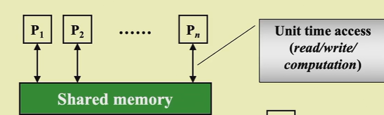

# Introduction
所谓**并行**(parallelism)，就是指每一步能够同时完成多个操作。可以分为以下几类并行方式：

- 机器并行（硬件层面）：包括了处理器并行、流水线、超长指令字 (VLIW) 等方法
- **并行算法**(parallel algorithms)（软件层面）：这就是本讲的主题，下面会详细介绍。并行算法中常用的模型有：
    - **并行随机访问机**(parallel random access machine, PRAM)
    - **工作 - 深度**(work-depth, WD)

# PRAM
图示：多个处理器访问同一块内存

{width="400"}
///caption
PRAM
///

- $P_1,\cdots,P_n$代表n个处理器，它们同时访问一块共享内存
- 每个处理器与共享内存之间的双向箭头表示单位时间内对内存的访问（包括读、写、计算等操作）

$$
\cdots
$$

!!! example "operations"

	=== "example1"
		2