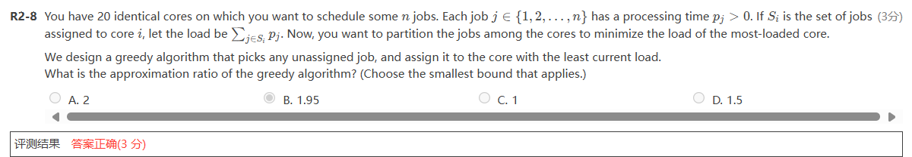

- skewed tree
	the binary tree in which each node has either one or no child is known as a ==skewed binary tree==.
# AVL Tree
## 1 Adelson-Velskii-Landis Trees

_Definition_: An empty binary tree is height balanced. If $T$ is a nonempty binary tree with $T_L$ and $T_R$ as its left and right subtree, then T is height balanced iff
- $T_L$ and $T_R$ are height balanced, and
- $|h_L-h_R|\le 1$ where $h_L$ and $h_R$ are the heights of $T_L$ and $T_R$, respectively

_Definition_: The balance factor BF(node)=$h_L-h_R$. In an AVL tree, $BF(node) = -1, 0, 1$

**trouble finder**: the first node that signals the trouble($|BF|(node) > 1$)

## 2 single rotation
LL rotation左子树顺时针旋转，RR rotation右子树逆时针旋转？

- If B has a left tree before rotation, we should make it the right subtree of A
- A is not expected to be the root of the whole tree, it can be the root of any subtree
## 3 double rotation 
**It can be considered as the combination of two single rotations**
LR rotation

## 4 The height of AVL tree
Let $n_h$ be the minimum number of the nodes in a height balanced tree of height $h$. 
$$n_h = n_{h-1} + n_{h-2}+1$$
so $n_h=F_{h+2}-1 \approx \frac 1{\sqrt 5}({\frac{1+\sqrt 5}2})^{h+2}-1$ 
# Splay Trees
**target**: Any M consecutive tree operations starting from an empty tree take at most $O(MlogN)$time

AVL tree is bound to be Splay tree

In splay tree, the amortized time is $O(logN)$摊还时间

不能让最坏的情况持续发生，如果某一节点是某一操作的最坏情况，那么下次它就得是最好的情况

**Idea**: After a node is accessed, it is pushed to the root by a series of AVL tree rotations
## 1 Splay操作
每访问一个节点x后都要强制将其旋转到根节点
- zig:在$p$是根节点时操作，Splay 树会根据 !$x$ 和  $z$间的边旋转。$zig$存在是用于处理奇偶校验文体，仅当$x$在splay操作开始时具有奇数深度时作为splay操作的最后一步执行
⚠️upload failed, check dev console

- zig-zig：同侧
- zig-zag：锯齿状
# analysis methods
## 1 Aggregate analysis
总量分析
## 2 Accounting method

==Theorem== The amortized time to splay a tree with root T at node X is at most $3(R(T)-R(X))+1=O(logN)$
$R(T)=\sum logS(i) (i\in T)$

# Red-Black Trees

```NULL``` is equal to ```NIL```, which is considered an external node with the color black
在红黑树中把每一个空节点看作一个```leaf node```
```internal nodes```: 除空节点外的所有节点

# Summary 1
**compare AVL trees with Red-Black Trees**

如果查询更多，AVL tree 快一点
如果插入和删除更多，红黑树快一点

# B+ Trees
B树是搜索树但不是二叉树 
**Definition** ： A B+ tree of order M  is a tree with the following structural properties:
- 根节点是叶子节点或者有2~M个子节点

## 1 Insertion
## 2 Analysis

# Inverted File Index
index用来存储给定单词在文章中的未知
**Inverted file** 存储指向出现的单词的指针

不仅包括在哪篇文章，还包括在文章中的那个位置

查找一句话时从频率最低的单词开始
## 1 Index Generator

### 1.1 Token Analyzer & Stop Filter
#### 1.1.1 Word Stemming词干提取
#### 1.1.2 Stop Words
一些在文章中经常出现的单词，不用去index，在处理之前要先删除掉
### 1.2 Vocabulary Scanner

### 1.3 Memory Management

## 2 Distributed indexing
Each node contains index of a subset of collection

## 3 Dynamic indexing

## 4 Compression
## 5 Thredholding
阈值
只解决一部分问题
- Document：只接受权值最高的x个文件
- Query
## 6 Measures for a search engine
- index的速度
- search的速度
- expressiveness of query language
	- 表达复杂信息的能力
	- 处理复杂
	- query的速度
- data 检索能力评估
- information 检索信息能力
### 6.1 measure the relevancy
- A benchmark document collection
- A benchmark suite of queries
- A binary assessment of either relevant or irrelevant for each query-doc pair

**How to improve the relevancy of search results**
==1==
# Leftist Heaps and Skew Heaps
## 1 Leftist Heaps
在线性时间内优化合并
普通堆的合并，$\Theta(N)$
***Leftist Heap:***
-  Order Property - the same
- Structure Property - binary tree, but unbalanced
***null path length***:
任何节点的$Npl(X)$是从X到任意一个没有两个子节点的节点的最短路径，Npl(NULL)=-1
从底至上计算
$$Npl(X)=min\{Npl(C)+1~for~all~C~as~children~of~X\}
$$


# Skew Heap
>  想要左偏堆改变能够进行自下而上维护，就要改变甚至放弃它的左偏的性质的严格性

skew heap 的合并与左偏堆的合并十分类似，知识此时无条件地交换左右子树，不论左偏性质如何变化，我们都会


# Binomial Queue
## 1 概念
二项队列本质上是一系列二项树的集合。
>**二项树**
>二项树满足堆的性质，即parent节点的值小于（大于）child的值

## 2 操作
### 2.1 合并
二项队列的合并可以看作两个二进制数的相加
### 2.2 单点插入
视为合并只有一个节点
### 2.3 查询队首
二项队列的队首就是整个队列的最小值（最大值），是这若干个（$O(logN)$个）二项树的根中最小（最大）的那个，所以其时间复杂度为$O(logN)$
### 2.4 队首出队
队首出队首先要找到队首，这件事我们在**[#查询队首](https://note.isshikih.top/cour_note/D2CX_AdvancedDataStructure/Lec05/#%E6%9F%A5%E8%AF%A2%E9%98%9F%E9%A6%96)**已经讨论过了。

找到队首后，我们将其从二项队列中移除，我们知道，队首必然是某个二项树的根，所以删掉这个队首以后，就会产生 kk 个新的子树。

而让我们**回顾二项树的合并过程**，可以发现，根的所有儿子都是一个完整的 kk 阶二项树合并过来的，所以当我们删掉这个根，产生的所有子树都是二项树。

因此我们联想到，将队首出队问题转化为合并二项队列的问题——假设 T的队首是 Bk的根，则队首出队可以转化为求解 merge(```T−Bk,Bk.root.children```)的问题。



$$\rho = \frac{2m-1}{m}$$
