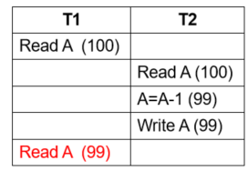
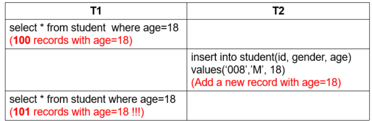
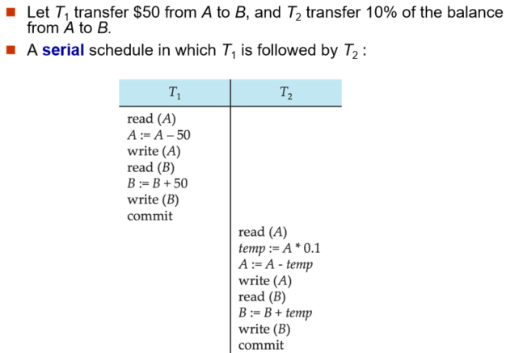
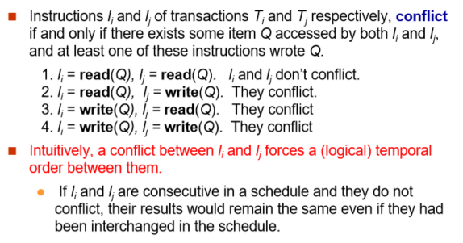
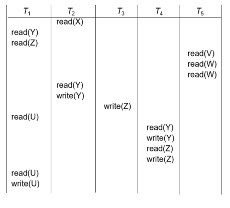
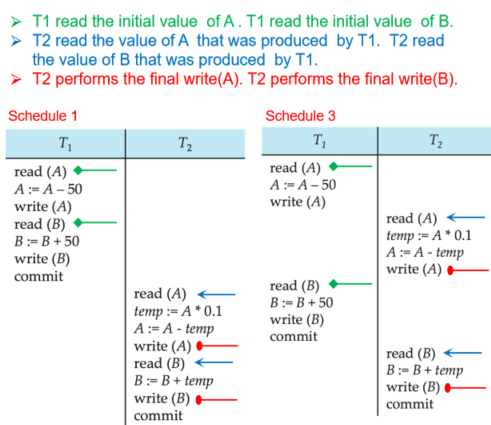
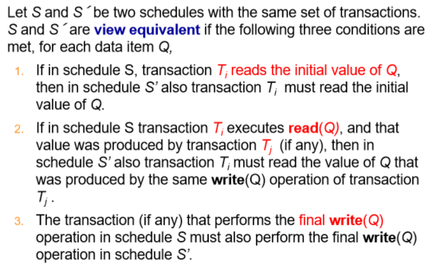
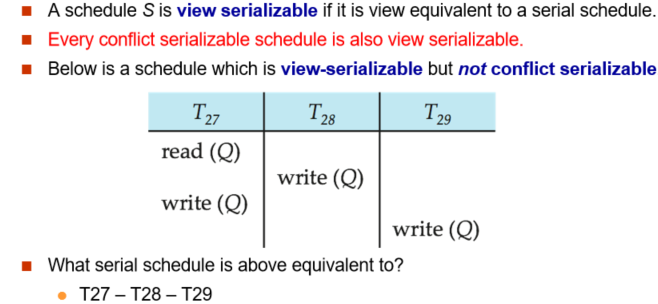
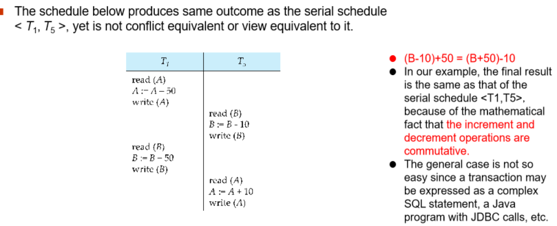
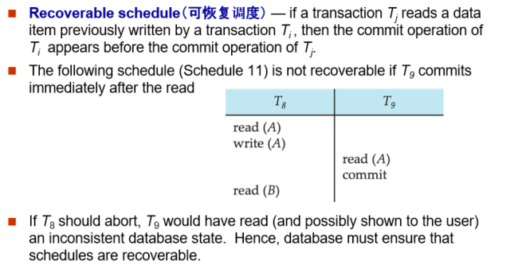

# Transactions

??? Abstract
    * Transaction Concept
    * A Simple Transaction Model
    * Concurrent Executions
    * Serializability
    * Recoverability
    * Transaction Isolation Levels 
    * Transaction Definition in SQL

## 1 Transaction Concept

A **transaction** is a unit of program execution that accesses and  possibly updates various data items.  
一段原子性的操作  

***e.g.*** transaction to transfer $50 from account A to account B  
``` SQL
update  account  set  balance=balance-50  where account_number=A;
update  account  set  balance=balance+50  where account_number=B;
commit;
```


Two main issues to deal with:
- Failures of various kinds, 例如硬件故障和系统崩溃
- 多种事务同时发生执行
### 1.1 ACID Properties

* **Atomicity（原子性）**  
全有或全无  
由数据库恢复功能保证
* **Consistency（一致性）**  
保证数据库内的内容正确性，与实际业务相符。如转账是一个人余额减少一个人增加。  
consistency 与开发人员有关系（事务设计是否合理）
* **Isolation（隔离性）**  
事务并发执行，但是相互隔离，好像是串行执行一样。  
由数据库的并发执行来实现
* **Durability（持久性）**  
事务提交后被缓存，掉电不能失去 buffer 里的内容。  

## 2 A Simple Transaction Model

这个模型中，把事务对数据库的修改简化为读写两种操作。  
Transactions access data using two operations:  

* **read(X)**, which transfers the data item X from the database to a variable, also called X， in  a work area  in  main  memory  belonging to the transaction that  executed the read  operation.  

* **write(X)**, which transfers the value in the variable X  in the main memory work area of the transaction that executed the write operation to the datat item X in database.   


在这个简单的模型中，我们不考虑数据读到工作区域后发生了什么操作，只考虑读写。

!!! Example "Example of Fund Transfer"
    

    * Atomicity requirement   
    如果执行结束之后出现了问题，数据库应该要撤销之前的操作
    * Durability requirement  
    如果事务结束了，我们就把更新同步
    * Consistency requirement  
        * Explicitly（显式） specified integrity constraints ***e.g.*** primary keys , foreign keys  
        数据库把这个定义放在内部，会自己维护
        * Implicit （隐式） integrity constraints ***e.g.*** sum of balances of all accounts minus sum of loan amounts must equal value of cash-in-hand 不在数据库中定义，但是在事务的操作来定义
    * Isolation requirement  
    在 step 3 6 之间，另一个事务可以访问这个被部分更新的数据库，A+B 会小于正确答案。这是因为破坏了隔离性。

### 2.1 Transaction State

* **Active** – the initial state; the transaction stays in this state while it is executing,事务执行中的状态
* **Partially committed** – after the final statement has been executed.  
语句执行完了，准备提交。能否提交取决于具体的执行。
* **Failed** -- after the discovery that normal execution can no longer proceed.  
不能正常提交。或者是执行过程中发现问题。
* **Aborted** – after the transaction has been rolled back and the database restored to its state prior to the start of the transaction.  Two options after it has been aborted:
    * restart the transaction
    * kill the transaction
* **Committed** – after successful completion.


## 3 Concurrent Executions

* increased processor and disk utilization 提高CPU和磁盘的利用率
* reduced average response time 降低平均响应时间

事务是并发执行的，如果不加以控制可能会有以下问题  
Anomalies in Concurrent Executions

* **Lost Update（丢失修改）** 

    ??? Example "Lost Update Example"
        

        一个人订票后，另一个人读到这里第一个人还没有修改的余量。导致丢失了一次修改。

* **Dirty Read（读脏数据）**
    
    ??? Example "Dirty Read"
        

        一个人订票后，另一个人读数据后，但是第一个人放弃了，但是第二个人仍然是用的脏数据。
        读了另外一个事务正在修改的数据

* **Unrepeatable Read （不可重复读）**

    ??? Example "Unrepeatable Read"
        

        Isolation 要求我们读到的数据应该是一样的。不符合隔离性。

* **Phantom Problem（幽灵问题）**
    
    ??? Example "Phantom Problem"
        

        unrepeatable 是针对已经存在的数据，但是数据的值不同. Phantom 是指数据数量会变多/减少。比如插入的数据本来不存在

### 3.1 Schedules

**Schedule 调度** – a sequences of instructions that specify the chronological order in which instructions of concurrent transactions are executed.  
事务的执顺序，可以是交叉执行。

??? Example "Schedule Example"
    * 串行调度  
    串行调度一定是满足隔离性的
        

    * 非串行调度，但等价于上面的串行调度
        <div align=center>  </div>

        这里 T2 的 readA 和 T1 的 readB 可以调换时间次序，就得到了刚刚的串行调度。  
        下面这样的调度就不等价，破坏了隔离性。
        <div align=center>  </div>

### 3.2 Serializability 可串行化

这里讨论的可串行化只是从隔离的角度来讨论的。

A (possibly concurrent) schedule is **serializable** if it is equivalent to a serial schedule.   
等价于一个串行调度

* conflict serializability(冲突可串行化)，same order of the conflict operation pairs
* view serializability(视图可串行化)
    - same data content of the corresponding read(Q) operations
    - same data content(Q) of the write(Q) operations

串行调度一定是可串行化的，交错执行不一定。

#### 3.2.1 Conflict Serializability



一对冲突的操作，决定了串行化的顺序。
* **conflicting operations** – two operations that belong to different transactions and access the same data item, and at least one of them is a write operation.  
    * 读和写冲突
    * 写和读冲突
    * 写和写冲突

注意这里针对的是同一个数据项 Q. 

a conflict between $l_i$ and $l_j$ forces a (logical) temporal order between them.   

If a schedule S can be transformed into a schedule S´  by a series of swaps of non-conflicting instructions, we say that S and S´ are **conflict equivalent**.  
交换不冲突的指令，得到的是冲突等价的调度。  
We say that a schedule S is **conflict serializable** if it is conflict equivalent to a serial schedule.  
冲突等价于一个串行调度，那么这个调度是可串行的。

#### 3.2.2 Testing for Serializability

Consider some schedule of a set of transactions $T_1, T_2, \ldots, T_n$  
**Precedence graph（前驱图）** — a directed graph where the vertices are the transactions (names).  

如果 T1 要在 T2 前面（即找出所有冲突的操作对，找到一条 T1 的指令要求比 T2 中的一条指令先执行），那我们画一条从 T1->T2 的边。  
如果找到环，说明是不可串行化的。否则可以利用拓扑排序。

!!! Example
    
    T1 的 readY 和 T2 的 writeY 冲突，所以要画一条边，如此。  
    最后有 10 种调度方式。

只用于理论研究，数据库内不会这样实现。

#### 3.2.3 View Serializability

!!! Example
    
    初始值由同一个事务读到。中间结果是由同一个事务得到再由另一个事务读出。最终写回数据库也是由同一个事务写。



A schedule S is **view serializable** if it is view equivalent to a serial schedule.

**Every conflict serializable schedule is also view serializable.**   

Below is a schedule which is view-serializable but not conflict serializable.   
冲突可串行化的都是视图可串行化的，反之不一定。

??? Example
    
    等价于 T27-28-29. (都是 27 读初值，中间没有其他读，最后是 29 写)

#### 3.2.4 Other Notions of Serializability

有的调度既不是冲突可串行化又不是视图可串行化，但它是可串行化的。

!!! Example
    
    等价于 T1-T5(T1先做，T2后做)
    加减操作是可结合的，这里需要了解事务里具体是什么操作。但我们的简单模型对此不加以区分。

## 4 Recoverable Schedules

**Recoverable schedule(可恢复调度)** — if a transaction $T_j$ reads a data item previously written by a transaction $T_i$ , then the commit operation of $T_i$  appears before the commit operation of $T_j$.

!!! Example
    The following schedule (Schedule 11) is not recoverable if T9 commits immediately after the read.  
    可能会读脏数据
        
    如果 T8 后续回滚, 但 T9 已经基于脏数据做了后续操作，而且已经提交了，不可恢复。  

如果一个事务读了另一个事务的脏数据，提交次序需要有约束，要在被读事务的后面提交。

### 4.1 Cascading Rollbacks

**Cascading rollback** – a single transaction failure leads to a series of transaction rollbacks.  Consider the following schedule where none of the transactions has yet committed (so the schedule is recoverable)

!!! Example
    If T10 fails, T11 and T12 must also be rolled back.
    
要有级联回滚的恢复。  
Can lead to the undoing of a significant amount of work.  
我们更希望用非级联的恢复，否则开销太大。

## 5 Transaction Isolation Levels

A database must provide a mechanism that will ensure that all possible schedules are 

* either *conflict or view serializable*, and   
保证可串行的
* are *recoverable* and preferably cascadeless  
保证可恢复的（最好是非级联）

数据库里提供一种协议，每个事务要遵从协议，遵从协议下产生的调度一定是可串行、可恢复的。  
这是完全的隔离，代价比较高。

In SQL `set transaction isolation level serializable`
In JDBC `connection.setTransactionIsolation(Connection.TRANSACTION_SERIALIZABLE)`
我们可以设置数据库的隔离级别。

* **Serializable** — default  
四种问题都要避免，代价最高。
* **Repeatable read** — only committed records to be read, repeated reads of same record must return same value.  However, a transaction may not be serializable – it may find some records inserted by a transaction but not find others.  
不管幽灵问题。
* **Read committed** — only committed records can be read, but successive reads of record may return different (but committed) values.  
保证不读脏数据。
* **Read uncommitted** — even uncommitted records may be read.  
最低的隔离级别，有些数据库只是做统计任务。

Lower degrees of consistency useful for gathering approximate information about the database 


!!! example 12306
    - Transaction Boundaries: 能订多张票还是不能订多张票
    - 执行顺序

## 6 Concurrency Control Protocols

锁协议是用来进行并发控制的协议，又两种锁：排他锁和共享锁。

如果当前数据项获得了排他锁，则当前指令既可以对数据项进行读操作也可以进行写操作

如果当前数据项获得了共享锁，则当前指令只能对数据项进行读操作，不能进行写操作

如果申请的是共享锁，其他事务仍然可以申请共享锁。但是如果申请的是排他锁，其他所有事务不能申请任何锁 

* Lock-Based Protocols
    * Lock on whole database vs lock on items  
    读之前要访问一个共享锁，写之前要访问一个排他锁，冲突了就要等待。通过锁就规定了一个执行的次序。
    * How long to hold lock?
    * Shared vs exclusive locks
* Timestamp-Based  Protocols
    * Transaction timestamp assigned ***e.g.*** when a transaction begins   
    事务执行时分配一个时间戳。执行次序按照时间戳排序。
    * Data items store two timestamps
        * Read timestamp
        * Write timestamp
    * Timestamps are used to detect out of order accesses
* Validation-Based  Protocols
    * Optimistic concurrency control 
    * Low rate of conflicts among transactions
    * Each transaction must go through 3 phases:  
    Read phase -> Validation phase -> Write phase  
        事务提交的时候先去验证是否有冲突，如果没有冲突就提交，如果冲突就考虑放弃某个。