# Concurrency Control

??? Abstract
    * Lock-Based Protocols（基于锁的协议）
    * Deadlock Handling （死锁处理）
    * Multiple Granularity （多粒度）
    * Insert and Delete Operations
    * Multiversion Schemes （多版本机制）
    * Timestamp-Based Protocols （基于时间戳的协议）
    * Validation-Based Protocols （基于有效性的协议）

## 1 Lock-Based Protocols

A lock is a mechanism to control concurrent access to a data item

* ***exclusive(X)***排他锁  
Data item can be both _read_ as well as _written_. X-lock is requested using **lock-X** instruction.
* ***shared(X)***共享锁
Data item can only be _read_. S-lock is requested using **lock-S** instruction.

要写一个数据，先申请获得 X 锁；要读一个数据，先申请获得 S 锁。  
访问结束后释放这个锁。

访问数据之前必须获得对应的锁，否则需要等待。

**lock-compatibility matrix:**
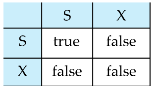

A transaction may be grantd a lock on an item if  the requested lock is compatible with locks alreaady held onn the item by other transactions.

如果请求的锁与其他事务已持有的锁兼容，则可以授予事务对某个数据项的锁。

Any number of transactions can hold shared locks on the same data item.

But is any transaction holds an exlusive on the item no other transaction may hold any lock on the item.

如果一个事务持有对数据项的排他锁，则没有其他事务可以在该数据项上持有任何锁。

if a lock cannot be granted , the requesting transaction is made to wait until all incompatible locks held by other transactions have been released. The lock is then granted.

如果锁无法授予，则请求的事务将被迫等待，直到其他事务释放所有不兼容的锁。然后授予锁。

A locking protocol is a set of rules following by all transactions while requesting and releasing locks.

Locking protocols enforce serializability by restricting the set of possible schedules.

**pitfalls of lock-based protocols:**

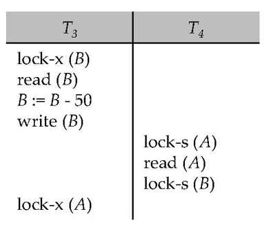

T3或T4都不能进行工作
- `lock-S(B)`导致T4必须等T3释放锁，`lock-x(A)`导致T3必须等T4释放锁

这种情况叫做死锁（deadlock），必须回滚使锁释放

Starvation: 

- A transaction may be waiting for  an X-lcok on an item, while a sequence of other transactions request and are granted an S-lock on the same item .
- The same transaction is repeatedly rolled back due to deadlocks
- Concurrency control manager can be designed to prevent starvation.


### 1.1 The Two-Phase Locking Protocol

事务的加锁和减锁分为两个阶段。  

* Phase 1: Growing Phase (增长阶段)
    * transaction may obtain locks 
    * transaction may not release locks
    - 只能申请锁不能释放锁
* Phase 2: Shrinking Phase(缩减阶段)
    * transaction may release locks
    * transaction may not obtain locks  
    一个事务一旦开始释放锁，就不能再加锁了。

事务两个阶段的分界线(lock point), 即获得了最后一个锁（完成获得这个动作）的时间点。  
这样每个事务都有一个 lock point, 按照这个时间排序即可得到串行化的执行顺序。

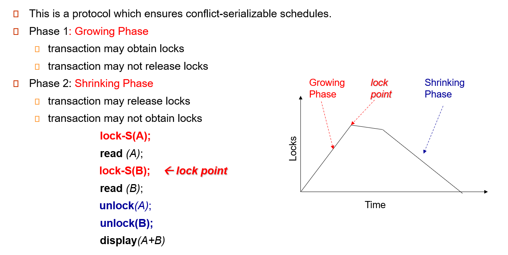

??? Example
    ```
    lock-S(A);
    read (A);
    lock-S(B); <- lock point
    read(B)；
    unlock(A);
    unlock(B);
    display(A+B);
    ```

<u>**Two-Phase Locking Protocol assures serializability.**</u>  

It can be proved that the transactions can be serialized in the order of their lock points. (在lockpoint 处进行最后的上锁)
可以按 lock points 串行化，但不是只能按照这么串行化。


上面基本的两阶段封锁协议无法保证事务的可恢复性（不能读脏数据）。

Extensions to basic two-phase locking（基本两阶段封锁） needed to ensure recoverability of freedom from cascading roll-back

* **Strict two-phase locking（严格两阶段封锁）**: a transaction must hold all its exclusive locks till it commits/aborts.  
Ensures recoverability and avoids cascading roll-backs.  
S 锁可以用完就放，但 X 锁必须到提交的时候才能释放（这样别人就不能访问了，无法读脏数据）。代价是降低并发度。
* **Rigorous two-phase locking（强两阶段封锁）**: a transaction must hold all locks till commit/abort.   
Transactions can be serialized in the order in which they commit.  
所有的锁都要等到提交才能释放。

<u>**Two-phase locking is not a necessary condition for serializability.**</u>  
两阶段封锁协议不是可串行化的必要条件。（只要访问的item全是独立的）


??? Example
    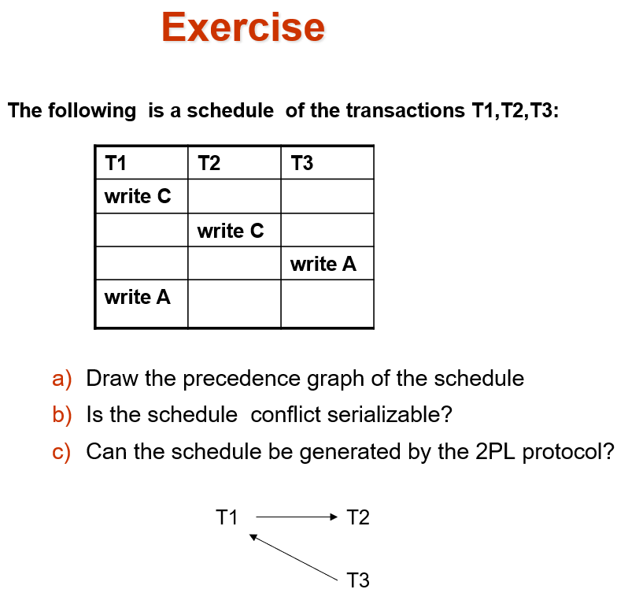
    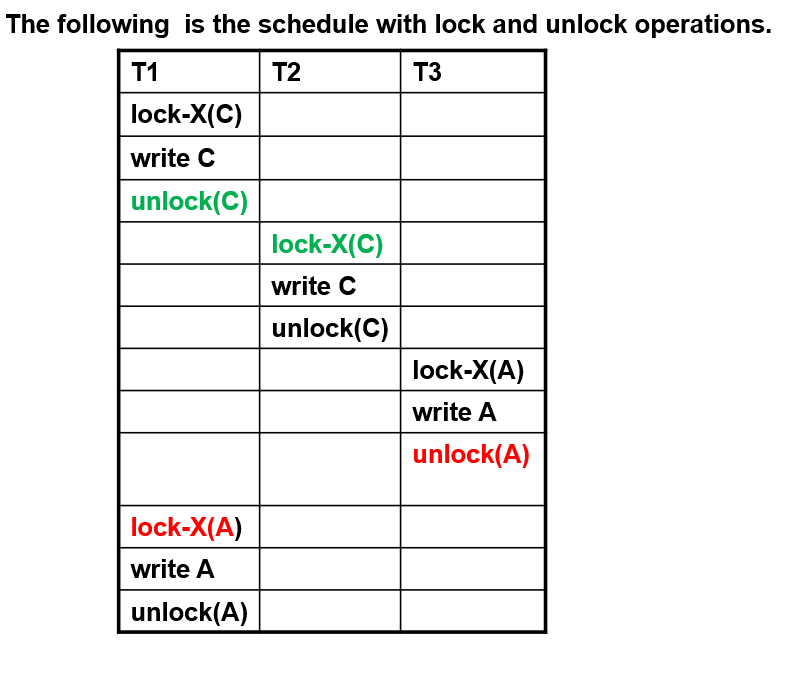

    这里放锁了之后还获得锁了，违背了两阶段封锁协议。  
    两个冲突的操作之间肯定有一组unlock和lock操作。
    所以不遵从两阶段封锁协议，也可以获得冲突可串行的调度。

### 1.2 2PL - Proof 

* Proof by Contradiction  
如果有 Ti->Tj 的有向边，那 Ti 的 lockpoint 一定小于 Tj.  
Ti->Tj 肯定有一个冲突的访问（对同一个数据）那 Tj 在获得锁的时候 Ti 已经放锁了，得证。
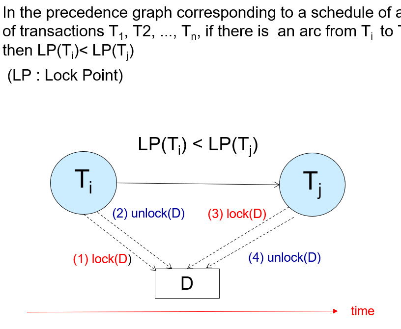

* Proof by Induction  
只需证明: Lock point 最小的事务，可以无障碍地交换到调度最前。  
假如有事务拦住他了，证明这是不可能发生的。（与 lockpoint 最小矛盾）
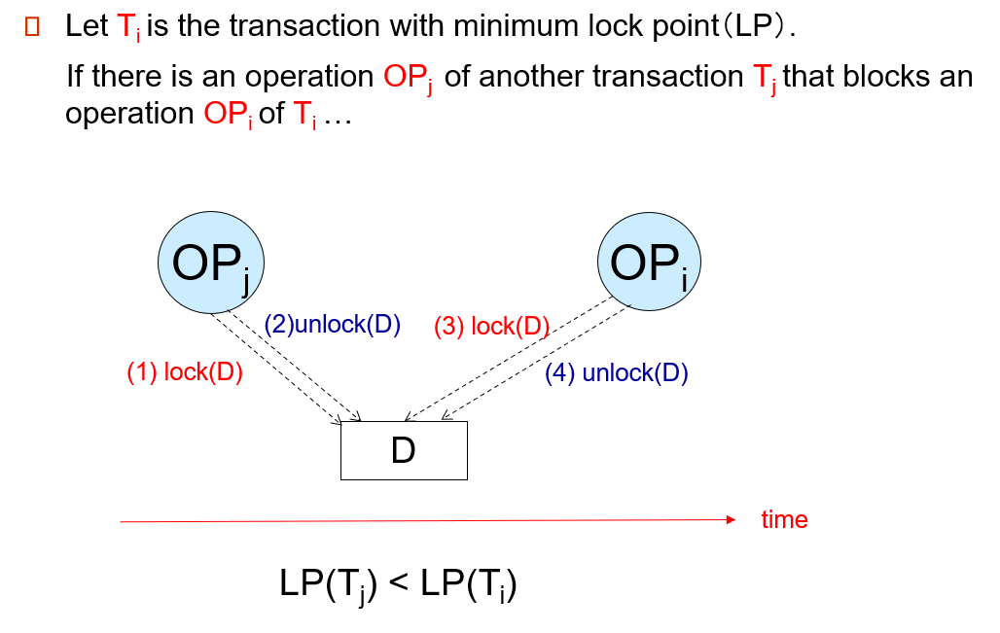


### 1.3 Lock Conversions

通常是先读后修改。但我们不能先得 S 锁再释放后得 X 锁（违背了两阶段协议），也不能直接用 X 锁（降低并发度）。

Two-phase locking with lock conversions:

* First Phase:        
    * can acquire a lock-S or lock-X on a data item
    * can convert a lock-S to a lock-X (*lock-upgrade*)
* Second Phase:
    * can release a lock-S or lock-X
    * can convert a lock-X to a lock-S (*lock-downgrade*)

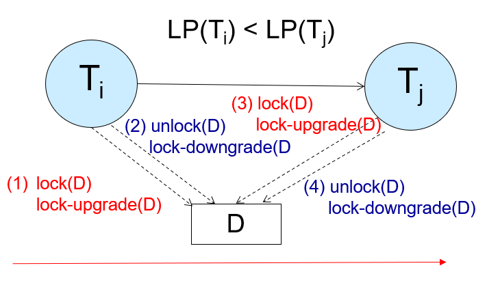

lockpoint 由放锁或者降级决定

**This protocol assures serializability.**

申请哪个锁是由数据库内部管理决定，不是由程序员显示调用。（自动加锁）
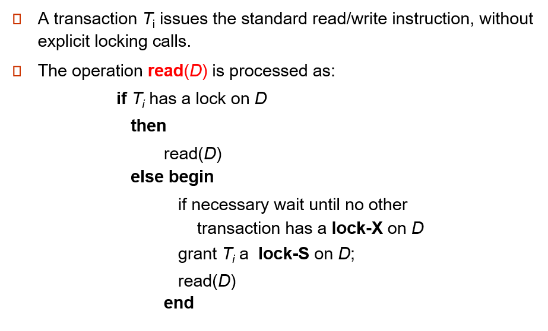
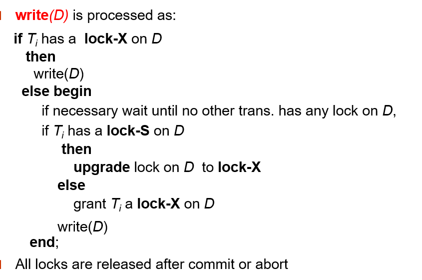

如果已经有锁了，直接读；否则申请读锁。

All locks are released after commit or abort


## 2 Implementation of Locking

A **lock manager** can be implemented as a separate process to which transactions send lock and unlock requests. 一个独立的进程管理一个独立的数据结构

The lock manager replies to a lock request by sending a lock grant message

发出请求的事务等到请求被回复

The  lock manage maintains a data-structure called a lock table to record granted locks and pending requests.

The lock table 通常由内存中的一个哈希表实现，以被锁的 item 的名字作为索引

### 2.1 Lock Table

Lock table records granted locks and waiting requests.  
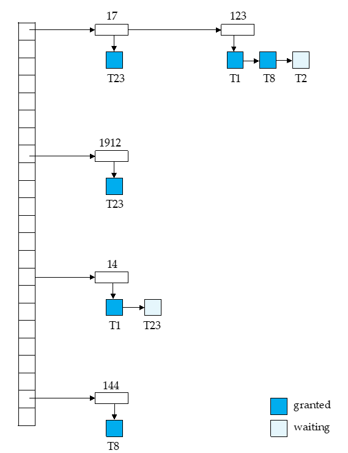

每个记录的 id 可以放进哈希表。  
如这里记录 123, T1、T8 获得了 S 锁，但 T2 在等待获得 X 锁。  

T1: lock-X(D) 通过 D 的 id 找到哈希表上的项，在对应项上增加。根据是否相容决定是获得锁还是等待。  
unlock 类似，先找到对应的数据，拿掉对应的项。同时看后续的项是否可以获得锁。

如果一个事务 commit, 需要放掉所有的锁，我们需要去找。因此我们还需要一个事务的表，标明每个事务所用的锁。

if transaction aborts, all waiting or granted requests of the transactioin are deleted.

lock manager may keep a  list of locks held by each transaction, to implement this efficiently.

### 2.2 Deadlock Handling

System is **deadlocked** if there is a set of transactions such that every transaction in the set is waiting for another transaction in the set.

都在互相等对方完成

<u>**Two-phase locking does not ensure freedom from deadlocks.**</u>
<div align = center></div>


Deadlock prevention protocols ensure that the system will never enter into a deadlock state. Some prevention strategies:

* Require that each transaction locks all its data items before it begins execution (predeclaration).  
一个事务执行前一次性获得所有锁。
* **Impose partial ordering** of all data items and require that a transaction can lock data items only in the order specified by the partial order (graph-based protocol).  
对数据访问规定一种次序。比如规定必须先拿咖啡再拿咖啡伴侣。  
***e.g.*** T1: A-50, B+50. T2: B-10, A+10. 我们可以把第二个事务调换顺序，变为 A+10, B-10. 这样按照 partial order 能降低死锁概率。
* **Timeout-Based Schemes**:  
    * *a transaction waits for a lock only for a specified amount of time*. After that, the wait times out and the transaction is rolled back.   
    等待一会，如果还是等不到就放弃。
    * thus deadlocks are not possible.  
    * simple to implement; but starvation is possible. Also difficult to determine good value of the timeout interval.  
    时长不好规定。但可能有事务老是申请不到自己的锁。
- Following Schemes use timestamps for the sake of deadlock prevention alone:
    * **Wait-Die**:  (non-preemptive)
        * Older transaction may wait for younger transaction to release its lock. 旧的事务等待新的事务释放锁。新事务永远不等待老的。 
        * Younger transaction is aborted (killed) if it requests a lock held by an older transaction.不允许这种情况的存在  
        * Older transaction is not aborted.  
        * Older transactions are given priority over younger transactions.  
    * **Wound-Wait**:  (preemptive) 只有younger事务等待older,否则直接夺取younger的锁(强制younger 回滚)
        * Younger transaction may wait for older transaction to release its lock.  
        * Older transaction is aborted (wounded) if it requests a lock held by a younger transaction.  
        * Younger transaction is not aborted.  
        * Younger transactions are given priority over older transactions.

### 2.3 Deadlock Detection

定期检查数据库内是否有死锁，如果有就选择一个事务将其回滚。  

**wait-for graph**
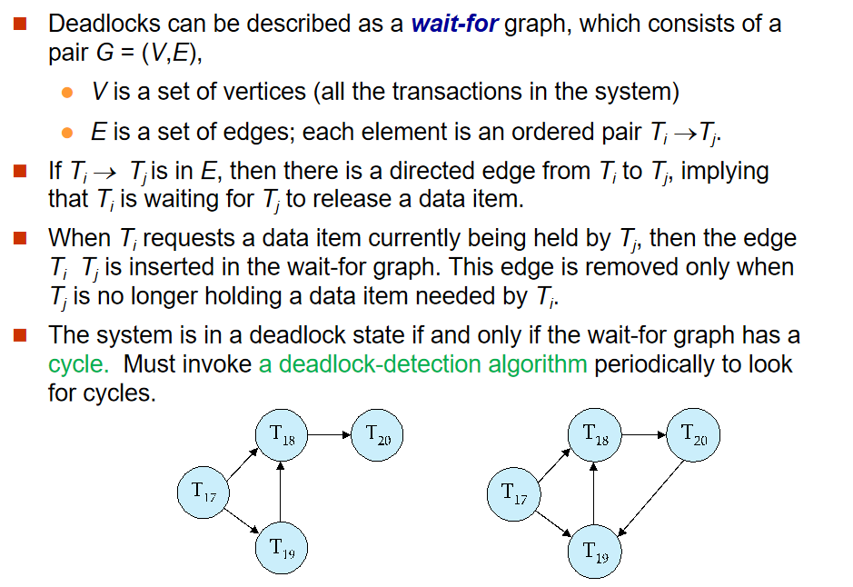

这里的箭头表示在等待锁。如 T17->T18 表示 T17 在等待 T18 的锁。  
如果形成了环，就说明出现了死锁。

通过刚刚的 Lock Table, 我们可以得到等待关系。（后面的 waited 等待前面的 granted）

When deadlock is  detected :

* Some transaction will have to rolled back (made a **victim**) to break deadlock.  Select that transaction as victim that will incur minimum cost.  

* Rollback -- determine how far to roll back transaction
    * Total rollback: Abort the transaction and then restart it.
    * More effective to roll back transaction only as far as necessary to break deadlock.只要能够打破死锁就足够了
    Starvation happens if same transaction is always chosen as victim. Include the number of rollbacks in the cost factor to avoid starvation

??? Example
    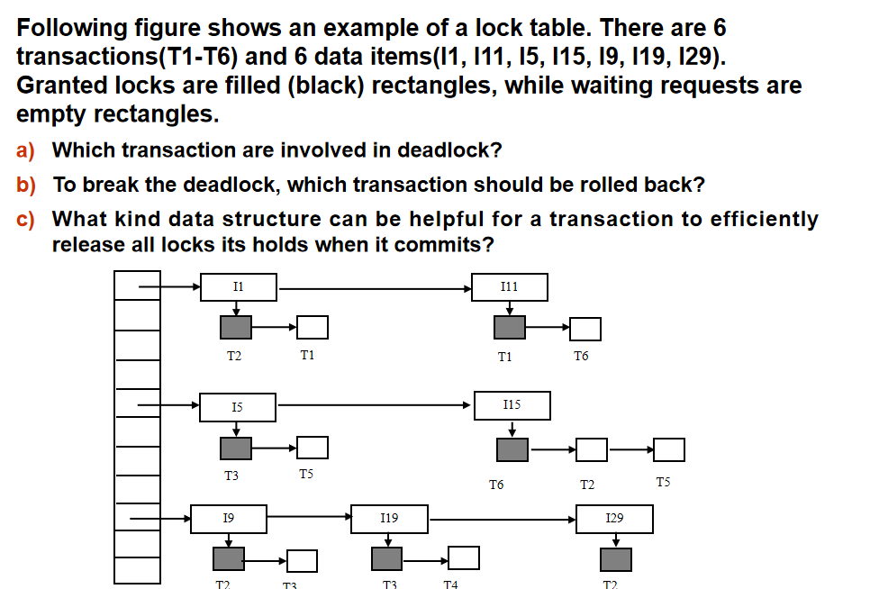
    T1 等 T2, T2 等 T6, T6 等 T1.(注意这里 T5 是等待 T6 而不是 T2)

### 2.4 Graph-Based Protocols

假设我们知道数据是按偏序访问的，可以有更高级的协议。  
数据按照某种偏序关系访问。
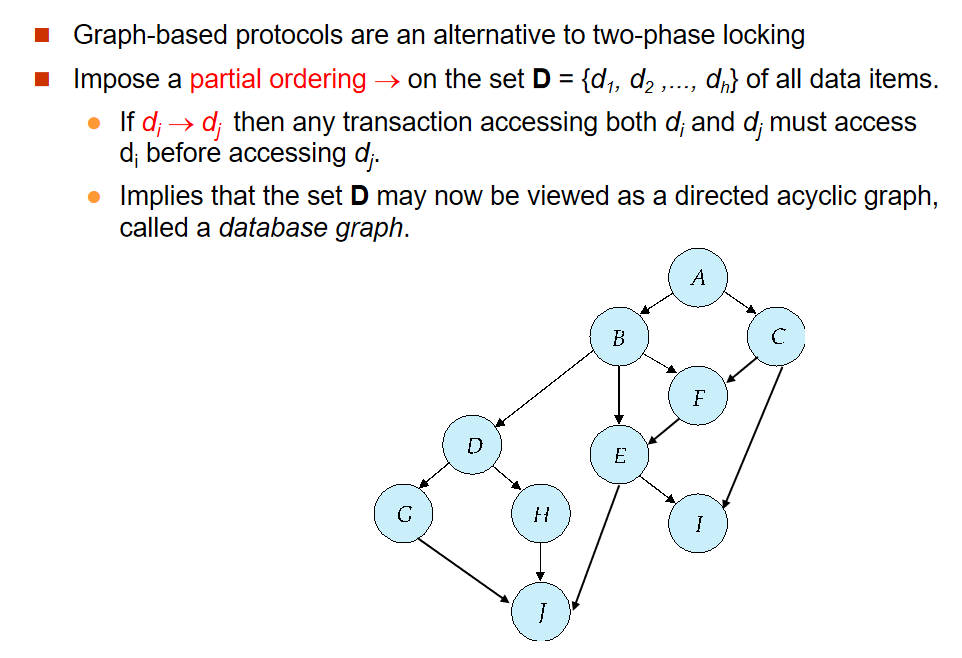

The ***tree-protocol*** is a simple kind of graph protocol. 

* **Only exclusive locks** are allowed.  只有排他锁
* The first lock by Ti may be on any data item. Subsequently, a data Q can be locked by Ti only if the parent of Q is currently locked by Ti.  
第一个锁可以放任意地方，后面的锁只能在父节点锁住时才能往下锁。
* Data items may be unlocked at any time.  
* A data item that has been locked and unlocked by Ti  cannot subsequently be relocked by Ti   
放了之后不能再加锁了。  

??? Example
    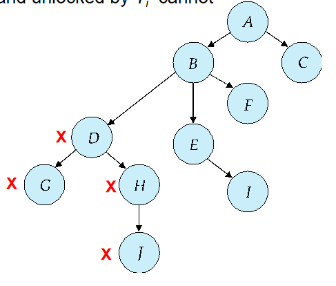
    比如这里我们先锁 D, 随后锁 G, 放掉, 锁 H, 这时 D 已经没用了可以放掉。随后我们锁 J, H 也就没用了也可以放掉。最后放掉  J. 

<u>**The tree protocol ensures conflict serializability as well as freedom from deadlock.**</u> 

* Advantages
    * Unlocking may occur earlier in the tree-locking protocol than in the two-phase locking protocol.  
    shorter waiting times, and increase in concurrency  
    锁可以更早释放，不用等待第二阶段。用完就可以放，提高了并发度。
    * protocol is **deadlock-free**  
    no rollbacks are required
* Disadvantages
    * Protocol does *not guarantee recoverability* or cascade freedom  
    Need to introduce commit dependencies to ensure recoverability  
    早放锁，意味着可能会读脏数据，不可恢复。这就对 commit 顺序有要求。
    * Transactions may have to *lock more data items* than needed.
        * increased locking overhead, and additional waiting time  
        比如刚刚的图中，我们访问 G, J, 需要从 D 开始访问。会锁上更多数据。  
        * potential decrease in concurrency
        降低了并发度
    * 必须知道数据有偏序关系，才能构建树。

## 3 Multiple Granularity

可以锁在记录上(如 `update table set ...;`)，也可以锁在整个表上(如 `select * from table;`)。  

Granularity of locking (level in tree where locking is done):

* **fine granularity（细粒度）** (lower in tree): high concurrency, high locking overhead（锁开销）
* **coarse granularity（粗粒度）** (higher in tree): low locking overhead, low concurrency，需要更多类型的锁

S锁和X锁可以加在不同的粒度上,但是话不够，需要引入一些意向锁

如果有事务希望在细粒度上加S锁，必须在粗粒度上加意向锁。
 
??? Example "Example of Granularity Hierarchy"
    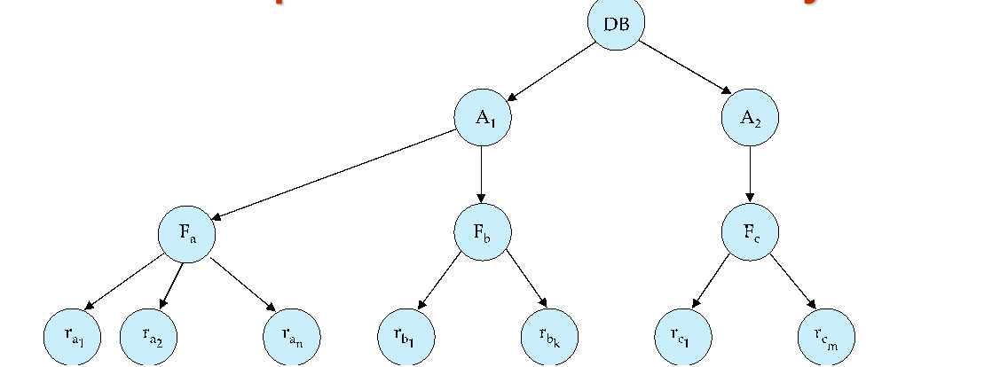

    The levels, starting from the coarsest (top) level are
    
    * database
    * area 
    * File(table)
    * record   

### 3.1 Intention Lock Modes

记录和表上都可以加 S/X 锁。但是当事务涉及到多个粒度，如何判断是否冲突，如一个表的 S 锁和一个记录的 X 锁是冲突的。  
我们引入了其他锁，意向锁(IS, IX, SIX)

* 如果一个事务要给一个记录加 S 锁，那也要在表上加 IS 锁。（意向共享锁）
* 如果一个事务要给一个记录加 X 锁，那也要在表上加 IX 锁。（意向排他锁）
* SIX 锁是 S 和 IX 锁的结合。要读整个表，但可能对其中某些记录进行修改。（共享意向排他）  

这样当我们想向一个表上 S 锁时，发现表上有 IX 锁，这样我们很快就发现了冲突，需要等待。  
IS 和 IX 是不冲突的。在表上是不冲突的，可能在记录上冲突（即对一个记录又读又写，冲突发生在记录层面而非表）。


* **intention-shared (IS)**: indicates explicit locking at a lower level of the tree but only with shared locks.  
在下面会加 S 锁。
* **intention-exclusive (IX)**: indicates explicit locking at a lower level with exclusive or shared locks  
在下面会加 X 锁。
* **shared and intention-exclusive (SIX)**: the subtree rooted by that node is locked explicitly in shared mode and explicit locking is being done at a lower level with exclusive-mode locks.

要符合相容矩阵。从最粗的粒度开始访问。要加锁的时候注意，对父亲的锁有要求。

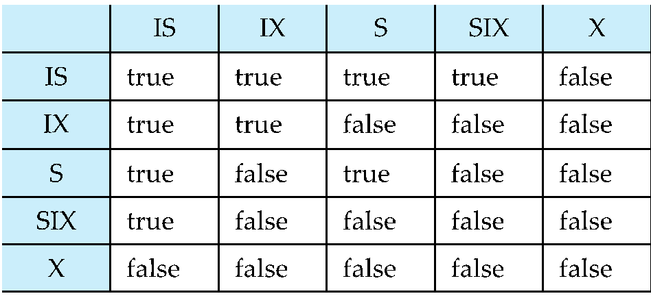

设有事务A B,都对同一数据对象r加锁

- X锁排他，故只要A对r加X锁，B就不能对r加任何锁


??? Example
    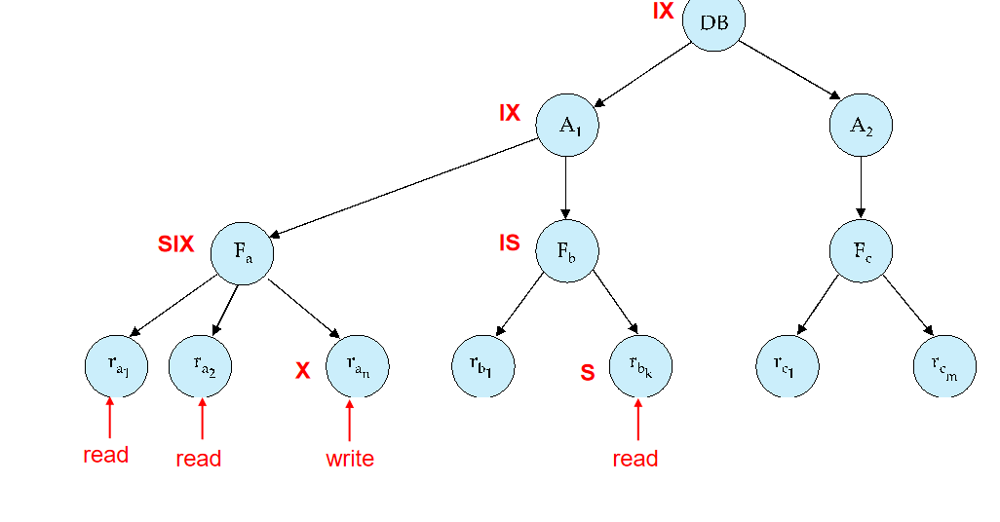

    加锁是从上往下，放锁是从下往上。  
    先对 DB 加 IX, 对 A1 加 IX, 对 Fa 加 SIX, 对某些记录加 X. 其他记录就不用再加 S 锁了(因为表是 SIX).  

## 4 Insert and Delete Operations

数据库里除了 R/W 还有插入、删除等操作。  
需要定义 R/W 和插入/删除是否冲突。

If two-phase locking is used :

* A delete operation may be performed only if the transaction deleting the tuple has an exclusive lock on the tuple to be deleted.  
删除前需要加 X 锁。
* A transaction that inserts a new tuple into the database is given an X-mode lock on the tuple  
插入之前是没有这个数据的，无法先加锁。应该插入之后马上加上 X 锁。

Insertions and deletions can lead to the *phantom phenomenon*.  
因此只是加锁不能保证串行化。  (If only tuple locks are used , non-serializable  schedules can result)


One solution:

- Associate a data item with the relation, to represent the information about what tuples the relation contains
- 事务扫描在data item上获得共享锁的relatoiin
- 事务插入或者删除一个tuple时，在data item上获得排他锁
- 这种协议会导致插入删除时非常低的并发度
- Index Locking Protocols提供更高的并发度同时放置了幽灵现象，by requiring locks on certain index buckets

### 4.1 Index Locking Protocol

- Every relation must have at least one index
- A transaction can access tuples in a relation only after finding them through one or more indices on the relation


其实插入/删除操作隐含地修改了信息，只是没有被表示出来。我们可以这个信息显示化，加锁。  
如果表上有索引，我们在扫描索引的时候会在叶子修改，我们在这里进行检测。
<div align=center>  </div>

??? Example "Index Locking on a B+ -Tree"
    <div align=center>  </div>

    先在叶子页加锁，再在记录上加锁。  
    如果我们要插入，比如 18. 这时插入到了 10 这页，发现这页被锁住了，无法插入，这样就确保了这个范围内无法被插入，不会有幽灵问题。  

也可以使用谓词锁。把这个位置锁上（比如刚刚 11 到 50 这个区间），后续如果要插入 18 落入这个区间，我们就能检查出来。但这样实现是比较复杂的。

### 4.2 Multiversion Concurrency Control Schemes

**不考**


### 4.3 Next-Key Locking To Prevent Phantoms

刚刚的例子中, 10 不在范围内，但我们把这页都锁住了，仍然插不进去，影响了并发度。 

Next-key locking protocol: provides higher concurrency

* Lock all values that satisfy index lookup (match lookup value, or fall in lookup range)
* Also lock next key value in index  
even for inserts/deletes
* Lock mode: S for lookups, X for insert/delete/update

!!! Example "Next-Key Locking"
    <div align=center>  </div>

    查询 7 到 16, 我们把索引项锁起来，把下一个索引值 18 也锁起来。插入的时候要申请这个锁和比插入值大的下一个值的锁，这里插入 15 时就要申请 15 和 18 的锁，冲突无法插入。插入 7 同理。