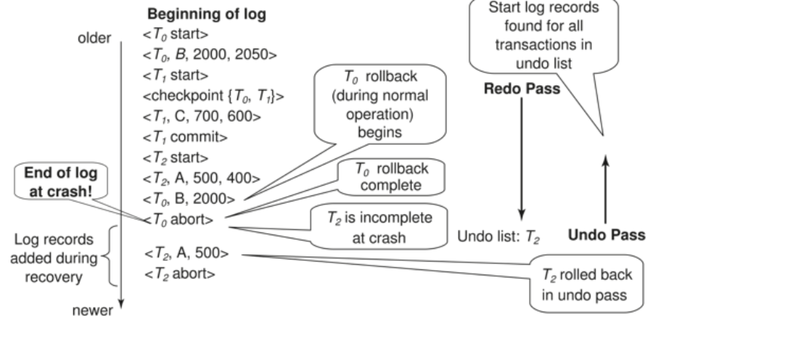
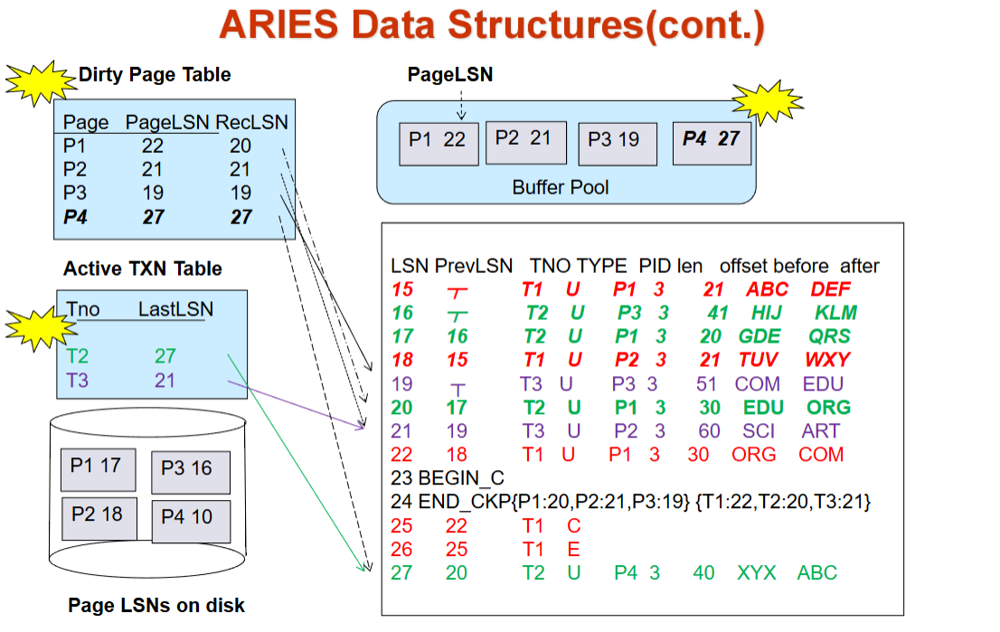
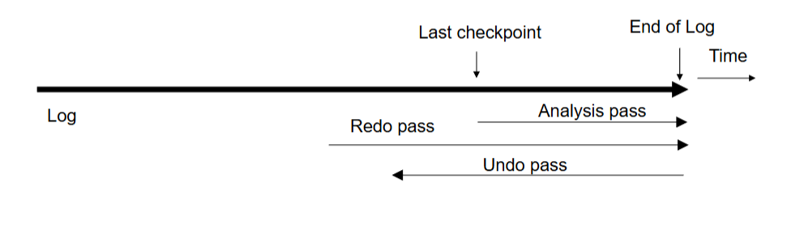
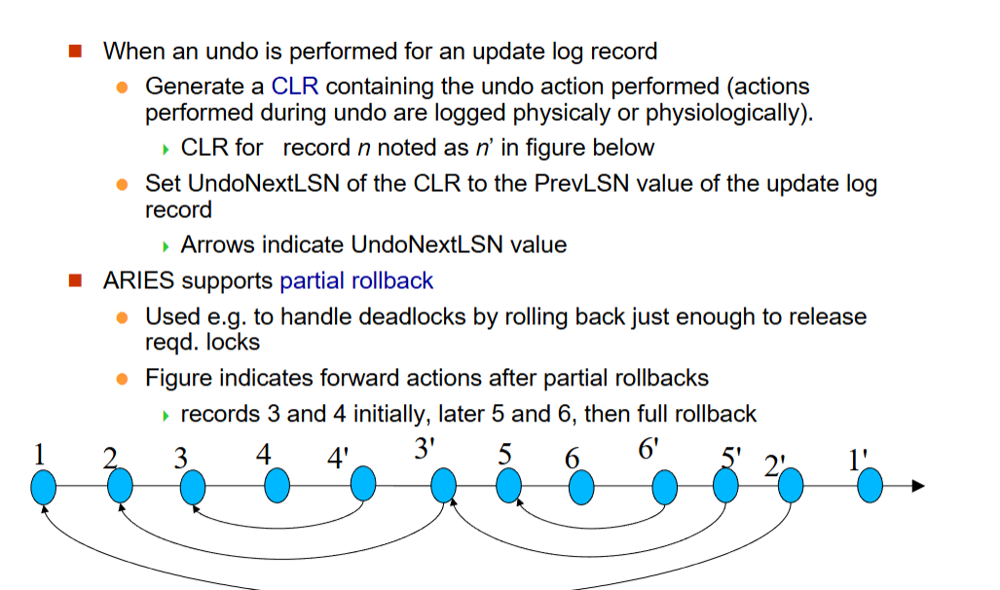

# Recovery System

---
counter: True  
---

# Recovery System

## Failure Classification

* Database application  
逻辑错误：比如不满足数据库约束条件（主键）
系统错误：死锁。
常用方法是撤销 undo, 把这个事件抹掉。（基于日志，在产生修改之前先记日志，故障后可以根据日志进行撤销）  
记日志比较快（顺序访问）
* DBMS  
掉电、硬件故障、软件故障  
system crash 是全局性的，所有运行的程序都会受到影响。分为两类：一类是事务已经提交（但是数据还在缓冲区），另一类是正在执行的事务（还没有提交）。  
已经提交的事务要 redo(数据可能没写回去), 没有完成的事务要 undo. 
先记日志，现在的数据库采用 repeating history 的方法。
* Database  
介质故障   
要防止介质故障，需要做备份（拷贝或者远程）  

## Storage Structure

日志可能也会出故障？我们假设日志存储在 Stable storage 里。

* Volatile storage  
* Nonvolatile storage  
survives system crashes
* Stable storage:
    * a mythical(虚拟的) form of storage that survives all failures
    * approximated by maintaining multiple copies on distinct nonvolatile media  
    可以近似实现，在非易失性介质维持多个备份

### Implementation

* Maintain multiple copies of each block on separate disks
* Failure during data transfer can still result in inconsistent copies  
修改过程中可能发生故障
* Protecting storage media from failure during data transfer 
    - Execute output operation as follows (assuming two copies of each block):
        - write the info onto the first physical block
        - when the first write successfully completes, write the same info onto the second one
        - 只有在第二个写也成功完成时，输出才结束
    
Copies of a block may differ 由于输出过程中发生的错误，为了恢复：

- 首先找到不对的blocks
    - expensive solution: 两个copies一个一个比过去
    - better solution ： 
        - record in-progress disk writes on 非易失性存储
        - Use this information during recovery  to find blocks that may be inconsistent, and only compare copies of these 在恢复过程中利用这个信息来中岛不正确的block
        - used in hardware RAID system
- If either copy of an inconsistent block is detected to have an error (bad checksum), overwrite it by the other copy.  If both have no error, but are different, overwrite the second block by the first block. 

### Data Access

- Physical blocks: blocks residing on the disk(存在硬盘上的block)
- Buffer blocks: 暂时存储在主存中的blocks
- input(B) transfers the physical block B  to main memory.
- output(B) transfers the buffer block B to the disk, and replaces the appropriate physical block there.

每个事务 $ T_i $ 都有一个私有的工作区，用于存放其访问和更新的所有数据项的本地副本。  

- $ T_i $ 的数据项 $ X $ 的本地副本称为 $ x_i $。  

数据项在系统缓冲区块和私有工作区之间的传输通过以下操作完成：  

- **read(X)**：将数据项 $ X $ 的值赋给局部变量 $ x_i $。  

- **write(X)**：将局部变量 $ x_i $ 的值赋给缓冲区块中的数据项 $ \{X\} $。  

- **注意**：**output($ B_X $)** 操作不必紧跟在 **write(X)** 之后执行。系统可以在认为合适的时候执行 **output** 操作。  

事务的规则：  

- 首次访问数据项 $ X $ 时必须先执行 **read(X)**（后续的读取可以直接从本地副本中获取）。  

- **write(X)** 可以在事务提交之前的任何时间执行。  

### Database Recovery

**Recovery algorithms** are techniques to ensure database consistency and transaction **atomicity** and **durability** despite failures.  

Recovery algorithms have two parts

* Actions taken during **normal transaction processing** to ensure enough information exists to recover from failures  
先记日志
* Actions taken after a failure to recover the database contents to a state that ensures atomicity, consistency and durability  

理想的算法：恢复得很快，对事务正常操作没有影响（记录信息的时候不能消耗太多性能），即兼顾上面两个部分。恢复的过程和并行控制是相关的。

We assume that strict two-phase locking ensures no dirty read.  
使用严格两阶段封锁协议保证没有脏数据。

**Idempotent(幂等性)**: An recovery algorithm is said to be idempotent if executing it several times gives the same result as executing it once.  
算法恢复多次的效果是一样的。（恢复过程中可能也发生 crash）

## Log-Based Recovery

### Log Records

为了确保即使在故障发生时也能保持原子性，我们首先将描述修改操作的信息（日志）输出到稳定存储器，而不会直接修改数据库本身。

A **log** is kept on stable storage(稳定存储器).   
The log is a sequence of **log records**, and maintains a record of update activities on the database.

* When transaction Ti starts, it registers itself by writing a **“start”** log record: $<T_i\  start>$  
事务开始. Ti 表示事务的 id. 
* Before Ti executes write(X), writing **“update**” log record $<T_i, X,  V_1,  V_2>$   
事务把 X 数据项的值从 V1(old value) 改为 V2(new value).  
这个就是恢复的基础. undo 就用 old value, redo 用 new value.  
Insert 就是 old 为空, Delete 就是 new 为空。
* When Ti finishes it last statement, writing **“commit”** log record: $<T_i\  commit>$ 
* When Ti  complete rollback（完成回滚时）, writing **“abort”** log record: $<T_i\  abort>$ 

事务会对应记录自己的前一个日志项

!!! Example "Log Example"
    
    这里当执行到 T2 回滚的时候我们会进行恢复（绿色的行表示补偿日志）比如 T2 把 C 恢复为 500, T3 把 B 恢复为 300, 最后 T2 abort. (undo 操作也会记录到日志中)  
    发生 crash 的时候 repeat history(undo 正常的操作也会重复), 随后得到并执行 undo list.(事务开始后先把事务放进去，如果提交或者回滚了就把事务移除) 只需要把 T4 undo.(假设故障前只执行到 15 行) 

### Write-Ahead Logging

Before a data in main memory is output to the database, the log records pertaining to data must have been output to stable storage.  
先写日志原则。  
数据修改之前，和数据有关的记录要先写入日志。

### 并发控制与恢复  

- 在并发事务环境下，所有事务共享同一个磁盘缓冲区和一个日志文件。  
  - 一个缓冲区块可能包含被一个或多个事务修改过的数据项。  
- 我们假设：如果事务 $ T_i $ 修改了某个数据项，那么在 $ T_i $ 提交或中止之前，其他事务不能修改同一数据项。  
  - 即未提交事务的更新操作对其他事务不可见。  
    - 否则，如果 $ T_1 $ 更新了 $ A $，接着 $ T_2 $ 更新 $ A $ 并提交，最后 $ T_1 $ 需要中止，该如何撤销 $ T_1 $ 的修改？  
  - 可以通过对更新的数据项加排他锁，并持有锁直至事务结束来确保这一点（严格两阶段锁协议）。  
- 支持逻辑撤销的日志恢复机制允许提前释放锁。  

### 数据库修改机制  

- **立即修改机制**允许未提交事务的更新操作在事务提交前就写入缓冲区或磁盘  
  - 更新日志记录必须在数据项写入数据库*之前*记录  
    - 我们假设日志记录会直接输出到稳定存储器  
  - 已更新数据块的输出可以在事务提交前后的任意时刻进行  
  - 数据块输出的顺序可以与写入顺序不同  

- **延迟修改机制**仅在事务提交时才将更新操作写入缓冲区/磁盘  
  - 简化了部分恢复流程  
  - 但需要额外开销来维护本地副本  

### Transaction Commit

A transaction is said to have committed when its *commit log record* is output to *stable storage*  
日志已经记录 commit, 说明事务已经提交。（因为后续可以根据这个恢复状态了）  
但此时数据不一定已经写回到数据库里（不一定高效）  
all previous log records of the transaction must have been output already 
所有之前的log records必须已经全部输出

Writes performed by a transaction may still be in the buffer when the transaction commits, and may be output later.    
不一定在磁盘。如果立刻将 block 写回磁盘可能引起大量 I/O 操作

### Undo(撤销) and Redo（重做） Operations

- 日志记录 **撤销**（Undo）操作：对记录 $ <T_i, X, V_1, V_2> $ 将旧值 $ V_1 $ 写回 $ X $  
- 日志记录 **重做**（Redo）操作：对记录 $ <T_i, X, V_1, V_2> $ 将新值 $ V_2 $ 写入 $ X $  

- **事务的撤销与重做机制**  
  - **撤销**($ T_i $)：将 $ T_i $ 更新的所有数据项恢复为旧值，从该事务的最后一条日志记录开始逆向处理  
    - 每次将数据项 $ X $ 恢复为旧值 $ V $ 时，会写入一条特殊的 **补偿日志记录** $ <T_i, X, V> $  
    - 当事务撤销完成时，会写入一条中止日志记录 $ <T_i \text{ abort}> $  

  - **重做**($ T_i $)：将 $ T_i $ 更新的所有数据项设置为新值，从该事务的第一条日志记录开始顺序处理  
    - 此过程无需额外记录日志  
 
### 故障恢复机制  

- 系统故障后恢复时：  
  - 需对事务 $ T_i $ 执行**撤销操作**(undo)的情况：  
    - 日志中包含 $ <T_i \text{ start}> $ 记录  
    - 但既无 $ <T_i \text{ commit}> $ 也无 $ <T_i \text{ abort}> $ 记录  

  - 需对事务 $ T_i $ 执行**重做操作**(redo)的情况：  
    - 日志中包含 $ <T_i \text{ start}> $ 记录  
    - 且包含 $ <T_i \text{ commit}> $ 或 $ <T_i \text{ abort}> $ 记录  
 
### 故障恢复机制 - 历史重演(Repeating History)  

- 关键说明：若事务 $ T_i $ 先前已被撤销且日志中记录了<$ T_i $ **abort**>，之后系统发生故障，则在故障恢复时会对 $ T_i $ 执行重做操作  
  - 此类**重做操作会重新执行所有原始动作**，*包括恢复旧值的操作步骤*  
  - 该机制称为**历史重演**  
  - 看似资源浪费，但能极大简化恢复流程  

### Checkpoints

Redoing/undoing all transactions recorded in the log can be very slow.  
Streamline recovery procedure by periodically performing checkpointing.  
重演历史可能很长。checkpoint 是确认之前的操作都已经反映到数据库里去了，这样重演的时候就可以直接从 checkpoint 开始。

Streamline recovery procedure by periodically performing **checkpointing** :

* Output all log records currently residing in main memory onto stable storage.  
日志不是生成就往内存写，而是有一个日志缓冲区。  
确保把日志项写到日志中去了。
* Output all modified buffer blocks to the disk.  
把 buffer 里所有数据都刷写一遍。
* Write a log record $<checkpoint\ L>$ onto stable storage where L is a list of all transactions active at the time of checkpoint.   
写一个日志的标记（新的日志类型）. L 是当前正在工作的事务的表。（用来做 undo list 的初始化列表）
* All updates are stopped while doing checkpointing!!!
做 checkpoint 的时候其他活跃事务都要停下来。

- 恢复时只需考虑两类事务：  
  1. 检查点前最近一个启动的事务 $ T_i $  
  2. 在 $ T_i $之后启动的所有事务  
  - 具体操作流程：  
    a) 从日志末尾反向扫描，定位最近的**<checkpoint L>**记录  
    b) 仅需对检查点记录 $ L $中的事务，以及检查点后启动的事务执行重做/撤销  
    c) 在检查点前已完成提交或中止的事务，其所有更新已持久化到稳定存储器  

- 撤销操作可能需要更早的日志记录：  
  - 继续反向扫描，直到为 $ L $中的每个事务 $ T_i $找到对应的 $ <T_i $start> 记录  
  - 早于上述所有 $ <T_i $start> 记录的日志段与恢复无关，可随时清除  

!!! Example "Log File with Checkpoint : Example"
    
    重演历史从最近的 checkpoint 重演. {T2 T4} 作为 undo list 的初始化值。 
     

checkpoint 之间的间隔应该如何确定？  
根据日志量。

### Recovery Algorithm

- **日志记录**（正常操作期间）：  
  $ <T_i \text{ start}> $ 事务开始时记录  
  $ <T_i, X_i, V_1, V_2> $ 每次数据更新时记录  
  $ <T_i \text{ commit}> $ 事务结束时记录  

- **事务回滚**（正常操作期间）：  
  - 设需回滚的事务为 $ T_i $  
  - 从日志末尾反向扫描，对每一条 $ T_i $ 的更新记录 $ <T_i, X_i, V_1, V_2> $：  
    a) 执行撤销操作：将 $ V_1 $ 写回 $ X_i $  
    b) 记录**补偿日志**：$ <T_i, X_i, V_1> $  
  - 当扫描到 $ <T_i \text{ start}> $ 记录时停止，并写入中止记录：  
    $ <T_i \text{ abort}> $  

- **故障恢复**：分为两个阶段  
  - **重做阶段**：重放$所有$事务的更新操作（无论已提交、已中止还是未完成）——$历史重演!!!$  
  - **撤销阶段**：回滚所有未完成事务  

- **重做阶段**操作流程：  
  1. 定位最后一条$<$**checkpoint L**$>$记录，初始化撤销列表为$L$  
  2. 从该检查点开始正向扫描日志：  
    a) 遇到$<T_i, X_j, V_1, V_2>$时，将$V_2$写入$X_j$执行重做  
    b) 遇到$补偿日志$记录$<T_i, X_j, V_2>$时，同样将$V_2$写入$X_j$  
    c) 遇到$<T_i$ **start**$>$时，将$T_i$加入撤销列表  
    d) 遇到$<T_i$ **commit**$>$或$<T_i$ **abort**$>$时，从撤销列表移除$T_i$  

**undo-list**：在checkpoint之后启动的所有没有commit/abort的事务的列表。

#### 撤销阶段操作流程

1. **反向扫描日志**  
   当遇到日志记录$<T_i, X_j, V_1, V_2>$且$T_i$在撤销列表中时，执行与事务回滚相同的操作：  
   - 将$V_1$写入$X_j$执行撤销  

2. **记录补偿日志**  
   - 写入补偿日志记录$<T_i, X_j, V_1>$  

3. **处理事务开始记录**  
   当遇到$<T_i$ start$>$记录且$T_i$在撤销列表中时：  
   - 写入中止记录$<T_i$ abort$>$  
   - 将$T_i$从撤销列表移除  

4. **终止条件**  
   - 当撤销列表为空时停止  
   （即已为撤销列表中每个事务找到对应的$<T_i$ start$>$记录）

- 撤销阶段完成后，系统可恢复正常事务处理

先redo,确定undo list, 再undo。

??? Example "Example of Recovery"
    
### Log Record Buffering

- **日志记录缓冲机制**  
  - 日志记录先缓冲在内存中，而非直接写入稳定存储器  
  - 以下两种情况会将缓冲区的日志记录写入稳定存储器：  
    1. 缓冲区中的日志记录块已满  
    2. 执行**日志强制写入**(log force)操作  

- **日志强制写入**(log force)  
  - 在事务提交时强制执行：将该事务所有日志记录（含提交记录）写入稳定存储器  

- **组提交优化**(Group commit)  
  - 通过单次I/O操作批量输出多个日志记录  
  - 显著降低I/O开销  

我们在把数据 buffer 中的块写到数据库时，要先把块对应的日志先写到日志文件（直接把日志全部刷写一遍）。  
事务提交之后有一个对日志的强制刷写。

**Group commit**: several log records can be output using a single output operation, reducing the I/O cost. 
commit 可能在日志里等待一段时间, 等到 buffer 里有足够多的日志记录再写出去。 

**日志缓冲须遵循的规则**：

1. **顺序写入原则**  
   - 日志记录必须按照生成顺序写入稳定存储器

2. **事务提交条件**  
   - 仅当日志记录$<T_i$ commit$>$写入稳定存储器后，事务$T_i$才能进入提交状态

3. **先写日志规则**(Write-Ahead Logging, WAL)  
   - 内存中的数据块写入数据库前，必须先将其关联的所有日志记录写入稳定存储器  
   - 注：严格来说，WAL仅要求撤销(undo)信息必须先写入

* The recovery algorithm supports the **no-force policy(非强制)**: **i.e.**, updated blocks need not be written to disk when transaction commits.  
好的恢复算法：我事务 commit 了但不强制日志刷写出去。
* The recovery algorithm supports the **steal policy(窃取策略)**:**i.e.**, blocks containing updates of uncommitted transactions can be written to disk, even before the transaction commits. 
事务提交之前脏数据能不能被写到磁盘里去？（同样地需要先把日志写出去）

如果将包含未提交更新的块输出到磁盘，则包含更新的撤销信息的日志记录将首先输出到稳定存储的介质上

当块输出到磁盘是，不应对块进行修改。
  - 在写入数据项之前，事务在包含数据项的块上获取独占锁
  - 在块被输出到磁盘之前，事务不能释放锁（such locks for short duration are called latches）

to output a block to disk

- 首先获取该块的独占锁，确保没有正在进行的更新
- 执行日志刷新
- 将块输出到磁盘
- 松开latch 

Database buffers are generally implemented in virtual memory, which is managed by the operating system.

缺点：（双分页问题）
- 当作系统需要逐出已修改的页面时，该页面将写入磁盘上的交换空间。
- 当数据库决定将缓冲区页写入磁盘时，缓冲区页可能位于交换空间中，并且可能必须从磁盘上的交换空间读取并输出到磁盘上的数据库，从而导致额外的 I/O！

理想情况下，当 OS 需要从缓冲区中逐出页面时，它应该将控制权传递给数据库，而数据库又应该

- 将页面输出到数据库而不是交换空间
- 从缓冲区中释放页面，供作系统使用

### Fuzzy Checkpointing

Fuzzy 模糊

做 checkpoint 的时候我们如果要求其他活跃事务都停下来，一次性把脏数据都刷写出去，吞吐率会忽高忽低，系统的可用性就比较差。  
记录脏数据，在后面不 check 的时候慢慢写。

* Temporarily stop all updates by transactions
* Write a $<checkpoint\ L>$ log record and force log to stable storage
* Note list M of modified buffer blocks
* Now permit transactions to proceed with their actions
* Output to disk all modified buffer blocks in list M

- Store a pointer to the checkpoint record in a fixed position last_checkpoint on disk

在把所有脏数据都写回磁盘后，我们会认定这个 checkpoint. 有一个指针指向最近一次成功的 checkpoint.  
这样 checkpoint 的时候就只需要记录一下，不用一下子写脏数据了。

### Failure with Loss of Nonvolatile Storage

到目前为止，我们假设没有丢失非易失性存储

类似于 checkpointing 的技术，用于处理非易失性存储的丢失

- 定期将数据库的全部内容转储到稳定stable storage中
- 在转储过程中，不能有事务处于活动状态;必须执行类似于检查点的过程
  - 输出当前驻留在主存中的所有日志记录到stable storage
  - 将所有缓冲块输出到磁盘上
  - 将数据库的内容复制到stable storage
  - 输出一条记录<dump> 以在stable storage中标记转储的结束

to cover from disk failure:

- restore the database from the most recent dump
-  consult the log and redo all transactions that committed after the dump was taken

Can be extended to allow transactions to be active during dump; known as fuzzy dump or online dump.  
类似于 checkpoint, 不是完全备份，而是记录一下，随后慢慢备份。

## Remote Backup Systems

### **一、远程备份系统的核心目标与架构**  
远程备份系统通过在远程站点维护数据库副本，确保主站点故障时仍能继续处理事务，实现高可用性。主站点向备份站点传输日志记录，备份站点利用日志恢复数据库状态。

### **二、故障检测与控制权转移**  
1. **故障检测**：  
   - 备份站点通过多条通信链路和心跳消息（Heart-beat messages）检测主站点故障，区分主站点故障与链路故障。  
2. **控制权转移**：  
   - 备份站点接管时，需基于本地数据库副本和已接收的日志记录执行恢复，重做已完成事务，撤销未完成事务，随后成为新主站点。  
   - 原主站点恢复后，需从备份站点获取重做日志，应用更新后才能重新接管。

### **三、恢复效率优化**  
1. **定期预处理**：  
   - 备份站点定期处理重做日志并执行检查点，删除旧日志以减少故障时的恢复时间。  
2. **热备份（Hot-Spare）配置**：  
   - 备份站点实时应用接收的日志记录，主站点故障时仅需回滚未完成事务，即可快速接管。  

### **四、数据耐久性与一致性策略**  
1. **事务提交策略**：  
   - **一安全（One-safe）**：主站点写入事务提交日志即视为提交，可能因备份未同步导致数据丢失。  
   - **两安全（Two-safe）**：  
     - **两-非常安全（Two-very-safe）**：主备均写入提交日志才视为提交，故障时可用性较低。  
     - **优化版两安全**：主备均可用时需两者确认；仅主站点可用时允许单独提交，平衡可用性与数据安全。  
2. **与分布式数据库的对比**：  
   - 远程备份比分布式数据库复制更快速、成本更低，但对故障的容忍度较差。

### **五、关键特性总结**  
| **特性**         | **描述**                                                                 |  
|------------------|--------------------------------------------------------------------------|  
| **核心优势**     | 高可用性，主站点故障时通过远程副本快速恢复业务。                 |  
| **日志依赖**     | 主站点需持续向备份站点传输日志，备份站点通过日志维持数据一致性。 |  
| **切换成本**     | 热备份配置可大幅降低接管延迟，非热备份需等待日志应用。    |  
| **局限性**       | 依赖网络连接，传输延迟可能影响性能；多站点一致性策略需权衡可用性与安全。 |  

## Recovery with Early Lock Release and Logical Undo Operations

### Logical Undo Logging

B+ 树insertions and deletions操作会提前释放锁

- 他们不能通过恢复旧值phsical undo来撤销，因为一旦释放了锁，其他事务可能已经更新了b+树的值。
- 通过logical undo来撤销操作，即记录操作的逻辑逆操作。

对于这类操作，undo log records需要记录逻辑撤销操作，而不是物理撤销操作。

redo information is logged physically even for operations with logical undo.
    - loggical redo 非常福大，因为恢复开始时磁盘上的数据库状态可能不是"recovery consistent"的。
    - physical redo 和early lock release 不冲突

如果早放锁，后续恢复为 old value 可能没有意义。比如存款 100, 转入 100. 那么我们恢复为 100(物理撤销) 就没有意义。这个时候应该采用逻辑撤销，即如果 `a+=100`, 恢复时就应该 `a-=100`. 

如 B+ 树的插入和删除操作。  
我们需要对逻辑操作记日志。

operation logging is done as follows
- 当操作开始时，记录$T_i,O_j,operation-begin$,$O_j$是操作实例的唯一标识符
- 执行操作时，正常记录物理重做信息和物理撤销信息
- 当操作结束时，记录$T_i,O_j,operation-end，U$，其中U包括了许哟啊进行逻辑撤销的信息

如果在操作完成之前发生crash/rollback
- the operation-end log record is not found,and the physical undo is performed

如果在操作完成之后发生crash/rollback
- the operation-end log record is found, and the logical undo is performed，the physical undo information for
the operation is ignored.

Redo of operation (after crash) still uses physical redo information.

#### Transaction Rollback with Logical Undo

1. **日志反向扫描处理**  
   - 逻辑操作回滚：  
     遇到$<T_i, O_j$ **operation-end**, $U>$记录时：  
     - 利用撤销信息$U$执行逻辑回滚  
     - 回滚操作产生的更新按正常操作方式记录日志  
     - 最终生成$<T_i, O_j$ **operation-abort**>$替代常规结束记录  
     - if a <$T_i,O_j,operation-abort$>is found, skip all preceding log records for $T_i$ until the <$T_i, O_j, operation-begin>$ record is found  
   - 跳过处理：  
     忽略所有redo-only记录  

2. **扫描终止条件**  
   - 发现$<T_i$ start>$记录时停止  
   - 追加$<T_i$ abort>$日志记录  

## 关键技术说明
1. **异常处理场景**  
   - 仅当数据库在回滚过程中崩溃时会出现操作中止记录  
2. **防重复回滚机制**  
   - 通过跳过已处理的操作开始记录（$<T_i, O_j$ **operation-begin**>$）  
   - 确保同一操作不会被多次回滚  

!!! Example "Transaction Rollback with Logical Undo"
    

    需要把每个操作的日志项记录下来（开始和结束）. C 表示自加操作。这里在 end 时会记录 logical undo 的操作(减法撤销对应加法)  
    注意我们是在 end 的时候记录逻辑撤销的方法，如果这个操作还没有结束，那么我们只能物理撤销。  
    这里我们早放锁了，没有遵循严格两阶段放锁协议。在 T0 还没有提交的时候 T1 就对数据进行了修改.  
    恢复中做的是物理撤销(old+new), begin/end 这些日志就不需要记录了。

!!! Example "Failure Recovery with Logical Undo"
  
    这里还没有 T2 end, 因此物理撤销。

## ARIES Recovery Algorithm

<u>ARIES is a state of the art recovery method.</u>  

unlike the recovery algorithm described earlier, ARIES

- uses log sequence number **LSN** to identify log records. Stores LSNs in pages to identify what updates have already been applie to a database page
- Physiological redo
- Dirty page table to avoid unnecessary redos during recovery
- Fuzzy checkPointing that only records inforation about dirty pages,a and doesnot require dirty pages to be written out at checkpoint time

每个日志都有一个日志编号 **log sequence number (LSN)**  
每个数据块里都会记一个 LSN, 表示这个块反应了最近哪个日志的操作。

**physiological redo**:

- affected page is physically identified, action within page can be logical
  - 用于降低日志开销
    - e.g. when a record is deleted and all other records have to be moved to fill hole： **Physiological redo** can log just the record deletion, but **Physical redo** would have to log the old and new values for much of the page
  - 要求以原子方式将页面输出到磁盘:可以通过RAID轻松实现

ARIES uses several data structures to support recovery:
  - Log Sequence Number (LSN) identifies each log record
    - 必须是顺序递增的
    - 通常是日志文件开头的偏移量，以允许快速访问。易于扩展以处理多个日志文件
  - Page LSN: 每个页(块的 LSN)
  - Log records of several different types
  - Dirty page table: 脏页表要记录在日志中。
    - 记录哪些页是脏的，哪些日志已经被应用到这些页上

### ARIES Data Structures

* **Log sequence number (LSN)** identifies each log record  
    * Must be sequentially increasing
* **Page LSN**  
每个页(块的 LSN)
* **Log records of several different types**
* **Dirty page table**  
脏页表要记录在日志中。

每个page都要包含一个PageLSN, 表示这个页的最新的日志记录。
  - to update a page:
    - x-latch the page , and write the log record
    - update the page
    - record the lsn of the log record in the page's PageLSN
    - unlock page
  - to flush page to disk, must first S-latch the page
    - 因此，磁盘上的页面状态是一致的：required to support physiological redo
  - **pageLSN** 用于防止repeated redoo, 从而保证idempotence

Log Record

日志记录通过 UndoNextLSN 串起来，提高恢复效率。

DirtyPage Table 

- list of pages in the buffer that have been updated
* PageLSN of the page
* RecLSN is an LSN such that log records before this LSN have already been applied to the page version on disk
每一页都有 PageLSN 和 RecLSN,

pageLSN 和 recLSN 对应一个 page 尚未落盘的最新 log 和最老 log。

!!! Example "ARIES Data Structures"
    
    
    这里 4894.1 表示这个块里的第一个数据。
    RecLSN 表示 7564 开始数据就没有反映到数据库中去了。

* Checkpoint log record
    * Contains: 
        * DirtyPageTable and list of active transactions  
        * For each active transaction, LastLSN, the LSN of the last log record written by the transaction  
        要记最近的事务项（从哪里开始恢复）
    * Fixed position on disk notes LSN of last completed checkpoint log record 上次checkpoint 完成位置的lsn
* Dirty pages are not written out at checkpoint time  
Instead, they are flushed out continuously, in the background  
脏页不会在 check 的时候写出去。在后台不断刷新
* Checkpoint is thus very low overhead
can be done frequently

### ARIES Recovery Algorithm

ARIES recovery algorithm consists of three passes:

* Analysis pass: 确定  
    * Which transactions to undo (undo-list)  
    * Which pages were dirty (disk version not up to date) at time of crash  
    得到 dirty page table. 
    * RedoLSN: LSN from which redo should start  
    真正的 redo 要从哪里开始(RecLSN 的最小值就是 redo 的起点)
* Redo pass  
从 RedoLSN 开始重演  
**RecLSN** and **PageLSNs** are used to avoid redoing actions already reflected on page.  
用来优化，有些日志不用 redo(没有意义)
* Undo pass  
把 undolist 进行撤销操作。回滚所有未完成的事务
  - 之前完成abort的事务不会被撤销。

!!! Example
    
  
    crash 之后，得到上页的 Dirty Page Table 和 Active TXN Table 以及磁盘里的日志。

- Analysis 确定了redo应该从哪里开始
- Undo 必须回退till start of earliest transaction in undolist

**Analysis Pass**
- 从最后一个checkpoint开始，向后扫描日志
  - 从日志记录中读取dirty page table
  - 设置 RedoLSN = min of RecLSNs of all pages in dirty page table. 如果没有 dirty page, RedoLSN =  checkpoint record's LSN
  - 设置 undolist = active transactions at the time of crash
  - 从检查点日志记录中读取undolist中的每个事务的最后一条日志的lsn
- 从checkpoint记录开始，向前扫描日志  
  - 对于每个不在 undolist 中的事务,如果找不到日志，添加到undo-list
  - 每当找到update log record ,如果page不在脏页中，则添加并设置RecLSN为该日志记录的LSN
  - 如果找到事务结束日志记录，则从撤销列表中删除事务
  - 跟踪撤销列表中每个事务最后的日志记录的LSN，可能需要撤销
- at the end of analysis pass,
  - RedoLSN确定从何处开始重做传递
  - 每个脏页的RecLSN确定了重做传递中每个脏页的重做起点,最小化了重做传递的工作量
  - 撤销列表中的事务需要回滚

**Redo Pass**
- 从RedoLSN开始，向前扫描日志  
  - 对于每个日志记录，如果page不在脏页表中，或者LSN小于RecLSN，跳过
  - 否则，从磁盘获取页面，如果PageLSN小于LSN，则执行重做操作

* ■ 对撤销列表 (undo-list) 中的所有事务，在日志上执行反向扫描进行撤销。
    * ● 通过如下方式跳过不需要的日志记录来优化反向扫描：
        * ► 分析阶段 (analysis pass) 会为每个事务找到其最后一条日志记录的 LSN（日志序列号），并将该 LSN 设置为这个事务的下一个待撤销 LSN。
        * ► 在每一步中，选择这些待撤销 LSN 中最大的一个进行撤销，跳转回该记录并执行撤销操作。
        * ► 在撤销一条日志记录后：
            * — 对于普通日志记录，将该事务的下一个待撤销 LSN 设置为该日志记录中记载的 PrevLSN (前一个日志序列号)。
            * — 对于补偿日志记录 (CLRs)，将下一个待撤销 LSN 设置为该日志记录中记载的 UndoNextLSN (下一个撤销日志序列号)。
                * » 所有中间的记录都会被跳过，因为它们应该已经被撤销了。
* ■ 撤销操作如前所述执行。

**Undo Pass**

!!! Example
  
    要把 2390 加到表里去。

好的，这是图片内容的中文翻译：

**ARIES 的其他特性**

* ■ **恢复独立性 (Recovery Independence)**
    * ● 页面可以独立于其他页面进行恢复
        * 例如，如果某些磁盘页面损坏，它们可以从备份中恢复，而其他页面仍在使用中。

* ■ **保存点 (Savepoints)**
    * ● 事务可以记录保存点并回滚到某个保存点
        * ► 对于复杂事务很有用
        * ► 也用于在发生死锁时回滚刚好足够释放锁的操作

* ■ **细粒度锁定 (Fine-grained locking):**
    * ● 索引并发算法允许在索引上使用元组级别 (tuple level) 的锁定
        * ► 这些算法需要逻辑撤销 (logical undo)，而不是像早期恢复算法中那样的物理撤销 (physical undo)。

* ■ **恢复优化 (Recovery optimizations):** 例如：
    * ● 脏页表 (Dirty page table) 可用于在重做 (redo) 期间预取 (prefetch) 页面
    * ● 乱序重做 (Out of order redo) 是可能的：
        * ► 对正在从磁盘获取的页面，其重做操作可以被推迟，并在页面被取回后执行
        * ► 与此同时，其他日志记录可以继续被处理