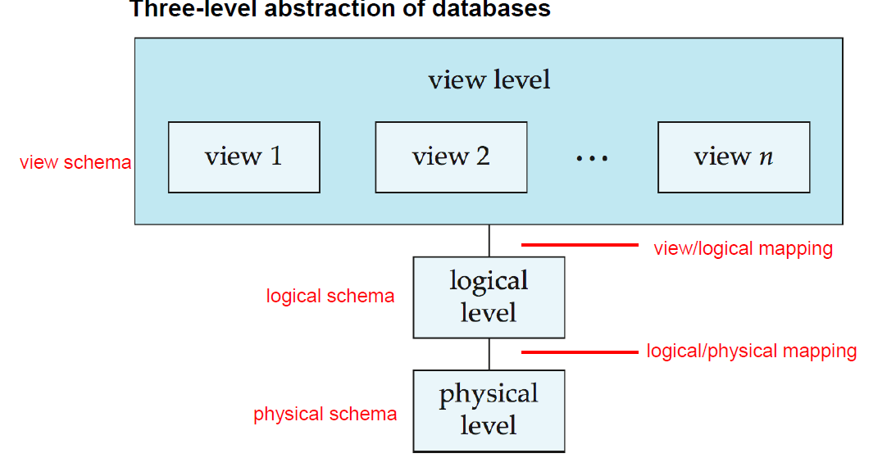
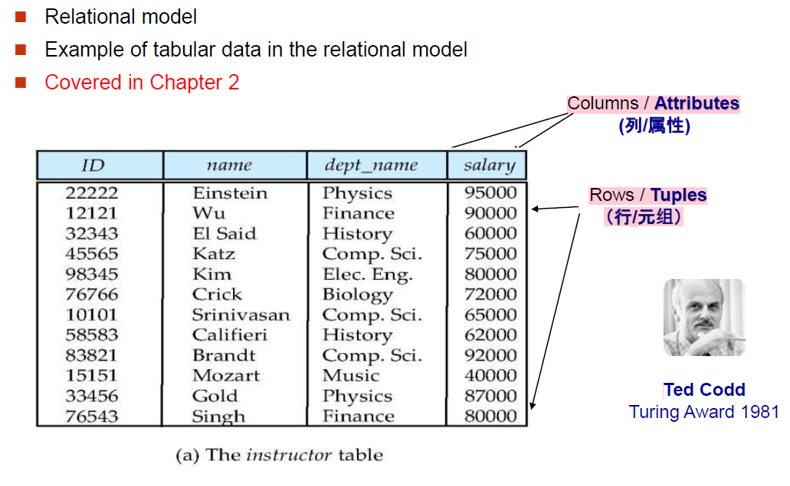

# DB Final Review
## 1 Chapter 1 Introduction

The primary goal of a DBMS是提供一种高效方便存储和检索数据库信息的方式

**Big Data**:

- Volume 容量
- Variety 种类
- Velocity 速度
- Value 价值

Database application 建立在文件系统上的问题

-  Data redundancy and inconsistency
- Data isolation 很多文件和格式
- Difficulty in accessing data
- Intergrity problems 完整性约束不是显式的表达出来的，不方便改
- Atomicity problems 比如一次动作修改两个item,这两个必须同时修改或者不修改才行
- Concurrent access anomalies
- Security problems

Characteristics of Databases

- data persistence(数据持久性) 
- convenience in accessing data(数据访问便利性) 
- data integrity （数据完整性） 
- concurrency control for multiple user(多用户并发控制) 
- failure recovery（故障恢复） 
- security control（安全控制）

Schema 和 instance(类似于 types 和 variables)

- **Schema (模式)** – 数据库的逻辑结构
    - 例如：数据库包含一组客户和账户的信息以及它们之间的关系
    - 类似于程序中变量的类型信息
    - **Physical schema (物理模式)**：物理级别的数据库设计
    - **Logical schema (逻辑模式)**：逻辑级别的数据库设计
- **Instance (实例)** – 特定时间点数据库的实际内容
    - 类似于变量的值

**Physical Data Independence （物理数据独立性**：the ability to modify the physical
schema without changing the logical schema

**Logical Data Independence 逻辑数据独立性** ： 能够修改逻辑模式而不影响 usr view schema

**Data Models**: 用来描述 data,data relationships, data semantics 语义，data constrains 约束 的一组工具

- Relation Model 
- Object-oriented model 面向对象数据模型
- Object-relational model 对象-关系模型
- Semistructured data model 半结构化模型
- Nerwork model 网状模型
- Hierarchical model 层次模型

**Relational model 

**Database Languages**

- Data Definition Language 数据定义语言
- Data Manipulation Language 数据操作语言
- SQL query language： non-procedural 非过程式
- Application Program Interface，SQL没法与用户交互等等，这些操作必须被卸载host language中，这些引用程序通过Language Extensions(embedded SQL)/API(ODBC/JDBC)来把sql语句送给数据库来访问数据库

