[ASC18世界大学生超算竞赛题目分析以及思路总结_asc世界大学生超级计算机竞赛题目-CSDN博客](https://blog.csdn.net/baolidanyang/article/details/79868593)
## 1 安装hpl和hpcg


```shell
cd $HOME && git clone -c feature.manyFiles=true --depth=2 https://github.com/spack/spack.git &&  . $HOME/spack/share/spack/setup-env.sh 
# 安装spack
# 每次使用前都要执行 . $HOME/spack/share/spack/setup-env.sh 

```

## 2 Intel-one-api version

```bash
spack env activate myenv
spack add intel-oneapi-compilers
spack install intel-oneapi-compilers
spack compiler add $(spack location -i intel-oneapi-compilers)/compiler/2025.0/bin
spack add intel-oneapi-mpi%oneapi
spack install intel-oneapi-mpi%oneapi

```


单位： Gflops

| $P\times Q$\NB | 128         | 160         | 192         | 224         | 256         | 288         | 320         | 352         | 384         | 416         |
| -------------- | ----------- | ----------- | ----------- | ----------- | ----------- | ----------- | ----------- | ----------- | ----------- | ----------- |
| $2\times 2$    | 4.70876e+03 | 4.85222e+03 | 4.85506e+03 | 4.76512e+03 | 4.78550e+03 | 4.78525e+03 | 4.74770e+03 | 4.73352e+03 | 4.72667e+03 | 4.46924e+03 |
| $1\times 4$    | 3.34736e+03 | 3.41158e+03 | 3.41368e+03 | 3.34171e+03 | 3.37401e+03 | 3.34084e+03 | 3.30737e+03 | 3.28426e+03 | 3.26189e+03 | 3.08771e+03 |
|                |             |             |             |             |             |             |             |             |             |             |
$P\times Q=2\times 2,NB=192$


| $P\times Q$\NB | 128         | 160         | 192         | 224         | 256         | 288         | 320         | 352         | 384         | 416         |
| -------------- | ----------- | ----------- | ----------- | ----------- | ----------- | ----------- | ----------- | ----------- | ----------- | ----------- |
| 1*2            | 1.04943e+03 | 1.11461e+03 | 1.17154e+03 | 1.16570e+03 | 1.18795e+03 | 1.18955e+03 | 1.20555e+03 | 1.20268e+03 | 1.19627e+03 | 1.14732e+03 |


计算得到$N=448380$

| N      | Gflops          |
| ------ | --------------- |
| 60000  | 4.96825e+03     |
| 70000  | 5.08977e+**03** |
| 80000  | 5.15926e+03     |
| 100000 | 5.19091e+03     |
| 120000 | 5.21272e+03     |
进程线程关系


## 3 不同实现
```mpirun -np 4 ./xhpl```

N=50000 NB=192 P * Q=2 * 2

mpich + openblas 
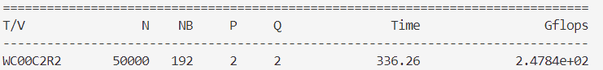

openmpi + openblas
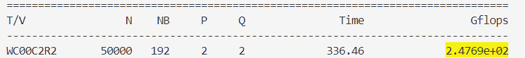

- [ ] ==添加intel 的依赖项时concretize会出错，可能是安装依赖的编译器不一样？
等测完其他的再去测试这个==

## 4 HPCG

### 4.1 intel-oneapi version

mkl/benchmarks/hpcg/hpcg_cpu
```bash
#!/bin/bash

mpiexec.hydra -genvall -n 2 -ppn 2 bin/xhpcg_skx -n64 -t60

mpiexec.hydra -genvall -n 2 -ppn 2 bin/xhpcg_skx -n128 -t60

mpiexec.hydra -genvall -n 2 -ppn 2 bin/xhpcg_skx -n192 -t60

mpiexec.hydra -genvall -n 2 -ppn 2 bin/xhpcg_skx -n256 -t60
```

```text
64:
 Final Summary =
 Final Summary ::HPCG result is VALID with a GFLOP/s rating of=37.5657
 Final Summary ::    HPCG 2.4 Rating (for historical value) is=37.7748
 Final Summary ::Reference version of ComputeDotProduct used=Performance results are most likely suboptimal
 Final Summary ::Results are valid but execution time (sec) is=60.0863
 Final Summary ::     Official results execution time (sec) must be at least=1800

128
 Final Summary =
 Final Summary ::HPCG result is VALID with a GFLOP/s rating of=37.8587
 Final Summary ::    HPCG 2.4 Rating (for historical value) is=38.0171
 Final Summary ::Reference version of ComputeDotProduct used=Performance results are most likely suboptimal
 Final Summary ::Results are valid but execution time (sec) is=60.8692
 Final Summary ::     Official results execution time (sec) must be at least=1800

192

 Final Summary =
 Final Summary ::HPCG result is VALID with a GFLOP/s rating of=38.7001
 Final Summary ::    HPCG 2.4 Rating (for historical value) is=38.8492
 Final Summary ::Reference version of ComputeDotProduct used=Performance results are most likely suboptimal
 Final Summary ::Results are valid but execution time (sec) is=67.3397
 Final Summary ::     Official results execution time (sec) must be at least=1800

256
 Final Summary =
 Final Summary ::HPCG result is VALID with a GFLOP/s rating of=37.0932
 Final Summary ::    HPCG 2.4 Rating (for historical value) is=37.2203
 Final Summary ::Reference version of ComputeDotProduct used=Performance results are most likely suboptimal
 Final Summary ::Results are valid but execution time (sec) is=66.819
 Final Summary ::     Official results execution time (sec) must be at least=1800


```

### 4.2 调整线程进程大小
```bash
#!/bin/bash

  

N_cores_per_node=52

NP=(2 4 8 12 16 24 48)

  

touch hpcg_cpu_results.out

  

for N_processes_per_node in ($NP){

    nt = $N_cores_per_node / $N_processes_per_node

    export OMP_NUM_THREADS=$nt

    nprocs = 2 * $N_processes_per_node

    mpiexec.hydra -genvall -n $nprocs -ppn $N_processes_per_node bin/xhpcg_skx -n128 -t60

}
```


# GPU版本的HPL和HPCG

[NVIDIA HPC-Benchmarks | NVIDIA NGC](https://catalog.ngc.nvidia.com/orgs/nvidia/containers/hpc-benchmarks)
``` shell
sudo docker container run -it --gpus all --ipc=host --ulimit memlock=-1 --ulimit stack=67108864  nvcr.io/nvidia/hpc-benchmarks:24.09 /bin/bash

cd hpl-linux-x86_64
```

`mpirun -n 1 ./hpl.sh --dat ./sample-dat/HPL-1GPU.dat`
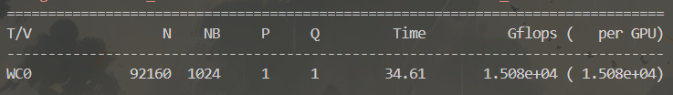
`mpirun -np 2 ./hpl.sh --dat ./sample-dat/HPL-2GPUs.dat`
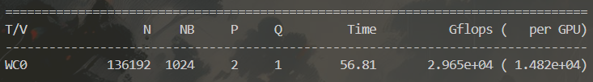
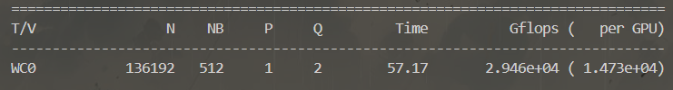
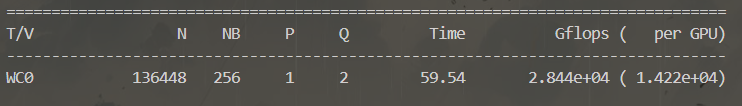
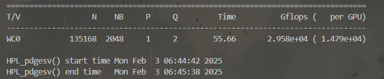
调整N
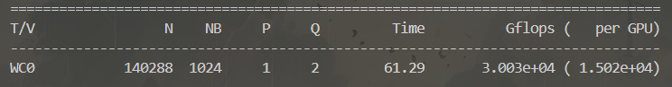
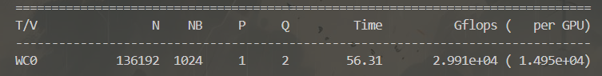
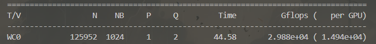
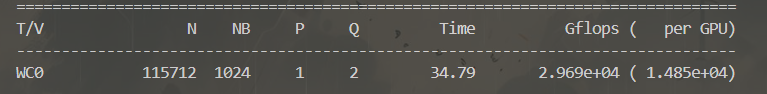
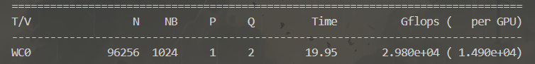
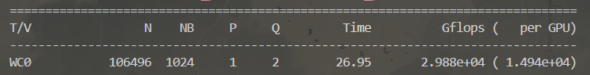
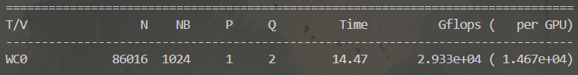
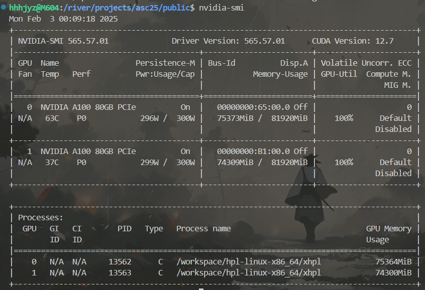


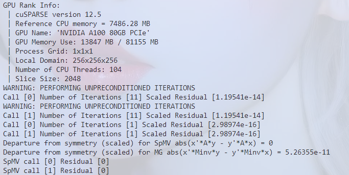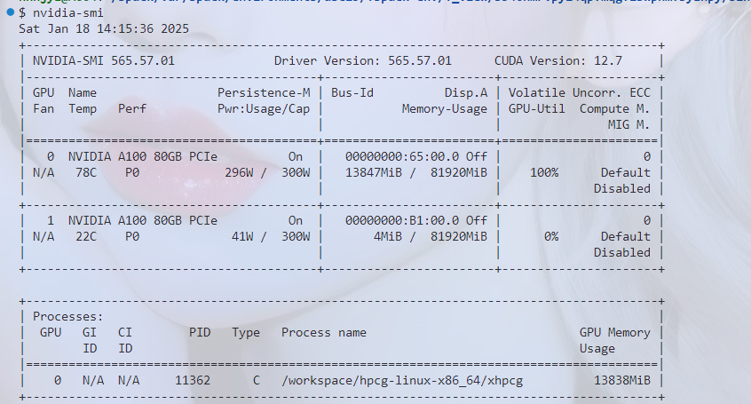

`./hpcg.sh --dat ./sample-dat/hpcg.dat --nx 48 --ny 48 --rt 5 --b 1`

```
HPCG-Benchmark
version=3.1
Release date=March 28, 2019
Machine Summary=
Machine Summary::Distributed Processes=1
Machine Summary::Threads per processes=104
Global Problem Dimensions=
Global Problem Dimensions::Global nx=104
Global Problem Dimensions::Global ny=104
Global Problem Dimensions::Global nz=104
Processor Dimensions=
Processor Dimensions::npx=1
Processor Dimensions::npy=1
Processor Dimensions::npz=1
Local Domain Dimensions=
Local Domain Dimensions::nx=104
Local Domain Dimensions::ny=104


```
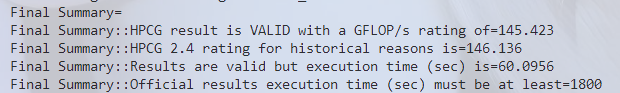


64 64 64 
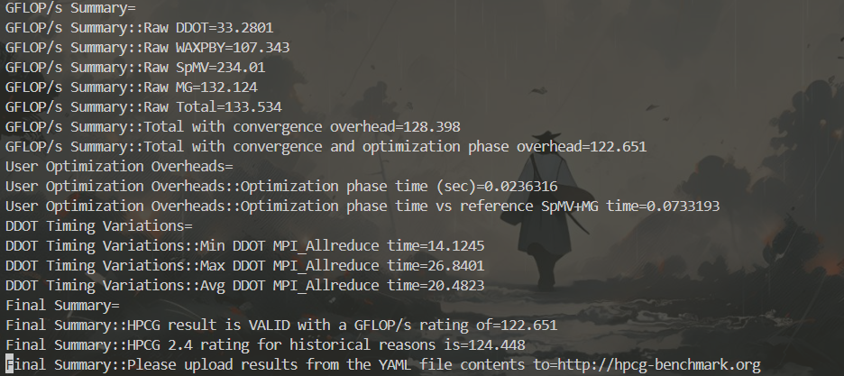

```bash
#!/bin/bash
# load CUDA and openmpi-cuda
nvidia-smi
mpirun --bind-to none -np 2 hpcg.sh --nx 256 --ny 256 --nz 256 --rt 64 | tee -a ./results.txt
mpirun --bind-to none -np 2 hpcg.sh --nx 288 --ny 288 --nz 288 --rt 64 | tee -a ./results.txt
mpirun --bind-to none -np 2 hpcg.sh --nx 320 --ny 320 --nz 320 --rt 64 | tee -a ./results.txt
mpirun --bind-to none -np 2 hpcg.sh --nx 352 --ny 352 --nz 352 --rt 64 | tee -a ./results.txt
mpirun --bind-to none -np 2 hpcg.sh --nx 384 --ny 384 --nz 384 --rt 64 | tee -a ./results.txt

echo "done"
```

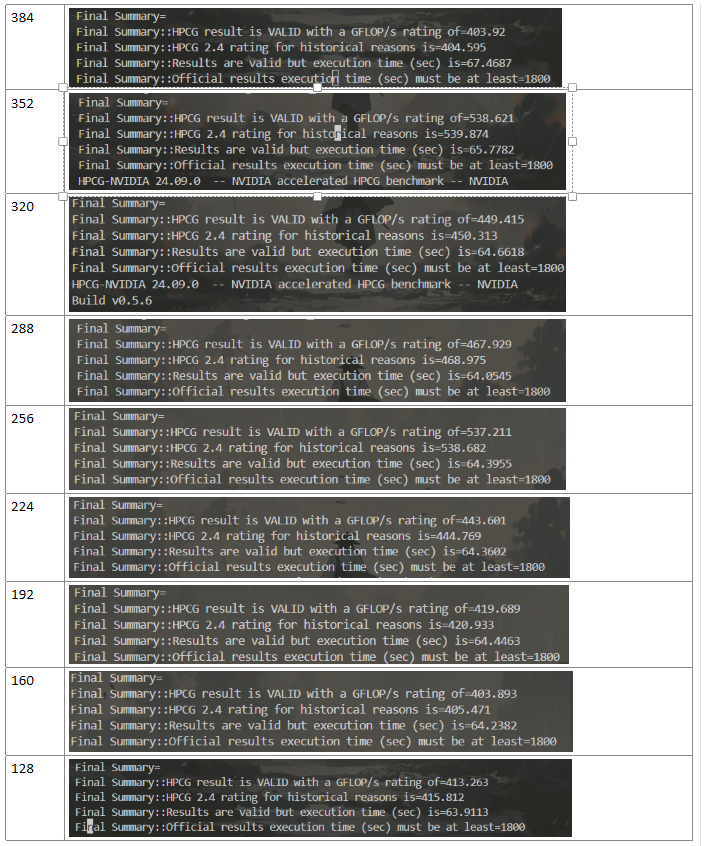