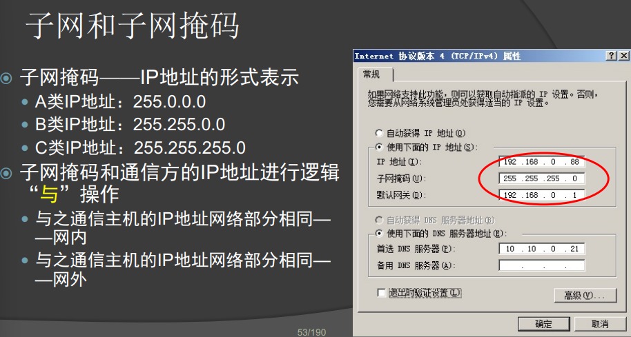
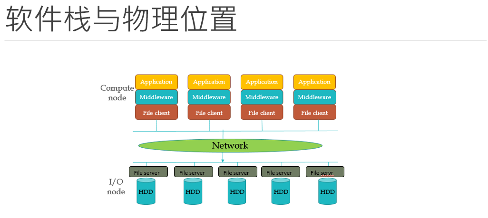
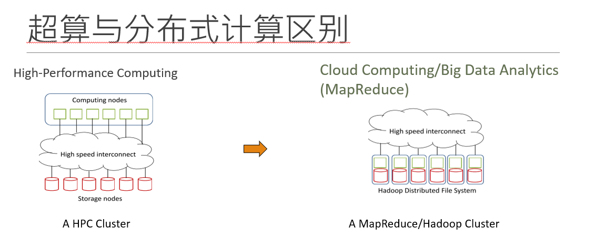
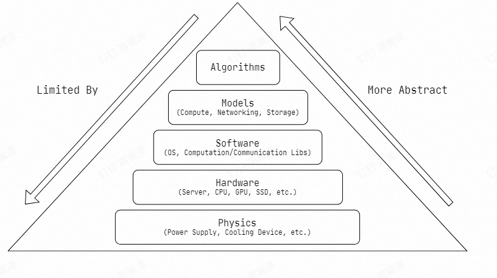
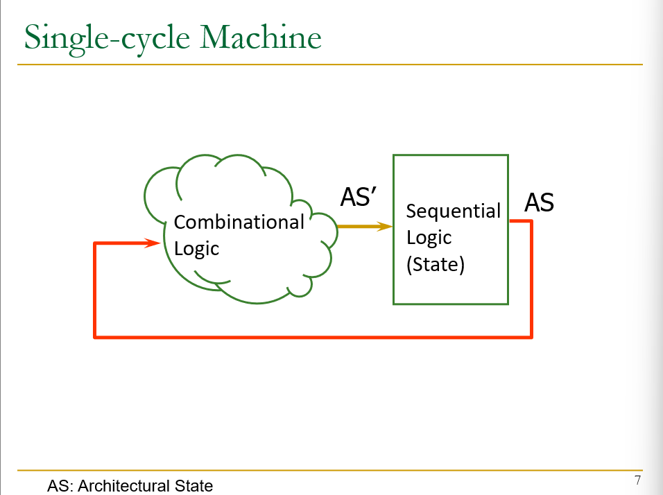
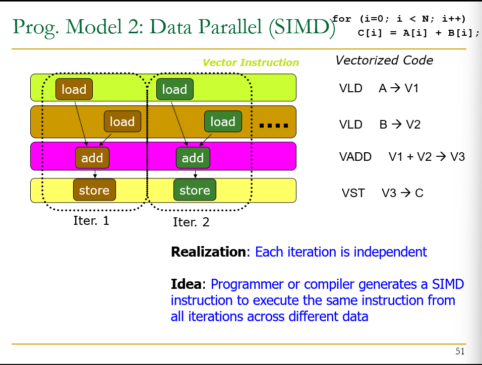
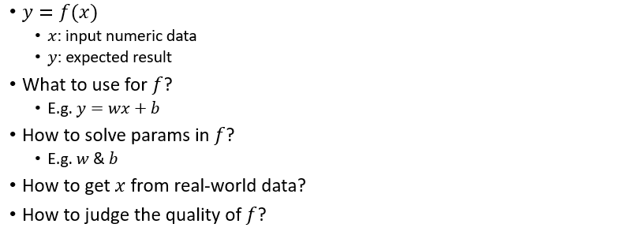
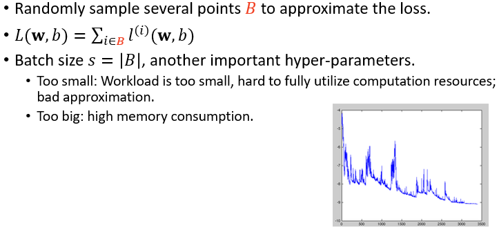

# 计算机系统知识
??? success "这是啥"
    haha
    
- 并行计算：
    - 传统意义上是指计算资源应包括一台配有多处理机（并行处理）的计算机
    - 具有超级计算能力的计算机系统
    - 也指一个痛殴过网络连接的计算机群
- 分布式计算
    - 包括分布式硬件结构和分布式软件设计
    - 一个分布式系统是为解决单个问题而紧密结合在一起工作的多处理机的集合
    - 一个分布式系统可能意味着一个由地理上分散的、各自独立的计算机组成的网络
- 集群计算：
    - 基于并行系统和网络的
    - 集群系统——是以高速网络连接起来的高性能工作站或微机组成
- 云计算：
## 1 计算机概述
- 程序（program）：简单地被理解为按照预定的步骤进行工作，程序是处理数据的算法的具体实现
- 计算机系统分为硬件系统和软件系统
- 硬件系统：指计算机的物理设备，实现计算机操作过程、输入、输出的各种电子设备
- 计算机是如何运行的：
  - 通电后 CPU执行启动程序BIOS，操作系统调入内存
  - BIOS引导后计算机由操作系统管理和控制

## 2 计算机中数的表示

- 整数：原码、反码、补码，正数的补码等于他的原码，负数的补码等于它的反码加1（==进位不改变符号位==）
  - 存储采用补码形式，将符号位与其他位可以统一处理，补码实现减法运算

- 数的两种形式：定点数和浮点数
  - 计算机中的定点数：二进制，固定长度，小数点固定在某一个位置，定点纯小数，定点纯整数
  - 浮点数，类似科学计数法，表示数的范围更大
- 浮点数：
  - 浮点数分阶码和尾数
    - 阶码：小数点位置——带符号的整数——类似科学计数法中数的指数部分
    - 尾数表示数的有效数值：纯整数或者纯小数

- 编码和文本
  - 常用编码：ASCII，汉字编码，多媒体数据
  - 文本：文本中的每一个符号包括字母、标点，都以一个唯一的二进制位序列表示，在计算机中，文本就是位模式的二进制数据长串
    - 基础的文本编码就是ASCII
    - 文本编码是计算机进行数据交换的基础（ASCII、Unicode、汉字编码）
      - 在汉字系统中，每个汉字对应两个英文字符宽度
      - 
      - 为了输出汉字，必须存储汉字的字形
        - 矢量化——它由一组指令来描述字符的外形——轮廓字体
        - 点阵图形——将汉字分解为若干个“点”组成的点阵字型方式

- 图形和图像：（两种技术：矢量图和位图）
  - 位图：使用像素阵列，每一个像素是一个点
  - 矢量图：任何图形、图形可以分解位曲线和直线的组合，直线、曲线公式的 组合作为图形数据存储起来

## 3 计算机系统组成


- PC机大多数功能电路，都安装在主板上
  - 主板区分：芯片组，安装在主板上，协助cpu
  - 北桥：主要负责管理、控制机内的总线
  - 南桥：主要负责外设接口的控制

- NUMA：非统一内存访问，描述了当代多处理

### 3.1 处理器

- 处理器由运算器和控制器构成

- 摩尔法则

- 处理器的结构模型：

  

- 内部总线：
  - 总线就是一组导线，是信号的公共通路
  - 主板范围内的总线叫内部总线，它是CPU与存储器及输入/输出控制电路进行数据交换的通路
  - 总线分为：
    - 数据总线：接受或输出数据
    - 地址总线：向外输出地址信号
    - 控制总线：输出控制信号或者接受来自外部的控制信号

- 处理器的性能指标
  - 主频
  - 集成度
  - 字长
  - 协处理器
  - 内部高速缓存器
  - 工作温度范围
  - 电源电压范围
  - 芯片封装材料及结构
- CISC（复杂指令集计算机）：使用数量和种类较多的指令

- RISC（精简指令集计算机）：只包含常用指令且指令的长度和执行时间都相同

### 3.2 存储器

- 存储单元以字节位单位，一个字节由8位二进制组成
  - 存储器由若干字节组成，每个字节都有唯一的标识叫做存储器的地址，用二进制位模式标识
  - 存储容量即存储器中存储单元的总数，也叫做字节数，或者称为地址空间
- 存储器分为内存和外存
  - 内存：
    - 与CPU经内总线连接的存储器是“内存” ， 也称主存储器，简称主存。 由半导体存储器组成，主要分： 
    - 随机存取存储器（RAM），易失性。 
      - ○动态RAM（Dynamic RAM） 
      - ○静态RAM（Static RAM） 
    - 只读存储器（ROM），断电后数据不丢失，一个重要应用：存放 BIOS程序。 
      - ○PROM —— 一旦数据被写入，就不能再改变
      -  ○EPROM ——如果数据需要被改写，就需要用一种紫外线光设备将原数据擦 除后再重新写数据 
      - ○EEPROM ——可以对部分单元进行重新写入


- 外存：
  - 辅助存储器系统——(外部存储器、外存) 
    -  具有外设特性 
    - 作为数据永久存储的设备 
  -  主存
    - 辅存结构和虚拟存储器 n
  - 辅助存储器主要采用： 
    -  磁介质存储设备 
    -  光存储设备

- CPU执行程序时 ，将磁盘中的数据映射存放到虚拟内存中 ，需要时再从映射的虚拟内存中重新取出è内存。 
- 由于虚拟内存与内存地址是对应的，因此存取速度快于一般磁盘操作 n提升了系统的运行效率。 
- 由OS和CPU共同完成管理和控制存储系统的任务

### 3.3 输入输出系统

- 端口和主机的数据传输模式有两种：并行或串行。
  - 并行：一次传输8位数据
  - 串行：每次传输1位数据

- 外部设备通过一组(束)导线的接插件端口与主机连接
- 外部设备的总线标准，规定了连接线如何排列且具有何种功能（如数 据位宽度、数据传输速率）
- USB：
  - 是一种总写标准，也是一种技术
  - 由Intel公司发起并制定的通用串行总线标准。 
    - 使用4线结构 
    - 自身无须配备电源，可以通过USB中的VBUS获得从主机提供的电源 
    - 它的连接端口主要有两种规格：A型和B型，分别连接计算机和外设。 
    - USB自动配置设备，支持热插拔（Hot-Plugging） 
    -  可以连接多达127个设备。

- 接口
  - 用来解决高速主机和低速外设之间的矛盾，使得它们在速度之间实现匹配
  - 分为两个部分：
    - 一部分通过内部总线连接CPU和存储器
    - 另一部分则通过外部总线连接外设

### 3.4 操作系统

__操作系统是计算机硬件与 其他软件之间的接口，能有效地对计算机软件 、硬件资源进行管理和使用， 使用户能方便地操作计算机。__

- 操作系统有许多不同的分类方法，按照其使用环境和对程序执行的处理方式进行分类， 可分为：
  - 实时系统 
    - 要求在规定的时间内响应，并快速处理，大部分实时操作系统都是专用系统
    - 实时操作系统本身对资源的使用和控制都必须优化以 满足系统要求。
  - 单用户单任务系统 
    - 只能由一个人使用，且一次只能执行一个任务
  - 单用户多任务系统 
    - 采用任务是一种分时处理技术，将CPU的执行时间划分为若干个时间片，在一个时间片内 执行一个任务，在下一个时间片内执行另外一个任务
    - 可以在多个程序之间进行数据交换
  - 多用户多任务系统 
    - 允许多个用户使用一台主机，而且支持每个用户的多任务处理
  - 分布式系统 
    - 通过网络将物理上分布（分散）的具有独立功能的计算 机系统互连起来，实现信息交换、资源共享、可互操作和 协作处理的系统。
  - 并行系统
    - 并行操作系统是针对计算机系统的多处理器要求设计的， 它除了完成单一处理器系统同样的作业与进程控制任务外， 还需要完成在系统的多个处理器之间活动的分配、调度。
    - 并行系统要解决 “负载平衡”（Load Balancing） 问题和“缩放”问题
  
- **操作系统的结构**
  - 操作系统的结构基于软件的层次结构，把操作系统分为 内核（Kernel）和外壳 （Shell）两层
    - kernel
      - 包括操控计算机各种资源的基本模块，设备驱动，内存管理
      - kernel的调度程序决定哪一个任务被执行，控制程序为这些任务分配时间片
    - shell
      - 负责接受用户和应用程序的操作命令，并将这个命令解释后交给kernel去执行

- **操作系统的功能**

  - 进程管理

    - ​	processes指正在执行中的程序，processes越多，进程管理越复杂
    - 进程管理最重要的任务就是进程调度，其目的就是有效管理而且防止死锁
    - 死锁就是多个进程同时占有对方需要的资源而同时请求对方的资源，而它们在得 到请求之前不会释放所占有的资源。
      - 发生死锁会导致系统处于无效等待状态，因此必须撤销其中的一个进程。例如 在Windows中，可用“任务管理器” 终止没有响应也就是无效的进程。
    - 进程概念的延伸。如果程序只有一个进程就可以处理所有的 任务，那么它就是单一线程的。如果程序可以被分解为多个 进程共同完成程序的任务，那么被分解的不同进程就叫做线 程，也叫轻量级进程（Light Weight Processes）

  - 存储器管理，负责调度内存、监控内存运行状态，还负责管理内存和外存之间的数据交换。输入输出管理模块也承担了对外存的默写管理任务

  - 内存管理的主要任务是内存资源的合理分配和使用，要确保整个内存被各个进程合理使用

    - 在操作系统中，MMU负责处理： 
      - 何时将程序或数据从外存装载到内存中？ 
      -  CPU如何在内存中寻找所需要的程序和数据的地址。 
      -  如何对内存分区或者分块，以存放不同的程序。

  - 虚拟存储

    ​	在磁盘上开辟一个比内存要大的空间（Windows建议为1.5 倍），把被执行的程序装载到这个区域中，按照内存的结构进行 组织 。

- **设备管理**
  -  块设备：信息存放在固定长度块中，每个块都有自己的地址， 磁盘、激光打印机就是典型的块设备。 
  - 字符设备：以字符为单位发送或者接受字符流，如键盘、鼠 标器都属于这一类。
  - 设备管理提供了许多与输入/输出(I/O)有关的服务 
    - 设备调度 – 确定进程按顺序执行I/O请求，使各个进程公平地共享设备 ，提供I/O访问的效率，减少I/O操作需要的平均等待时间 。 
    - 缓冲区 – 即缓冲存储区，它在两个设备之间，或在设备和应用程序之间 缓存数据。 
    - 错误处理
  
  - 设备驱动程序（Driver）
    - OS通过驱动程序操作设备
    - Device Driver是控制、操作设备的程序，是一组接口，可以被操作系统和其他应用程式所调用
  - 启动和停机：
    - 按下开关,通电——执行BIOS，启动装载程序，完成系统引导
    - 长按电源开关——启动关机过程：数据写入，结束进程，关闭电源

- **文件和文件管理**
  - 

- **计算机网络**
  - TCP/IP
    - Transmission Control Protocol/Internet Protocol
    - TCP 数据打包、编号，在接收端将数据按原格式组合
    - IP 为每个数据包加上接收机地址后在网络信道中传输
    - 
    - 
    - 
    - 
    - 
    - IP地址
      - IP协议规定，每台入网的计算机都必须有一个唯一的网络地址，即IP地址
      - Host：拥有IP地址的机器叫做主机，路由根据IP地址传输数据包、
      - 
    - 子网和子网掩码：
      - 把一个较大的网络分成若干个较小的网络，并通过路由器连接起来，这些具有相同网络标识的小网络就称为子网
      - 
      - 

# 超算简介






# A Crash Course on Computer System

## 1 ISA

- Primitives for processors to execute
- Defined by an instruction set architecture
- usually generated by compilers of high-level languages
- code forms:

  - Machine Code
  - Assembly Code
  

# HPC Methodology

## 1 Basic Theories for HPC

### 1.1 Factors Affecting Performance



### 1.2 High-Level Models

- Compute 
  - Program，Function，Programming language，Computation Graph
  - Lynn Models，SIMT

- Storage
  - Storage Database: Relational, KV, Graph 
  - Storage System: Block, Object, File . 
- Networking 
  - I/O :Blocking, Signal-Driven, Asynchronous 
  - Communication Mode: P2P, Collective Communication

### 1.3 Software： Implementation of Models

- Host OS 
  - Compute Library 
  - BLAS, FFT 
  - OpenMP, pthreads, TBB, Intel MKL, Nvidia CUDA .
-  Storage 
  - File System: Local, Remote, Distributed . 
- Communication Library 
  - MPI, Gloo, NCCL

### 1.4 Hardware: Operated by Software

- Server 
- Processing Units 
- CPU, GPU, NPU, FPGA 
- Related: Cache, Memory . 
- Storage Hardware 
  - HDD, SSD, NVMe 
  - RAID . 
- Networking 
  - Ethernet, IB 
  - Smart NIC, DP

==Example: Matrix Multiplication==


​	We  decide  to run it in parallel(即将矩阵分成几个部分进行并行计算)

 - Assuming we divide it into 3 small matrix multiplication tasks
 - Compute  on 3 different processing units
 - Distribute workload & gather results via net work

对于每一个小矩阵的计算，使用BLAS进行efficient computing

对于工作量分配和结果收集，我们使用MPI来进行通信

- We use BLAS on CPU/GPU
  - CPU/GPU性能$\rightarrow$higher performance
  - GPU通常计算会更快
- use MPI on InfiniBand(I/O网络)
  - larger throughput & lower latency

## 2 Performance Analysis and Optimization Methodology

- Performance Test： Just directly run the program and see how long it takes 

### 2.1 Optimization Space Analysis

**we can find the theoretical upper bounds**

- CPU/GPU Flops
- Memory Accessing Speed
- PCIe Bandwidth
- Disk/Net IO Speed

**Some Open question**

- turn to use black-box models

**Opt. Space Analysis - Roofline Model**

- Work
  - The work W denotes the number of operations performed, and in most cases W is expressed as FLOPS
- Memory traffic
  - The memory traffic Q denotes the number of bytes of memory transfers during the execution
- Arithmetic intensity
  - The arithmetic intensity I is the ratio of the work W to the memory traffic Q

Roofline model only focus on 1~2 dominant components

### 2.2 Where to optimize

_Amdahll's Law_

can be formulated in the following way:$S_{latency}(s)=\frac{1}{(1-p)+\frac{p}{s}}\leq\frac{1}{1-p}$

- $S_{latency}(s): $整个过程的理论优化速度
- s:系统资源引起的速度优化
- p:执行过程受优化的时间

**hotspot analysis**:

use hotspots analysis to find the bottleneck of the program

- Methods：
  - Analytical
  - Hardware simulator
  - Profile: sampling some usage of a resource by a program
  - Trace : collecting highly detailed data about the execution


### 2.3 General Optimizaton Pipeline

1. Determine your baseline code 
2.  Run performance test 
3.  Is optimization target reached? (Optimization Space Analysis) 
4. Find bottleneck (Hotspot Analysis) 
5. Optimize the bottleneck 
6. Go to 2.

## 3 Practical Optimization Stretagies

### 3.1 Algorithm Optimization

- reduce complexity
- trade space for time
- parallelization
- prefetch & prediction
  - locality of high-level logic
  - instruction level
    - branch prediction

#### 3.1.1 Caching

- stores results from previous executions
- limited cache size

#### 3.1.2 Lock-Free

- Locks are needed for concurrency 
- Lock--waiting: waste cpu resources
- use atomic primitives

#### 3.1.3 Load Balancing

### 3.2 Code Optimization

- reduce redundancy(冗余)

- reduce precision

  high-precision data:

  - take up lots of space 
  - large computation cost
  - consume lots of  resources

- reduce branching减少分支语句
- Vectorization（矢量化）
- optimize memory access locality
- adjust modifiers 调整修饰符
-    Instruction/Data Alignment
  - Optimize CPU memory access

### 3.3 Compile/Running Parameter Optimization

#### 3.3.1 Parameter Tuning

Adjust Running Scale

 Adjust Cache Size 

Adjust Core Affinity

### 3.4 hardware optimization


- DPU

  

# Linux 实践

## 1 获取帮助

- man
- tldr： too long, didn't read
- cht.sh: unified cheat sheet

## 2 使用集群代理

```proxychains4```

## 3 Linux 用户和用户组


集群使用中心化的用户认证：NIS，LDAP

不要滥用root账户

## 4 Everything is a file

- 文件 file
- 目录 directory 
- 设备 device 
- 管道 pipe 
- 套接字 socket 
- 符号链接 symbolic link

## 5 Linux文件系统层次


## 6 Linux 文件权限

read write execute

SUID：临时拥有文件持有者的权限


## 7 常用命令

``````shell
echo
date/timedatectl
reboot/poweroff
wget/curl
ps/pstree/top/htop/btop/nice/pidof/kill/killall
#系统状态
ifconfig/ping/traceroute/netstat
uname/uptime/free
who/last
history
#文件
pwd/cd/ls
find/locate/whereis/which
cat/more/head/tail/tr/wc/stat/grep/cut/diff/sort
touch/mkdir/cp/mv/rm/dd/file/tar
#磁盘和文件系统管理
mount/unmount
lsblk
df
parted
fdisk
``````

### 7.1 源代码管理和构建工具

GNU Compiler Collection

LLVM Compiler Infrastructure

Git

Make

CMake

### 7.2 管道与重定向

``````shell
| > <
>>
2&>1
tee
``````

Tip:记录自己的操作和log

## 8 Linux内核知识

### 8.1 内核的角色和作用

Physical Hardware -> Kernel Space -> User Space

将内核空间和用户空间分开：	

- ​	Why？硬件层面上指令分级（特权与非特权）危险指令只有操作系统能够执行
  - 提高操作系统的稳定性

- 用户态下执行的命令受到诸多检查
- 需要访问系统资源是，执行系统调用，切换到内核态

### 8.2 宏内核与微内核

### 8.3 Linux 内核模块

- 内核代码树拥有所有可用的东西
- 但不可能在内核启动时加载所有可能的相关代码
- 厂商的闭源驱动
- 运行时动态加载模块

### 8.4 驱动是一种内核模块

驱动知道怎么和硬件交互

- 特殊的指令
- 内存空间映射
- 中断

### 8.5 使用内核模块


## 9 HPC中的软件

**集群概况：NFSRoot**

- 大型技术群往往不会选择NFSRoot（网络负担太重）
- RAM Disk和镜像部署时比较常见的选择

### 9.1 环境管理

参考集群管理文档

### 9.2 MPI

### 9.3 CUDA

## 10 HPC中的硬件

HPC集群

服务器

CPU

PCIe

## 11 功耗控制

**限制CPU的功耗**：

- 间接：限制频率，减少使用的核心数
- 直接： Intel DCM ，Powercap

## 12 算力发展与运维的演进

# 向量化计算

## 1 NumPy

向量化核心思想：一次同时参与运算的不是一个值，而是同时多个值一起算，即一个向量

## 2 NumPy基础

- 创建一个矩阵：将原有列表转为NumPy矩阵

## 3 SIMD向量化

- Single Instruction Multiple Data,单指令多数据流
- 在x86架构下，SIMD一般和SSE和AVX等指令集联系在一起
- SSE和AVX指令集中 提供了大量可以单指令操作多个数据单元的指令

# Graphics Processing Units

## 1 von Neumann Model


-  Von Neumann Model is also called stored program computer(instructions in memory)
- has two key properties
  - stored program
    - 指令被存储在liner memory array中
    - 内存在指令和数据之间是统一的：翻译存储的内容取决于控制命令
  - sequential instruction processing
    - 一个指令执行一次
    - Program counter识别当前的指令，时序上是提前的除非控制transfer instruction

## 2 single-cycle microarchitecture



Each instruction takes a single clock cycle to execute

only combinational logic is used to implement instruction execution

## 3 Multi-Cycle Microarchitectures

- Goal: Let each instruction take only as much time is reslly needs
- Idea:
  - 减少时钟周期的时间
  - 一条指令期间进行多次状态传输
  - 每一条指令后的状态是不同的


## 4 Pipeline

- Goal: More concurrency -->Higher instruction throughput
- Key idea: When an instruction is using some resources in its processing phase, process other instructions on idle4 resources not needed by that instruction

- idea  of  pipeling : 
  - divide the instruction processing cycle int distinct "stages" of processing 
  - ensure enough hardware resources to process on instruction in each stage
  - process a different instruction in each stage

## 5 GPU

**CPU**： Few complex cores;Larger cache for low memory latency ; Large and slow memory

**GPU** : Lots of simple cores; Small cache for low memory latency; Small and fast memory

### 5.1 GPU Computing

**key idea**: Computation is offloaded to the GPU

Three steps:


- CPU-GPU Co-processing
  - CPU： Sequential or modestly parallel sections
  - GPU: Massively parallel sections

	### Hardware Execution Model 

A GPU is not programmed using threads(SIMD programming model ), Each thread execute the same code but operates a different piece of data. Each Thread has its own context.

- sequential (SISD)流水线处理
- data-parallel (SIMD)
- 
- Multithreaded(SPMD)


# Introduction to Machine Learning

## 1 Basic of machine leatning

**Machine learning problems**:

- Supervised learning给标签
- unsupervised learning不给标签
- transfer learning
- reinforcement learning

Classifiation,Regression， Clustering， Dimensionality

**Formulation of machine learning**



**How to solve params in $f$**：

- gradient: the direction in which the function increases most quickly

**Minibatch Stochastic Gradient Descent**:



**overfitting and underfitting**


## 2 Basic of deep learning

### 2.1 Multilayer perceptrons

active function: 解决拟合过程中无法拟合的问题


# OpenMP


## 1 False Sharing

False sharing是OpenMP并行编程中常见的性能问题之一。它发生在多个线程并行修改相云的内存位置时，即使它们修改的是不同的变量。由于缓存系统的设计，CPU核心通常不会直接从主内存中读写数据，而是操作缓存中的数据。现代计算机的缓存系统通常以缓存行（cache line）为单位存储数据，一个缓存行通常是64字节。

当一个线程修改了它的缓存行中的数据时，如果这个缓存行也被其他核心缓存了（因为其他核心的线程需要访问同一个缓存行中的其他数据），那么这个缓存行会被标记为无效。结果是，其他核心必须从主内存中重新读取这个缓存行，即使它们需要的数据没有被修改。这就是所谓的"false sharing"：虽然线程操作的是不同的数据，但由于这些数据位于同一个缓存行中，它们的操作互相干扰，导致性能下降。

避免false sharing的一种方法是确保并行工作的数据分布在不同的缓存行中。这可以通过增加数据结构的大小（padding）来实现，确保每个线程工作的数据位于不同的缓存行上。

# MPI编程

