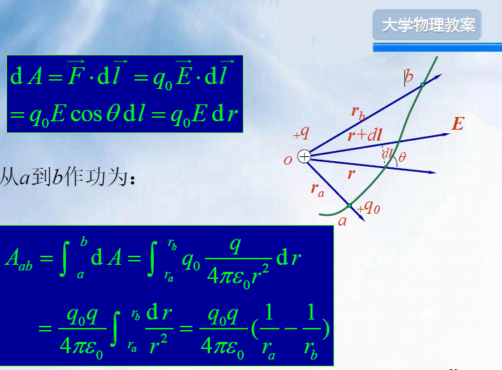
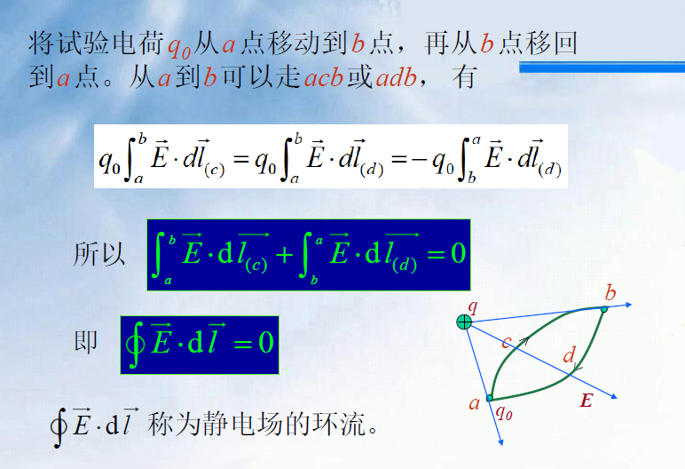
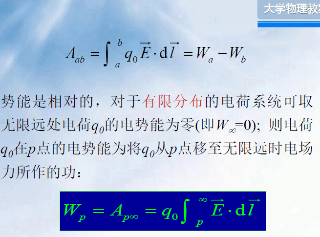
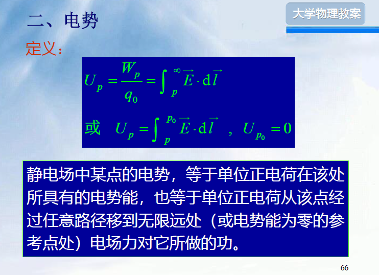
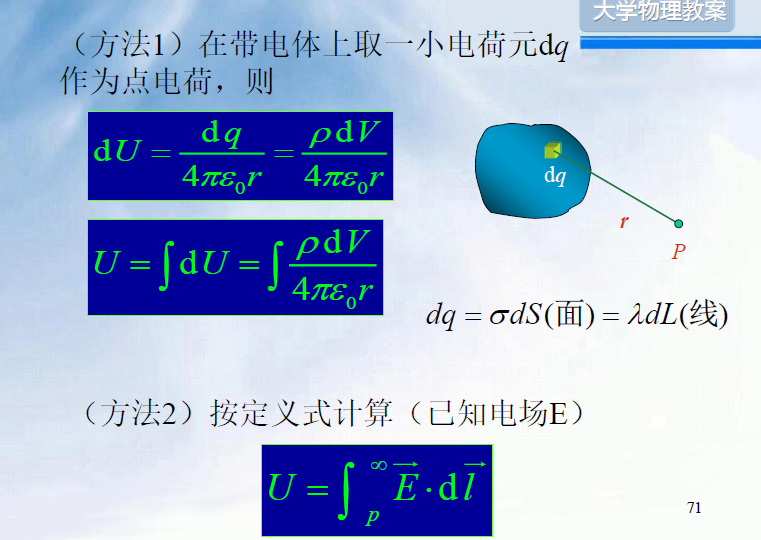
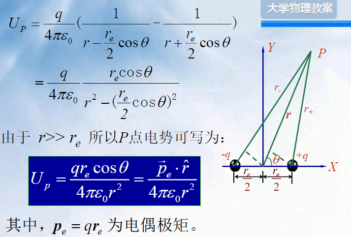
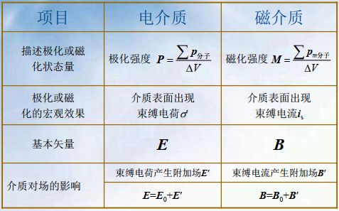
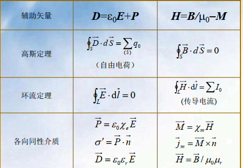
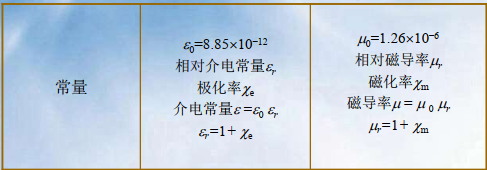

==忽略边缘效应=无限长==
==接地后电势为0==

# 第9章 静电场
## 1 电荷
### 1.1 电荷量子化
电子是自然界中存在的最小负电荷，质子是最小的正电荷。他们的带电量都是基本电荷：
$$e=1.602176\times 10^{-19}C$$
### 1.2 电荷守恒定律
在一个与外界没有电荷交换的系统内，正负电荷的代数和在任何物理过程中保持不变
### 1.3 电荷的相对论不变性
在不同的参照系内观察，同一个带点粒子的电量不变
## 2 库仑定律
$$F=\frac 1{4\pi \varepsilon_0}\frac {q_1q_2}{{r_{12}^2}}\hat {r_{12}}$$
### 2.1 电场力叠加原理
矢量和
## 3 电场 电场强度
## 4 高斯定理及其应用
静电场中任一闭合曲面上所通过的电通量与这一闭合曲面所包围的电荷之间的关系：$\phi=\frac 1 {\varepsilon_0}\sum{q_i}$
### 4.1 高斯定理的应用
#### 4.1.1 球对称分布
带点球面（q）外任一点（半径r）处的场强
$$\overrightarrow E=\frac q {4\pi \varepsilon_0 r^2}\hat r$$
#### 4.1.2 轴对称分布
无限长均匀带点的直线，圆柱面，圆柱体等
$$E=\frac {\lambda} {2\pi \varepsilon_0 R}$$
#### 4.1.3 无限大平面电荷
$$E=\frac \sigma {2\varepsilon_0}$$
#### 4.1.4 两块带等量异号电荷平行平板的电场
$$E=\frac \sigma {\varepsilon_0}$$
## 5 静电场的环路定理
### 5.1 静电场力的功
#### 5.1.1 点电荷电场中电场力做功

### 5.2 静电场的环路定理

有源场、有势场：高斯定理表明电场的闭合面积分不为0，是有源场；环路定理表明电场的闭合线积分为0，是有势场
## 6 电势

点电荷电场中电荷的电势能：
$$W_p=\frac {q_0q}{4\pi\varepsilon r_p}$$

- 电场力做功和电势能用电势来表示：
$$W_a = qU_a,W_b=q_oU_b$$

**电势梯度**：$$F=-\frac{\partial U}{\partial x}\overrightarrow i-\frac{\partial U}{\partial y}\overrightarrow j-\frac{\partial U}{\partial z}\overrightarrow k$$
### 5.3 电势叠加原理
#### 5.3.1 点电荷电场的电势
$$U_p=\frac q {4\pi\varepsilon_0 r}$$
#### 5.3.2 电势叠加原理
$$U_p =\sum {U_{pi}}$$
#### 5.3.3 电荷连续分布带电体的电势

**电偶极子电势**

#### 5.3.4 电势的计算
- 均匀带电球壳产生的电场的电势
$$(r>R )V_P=\frac 1{4\pi \varepsilon_0}\frac qr$$
$$(r<R)V_p=\frac 1{4\pi \varepsilon_0}\frac qR$$
- 均匀带电圆环轴线上的电势
$$V=\frac q {4\pi \varepsilon_0(x^2+R^2)^{\frac 12}}$$

# 静电场中的导体和电介质
## 1 静电场中的金属导体
### 1.1 导体的静电平衡
 必要条件：导体内任一点的电场强度都等于零

 静电平衡的推论：
 - 导体内部场强处处为零
 - 导体是一个等势体，导体表面是一个等势面
 - 导体表面的场强垂直于导体表面
### 1.2 静电平衡时导体上的电荷分布
电荷只能分布在导体的表面
$$\overrightarrow E =\frac \sigma \varepsilon_0 \overrightarrow e_n$$

$\sigma$: 导体表面上电荷密度的分布
在没有外电场的情况下，电荷的分布与导体表面的曲率有关，导体突出的地方曲率较大，面电荷密度$\sigma$较大，场强较大
## 2 外电场中的导体
- 实心导体
- 导体空腔
	- 空腔内无带电体（静电屏蔽）
	- 空腔内有带电体
		空腔内外的电场不互相影响（外表面接地）
		先考虑吧空腔内静电感应，若没有再考虑外电场
## 3 电容，电容器
### 3.1 孤立导体的电容
$$C=\frac q U=4\pi \varepsilon_0R~~~~~~U=\frac 1 {4\pi \varepsilon_0 }\frac qR$$
### 3.2 电容器的电容
$$C=\frac Q {U_A-U_B}$$
#### 3.2.1 平行板电容器
$$C=\frac {\varepsilon_0 S}d$$
#### 3.2.2 圆柱形电容器
$\lambda=\frac qr$是每单位长度圆柱横截面上的带电量
$$C=\frac {2\pi \varepsilon_0l}{ln\frac {R_B} {R_A}}$$
$R_A$为内径,$R_B$为外径
#### 3.2.3 球形电容器
$$C=4\pi \varepsilon_0\frac {R_B R_A}{R_B-R_A}$$
### 3.3 电容器的串联和并联
**串联**：
$$\frac 1 C =\frac 1 C_1+\frac 1 C_2\cdots+\frac 1 C_n$$
电容减小，耐压增加
**并联**
$$C=C_1+C_2\cdots +C_n$$
并联增加总电容，耐压值等于其中最低的耐压值
## 4 静电场中的电介质
**电介质**： 电的非导体，绝缘介质，在外电场中对电场有影响，静电平衡时，内部场强不为0
### 4.1 电介质对电场的影响

### 4.2 电介质的极化
分子的正负电中心是否重合。对有极分子，正负电中心组成等效分子电偶极矩$p$,对大量分子的等效电偶极矩之和$\sum p=0$,对无极分子$p=0$

**电介质极化**：
电介质在外场中，在与外场$E_0$的垂直的表面层里出现正负电荷层，这些电荷不能自由移动，称为**舒服电荷**或**极化电荷**，这种现象称为电介质的极化。无极分子的极化称为位移极化，有极分子的极化称为取向极化

### 4.3 电极化强度矢量 极化电荷面密度
**电偶极矩**：$$ \overrightarrow{p}=\overrightarrow{q}\cdot \overrightarrow{r_e}$$

### 4.4 电介质中静电场的基本定理
#### 4.4.1 电介质中的场强

$$\begin{align}&E=\frac{E_o}{1+\chi_e}\\&U=Ed=\frac{\sigma_0d}{\varepsilon_0(1+\chi_e)}\\ &=\frac qU=(1+\chi_e)C_0\end{align}$$

$$\begin{align}\varepsilon_r=(1+\chi_e)\\ \varepsilon = \varepsilon_r\varepsilon_0=(1+\chi_e)\varepsilon_0\\ \sigma'=(1-\frac 1 \varepsilon_r)\sigma_0\end{align}$$
#### 4.4.2 有电介质时的高斯定理 电位移矢量
**电位移矢量**：
$$\overrightarrow D = \varepsilon_0\overrightarrow E+\overrightarrow P$$
**有电介质时的高斯定理**
$$\int\kern{-7pt}\int \kern{-24mu} \bigcirc \bf_S \overrightarrow D\cdot d\overrightarrow s = q_0$$
**引进电位移线**：
1.电位移线上每一点的切线方向和该点的电位移D的方向相同
2.垂直于电位移线的单位面积上通过的电位移线数等于该点的电位移D的量值
**电介质中的高斯定理**：
通过电介质中任一闭合曲面的电位移通量等于该面所包围的自由电荷量的代数和
- 电位移矢量没有明显的物理意义
- 通过闭合曲面的电位移通量只与自由电荷有关
- 电位移矢量决定于自由电荷与极化电荷的分布
- 电位移矢量的定义式对各向同性和各向异性的介质都适用

在各向同性的介质中：
$$\overrightarrow D = \varepsilon \overrightarrow E
$$
## 5 静电场的能量
### 5.1 点电荷的相互作用能
外力做功等于两电荷相互作用的能量
$$W=\frac 12\sum_{i=1}^nq_iU_i$$
### 5.2 电荷连续分布式的静电能
- 电荷体分布时的静电能
$$W=\frac 12 \iiint_V U\rho dV$$
- 电荷面分布时的静电能
$$W=\frac 12 \iint_sU\sigma dS$$
- 电容器所带的静电能
$$W=\frac Q2U_A-\frac QxU_B=\frac 12 \frac {Q^2}C$$
### 5.3 静电场的能量
$$\begin{align}w_e=\frac 12\overrightarrow E\cdot\overrightarrow D=\frac 12\varepsilon_0\varepsilon_rE^2\\
W=\int_Vw_e\mathrm d V
\end{align}$$

对任意变化电场都适用
# 稳恒电流
## 1 稳恒电流

***电流密度矢量***：
$$\begin{align}
&I=\frac{\mathrm d q}{\mathrm d t}\\
&j=\frac{\mathrm d I}{\mathrm d Scos\theta}\\
&I=\int_S j\cdot \mathrm d S
\end{align}$$
**电流场**：$j$形成的矢量场
**电流线的特点**
- 电流线上的切线方向为$j$的方向
- 电流线密处$j$大
- 两电流线不相交
### 1.1 电流密度和漂移速度的关系
**漂移运动**：电子在电场作用下，除了作无规则热运动外，还将定向运动你，这种定向运动的平均速度称为漂移速度$v_d$
$$\overrightarrow j=-en\overrightarrow{v_d}$$
### 1.2 稳恒电流与稳恒电场
***稳恒电流***：导体中各点密度矢量不随时间变化
**电荷连续性方程**：
$$\int\kern{-7pt}\int \kern{-24mu} \bigcirc \bf_S \overrightarrow j\cdot d\overrightarrow S = -\frac {\mathrm dq}{\mathrm d t}$$
***电流稳恒条件***
$$\int\kern{-7pt}\int \kern{-24mu} \bigcirc \bf_S \overrightarrow j\cdot d\overrightarrow S = 0$$

## 2 欧姆定律的微分形式
$$\begin{align}
&I=\frac UR
\\&R=\rho\frac l S
\\&\rho_t=\rho_0(1+\alpha t)
\end{align}$$
欧姆定律的微分形式

$$j=\gamma E = -enV_d$$
$\gamma=\frac 1\rho$:电导率
## 3 电动势
电源：提供非静电性外力的装置，是将其他能量转化为电能的装置
### 3.1 电源的电动势
$$\varepsilon=\frac {A_K}{q}$$

### 3.2 电源的路端电压
$$U_+-U_-=\varepsilon - IR$$
# 稳恒磁场

## 1 磁场，磁感应强度
### 1.1 基本磁现象
磁现象可归结为运动电荷的相互作用，这种相互作用通过磁场传递
### 1.2 磁感应强度
当速度v垂直于磁感应强度B时，力达到最大值
$$B=F_{max}/(qv)$$
***洛伦兹力***：
$$\overrightarrow F=q\overrightarrow v\times\overrightarrow B$$
***若电场和磁场同时存在***：
$$\overrightarrow F=q\overrightarrow E+q\overrightarrow v\times\overrightarrow B$$
### 1.3 磁感应线
***磁感应线：***
磁感应线上任一点的切线方向和该点的磁场方向一致。磁感应线是闭合曲线，环流方向与电流构成右手螺旋关系。

### 1.4 运动电荷的场
$$B=\frac {\mu_0}{4\pi}\frac{q( v\times \hat r)}{r^2}$$
## 2 毕奥-萨伐尔定律
$$d\overrightarrow B=\frac {\mu_0} {4\pi}\frac {Id\overrightarrow l\times\hat{r}}{r^2} $$
$$\overrightarrow B = \frac{\mu_0}{4\pi}\int_L\frac{Id\overrightarrow l\times \hat r}{r^2}$$
### 2.1 毕奥-萨伐尔定律的应用
#### 2.1.1 载流长直导线的磁场

$$B=\frac{\mu_0 I}{4\pi a}(cos\theta_1-cos\theta_2)$$
当$L>>a,\theta_1=0,\theta_2=\pi$时
$$B=\frac {\mu_0I}{2\pi a}$$
#### 2.1.2 载流圆线圈轴线上的磁场

$$B=\frac{\mu_0IR^2}{2(R^2+x^2)^{\frac 32}}$$
$B$的方向沿OP轴，与电流方向成右螺旋关系
***两特殊点的情况***
- 在圆心O处，x=0,则$B(0)=\frac {\mu_0I}{2R}$
	若密绕N匝，则：$B(0)=\frac {\mu_0IN}{2R}$
- 在轴线上远离原线圈$(x>>R)$:
	$$B=\frac {\mu_0IS}{2\pi x^3}$$
	***载流线圈的磁矩，磁偶极子***
	磁矩$p_m=NIS_n$
	引入磁矩概念后，在轴线撒谎给你远离载流圆线圈的磁场为：$$\overrightarrow B=\frac {\mu_0\overrightarrow p_m}{2\pi x^3}$$
	场点到场源的距离远大于线圈尺寸的载流线圈——磁偶极子
#### 2.1.3 载流直螺线管内部的磁场

$$\mathrm dB=\frac{\mu_0IR^2n\mathrm dl}{2(R^2+l^2)^{\frac 32}}$$
$$B=\frac {\mu_0} 2nI(cos\beta_2-cos\beta_1)$$
***两种特殊情况***
- $L>>R$$$B=\mu_0nI$$
- 长直螺线管上的两端点，$\beta_1=\frac {\pi}2,\beta_2\rightarrow 0$或$\beta_2=\frac {\pi}2,\beta_1\rightarrow 0$
$$B=\frac 12\mu_0nI$$***亥姆霍兹线圈：***

### 2.2 运动电荷的磁场
$$j=qnv，I=qnvS$$

## 3 磁场的高斯定理，安培环路定理
### 3.1 磁通量
通过有限曲面$S$的磁通量
$$\phi=\iint_S\overrightarrow  B\cdot\mathrm d\overrightarrow S$$
### 3.2 磁场中的高斯定理

### 3.3 安培环路定理
在磁场中，沿任何闭合曲线，B矢量的线积分（或B矢量的环流），等于真空的磁导率$\mu_0$乘以穿过这个闭合曲线为边界所张任意曲面的各恒定电流的代数和
$$\oint_L\overrightarrow B\cdot \mathrm d \overrightarrow l=\mu_0\sum I$$
### 3.4 安培环路定理的应用
#### 3.4.1 长直圆柱形载流导线内外的磁场

- 当r>R时，$B=\frac {\mu_0}{2\pi}\frac Ir$
- 当r<R时，若电流在圆柱形的导体截面上均匀分布，$B=\frac{\mu_0}{2\pi}\frac{Ir}{R^2}$
#### 3.4.2 载流螺绕环内的磁场
$$B=\frac{\mu_0NI}{2\pi r}$$ 
#### 3.4.3 载流长直螺线管内的磁场
$$B=\mu_0nI$$

## 4 洛伦兹力
$$F_m=q\overrightarrow v\times \overrightarrow B$$

## 5 磁场对电流的作用
### 5.1 安培力
$$\overrightarrow F=\int_L I\mathrm d \overrightarrow l \times\overrightarrow B $$
### 5.2 平行长直载流导线间的相互作用力

==第五周作业==
15-19 15-22 19-1 19-2 19-9 19-10
### 5.3 磁场对平面载流线圈的作用

$\overrightarrow p_m=NIS$为载流线圈的磁矩，方向为载流线圈法向量方向$$\overrightarrow M=\overrightarrow p_m\times \overrightarrow B$$
## 6 磁力做功
### 6.1 载流导向在磁场中运动是磁力所作的功
$$A=I\Delta\Phi$$
磁力所作的功等于电流乘以磁通量的变化
### 6.2 载流线圈在匀强磁场中转动时磁力所作的功
$$A=I\Delta\Phi$$
## 7 带电粒子在电场和磁场中的运动

# Chapter16 物质中的磁场
**磁化强度** M= $\frac {\sum p_m}{\Delta V}$
## 1 磁介质的磁化
磁介质在外磁场作用下能够获得磁矩的现象称为磁介质的磁化，磁化后的磁介质产生的附加磁场$B'$和电流产生的磁场$B_0$叠加在一起，便产生合磁场$B=B_0+B'$
## 2 束缚电流与磁化强度的关系

$j_m$: 磁介质表面单位长度上的束缚电流
$\oint_LM\cdot \mathrm d l = j_m \cdot \overline{ab}=I_m$
这里的$I_m$是通过闭合回路的束缚电流
## 3 磁场强度与磁介质中的安培环路定理
磁场强度$H=\frac B {\mu_0} - M$
$$\oint_L H\cdot \mathrm d l=\sum_{L内} I$$

$$M=\chi_mH$$

$$H=\frac{B}{\mu_0\mu}$$
>[!note] 磁介质与电介质的对比
>
>
>
