# Lab1

## 1 上机实践1

### 1.1 检索步骤

在https://portal.gdc.cancer.gov/数据库选择Analysis Center，接着选择Mutationn Frequency,
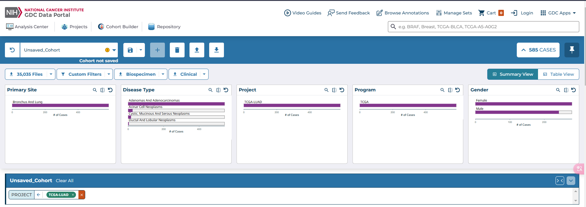
点击CASES,选择TCGA-LUAD project,进行检索

接着点击Genes，查看Distribution of Most Frequently Mutated Genes

最后点击Mutations,查看突变频率最高的10个突变类型
### 1.2 检索结果

- 肺癌(TCGA-LUAD project)中体细胞突变频率最高的10个基因(genes)

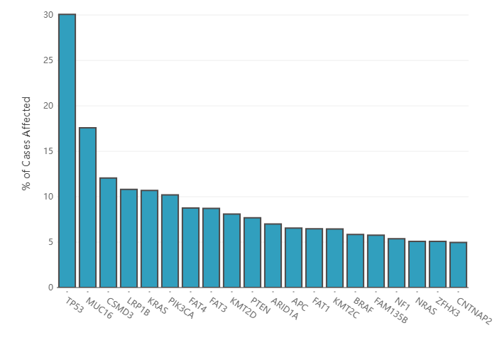

-  肺癌(TCGA-LUAD project)中体细胞突变频率最高的10个突变类型(motations）
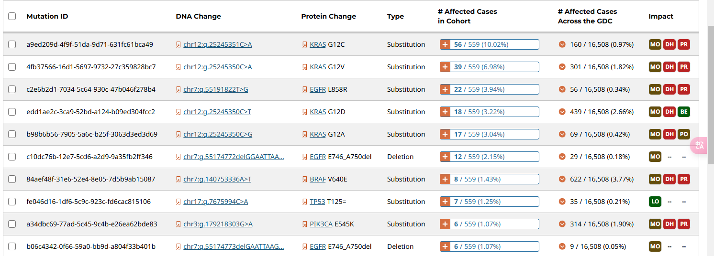

## 2 上机实践2

### 2.1 检索过程

首先，进入CHEMBL官网，在Search 的下拉选项中选择Compound Search， 找到Structure Search 部分，点击Draw Structure按钮，打开化学结构编辑器，根据给出的图片绘制需要检索的化合物的键线式，进行检索，找到我们需要的化合物
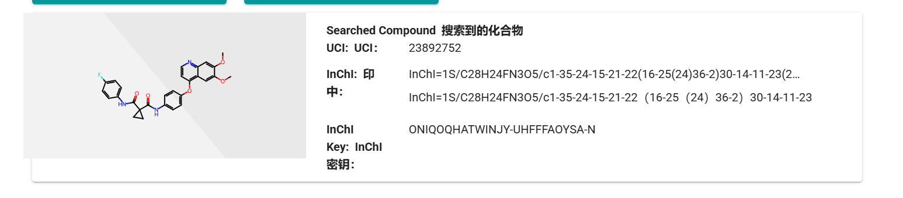

点击Activity Charts 得到对应的分布图

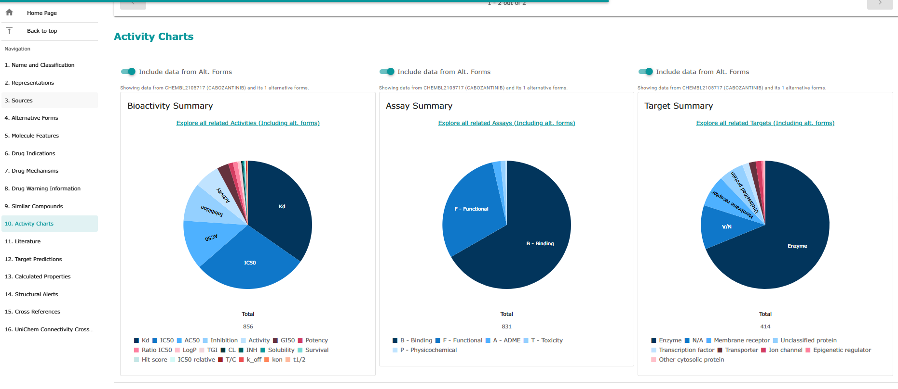

接着在当前页面点击Druc Mechanisms,找到两个靶标及其对应ID

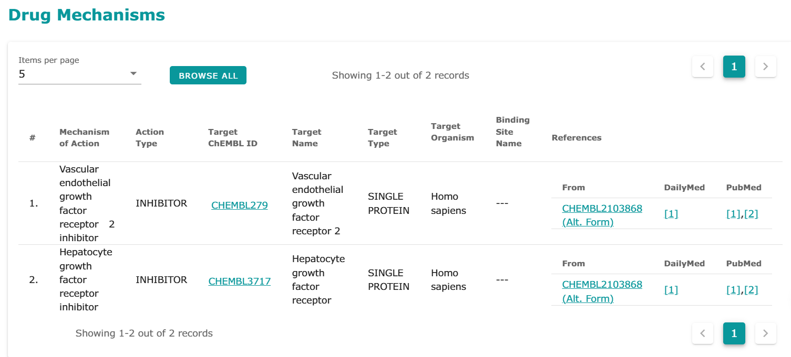

分别点击两个靶标ID,找到其对应的Activity Charts

**CHEMBL279:**
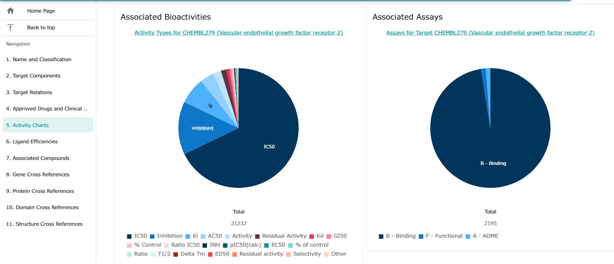

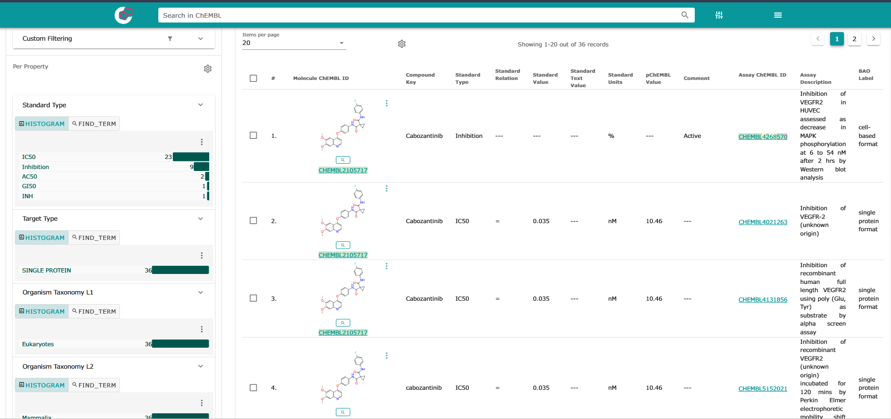

点击对应的activity charts ， 就可以找到在不同试验中针对该靶标对应所要求化合物的活性数值

**CHEMBL3717:**

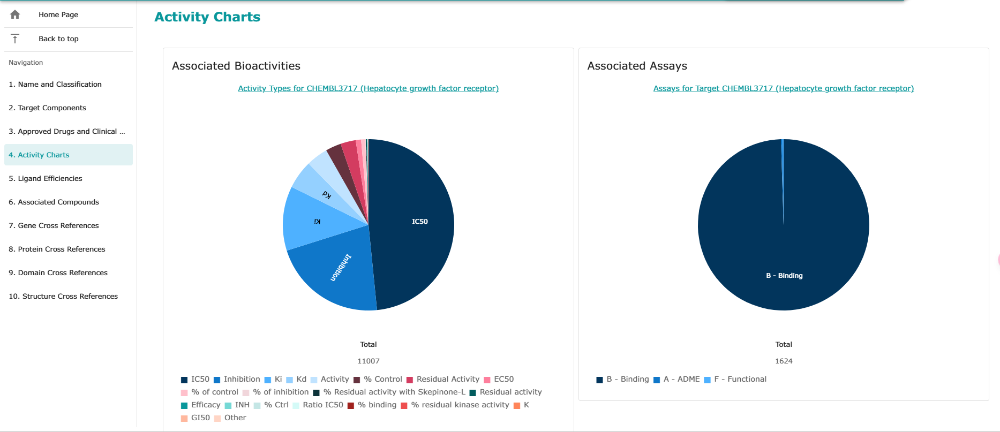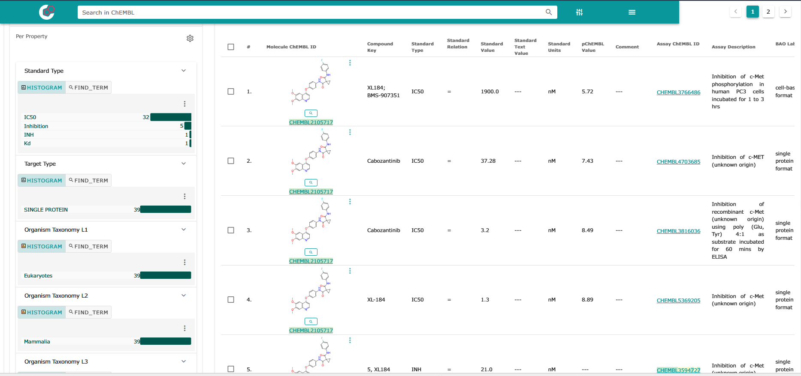
步骤同上

这样我们就得到了所求化合物的生物活性信息

## 3 上机实验3

我们选择CHEMBL作为数据源，在CHEMBL中搜索hepatocellular carcinoma ，筛选出与肝癌相关的试验，接着点击对应的试验，找出该试验中化合物与靶标对应的名称

比如：

在**Proliferation assay: SNU-449 (hepatocellular carcinoma)** 中，我们找到

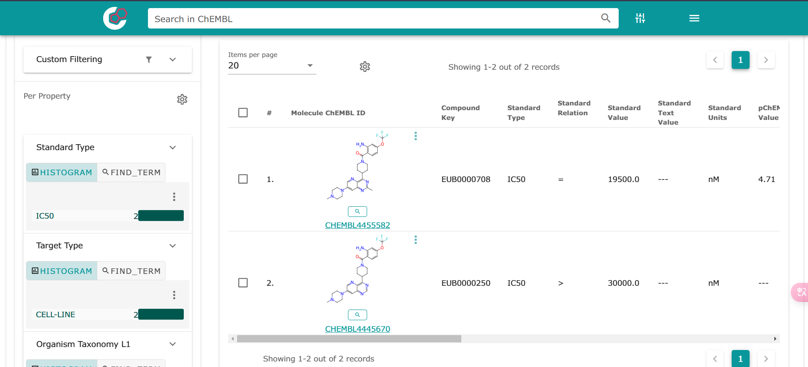

此处找出的靶标组合为BAY-693和# SNU-449

在**Antitumor activity against human hepatocellular carcinoma Hells** 中，我们找到

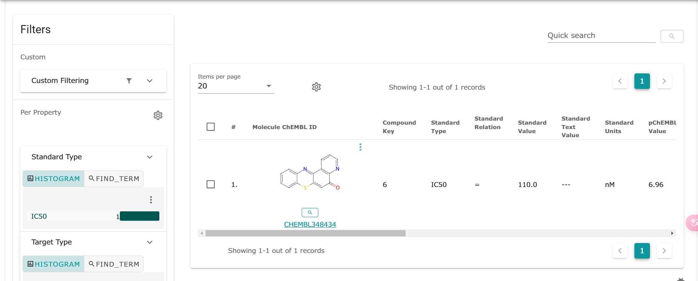

此处找出的靶标组合为CHEMBL348434和HepG2

