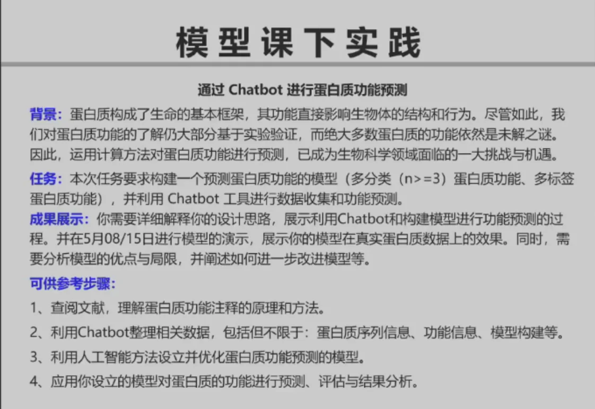
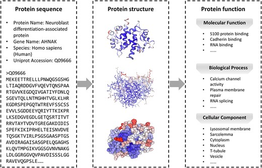
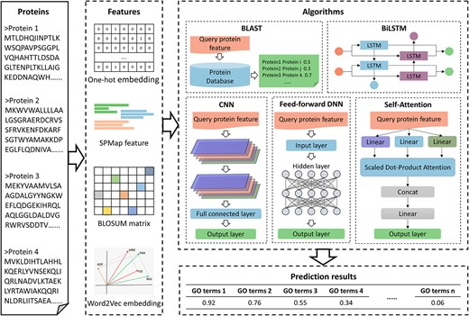

## 1 蛋白质功能注释的原理与方法

在蛋白质研究中，遵循“序列-结构-功能”的范式。目前，蛋白质功能由基因本体论 （GO）标准化，它包括三个方面：生物过程本体论 （BPO）、分子功能本体论 （MFO） 和细胞成分本体论 （CCO）


“序列-结构-函数”范式的示意图。序列是指蛋白质中氨基酸的排列。结构是指蛋白质原子的三维排列。功能是指蛋白质在生物体内发挥的特殊作用 。通常，蛋白质序列决定了它的结构，而结构又决定了它的功能。

在过去的几十年里，已经提出了许多计算方法来预测蛋白质功能。这些方法根据它们使用的信息类型可分为四组：基于序列的方法、基于 3D 结构的方法、基于 PPI 网络的方法和基于混合信息的方法。需要注意的是，这些类别并不严格不同，它们之间存在重叠和相关性。例如，一些基于结构或 PPI 信息的计算方法也使用序列信息来预测蛋白质功能。


## 2 模型构建


#### 2.1.1 蛋白质序列信息

**蛋白质序列信息**是指蛋白质中氨基酸残基的线性排列顺序，这是蛋白质最基本的结构特征。

 主要特点：
- **表示方式**：通常用20种标准氨基酸的单字母或三字母缩写表示（例如：A代表丙氨酸Alanine，R代表精氨酸Arginine等）
- **标准格式**：常见的序列格式包括FASTA格式、UniProt格式等
- **序列长度**：从几十到几千个氨基酸不等，平均约300个氨基酸

 示例（FASTA格式）：
```
>sp|P99999|CYC_HUMAN Cytochrome c
MGDVEKGKKIFIMKCSQCHTVEKGGKHKTGPNLHGLFGRKTGQAPGYSYTAANKNKGIIWGEDTLMEYLENPKKYIPGTKMIFVGIKKKEERADLIAYLKKATNE
```

重要性：
- 序列决定蛋白质的折叠方式和最终三维结构
- 是预测蛋白质功能的基本输入数据
- 通过序列比对可以推断蛋白质的进化关系

蛋白质功能信息

**蛋白质功能信息**描述蛋白质在生物体内执行的生物学任务或角色。

主要分类：
- **分子功能(Molecular Function)**：描述蛋白质的分子活性，如催化活性或结合活性
- **生物过程(Biological Process)**：描述蛋白质参与的生物学过程，如细胞凋亡、信号传导等
- **细胞组分(Cellular Component)**：描述蛋白质在细胞中的定位，如细胞核、线粒体等

功能注释系统：
- **基因本体论(GO，Gene Ontology)**：最广泛使用的功能注释系统，提供标准化词汇表描述蛋白质功能
- **酶委员会编号(EC Number)**：对酶的功能进行分类的数字代码系统
- **KEGG通路**：描述蛋白质参与的代谢和信号通路

### 2.2 示例（GO术语）：
- GO:0005515 - 蛋白质结合(protein binding)
- GO:0006915 - 细胞凋亡过程(apoptotic process)
- GO:0005739 - 线粒体(mitochondrion)

序列相似的蛋白质通常具有相似的功能，这是序列比对方法的基础

基于序列的方法侧重于蛋白质序列，通过从中提取与功能相关的潜在特征来预测蛋白质功能。这些方法深入研究氨基酸序列中包含的信息，并试图捕捉嵌入其中的与蛋白质功能相关的细微特征



首先，通过不同的方法从序列中提取特征。其次，将提取的特征输入到某种算法中。最后，通过训练模型预测未知蛋白质的功能，并计算它们属于特定 GO 项的概率。但是，BLAST 工具会在数据库中搜索与目标蛋白相似的序列，无需从序列中提取特征。

以下是推荐的3-4个分类角度：

1. **代谢酶 (Metabolic Enzymes):**
    
    - **功能：** 这类蛋白质的主要作用是催化细胞内各种生物化学反应，是新陈代谢途径（如糖酵解、三羧酸循环、脂肪酸合成与分解等）的核心参与者。
    - **特点：** 通常具有特定的活性位点，序列上可能包含与辅酶或底物结合相关的保守模体（motifs）。
    - **例子：** 己糖激酶、丙酮酸脱氢酶、脂肪酸合酶。
2. **转录调控因子 (Transcription Regulators):**
    
    - **功能：** 这类蛋白质通过与DNA特定序列结合，调控基因的转录（即基因的“开启”或“关闭”），从而控制细胞的功能和命运。
    - **特点：** 通常包含DNA结合域（如锌指、螺旋-转角-螺旋等）以及与其他调控蛋白相互作用的结构域。
    - **例子：** p53抑癌蛋白、Hox蛋白、类固醇激素受体。
3. **跨膜转运蛋白 (Transporters):**
    
    - **功能：** 这类蛋白质镶嵌在细胞膜或细胞器膜上，负责选择性地将离子、营养物质、代谢产物等分子跨膜运输。
    - **特点：** 其序列通常包含一个或多个跨膜区域（疏水性氨基酸富集），形成通道或载体结构。
    - **例子：** 葡萄糖转运蛋白 (GLUTs)、水通道蛋白 (Aquaporins)、钠钾泵 (Na+/K+-ATPase)。
4. **细胞骨架蛋白 (Cytoskeletal Proteins):** (如果需要第四类)
    
    - **功能：** 这类蛋白质构成细胞的骨架系统，为细胞提供结构支持、维持细胞形态、参与细胞运动、细胞分裂以及细胞内物质运输等。
    - **特点：** 通常能自组装成长丝状结构，具有重复性的结构单元。
    - **例子：** 肌动蛋白 (Actin)、微管蛋白 (Tubulin)、角蛋白 (Keratin)。

**选择这些角度的理由：**

- **功能相对明确且重要：** 这几类蛋白质代表了细胞内一些最基本和核心的功能活动。
- **结构与序列特征的潜在差异：** 不同功能的蛋白质往往在序列组成、结构域、二级结构和三级结构上有一定的差异，这为机器学习模型提供了学习和区分的基础。例如，跨膜蛋白通常有明显的疏水跨膜区，DNA结合蛋白有特定的DNA结合域。
- **数据可获得性：** 这些类别的蛋白质在公共数据库 (如UniProt) 中有大量的注释信息和序列数据，便于收集训练样本。
- **符合项目要求：** 能够满足你项目初期对3-4类进行多分类的需求。

**在实际操作中，你需要注意：**

- **明确分类标准：** 在收集数据时，要确保每个蛋白质被明确地归入一个类别。可以参考Gene Ontology (GO) 等数据库中的注释，选择那些主要功能明确属于某一类的蛋白质。
- **避免高度重叠：** 虽然蛋白质功能复杂，可能存在“兼职”现象，但在初期进行多分类时，尽量选择功能界限相对清晰的类别和蛋白质样本。

从代谢酶的角度，它们最主要和最系统化的分类方式是根据**国际酶学委员会 (Enzyme Commission, EC)** 的分类系统。这个系统根据酶所催化的化学反应类型将酶分为七大类，每一类下面又进一步细分为亚类和次亚类。

对于代谢途径中的酶，它们都会归属于这七大类之一：

1. **EC 1: 氧化还原酶 (Oxidoreductases)**
    
    - **功能：** 催化氧化还原反应，即电子的转移。这些酶通常需要辅酶（如NAD$^+$、FAD）作为电子的载体。
    - **代谢中的例子：**
        - **脱氢酶 (Dehydrogenases)：** 如乳酸脱氢酶（催化乳酸和丙酮酸之间的转化）、乙醇脱氢酶。
        - **氧化酶 (Oxidases)：** 如细胞色素c氧化酶（电子传递链的最终氧化酶）。
        - **过氧化物酶 (Peroxidases)：** 清除过氧化氢。
2. **EC 2: 转移酶 (Transferases)**
    
    - **功能：** 催化一个分子官能团（如甲基、乙酰基、氨基、磷酸基等）从一个分子（供体）转移到另一个分子（受体）。
    - **代谢中的例子：**
        - **激酶 (Kinases)：** 转移磷酸基，通常由ATP提供磷酸基，如己糖激酶（催化葡萄糖磷酸化）、蛋白激酶。
        - **氨基转移酶 (Aminotransferases/Transaminases)：** 转移氨基，在氨基酸代谢中非常重要，如丙氨酸氨基转移酶。
        - **甲基转移酶 (Methyltransferases)：** 转移甲基。
3. **EC 3: 水解酶 (Hydrolases)**
    
    - **功能：** 催化化学键的水解反应，即利用水分子将一个大分子断裂成两个小分子。
    - **代谢中的例子：**
        - **蛋白酶/肽酶 (Proteases/Peptidases)：** 水解蛋白质中的肽键，如胃蛋白酶、胰蛋白酶。
        - **脂肪酶 (Lipases)：** 水解甘油三酯（脂肪）生成甘油和脂肪酸。
        - **糖苷酶 (Glycosidases)：** 水解糖苷键，如淀粉酶（水解淀粉）、乳糖酶。
        - **磷酸酶 (Phosphatases)：** 去除磷酸基团，与激酶功能相反。
4. **EC 4: 裂解酶 (Lyases)**
    
    - **功能：** 催化非水解、非氧化的方式裂解化学键，或从底物移去一个基团形成双键（或反向反应，将基团加到双键上）。
    - **代谢中的例子：**
        - **脱羧酶 (Decarboxylases)：** 移去羧基并释放CO$_2$，如丙酮酸脱羧酶。
        - **醛缩酶 (Aldolases)：** 如糖酵解中的果糖-1,6-二磷酸醛缩酶。
        - **水合酶/脱水酶 (Hydratases/Dehydratases)：** 如延胡索酸酶（催化延胡索酸水合生成苹果酸）。
5. **EC 5: 异构酶 (Isomerases)**
    
    - **功能：** 催化分子内的结构重排，将一个分子转变为其同分异构体。
    - **代谢中的例子：**
        - **消旋酶 (Racemases) 和差向异构酶 (Epimerases)：** 改变手性中心的构型，如丙氨酸消旋酶。
        - **顺反异构酶 (Cis-trans isomerases)：** 催化顺反异构。
        - **分子内转移酶 (Intramolecular transferases)：** 如磷酸葡萄糖异构酶（催化葡萄糖-6-磷酸和果糖-6-磷酸之间的转化）。
6. **EC 6: 连接酶 (Ligases)**
    
    - **功能：** 催化两个分子连接形成新化学键的反应，此过程通常与ATP（或其他类似的核苷三磷酸）的水解相偶联以提供能量。
    - **代谢中的例子：**
        - **合成酶 (Synthetases)：** 如谷氨酰胺合成酶（利用ATP连接谷氨酸和氨生成谷氨酰胺）。
        - **羧化酶 (Carboxylases) (某些类型)：** 如丙酮酸羧化酶（利用ATP将CO$_2$加到丙酮酸上生成草酰乙酸）。
        - **DNA连接酶 (DNA ligase)：** 连接DNA片段。
7. **EC 7: 转位酶 (Translocases)**
    
    - **功能：** 催化离子或分子跨膜转运，或其在膜内的分离。这类酶通常是膜蛋白。
    - **代谢中的例子：**
        - **ATP酶（某些类型作为离子泵）：** 如H$^+$-ATP酶（质子泵）。
        - **许多参与物质跨膜运输的蛋白质**，如线粒体内膜上的某些载体。

# 模型构建

好的，我们来详细分析一下之前为你设计的1D CNN（一维卷积神经网络）模型的构建流程。这个流程主要指的是在Keras中使用`Sequential` API来逐层搭建网络结构，并最终编译模型以备训练。

模型构建的目标：

我们的目标是构建一个能够接收蛋白质序列作为输入，并输出该蛋白质属于预定义的几个酶类别（EC1, EC2, EC3, EC5, EC6）中哪一个的概率的模型。

回顾模型输入：

在进入模型之前，原始的蛋白质氨基酸序列（如 "MKT...Y"）经过了以下预处理：

1. **整数编码：** 每个氨基酸字符（A, C, D,...W, Y, 以及一个代表未知氨基酸的'X'）被映射为一个唯一的整数（例如，A->1, C->2,..., X->21）。
2. **序列填充/截断：** 所有整数编码后的序列都被处理成统一的长度 `MAX_SEQUENCE_LENGTH`。较短的序列会在末尾用0进行填充（padding），较长的序列会被截断。 所以，模型的直接输入是一个形状为 `(batch_size, MAX_SEQUENCE_LENGTH)` 的2D整数张量。

---

**模型各层详细分析 (Keras `Sequential` 模型)**

我们使用的是Keras的`Sequential`模型，这意味着各层是线性堆叠的，前一层的输出是后一层的输入。

Python

```
model = Sequential(name="Protein_1D_CNN")
```

1. **`Embedding`层 (嵌入层)**
    
    Python
    
    ```
    model.add(Embedding(input_dim=VOCAB_SIZE,
                        output_dim=EMBEDDING_DIM,
                        input_length=MAX_SEQUENCE_LENGTH,
                        name="embedding_layer"))
    ```
    
    - **目的：** 将输入的整数编码的氨基酸序列转换为稠密的向量表示。这一层的主要作用是学习氨基酸之间的“语义”关系，并将每个氨基酸映射到一个固定维度的“嵌入向量”中。相比于稀疏的独热编码 (One-hot encoding)，嵌入层能更有效地表示特征，并且可以减少后续层的参数量。
    - **参数解释：**
        - `input_dim=VOCAB_SIZE`: 输入数据的词汇表大小。这里是不同氨基酸（加上填充符0和未知符'X'）的总数。例如，如果20种标准氨基酸+1个'X'+1个padding=0，那么可能是22。在我们的代码中，`VOCAB_SIZE` 被设置为 `len(char_to_int) + 1`，其中 `char_to_int` 包含了20个标准氨基酸和'X'，索引从1开始，所以 `VOCAB_SIZE` 实际上是 `(20+1) + 1 = 22`，代表索引0到21。
        - `output_dim=EMBEDDING_DIM`: 每个氨基酸嵌入向量的维度。这是一个超参数，例如设置为64，意味着每个氨基酸会被表示成一个64维的浮点数向量。
        - `input_length=MAX_SEQUENCE_LENGTH`: 输入序列的长度。
    - **输出：** 形状为 `(batch_size, MAX_SEQUENCE_LENGTH, EMBEDDING_DIM)` 的3D张量。现在，序列中的每个位置不再是一个整数，而是一个 `EMBEDDING_DIM` 维的向量。
2. **第一个卷积块 (`Conv1D`, `MaxPooling1D`, `Dropout`)**
    
    Python
    
    ```
    model.add(Conv1D(filters=NUM_FILTERS_1,
                     kernel_size=KERNEL_SIZE_1,
                     activation='relu',
                     padding='same',
                     name="conv1d_1"))
    model.add(MaxPooling1D(pool_size=2, name="maxpool1d_1"))
    model.add(Dropout(DROPOUT_RATE, name="dropout_1"))
    ```
    
    - **`Conv1D` (一维卷积层)**:
        - **目的：** 充当“模体扫描器”(motif scanner)。它在输入的氨基酸嵌入序列上滑动一个固定大小的卷积核（滤波器），以检测局部的氨基酸模式（例如，连续`KERNEL_SIZE_1`个氨基酸组成的短序列模式）。不同的滤波器会学习识别不同类型的模式。
        - **参数解释：**
            - `filters=NUM_FILTERS_1`: 卷积核的数量（也是输出特征图的深度）。例如128个，意味着这一层会学习128种不同的局部模式。
            - `kernel_size=KERNEL_SIZE_1`: 1D卷积窗口的长度。例如7，表示卷积核一次查看7个连续的氨基酸（的嵌入向量）。
            - `activation='relu'`: 激活函数，引入非线性，使得模型能学习更复杂的模式。ReLU (Rectified Linear Unit) 是常用的激活函数。
            - `padding='same'`: 填充策略。`'same'`表示在输入序列的两端进行填充，使得卷积操作后的输出序列长度与输入序列长度相同（对于卷积的“时间”维度而言）。
        - **输出：** 形状为 `(batch_size, MAX_SEQUENCE_LENGTH, NUM_FILTERS_1)` 的3D张量。
    - **`MaxPooling1D` (一维最大池化层)**:
        - **目的：** 对卷积层输出的特征图进行下采样。它通过取特征图局部区域的最大值来减少数据的维度，有助于：
            - 减少后续层的计算量。
            - 提取最显著的特征，使得模型对模体在序列中的具体位置不那么敏感（平移不变性）。
        - **参数解释：**
            - `pool_size=2`: 池化窗口的大小。这里为2，意味着将序列长度减半（大约）。
        - **输出：** 形状为 `(batch_size, MAX_SEQUENCE_LENGTH / 2, NUM_FILTERS_1)` 的3D张量。
    - **`Dropout` (丢弃层)**:
        - **目的：** 正则化技术，用于防止模型在训练数据上过拟合。它在训练过程中以一定的概率 (`DROPOUT_RATE`) 随机地将输入单元（神经元）的激活值设置为0。
        - **参数解释：**
            - `rate=DROPOUT_RATE`: 需要丢弃的输入单元的比例，例如0.4表示40%。
        - **工作方式：** 迫使网络学习冗余表示，减少神经元之间的共同适应，从而提高模型的泛化能力。在测试时，Dropout层不起作用，所有单元都保持激活状态（但其输出会按比例缩小）。
3. **第二个卷积块 (与第一个类似，可选)**
    
    Python
    
    ```
    model.add(Conv1D(filters=NUM_FILTERS_2,
                     kernel_size=KERNEL_SIZE_2,
                     activation='relu',
                     padding='same',
                     name="conv1d_2"))
    model.add(MaxPooling1D(pool_size=2, name="maxpool1d_2"))
    model.add(Dropout(DROPOUT_RATE, name="dropout_2"))
    ```
    
    - **目的：** 在第一个卷积块提取的特征基础上，学习更高级别、更复杂的特征模式。通常，网络中更深的卷积层能捕捉到更大感受野的特征。
    - **参数和工作方式** 与第一个卷积块类似，但可以有不同的`filters`和`kernel_size`。
    - **输出：** 经过这个块后，序列长度会进一步减小（如果`pool_size=2`，则再减半），特征图的深度变为`NUM_FILTERS_2`。例如，形状变为 `(batch_size, MAX_SEQUENCE_LENGTH / 4, NUM_FILTERS_2)`。
4. **`GlobalMaxPooling1D` (全局最大池化层)**
    
    Python
    
    ```
    model.add(GlobalMaxPooling1D(name="global_maxpool1d"))
    ```
    
    - **目的：** 将前一个卷积块输出的每个特征图（对应每个滤波器）在整个序列维度上进行最大池化。也就是说，对于`NUM_FILTERS_2`个特征图中的每一个，它只保留该特征图在所有时间步（序列位置）上的最大值。
    - **工作方式：** 将形状为 `(batch_size, steps, features)` 的输入转换为形状为 `(batch_size, features)` 的输出。这有效地为每个输入序列生成了一个固定长度的特征向量，无论在卷积过程中序列长度如何变化。这个向量可以被看作是整个序列最重要的特征的总结。
    - **替代方案：** 可以使用`Flatten()`层，它会将所有特征图的所有值展平成一个长向量。但`GlobalMaxPooling1D` (或`GlobalAveragePooling1D`) 通常在序列分类中表现更好，因为它们对输入长度的变化更不敏感，并且能减少参数数量。
    - **输出：** 形状为 `(batch_size, NUM_FILTERS_2)` 的2D张量。
5. **第一个全连接（稠密）隐层 (`Dense`, `Dropout`)**
    
    Python
    
    ```
    model.add(Dense(DENSE_UNITS, activation='relu', name="dense_hidden"))
    model.add(Dropout(DROPOUT_RATE, name="dropout_dense"))
    ```
    
    - **`Dense` (全连接层)**:
        - **目的：** 在卷积和池化层提取的特征基础上进行更高层次的非线性组合，以学习类别之间的复杂关系。
        - **参数解释：**
            - `units=DENSE_UNITS`: 该层神经元的数量，例如128。
            - `activation='relu'`: 激活函数。
        - **工作方式：** 每个神经元都与前一层（`GlobalMaxPooling1D`的输出）的所有单元相连接。
        - **输出：** 形状为 `(batch_size, DENSE_UNITS)` 的2D张量。
    - **`Dropout`**: 同样用于防止过拟合。
6. **输出层 (`Dense`)**
    
    Python
    
    ```
    model.add(Dense(NUM_CLASSES, activation='softmax', name="output_softmax"))
    ```
    
    - **目的：** 最终的分类层，为每个输入序列输出其属于各个酶类别的概率。
    - **参数解释：**
        - `units=NUM_CLASSES`: 输出单元的数量，等于你要分类的酶的类别总数（例如5个类别）。
        - `activation='softmax'`: Softmax激活函数。它将输出层的原始输出（logits）转换为一个概率分布，确保所有输出概率值都在0到1之间，并且它们的总和为1。每个输出单元对应一个类别的概率。
    - **输出：** 形状为 `(batch_size, NUM_CLASSES)` 的2D张量，其中每一行是一个概率分布。

---

**模型编译 (`model.compile(...)`)**

在定义完模型结构后，需要编译模型来配置其学习过程：

Python

```
model.compile(optimizer='adam',
              loss='categorical_crossentropy',
              metrics=['accuracy'])
```

- **`optimizer='adam'` (优化器):**
    - **目的：** 指定用于更新网络权重以最小化损失函数的算法。
    - **'adam'**: 一种常用的、自适应学习率的优化算法，通常在各种任务中表现良好，收敛速度较快。
- **`loss='categorical_crossentropy'` (损失函数):**
    - **目的：** 衡量模型预测结果与真实标签之间的差异（“误差”）。训练过程的目标是最小化这个损失。
    - **'categorical_crossentropy'**: 适用于多分类问题，且真实标签是独热编码 (one-hot encoded) 形式（例如，`[0,1,0,0,0]` 代表属于第2类）。如果真实标签是整数形式（例如，`1` 代表属于第2类），则应使用 `sparse_categorical_crossentropy`。
- **`metrics=['accuracy']` (评估指标):**
    - **目的：** 在训练和评估过程中监控的指标，用于判断模型的性能。
    - **'accuracy'**: 对于分类问题，准确率是最直观的指标之一，表示被正确分类的样本所占的比例。

---

**整体流程总结：**

1. **输入序列**首先通过**嵌入层**转换为向量序列，捕捉氨基酸的语义信息。
2. 然后，**一系列卷积和池化层**（卷积块）像特征提取器一样工作，从局部（短的氨基酸模式）到逐渐更全局的层面学习序列中的层次化特征。Dropout层在其中帮助防止过拟合。
3. **全局池化层**（如 `GlobalMaxPooling1D`）将卷积部分提取的可变长度特征图转换为固定长度的特征向量，代表了整个序列的关键信息。
4. 这个特征向量接着被送入**一个或多个全连接（稠密）层**，这些层进一步组合这些特征，并学习它们与最终酶类别之间的非线性映射关系。
5. 最后，**带有Softmax激活的输出层**产生每个类别的概率，从而完成分类任务。
6. **编译步骤**则为这个学习过程配置了优化器、损失函数和评估标准。

这个流程体现了深度学习模型（特别是CNN）在处理序列数据时从原始输入中自动学习相关特征的强大能力。模型的参数（权重和偏置）会在训练过程中通过反向传播和优化器不断调整，以最小化损失函数。


# 模型评估
pip install https://ms-release.obs.cn-north-4.myhuaweicloud.com/2.2.14/MindSpore/cpu/x86_64/mindspore-2.2.14-cp37-cp37m-win_amd64.whl --trusted-host ms-release.obs.cn-north-4.myhuaweicloud.com -i https://pypi.tuna.tsinghua.edu.cn/simple

