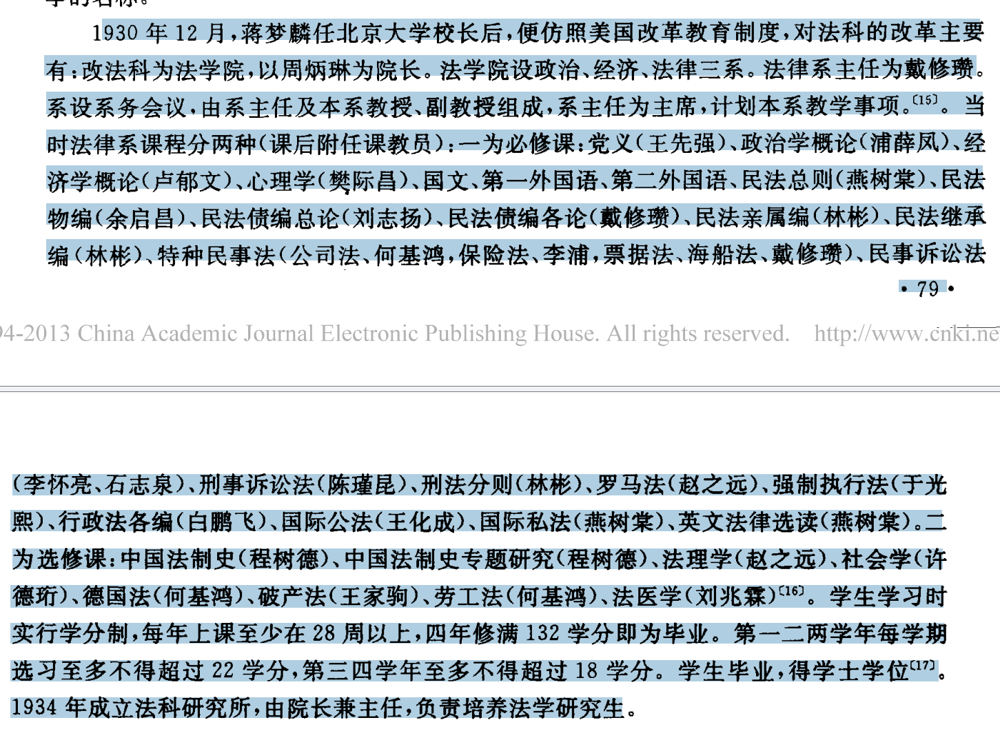

# 国立北京大学教员录 1942
民国31年，1942
- 院长 方宗鳌
> 方宗鳌早年留学日本.1903年至1905年就读于“[东京同文书院](https://zh.wikipedia.org/wiki/%E4%B8%9C%E4%BA%9A%E5%90%8C%E6%96%87%E4%B9%A6%E9%99%A2 "东亚同文书院")”。毕业后，回到广东普宁，在家乡创办了师范学校速成科。1908年，作为清末的公费留学生再次东渡日本留学。同年6月入[日本](https://zh.wikipedia.org/wiki/%E6%97%A5%E6%9C%AC "日本")[山口县](https://zh.wikipedia.org/wiki/%E5%B1%B1%E5%8F%A3%E5%8E%BF "山口县")“山口高等商业学校”学习；1911年毕业后，入[明治大学](https://zh.wikipedia.org/wiki/%E6%98%8E%E6%B2%BB%E5%A4%A7%E5%AD%B8 "明治大学")学习经济学，1914年毕业。归国后，历任中央银行稽核；[北京大学](https://zh.wikipedia.org/wiki/%E5%8C%97%E4%BA%AC%E5%A4%A7%E5%AD%A6 "北京大学")法学院教授，院长；[北京大学](https://zh.wikipedia.org/wiki/%E5%8C%97%E4%BA%AC%E5%A4%A7%E5%AD%A6 "北京大学")、[朝阳大学](https://zh.wikipedia.org/wiki/%E6%9C%9D%E9%98%B3%E5%A4%A7%E5%AD%A6 "朝阳大学")、[中国大学](https://zh.wikipedia.org/wiki/%E4%B8%AD%E5%9B%BD%E5%A4%A7%E5%AD%A6 "中国大学")经济学教授、教务长及商学系主任；中央银行董事等职。

-  法律系主任教授 朱颐年

- **金子一（Kaneko Hajime，1906** 年 [12 月 18](https://ja.wikipedia.org/wiki/1906%E5%B9%B4 "1906年") 日 [-](https://ja.wikipedia.org/wiki/%E6%98%8E%E6%B2%BB "明治") [1973](https://ja.wikipedia.org/wiki/1973%E5%B9%B4 "1973年") [年 4 月 6 日](https://ja.wikipedia.org/wiki/4%E6%9C%886%E6%97%A5 "4月6日")）是一位[日本](https://ja.wikipedia.org/wiki/%E6%97%A5%E6%9C%AC "日本")[法学家](https://ja.wikipedia.org/wiki/%E6%97%A5%E6%9C%AC%E3%81%AE%E6%B3%95%E5%AD%A6%E8%80%85%E4%B8%80%E8%A6%A7#%E6%B0%91%E4%BA%8B%E8%A8%B4%E8%A8%9F%E6%B3%95 "日本の法学者一覧")。 他专门研究[民事诉讼法](https://ja.wikipedia.org/wiki/%E6%B0%91%E4%BA%8B%E8%A8%B4%E8%A8%9F%E6%B3%95 "民事訴訟法")。 他拥有法学[博士学位](https://ja.wikipedia.org/wiki/%E5%AD%A6%E4%BD%8D "学位")。 曾任[东京大学](https://ja.wikipedia.org/wiki/%E6%9D%B1%E4%BA%AC%E5%A4%A7%E5%AD%A6 "東京大学")教授。 [三等](https://ja.wikipedia.org/wiki/%E5%BE%93%E4%B8%89%E4%BD%8D "従三位")勋章，[一等](https://ja.wikipedia.org/wiki/%E5%8B%B2%E7%AD%89 "勲等")[宝勋章](https://ja.wikipedia.org/wiki/%E7%91%9E%E5%AE%9D%E7%AB%A0 "瑞宝章")。 当时，他专门研究民事诉讼法，这是实体法学者的单方面努力，并为日本民事诉讼法的独特性奠定了基础。 [在加藤正治的领导下](https://ja.wikipedia.org/wiki/%E5%8A%A0%E8%97%A4%E6%AD%A3%E6%B2%BB "加藤正治")。 他的弟子包括 [Morio Takeshita](https://ja.wikipedia.org/wiki/%E7%AB%B9%E4%B8%8B%E5%AE%88%E5%A4%AB "竹下守夫")、[Koji Shindo](https://ja.wikipedia.org/wiki/%E6%96%B0%E5%A0%82%E5%B9%B8%E5%8F%B8 "新堂幸司")、[Noboru Koyama](https://ja.wikipedia.org/wiki/%E5%B0%8F%E5%B1%B1%E6%98%87_(%E6%B3%95%E5%AD%A6%E8%80%85) "小山昇 (法学者)")、[Hideo Saito](https://ja.wikipedia.org/wiki/%E6%96%8E%E8%97%A4%E7%A7%80%E5%A4%AB "斎藤秀夫") 和 [Koichi Shimoshima](https://ja.wikipedia.org/w/index.php?title=%E9%9C%9C%E5%B3%B6%E7%94%B2%E4%B8%80&action=edit&redlink=1 "「霜島甲一」 (存在しないページ)")。

- **稻田正嗣（Masatsugu，1902** [年 8 月 26 日](https://ja.wikipedia.org/wiki/8%E6%9C%8826%E6%97%A5 "8月26日") [-](https://ja.wikipedia.org/wiki/%E6%98%8E%E6%B2%BB "明治") [1984](https://ja.wikipedia.org/wiki/1984%E5%B9%B4 "1984年") [年 8 月 14 日](https://ja.wikipedia.org/wiki/8%E6%9C%8814%E6%97%A5 "8月14日")）是一位[日本](https://ja.wikipedia.org/wiki/%E6%97%A5%E6%9C%AC "日本")[宪法学者](https://ja.wikipedia.org/wiki/%E6%86%B2%E6%B3%95 "憲法")。 [法学博士](https://ja.wikipedia.org/wiki/%E6%B3%95%E5%AD%A6%E5%8D%9A%E5%A3%AB "法学博士") [[1]。](https://ja.wikipedia.org/wiki/%E7%A8%B2%E7%94%B0%E6%AD%A3%E6%AC%A1#cite_note-1) [东京教育大学](https://ja.wikipedia.org/wiki/%E6%9D%B1%E4%BA%AC%E6%95%99%E8%82%B2%E5%A4%A7%E5%AD%A6 "東京教育大学")名誉教授。[1945 年](https://ja.wikipedia.org/wiki/1945%E5%B9%B4 "1945年")，战争结束后，他于 12 月向政府提交了一份[私人宪法修正案草案](https://www.ndl.go.jp/constitution/shiryo/02/055/055tx.html)并公布。 该草案以[英国](https://ja.wikipedia.org/wiki/%E3%82%A4%E3%82%AE%E3%83%AA%E3%82%B9 "イギリス")宪法为蓝本，并以[美国](https://ja.wikipedia.org/wiki/%E3%82%A2%E3%83%A1%E3%83%AA%E3%82%AB%E5%90%88%E8%A1%86%E5%9B%BD "アメリカ合衆国")宪法的规定为蓝本。 [1946 年](https://ja.wikipedia.org/wiki/1946%E5%B9%B4 "1946年")，他与[尾崎由纪夫](https://ja.wikipedia.org/wiki/%E5%B0%BE%E5%B4%8E%E8%A1%8C%E9%9B%84 "尾崎行雄")和[岩波茂雄](https://ja.wikipedia.org/wiki/%E5%B2%A9%E6%B3%A2%E8%8C%82%E9%9B%84 "岩波茂雄")一起成立了宪法咨询委员会，起草并公布了[日本宪法草案](https://www.ndl.go.jp/constitution/shiryo/02/092/092tx.html)。[1952 年，他](https://ja.wikipedia.org/wiki/1952%E5%B9%B4 "1952年")成为[东京教育大学的](https://ja.wikipedia.org/wiki/%E6%9D%B1%E4%BA%AC%E6%95%99%E8%82%B2%E5%A4%A7%E5%AD%A6 "東京教育大学")教授，[并于 1953](https://ja.wikipedia.org/wiki/1953%E5%B9%B4 "1953年") 年至 [1957](https://ja.wikipedia.org/wiki/1957%E5%B9%B4 "1957年") 年被任命为[文学院](https://ja.wikipedia.org/wiki/%E6%96%87%E5%AD%A6%E9%83%A8 "文学部")院长。 1960 年出版了《明治宪法制定史》第一卷，1962 年出版了同卷第二卷。 从[誓言五条](https://ja.wikipedia.org/wiki/%E4%BA%94%E7%AE%87%E6%9D%A1%E3%81%AE%E5%BE%A1%E8%AA%93%E6%96%87 "五箇条の御誓文")到[日本帝国宪法](https://ja.wikipedia.org/wiki/%E5%A4%A7%E6%97%A5%E6%9C%AC%E5%B8%9D%E5%9B%BD%E6%86%B2%E6%B3%95 "大日本帝国憲法")的实施，他详细研究了公共和私营部门的私人宪法以及政府内部的宪法制定过程。 由于这一成就，他被授予[法学博士学位](https://ja.wikipedia.org/wiki/%E6%B3%95%E5%AD%A6%E5%8D%9A%E5%A3%AB "法学博士")。

-  杨堃 1931年回国，先后在[河北大学](https://zh.wikipedia.org/wiki/%E6%B2%B3%E5%8C%97%E5%A4%A7%E5%AD%A6 "河北大学")农学院、[国立北平大学](https://zh.wikipedia.org/wiki/%E5%9C%8B%E7%AB%8B%E5%8C%97%E5%B9%B3%E5%A4%A7%E5%AD%B8 "国立北平大学")法商学院、[国立北平大学](https://zh.wikipedia.org/wiki/%E5%9C%8B%E7%AB%8B%E5%8C%97%E5%B9%B3%E5%A4%A7%E5%AD%B8 "国立北平大学")女子文理学院、[国立北平师范大学](https://zh.wikipedia.org/wiki/%E5%9B%BD%E7%AB%8B%E5%8C%97%E5%B9%B3%E5%B8%88%E8%8C%83%E5%A4%A7%E5%AD%A6 "国立北平师范大学")文学院社会学系、[中法大学](https://zh.wikipedia.org/wiki/%E4%B8%AD%E6%B3%95%E5%A4%A7%E5%AD%A6 "中法大学")孔德学院社会科学系、[清华大学](https://zh.wikipedia.org/wiki/%E6%B8%85%E5%8D%8E%E5%A4%A7%E5%AD%A6 "清华大学")社会学系等任教，主讲社会进化史、社会学、普通人类学和民族学。1934年，杨堃等人发起成立了[中国民族学会](https://zh.wikipedia.org/w/index.php?title=%E4%B8%AD%E5%9B%BD%E6%B0%91%E6%97%8F%E5%AD%A6%E4%BC%9A&action=edit&redlink=1 "中国民族学会（页面不存在）")，任民族学会《民族学报》编委。1937年，赴[燕京大学](https://zh.wikipedia.org/wiki/%E7%87%95%E4%BA%AC%E5%A4%A7%E5%AD%A6 "燕京大学")社会学系任教，讲授原始社会学、当代社会学学。1941年因太平洋战争爆发，到到北平中法汉学研究所作民俗学专任研究员，1947年至[云南大学](https://zh.wikipedia.org/wiki/%E4%BA%91%E5%8D%97%E5%A4%A7%E5%AD%A6 "云南大学")任社会学系教，暑假加入了[新民主主义者联盟](https://zh.wikipedia.org/w/index.php?title=%E6%96%B0%E6%B0%91%E4%B8%BB%E4%B8%BB%E4%B9%89%E8%80%85%E8%81%94%E7%9B%9F&action=edit&redlink=1 "新民主主义者联盟（页面不存在）")。

# 国立北京大学职员录 1922

法律系教授
- 黄右昌 民法物权民法亲属民法继承罗马法
>27岁教授民法、罗马法课程，任北京大学法律系教授兼系主任，同时兼任清华大学、法政大学、朝阳大学、中国大学、民国大学和天津法商学院教授。他在执教十八年期间，著有《罗马法与现代》、《海法与空法》、《法律之革命》、《民法要义》等，有“黄罗马”之称。
- 周龙光 商法行政法总论行政法各论
- 燕树棠
> 1916年，燕树棠通过[清华学校](https://zh.wikipedia.org/wiki/%E6%B8%85%E5%8D%8E%E5%AD%A6%E6%A0%A1 "清华学校")专科考试，赴[美国](https://zh.wikipedia.org/wiki/%E7%BE%8E%E5%9B%BD "美国")留学，先后入[哈佛大学](https://zh.wikipedia.org/wiki/%E5%93%88%E4%BD%9B%E5%A4%A7%E5%AD%A6 "哈佛大学")、[哥伦比亚大学](https://zh.wikipedia.org/wiki/%E5%93%A5%E4%BC%A6%E6%AF%94%E4%BA%9A%E5%A4%A7%E5%AD%A6 "哥伦比亚大学")、[耶鲁大学](https://zh.wikipedia.org/wiki/%E8%80%B6%E9%B2%81%E5%A4%A7%E5%AD%A6 "耶鲁大学")学习，1917年获哥伦比亚大学[法学硕士](https://zh.wikipedia.org/wiki/%E6%B3%95%E5%AD%A6%E7%A1%95%E5%A3%AB "法学硕士")学位（L.L.M.），1920年获耶鲁大学[法理学](https://zh.wikipedia.org/wiki/%E6%B3%95%E7%90%86%E5%AD%A6 "法理学")博士学位（J.S.D.）。[[1]](https://zh.wikipedia.org/wiki/%E7%87%95%E6%A8%B9%E6%A3%A0#cite_note-yst-1)
> 回国后，燕树棠历任[北京大学](https://zh.wikipedia.org/wiki/%E5%8C%97%E4%BA%AC%E5%A4%A7%E5%AD%A6 "北京大学")法律学系教授暨系主任，[武汉大学](https://zh.wikipedia.org/wiki/%E6%AD%A6%E6%B1%89%E5%A4%A7%E5%AD%A6 "武汉大学")法律学系教授暨第一任系主任（燕树棠曾三次到武汉大学任职，三次均任系主任），[清华大学](https://zh.wikipedia.org/wiki/%E6%B8%85%E5%8D%8E%E5%A4%A7%E5%AD%A6 "清华大学")法律学系、政治学系教授暨法律学系第一任系主任，[西南联合大学](https://zh.wikipedia.org/wiki/%E8%A5%BF%E5%8D%97%E8%81%94%E5%90%88%E5%A4%A7%E5%AD%A6 "西南联合大学")法律学系教授暨系主任、系教授会主席，先后主讲过[国际私法](https://zh.wikipedia.org/wiki/%E5%9B%BD%E9%99%85%E7%A7%81%E6%B3%95 "国际私法")、[国际公法](https://zh.wikipedia.org/wiki/%E5%9B%BD%E9%99%85%E5%85%AC%E6%B3%95 "国际公法")、[法理学](https://zh.wikipedia.org/wiki/%E6%B3%95%E7%90%86%E5%AD%A6 "法理学")、[宪法](https://zh.wikipedia.org/wiki/%E5%AE%AA%E6%B3%95 "宪法")、[民法](https://zh.wikipedia.org/wiki/%E6%B0%91%E6%B3%95 "民法")概论、民法总则等课。[[1]](https://zh.wikipedia.org/wiki/%E7%87%95%E6%A8%B9%E6%A3%A0#cite_note-yst-1)
- 何基鸿
>何基鸿早年赴日本留学，1912年毕业于[东京帝国大学](https://zh.wikipedia.org/wiki/%E4%B8%9C%E4%BA%AC%E5%B8%9D%E5%9B%BD%E5%A4%A7%E5%AD%A6 "东京帝国大学")，获法学士学位。后又前往德国留学。返回中国后，他先后担任[北洋政府](https://zh.wikipedia.org/wiki/%E5%8C%97%E6%B4%8B%E6%94%BF%E5%BA%9C "北洋政府")[大理院](https://zh.wikipedia.org/wiki/%E5%A4%A7%E7%90%86%E9%99%A2_(%E4%B8%AD%E5%8D%8E%E6%B0%91%E5%9B%BD) "大理院 (中华民国)")书记官、推事，[司法部](https://zh.wikipedia.org/wiki/%E4%B8%AD%E8%8F%AF%E6%B0%91%E5%9C%8B%E6%B3%95%E5%8B%99%E9%83%A8 "中华民国法务部")参事，[国民政府](https://zh.wikipedia.org/wiki/%E5%9B%BD%E6%B0%91%E6%94%BF%E5%BA%9C "国民政府")[考试院](https://zh.wikipedia.org/wiki/%E8%80%83%E8%AF%95%E9%99%A2 "考试院")编撰等职。他还曾任教于[国立北京大学](https://zh.wikipedia.org/wiki/%E5%9B%BD%E7%AB%8B%E5%8C%97%E4%BA%AC%E5%A4%A7%E5%AD%A6 "国立北京大学")，出任北京大学教务长兼第三院（社会科学学院）主任及法律系、政治系主任。
- 陈启修 宪法
> 1905年前往日本留学，先后求学于[东京第一高等学校](https://zh.wikipedia.org/wiki/%E6%9D%B1%E4%BA%AC%E7%AC%AC%E4%B8%80%E9%AB%98%E7%AD%89%E5%AD%B8%E6%A0%A1 "东京第一高等学校")、[东京帝国大学](https://zh.wikipedia.org/wiki/%E4%B8%9C%E4%BA%AC%E5%B8%9D%E5%9B%BD%E5%A4%A7%E5%AD%A6 "东京帝国大学")法科，曾师从日本著名经济学家[河上肇](https://zh.wikipedia.org/wiki/%E6%B2%B3%E4%B8%8A%E8%82%87 "河上肇")。期间翻译了[小林丑三郎](https://zh.wikipedia.org/wiki/%E5%B0%8F%E6%9E%97%E4%B8%91%E4%B8%89%E9%83%8E "小林丑三郎")《财政学提要》一书。1916年与[李大钊](https://zh.wikipedia.org/wiki/%E6%9D%8E%E5%A4%A7%E9%92%8A "李大钊")、[杜国庠](https://zh.wikipedia.org/wiki/%E6%9D%9C%E5%9B%BD%E5%BA%A0 "杜国庠")等人创办[丙辰学社](https://zh.wikipedia.org/w/index.php?title=%E4%B8%99%E8%BE%B0%E5%AD%A6%E7%A4%BE&action=edit&redlink=1 "丙辰学社（页面不存在）")并当选为首任执行部理事。
1917年底回国后任[北京大学](https://zh.wikipedia.org/wiki/%E5%8C%97%E4%BA%AC%E5%A4%A7%E5%AD%A6 "北京大学")法科教授兼政治门研究所主任。1921年当选北大评议会组委会委员。1923年前往欧洲考察。后赴[苏联](https://zh.wikipedia.org/wiki/%E8%8B%8F%E8%81%94 "苏联")[莫斯科东方大学](https://zh.wikipedia.org/wiki/%E8%8E%AB%E6%96%AF%E7%A7%91%E4%B8%9C%E6%96%B9%E5%A4%A7%E5%AD%A6 "莫斯科东方大学")学习，期间加入[中国国民党](https://zh.wikipedia.org/wiki/%E4%B8%AD%E5%9B%BD%E5%9B%BD%E6%B0%91%E5%85%9A "中国国民党")和[中国共产党](https://zh.wikipedia.org/wiki/%E4%B8%AD%E5%9B%BD%E5%85%B1%E4%BA%A7%E5%85%9A "中国共产党")，1924年当选为中共第四期旅莫支部审查委员会委员。1925年回国后继续任教于北大
> 马克思主义经济学家，《资本论》的第一个中文译者

- 毕善功 
> 1910年，转任[北京大学](https://zh.wikipedia.org/wiki/%E5%8C%97%E4%BA%AC%E5%A4%A7%E5%AD%A6 "北京大学")教授。讲授英国法律、英文、拉丁文。
- 程树德
>程树德先生一生主要从事国际法、宪法、中国法制史等领域的研究，一生著述约400余万字。早年便致力于写作，1906年首部著作《国际私法》七卷问世；1919年，《汉律考》七卷问世；1925年，出版《九朝律考》，这是他平生最为重要的著作之一；1928年，《中国法制史》问世，上溯黄帝，下逮有清，阐述历代法令及刑制的发展；1931年《比较国际私法》出版；1933年，《说文稽古编》出版。
- 梁仁杰
>|   |
|---|
|梁仁杰，教授，民国时期省高等法院院长，字云山。江西临川人。早年赴法国留学，进入巴黎大学法科，获法学博士学位。历任国立北京大学法律系教授，北京政府大理院推事，上海租界临时法院刑事庭庭长。1928年1月署国民政府最高法院推事，并任国立中央大学法学院法律学系副教授。嗣后任江西高等法院首席检察官。1929年12月后署江西高等法院院长。1947年6月辞职。1948年12月任江苏省高等法院院长
- 左德敏
>
- 梁宓
- 陈瑾昆
>陈瑾昆于1908年前往[日本](https://zh.wikipedia.org/wiki/%E6%97%A5%E6%9C%AC "日本")留学，就读于[东京帝国大学](https://zh.wikipedia.org/wiki/%E4%B8%9C%E4%BA%AC%E5%B8%9D%E5%9B%BD%E5%A4%A7%E5%AD%A6 "东京帝国大学")法律专业，并获法学士学位。1917年回国，历任[奉天省](https://zh.wikipedia.org/wiki/%E5%A5%89%E5%A4%A9%E7%9C%81 "奉天省")高等审判所推事、庭长，修订法律馆纂修，[大理院](https://zh.wikipedia.org/wiki/%E5%A4%A7%E7%90%86%E9%99%A2_(%E4%B8%AD%E5%8D%8E%E6%B0%91%E5%9B%BD) "大理院 (中华民国)")推事、庭长，最高法院庭长等。期间还兼职任教于[北京大学](https://zh.wikipedia.org/wiki/%E5%8C%97%E4%BA%AC%E5%A4%A7%E5%AD%A6 "北京大学")、[朝阳大学](https://zh.wikipedia.org/wiki/%E6%9C%9D%E9%98%B3%E5%A4%A7%E5%AD%A6 "朝阳大学")、[中国大学](https://zh.wikipedia.org/wiki/%E4%B8%AD%E5%9B%BD%E5%A4%A7%E5%AD%A6 "中国大学")等校。
- 李芳
- 王宠惠
>1901年，他留学日本学习法律、政治。在日本，他发起成立[国民会](https://zh.wikipedia.org/wiki/%E5%9C%8B%E6%B0%91%E6%9C%83 "国民会")，并任《国民报》英文记者，后来他还与[冯斯栾](https://zh.wikipedia.org/w/index.php?title=%E9%A6%AE%E6%96%AF%E6%AC%92&action=edit&redlink=1 "冯斯栾（页面不存在）")、[郑贯一](https://zh.wikipedia.org/w/index.php?title=%E9%84%AD%E8%B2%AB%E4%B8%80&action=edit&redlink=1 "郑贯一（页面不存在）")、[冯自由](https://zh.wikipedia.org/wiki/%E9%A6%AE%E8%87%AA%E7%94%B1 "冯自由")等发起组织[广东独立协会](https://zh.wikipedia.org/w/index.php?title=%E5%BB%A3%E6%9D%B1%E7%8D%A8%E7%AB%8B%E5%8D%94%E6%9C%83&action=edit&redlink=1 "广东独立协会（页面不存在）")。1902年他留学[美国](https://zh.wikipedia.org/wiki/%E7%BE%8E%E5%9C%8B "美国")，1905年于[耶鲁大学](https://zh.wikipedia.org/wiki/%E8%80%B6%E9%B2%81%E5%A4%A7%E5%AD%A6 "耶鲁大学")获[民法学博士](https://zh.wikipedia.org/w/index.php?title=%E6%B0%91%E6%B3%95%E5%AD%B8%E5%8D%9A%E5%A3%AB&action=edit&redlink=1)，留学美国期间，曾为[美国律师公会](https://zh.wikipedia.org/wiki/%E7%BE%8E%E5%9C%8B%E5%BE%8B%E5%B8%AB%E5%8D%94%E6%9C%83 "美国律师协会")[学报](https://zh.wikipedia.org/w/index.php?title=%E7%BE%8E%E5%9C%8B%E5%BE%8B%E5%B8%AB%E5%85%AC%E6%9C%83%E5%AD%B8%E5%A0%B1&action=edit&redlink=1)编辑。此后他到欧洲研习法学，于[英国](https://zh.wikipedia.org/wiki/%E8%8B%B1%E5%9C%8B "英国")[伦敦](https://zh.wikipedia.org/wiki/%E5%80%AB%E6%95%A6 "伦敦")[中殿律师学院](https://zh.wikipedia.org/wiki/%E4%B8%AD%E6%AE%BF%E5%BE%8B%E5%B8%AB%E5%AD%B8%E9%99%A2 "中殿律师学院")获[英格兰及威尔士高等法院](https://zh.wikipedia.org/wiki/%E8%8B%B1%E6%A0%BC%E8%98%AD%E5%8F%8A%E5%A8%81%E7%88%BE%E6%96%AF%E9%AB%98%E7%AD%89%E6%B3%95%E9%99%A2 "英格兰及威尔士高等法院")[大律师](https://zh.wikipedia.org/wiki/%E5%A4%A7%E5%BE%8B%E5%B8%AB "大律师")资格，成为[德国](https://zh.wikipedia.org/wiki/%E5%BE%B7%E5%9B%BD "德国")[柏林比较法学会](https://zh.wikipedia.org/w/index.php?title=%E6%9F%8F%E6%9E%97%E6%AF%94%E8%BE%83%E6%B3%95%E5%AD%A6%E4%BC%9A&action=edit&redlink=1 "柏林比较法学会（页面不存在）")会员。
>
- 夏勤 刑事政策
>夏勤未满周岁时，父亲逝世，自幼由长兄夏惟默抚养长大。16岁时，夏勤考入[北京](https://zh.wikipedia.org/wiki/%E5%8C%97%E4%BA%AC "北京")[国立京师法政大学堂](https://zh.wikipedia.org/w/index.php?title=%E5%9B%BD%E7%AB%8B%E4%BA%AC%E5%B8%88%E6%B3%95%E6%94%BF%E5%A4%A7%E5%AD%A6%E5%A0%82&action=edit&redlink=1 "国立京师法政大学堂（页面不存在）")。在校期间，受到该学堂总教习[江庸](https://zh.wikipedia.org/wiki/%E6%B1%9F%E5%BA%B8 "江庸")、教习[汪有龄](https://zh.wikipedia.org/wiki/%E6%B1%AA%E6%9C%89%E9%BE%84 "汪有龄")、[大理院](https://zh.wikipedia.org/wiki/%E5%A4%A7%E7%90%86%E9%99%A2_(%E4%B8%AD%E5%8D%8E%E6%B0%91%E5%9B%BD) "大理院 (中华民国)")院长[余棨昌](https://zh.wikipedia.org/wiki/%E4%BD%99%E6%A3%A8%E6%98%8C "余棨昌")的赏识。20岁时，夏勤赴[日本中央大学](https://zh.wikipedia.org/wiki/%E6%97%A5%E6%9C%AC%E4%B8%AD%E5%A4%AE%E5%A4%A7%E5%AD%B8 "日本中央大学")留学，毕业后在[东京帝国大学](https://zh.wikipedia.org/wiki/%E4%B8%9C%E4%BA%AC%E5%B8%9D%E5%9B%BD%E5%A4%A7%E5%AD%A6 "东京帝国大学")刑事法学研究室研究[刑法](https://zh.wikipedia.org/wiki/%E5%88%91%E6%B3%95 "刑法")。1917年归国后，任[京师地方检察厅](https://zh.wikipedia.org/w/index.php?title=%E4%BA%AC%E5%B8%88%E5%9C%B0%E6%96%B9%E6%A3%80%E5%AF%9F%E5%8E%85&action=edit&redlink=1 "京师地方检察厅（页面不存在）")检察官。此后，夏勤历任[京师高等审判厅](https://zh.wikipedia.org/w/index.php?title=%E4%BA%AC%E5%B8%88%E9%AB%98%E7%AD%89%E5%AE%A1%E5%88%A4%E5%8E%85&action=edit&redlink=1 "京师高等审判厅（页面不存在）")庭长、大理院推事、[总检察厅](https://zh.wikipedia.org/w/index.php?title=%E6%80%BB%E6%A3%80%E5%AF%9F%E5%8E%85&action=edit&redlink=1 "总检察厅（页面不存在）")检察官、首席检察官[[1]](https://zh.wikipedia.org/wiki/%E5%A4%8F%E5%8B%A4#cite_note-zgfl-1)。
- 罗文干
> 早年留学英国[牛津大学](https://zh.wikipedia.org/wiki/%E7%89%9B%E6%B4%A5%E5%A4%A7%E5%AD%B8 "牛津大学")学习法律，[宣统](https://zh.wikipedia.org/wiki/%E5%AE%A3%E7%B5%B1 "宣统")元年（1909年）毕业获[法学硕士学位](https://zh.wikipedia.org/wiki/%E6%B3%95%E5%AD%A6%E7%A1%95%E5%A3%AB "法学硕士")，同年于[英国](https://zh.wikipedia.org/wiki/%E8%8B%B1%E5%9C%8B "英国")[伦敦](https://zh.wikipedia.org/wiki/%E5%80%AB%E6%95%A6 "伦敦")[内殿律师学院](https://zh.wikipedia.org/wiki/%E5%85%A7%E6%AE%BF%E5%BE%8B%E5%B8%AB%E5%AD%B8%E9%99%A2 "内殿律师学院")获[英格兰及威尔士高等法院](https://zh.wikipedia.org/wiki/%E8%8B%B1%E6%A0%BC%E8%98%AD%E5%8F%8A%E5%A8%81%E7%88%BE%E6%96%AF%E9%AB%98%E7%AD%89%E6%B3%95%E9%99%A2 "英格兰及威尔士高等法院")[大律师](https://zh.wikipedia.org/wiki/%E5%A4%A7%E5%BE%8B%E5%B8%AB "大律师")资格[[2]](https://zh.wikipedia.org/wiki/%E7%BE%85%E6%96%87%E6%A6%A6#cite_note-2)。回国任清廷[广东省](https://zh.wikipedia.org/wiki/%E5%BB%A3%E6%9D%B1%E7%9C%81 "广东省")审判厅厅长，后评为留学生最优，赐法政科进士，任教于北大，与[胡适](https://zh.wikipedia.org/wiki/%E8%83%A1%E9%81%A9 "胡适")交谊甚笃，自命为“有职业而不靠政治吃饭”的自由主义知识分子。1912年在北洋政府历任检察长及司法、财政部、[大理院](https://zh.wikipedia.org/wiki/%E5%A4%A7%E7%90%86%E9%99%A2_(%E4%B8%AD%E5%8D%8E%E6%B0%91%E5%9B%BD) "大理院 (中华民国)")院长等职。1915年8月，罗辞去总检察长南下，传闻为[筹安会](https://zh.wikipedia.org/wiki/%E7%B1%8C%E5%AE%89%E6%9C%83 "筹安会")是否违法一事，与内务、司法两部不协，总检察厅更发文澄清[[3]](https://zh.wikipedia.org/wiki/%E7%BE%85%E6%96%87%E6%A6%A6#cite_note-3)，后参加反袁。1921年12月复任北洋政府司法总长，1922年1月改任大理院院长，同年9月任[王宠惠](https://zh.wikipedia.org/wiki/%E7%8E%8B%E5%AE%A0%E6%83%A0 "王宠惠")内阁财政总长。

# 1930 北大法学职员

。 年  月 , 蒋梦麟任北 京 大学校 长后 , 便仿照美 国改革教 育制度 , 对法科 的改革主要有  改法 科为法学院, 以周炳琳为院长。 法学院设政治、 经济、 法律三 系 。 法律系主任为戴修攒 。系设系务会议 , 由系主任及本系教授、 副教授组成 , 系 主任为主 席, 计划 本系教学 事项 。 〔‘ 〕 。 当时法 律系课程分两种 课后 附任课教员   一 为必修课  党义 王 先强 、 政治 学概论 浦薛凤、 经济学概论卢郁文 、 心理学樊际 昌 、 国文、 第一 外国语、 第二外国语、 民法 总则燕树棠 、 民法物编余启 昌、 民法 债编总论刘志扬 、 民法债编各论 戴修攒 、 民法亲属 编 林彬、 民法继承编 林彬 、 特种 民事法公司法 、 何基鸿 , 保 险法 、 李浦, 票据法、 海 船法 、 戴修攒、 民事诉讼法

·  

李怀亮、 石志泉 、 刑事诉讼法陈瑾昆 、 刑法 分则林彬、 罗马法 赵之远 、 强制执行法于光熙 、 行政法各编 白鹏飞 、 国际公法王化成、 国际私法燕树棠 、 英文法律选读燕树棠 。 二为选 修课  中国法制史程树德 、 中国法 制史专题研究程树德、 法理学赵之远 、 社会学许德琦 、 德国法何基鸿 、 破产法王家驹 、 劳工法 何基鸿  、 法医学刘 兆霖〔‘ 〕 。 学生 学习时实行学分制 , 每年上课至少在  周以上 , 四年修满   学分 即为毕业 。 第一二两学年每学期选 习至 多不 得超过  学分 , 第三 四 学年至 多 不得超 过  学分。 学生 毕业 , 得学士 学位山〕 。

  年成立 法科研究所 , 由院长兼主任, 负责培养法学研究生

