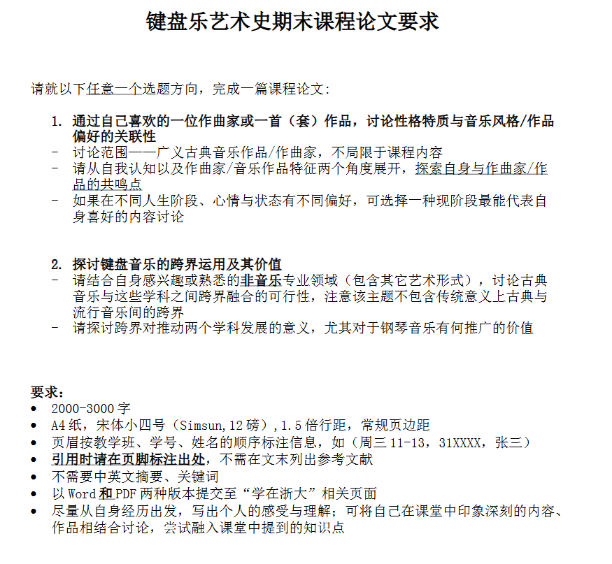
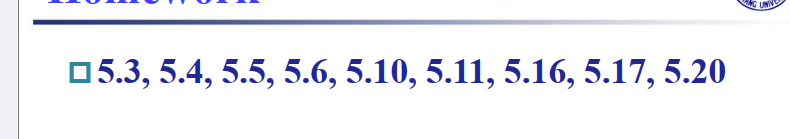

# 12.4
- [ ] ISC24 fortran
- [x] 大物竞赛（12.7 8点）
- [x] 六级笔试
- [x] 计组lab5- 1,2,3
- [x] 计组lab5-4
- [ ] 计组lab6
- [x] 听后感完善
- [x] 键盘乐艺术史论文
>  

- [ ] 大物，概统，计组复习

# 12.5
- [x] 大学与文化传承资料搜集(ddl 12.8 24:00)
- [ ]  概统作业 ***ddl 12.12***
- [x] 大物作业

# 12.6
- [ ] 大物作业 ***ddl 12.12***
- [ ]  ads作业 ***ddl 12.9***
- [ ]  计组hw5 ***ddl 12.18***

- [ ] 计组lab5 实验报告 ***ddl 12.26***

# 期末复习
- [ ] 大物
- [ ] 计组
- [ ] 马原
- [ ] 概统
- [ ] ads
- [ ] 大物实验