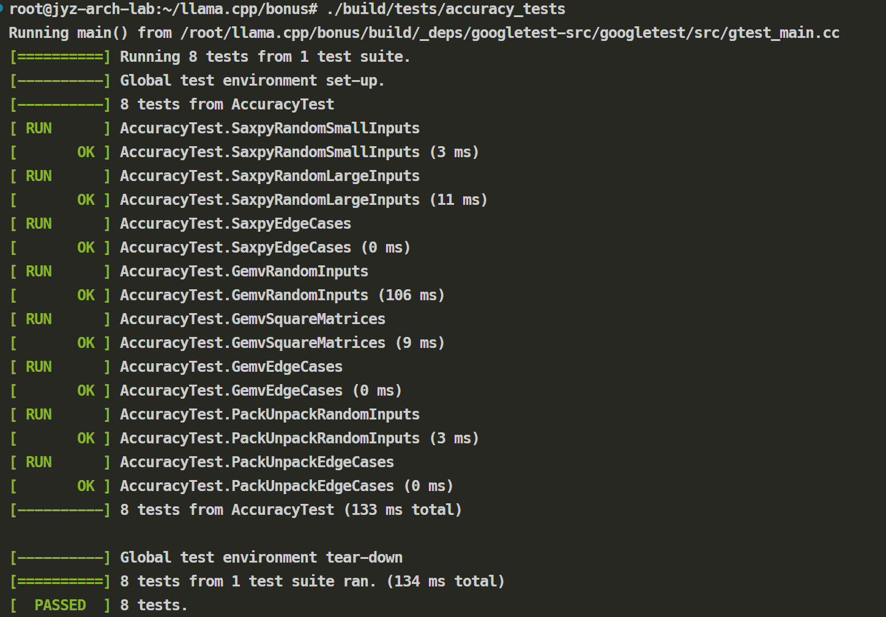

# 实验报告

<div align =center>3230102996 蒋翼泽</div>

## 1 Task 1: SAXPY 向量化

### 1.1 实现思路
```cpp
void saxpy_sve(const float* x, float* y, float a, const size_t n) {
  size_t vl = svcntw();  // 获取向量长度（float元素数）
  
  for (size_t i = 0; i < n; i += vl) {
    svbool_t pg = svwhilelt_b32(i, n);  // 处理边界条件
    
    svfloat32_t x_vec = svld1_f32(pg, &x[i]);
    svfloat32_t y_vec = svld1_f32(pg, &y[i]);
    
    // 使用乘加指令
    svfloat32_t result_vec = svmla_n_f32_x(pg, y_vec, x_vec, a);
    
    svst1_f32(pg, &y[i], result_vec);
  }
}
```

- 使用谓词向量，通过 `svwhilelt_b32` 自动处理数组边界，加载向量后，使用`svmla_n_f32_x` 一条指令完成乘法和加法

## 2 Task 2: GEMV 向量化


### 2.1 实现思路
```cpp
void gemv_sve(const float* A, const float* x, float* y, const size_t m, const size_t n) {
  size_t vl = svcntw();
  svfloat32_t zero_vec = svdup_f32(0.0f);
  
  for (size_t i = 0; i < m; i++) {
    svfloat32_t acc_vec = zero_vec;  // 累加向量
    
    // 向量化内层循环
    for (size_t j = 0; j < n; j += vl) {
      svbool_t pg = svwhilelt_b32(j, n);
      svfloat32_t a_vec = svld1_f32(pg, &A[i * n + j]);
      svfloat32_t x_vec = svld1_f32(pg, &x[j]);
      acc_vec = svmla_f32_x(pg, acc_vec, a_vec, x_vec);
    }
    
    // 向量归约为标量
    svbool_t pg_final = svptrue_b32();
    y[i] = svaddv_f32(pg_final, acc_vec);
  }
}
```

首先加载矩阵行元素和向量 x 的对应段,使用 `svmla_f32_x` 将乘积累加到累加器中,处理完一行之后，使用 `svaddv_f32` 将向量累加器的所有元素求和得到标量结果，最后输出到对应的y向量的位置

## 3 Task 3: INT4 打包/解包向量化

### 3.1 实现思路
```cpp
void unpack_sve(uint8_t* dst, const uint8_t* src, const size_t n_dst) {
  uint64_t vl_bytes = svcntb();
  svbool_t pg_all_lanes = svptrue_b8();
  
  while (current_src_idx < n_src) {
    svbool_t pg_load = svwhilelt_b8_u64(current_src_idx, n_src);
    svuint8_t z_src_data = svld1_u8(pg_load, Psrc_base + current_src_idx);
    
    // 提取高4位和低4位
    svuint8_t z_high_nibbles = svlsr_n_u8_z(pg_all_lanes, z_src_data, 4);
    svuint8_t z_low_nibbles = svand_n_u8_z(pg_all_lanes, z_src_data, 0x0F);
    
    // 交错排列
    svuint8_t z_interleaved_part1 = svzip1_u8(z_high_nibbles, z_low_nibbles);
    svuint8_t z_interleaved_part2 = svzip2_u8(z_high_nibbles, z_low_nibbles);
    
    // 存储结果
    svst1_u8(pg_store1, Pdst_base + current_dst_idx, z_interleaved_part1);
    svst1_u8(pg_store2, Pdst_base + current_dst_idx + vl_bytes, z_interleaved_part2);
  }
}
```

首先计算源数组长度 `n_src = n_dst / 2`，因为每个源字节产生两个目标元素

接着以 SVE 字节向量长度为步长处理源数组

- 使用 `svlsr_n_u8_z` 提取每个字节的高 4 位
- 使用 `svand_n_u8_z` 提取每个字节的低 4 位

然后使用 `svzip1_u8` 和 `svzip2_u8` 将高位和低位交错排列，并将重排后的数据分两次存储到目标数组中

## 4 Task 4: 量化 GEMV 向量化


### 4.1 实现思路

```cpp
   for (int k = 0; k < (qk / (2 * blocklen)); k++) {
        const uint64_t vl_bytes = svcntb();
        // 创建谓词寄存器
        svbool_t pg_8 = svwhilelt_b8(0, blocklen);
        svbool_t pg_16 = svwhilelt_b16(0, blocklen);
        svbool_t pg_32 = svwhilelt_b32(0, blocklen);
        // 预加载激活数据
        const int8_t* a_base1 = &a_ptr[l].qs[k * blocklen];
        const int8_t* a_base2 = &a_ptr[l].qs[k * blocklen + qk / 2];
        svint8_t a1_vec = svld1_s8(pg_8, a_base1);
        svint8_t a2_vec = svld1_s8(pg_8, a_base2);
        // 预转换激活数据到 16-bit
        svint16_t a1_16 = svunpklo_s16(a1_vec);
        svint16_t a2_16 = svunpklo_s16(a2_vec);
        // 优化3：批量处理2列
        for (int j = 0; j < ncols_interleaved; j += 2) {
            // 并行加载两列的权重数据
            const uint8_t* b_base0 = (const uint8_t*)&b_ptr[l].qs[k * ncols_interleaved * blocklen + j * blocklen];
            const uint8_t* b_base1 = (const uint8_t*)&b_ptr[l].qs[k * ncols_interleaved * blocklen + (j+1) * blocklen];
            svuint8_t packed0 = svld1_u8(pg_8, b_base0);
            svuint8_t packed1 = svld1_u8(pg_8, b_base1);
            // 解包两列的权重
            svint8_t w0_low = svreinterpret_s8_u8(svlsl_n_u8_x(pg_8, packed0, 4));
            svint8_t w0_high = svreinterpret_s8_u8(svand_n_u8_x(pg_8, packed0, 0xF0));
             svint8_t w1_low = svreinterpret_s8_u8(svlsl_n_u8_x(pg_8, packed1, 4));
            svint8_t w1_high = svreinterpret_s8_u8(svand_n_u8_x(pg_8, packed1, 0xF0));
            // 转换到16-bit
            svint16_t w0_low_16 = svunpklo_s16(w0_low);
            svint16_t w0_high_16 = svunpklo_s16(w0_high);
            svint16_t w1_low_16 = svunpklo_s16(w1_low);
            svint16_t w1_high_16 = svunpklo_s16(w1_high);
            // 计算两列的乘积
            svint16_t mul0_low = svmul_s16_x(pg_16, w0_low_16, a1_16);
            svint16_t mul0_high = svmul_s16_x(pg_16, w0_high_16, a2_16);
            svint16_t mul1_low = svmul_s16_x(pg_16, w1_low_16, a1_16);
            svint16_t mul1_high = svmul_s16_x(pg_16, w1_high_16, a2_16);
            // 合并乘积
            svint16_t sum0_16 = svadd_s16_x(pg_16, mul0_low, mul0_high);
            svint16_t sum1_16 = svadd_s16_x(pg_16, mul1_low, mul1_high);
            svint16_t scaled0_16 = svasr_n_s16_x(pg_16, sum0_16, 4);
            svint16_t scaled1_16 = svasr_n_s16_x(pg_16, sum1_16, 4);
            // 转换到32-bit并归约
            svint32_t sum0_32 = svunpklo_s32(scaled0_16);
            svint32_t sum1_32 = svunpklo_s32(scaled1_16);
            int sumi0 = svaddv_s32(pg_32, sum0_32);
           int sumi1 = svaddv_s32(pg_32, sum1_32);
            // 反量化
            float scale_w0 = GGML_FP16_TO_FP32(b_ptr[l].d[j]);
            float scale_w1 = GGML_FP16_TO_FP32(b_ptr[l].d[j+1]);
            float scale_a = GGML_FP16_TO_FP32(a_ptr[l].d);
            sumf[j] += (float)sumi0 * scale_w0 * scale_a;
            if (j + 1 < ncols_interleaved) {
                sumf[j+1] += (float)sumi1 * scale_w1 * scale_a;}
```


首先预加载和转换激活数据到16位精度以便在多列间复用

然后批量处理两列权重数据，解包4位量化权重，通过左移和掩码操作分离高低4位

接着将所有数据提升到16位精度进行乘法运算避免溢出，

最后通过算术右移进行缩放、归约到标量并进行反量化


# 测试结果

<div align = center></div>


